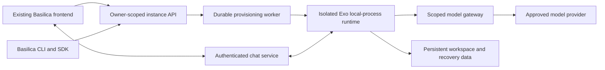

# Exo on Basilica — unified implementation plan

Updated: 2026-09-18. Status: implementation in progress; G0 contracts and baseline underway.

Planning branch: `docs/exo-implementation-plan`, created from freshly fetched `origin/main` at `f3749c7211e828c5c8ff34f6995f822cf83ccd2f`. Plan worktree: `/Users/samueldare/code/cc/basilica/basilica-exo-plan`. The original public checkout remains on its unrelated `docs/basilica-fly-school` branch and must not be used as the branch base for Exo implementation.

**This is the single implementation plan.** It replaces the earlier feasibility, Runta assessment, and frontend documents. Give this entire file to every implementation agent. The coordinator alone updates its contracts, ownership ledger, gate status, and integration record. README and TODO are pointers, not additional specifications.

## 1. Outcome and scope

Users launch Exo in the existing Basilica frontend or through `basilica summon exo`, then return to the same persistent agent from any device. Both surfaces operate on one backend-owned instance. Users do not configure Docker, SSH, images, or ports. Existing OpenClaw behavior remains supported.

```text
Agents → Create agent → Exo → name + model connection + recommended size
       → actual cost and persistence summary → Launch → Chat workspace
```

Connect a model inline and save an owner-scoped connection for reuse. Start with providers/models that pass real streaming/tool conformance tests; upstream's installer offers OpenAI and OpenRouter. Recommend one size, with advanced overrides. Benchmark before choosing defaults or promising startup times. Hosted model use does not require a GPU by default.

First release: deterministic setup, authenticated text chat, background scheduler/adapters, stable names/IDs, status, restart, export of declared persistent state, deletion with verified cleanup, and out-of-band recovery after a broken self-rebuild. Show compute, storage, and model charges separately. Do not imply platform provider keys make inference free or quote an unmeasured flat total.

Pause/resume, timed trials, whole-environment checkpoints, terminal, rich files/artifacts UI, teams, automatic upgrades, and bundled inference are capability-gated follow-ons. Hide nonfunctional controls. File restoration is not process-memory restoration. Full machine recovery is required only when offered in the declared persistence contract; it is not an unconditional prerequisite for a narrower, honestly described first release.

## 2. Checkouts, evidence, and current limitations

Workspace: `/Users/samueldare/code/cc/basilica`.

| Checkout | Responsibility | Reviewed revision |
| --- | --- | --- |
| `basilica/` | CLI, Rust SDK, customer docs, this plan | `f3749c7211e828c5c8ff34f6995f822cf83ccd2f` |
| `basilica-backend/` | Runtime, provisioning, instance/model/chat services, billing integration | `e0cd16dd2cf45625d7f5d822f666ef6b21c6e913` |
| `basilica-site/` | Existing Next.js app and authenticated agent experience | `5854e17d952a62906206ee60d8a64a4cb9cf8a95` |

Use sibling `basilica-site/`, not the older `cc/website/basilica-site` copy. Do not create another frontend or migrate hosts. Read repository-local instructions; inspect `git status --short` and `git diff --stat <reviewed-revision>..HEAD -- <owned-paths>` before implementation. Preserve unrelated work; the public checkout previously had simulator/RL/fly-school edits.

The current backend contains `docs/dependency-modes.md`; it was read during implementation. Default validation uses locked Git dependencies. Public contract changes must be pushed first, then the backend lockfile deliberately updated; disposable local overrides may be used only as documented.

Evidence that determines the design:

- All six pages of `/Users/samueldare/Downloads/Introducing_Exo_Harness_for_Runta_Runtimes.pdf` were inspected. Runta describes local-process Exo in a managed runtime, automatic onboarding, browser terminal, and a credential-substituting gateway. Its guarantees were not independently tested; the referenced demo videos were not available inside the PDF.
- Upstream Exo revision `b2769b6295e3cf23b24aad2794230fca6c09149c`, `crates/exoharness/src/sandbox.rs:1135`, implements local-process execution. Nested Docker is not required. That backend does not implement native sandbox snapshots/restore, attachment/detachment, durable-filesystem declarations, or a disabled-network policy. Basilica supplies the surrounding isolation/storage/network guarantees.
- Upstream `exo.sh` defaults to Docker: do not use its default installer unchanged. `crates/cli/src/adapters.rs` lacks adapter creation, while `crates/executor/src/adapter/store.rs:33` supplies typed creation. Bootstrap must not ask an LLM to create its own chat adapter.
- Exo state defaults to `.exo`; `crates/exoharness/src/secrets.rs:265` can place the master key elsewhere. Backing up `.exo` alone is insufficient.
- ExoChat uses outbound WebSockets. Its worker uses Cloudflare Durable Objects, sends `frame-ancestors 'none'`, and replaces an existing socket for the same role. It is not a drop-in Next.js route or OpenClaw iframe URL.
- Public `crates/basilica-cli/src/cli/commands.rs:264` defines `summon` as a `deploy` alias. Rust SDK CPU provisioning already exists in `crates/basilica-sdk/src/client.rs:684`. Current CPU stop terminates the machine; it cannot be relabeled Pause.
- Backend `crates/basilica-operator/src/controllers/user_deployment_controller.rs:522` constrains workload privileges. Do not weaken shared workload security or mount a node Docker socket.
- The frontend already supplies Auth0, funding, model selection, deployment management and OpenClaw chat. Its `lib/providerStore.js` stores raw provider keys in browser storage; `app/api/openclaw/deploy/route.js` injects resolved keys into deployment env. The Exo connection/gateway design must not inherit that exposure pattern.

Pinned references: [local-process implementation](https://github.com/exoharness/exo/blob/b2769b6295e3cf23b24aad2794230fca6c09149c/crates/exoharness/src/sandbox.rs), [ExoChat](https://github.com/exoharness/exo/blob/b2769b6295e3cf23b24aad2794230fca6c09149c/exo/adapters/exochat/README.md), [snapshot semantics](https://github.com/exoharness/exo/blob/b2769b6295e3cf23b24aad2794230fca6c09149c/exoharness/docs/sandbox-snapshots.md).

No runtime deployment, build, paid model call, or recovery test was performed during planning. Routes/types below are proposed, not shipped API documentation.

## 3. Architecture decisions

1. Test local-process Exo inside an existing Basilica CPU deployment first. Choose a dedicated CPU VM if that environment fails the required isolation, self-rebuild, or persistence contract. Docker remains optional.
2. One durable managed-agent record links owner, template/version, runtime resource, operation, connection, and persistent state. Reuse the current allocator and billing. A backend worker owns provisioning; browser/CLI closure cannot interrupt it.
3. Prebuild and pin the baseline/toolchain. Seed a writable per-instance source checkout once. Preserve source changes; do not fetch `main`, reset evolved source, or rebuild the baseline at every launch.
4. Keep provisioning authority, provider keys, billing and management outside the editable guest. A secret stub is not authentication. Use scoped revocable runtime identity, never a general Basilica account token.
5. Basilica operates the supported chat path. The frontend hosts the UI; a suitable service hosts persistent connections. Upstream's public relay can support a labeled compatibility spike, not the supported public product.
6. Reuse website account flows, theme and components. Preserve OpenClaw links and behavior. A marketplace framework, payment redesign, OpenClaw key migration, and broad frontend rewrite are out of scope.



## 4. Parallel ownership and coordination

**You are not alone in the codebase. Do not revert others' changes. Adapt to accepted edits. Work only in owned files; request changes from another file's owner.** Workstreams are logical responsibilities, not a claim that all workers run simultaneously.

Use isolated worktrees per worker/repository. Create each repository's Exo integration branch from its freshly fetched `origin/main`, not whichever feature branch happens to be checked out. Record the main base SHA and resolve any drift from the reviewed revisions. Workers branch from that main-based integration revision, including already accepted contracts when needed. CO integrates verified changes, records commits, and tells consumers when to update. Changes are not automatically shared between worktrees. Do not switch, reset, or move unrelated changes in the original checkouts. Never run broad auto-fix/format commands over another worker's work.

| ID | Exclusive ownership | Deliverable |
| --- | --- | --- |
| CO — coordinator | This plan/pointers; backend shared route/module registration, app state/bootstrap wiring, Cargo manifests/lockfile, migration filenames/files, shared CI | Frozen contracts, shared schema/wiring, integration and release evidence |
| RT — runtime | Backend `scripts/exo/**`, including upstream patch/helper and runtime smoke/evidence | Pinned runtime, deterministic bootstrap, supervision, persistence/export and bad-rebuild recovery |
| LC — lifecycle | New backend `src/api/routes/agent_instances/**`, `src/agents/lifecycle/**`, `src/db/agent_instances.rs` and colocated tests, all under `crates/basilica-api/` | Durable instance/operation lifecycle, quotes, reconciliation and cleanup |
| MG — model gateway | New backend `src/api/routes/model_connections/**`, `src/agents/model_gateway/**`, `src/db/model_connections.rs` and colocated tests, under `crates/basilica-api/` | Secure connections, scoped gateway, validation/streaming/revocation |
| CT — chat | New backend `src/api/routes/agent_chat/**`, `src/agents/chat/**` and colocated tests, under `crates/basilica-api/`; `scripts/exo-chat/**` | Sessions, pairing, transport, reconnect/revocation and relay assets |
| FE — frontend | `basilica-site/` paths in section 8, including shared auth/API/shell, package/lock/test config and README | Launch/list/workspace UI and frontend tests |
| SDK — CLI/SDK | Public `crates/basilica-cli/**`, `crates/basilica-sdk/**`, relevant public Cargo/lock changes, focused customer docs/examples | Matching CLI/SDK behavior, routing, output and tests |

New backend paths are proposed reservations. At G0, CO checks conventions and records any relocation in the ledger **before code is written**. Existing rental/deployment internals require explicit scope allocation before LC changes them. CO alone edits shared `api/routes/mod.rs`, `db/mod.rs`, `agents/mod.rs`, server state/registration and migrations. Feature owners send concrete registration/schema patches to CO; they do not independently number migrations or modify manifests.

FE alone owns frontend shared files; SDK alone owns public client/types and CLI dispatch. RT alone changes bootstrap even when MG/CT need more inputs. An interface change request includes reason, fields, compatibility, affected consumers and tests; CO versions the contract before landing it. No silent renames or private competing API schemas.

### Scheduling with four available agent slots

CO occupies one slot, leaving at most three workers. Reuse slots as owners finish:

| Wave | Workers beside CO | Dependency rules |
| --- | --- | --- |
| 0 | RT feasibility; FE build/auth baseline; MG existing-service/dependency inspection | Independent foundations while CO freezes contracts and module ownership |
| 1 after G0 | RT packaging; LC lifecycle; MG gateway | LC can implement durable storage/idempotency/reconciliation before G1; final runtime adapter waits for G1 |
| 2 as slots free | LC completion; CT chat; FE product UI | RT/MG hand off contracts/artifacts; FE can implement agreed schemas before every service finishes, but cannot claim real integration from mocks |
| 3 as slots free | CT/FE completion; SDK CLI/SDK | SDK may start earlier whenever G0 and a slot are available; CO integrates shared wiring |
| 4 after G2 | FE/SDK fixes; recall service owner for specific failures | CO runs end-to-end acceptance and records evidence |

Do not wait for an entire wave if a task's own gate is satisfied and a slot is free. This is a capacity-aware schedule, not an artificial serial pipeline.

## 5. Shared contracts — freeze v1 at G0

CO verifies existing naming/casing/auth conventions and produces the exact OpenAPI/types before clients depend on them. Reuse existing services where behavior matches. The following proposed routes are backend routes, separate from website paths:

| Operation | Proposed route | Required semantics |
| --- | --- | --- |
| Templates/offers | `GET /agent-templates`; `POST /agent-instances/quote` | Supported providers/models, sizes/regions, current quote/currency/basis/expiry and capabilities |
| Connections | `POST/GET /model-connections`; `PATCH/DELETE /model-connections/{id}` | Owner-scoped create/list/rotate/delete; accept secrets securely, never return them; explicit in-use deletion policy |
| Launch/list | `POST/GET /agent-instances` | Create accepts template, name, connection ID, quote ID and supported lifetime; returns stable instance and durable operation IDs |
| Detail | `GET /agent-instances/{id}` | Safe instance metadata, never chat/provider secrets |
| Operation | `GET /agent-operations/{id}` | Owner-checked progress, error, retry and cleanup state |
| Lifecycle | `POST /agent-instances/{id}/restart`, `/export`, `/recover`; `DELETE /agent-instances/{id}` | Durable operations with explicit data-retention and billing outcomes; recover names an available compatible code checkpoint |
| Logs | `GET /agent-instances/{id}/logs` | Bounded/paginated, redacted and owner-authorized |
| Chat access | `POST /agent-instances/{id}/chat-sessions` | Short-lived scoped access, expiry, approved transport URL and revocation; separate from general instance JSON |

Derive ownership from verified auth context, not supplied owner IDs. Freeze request/response casing, HTTP/error envelope, pagination and event types at G0. Proposed create response is HTTP 202 with `instance_id`, `operation_id`, `status_url`. An expired quote requires requoting, not silent repricing.

Minimum safe instance fields: stable ID, server-stored name, template/version, phase, desired state, current operation, connection ID/safe model label, cost basis, optional expiry, persistence description, capability flags, and actionable safe error. Runtime resource IDs are implementation metadata with appropriate visibility. Clients must not infer kind from image names or store authoritative identity only in localStorage.

Normalize phases for both clients: `queued`, `provisioning`, `configuring`, `starting`, `ready`, `restarting`, `failed`, `deleting`, `deleted`. Operation state separately expresses running/succeeded/failed and cleanup pending. CO may align names with repository conventions before G0, not independently per feature.

Mutations have owner-scoped idempotency. Same key + normalized body returns the same operation; changed body with the same key conflicts. Persist results across worker restarts. G0 fixes key lifetime and concurrent-mutation rules. Delete during provisioning persists desired deletion and reconciles any created resource. Success requires confirmed provider state and billing finalization, not just a successful API request.

Maintenance intent v1 covers restart, export and code recovery. Only owned instances with desired state `running`, phase `ready` or `failed`, a bound runtime resource and the explicitly enabled action capability can accept new intent. Any running operation or unresolved cleanup conflicts; only delete may preempt. Same-key replay precedes current-state checks and never resurrects an instance after later deletion. Recovery additionally requires a checkpoint belonging to the same owner and instance whose schema exactly matches the authoritative current state schema. Migration 036 adds a nullable, bounded `state_schema_version`; unknown is incompatible, never inferred from a baseline or capability. The lifecycle controller must record observed schema and register only health-verified checkpoints before enabling recovery; artifact existence alone is insufficient.

An accepted maintenance intent atomically advances generation, persists the operation/checkpoint and retry response, sets phase `restarting` with unknown health, and revokes old runtime/chat grants. This also applies to export because its consistent snapshot requires stopping writers before resuming a fresh service generation. A claimed recovery lease carries its checkpoint ID. Database generation and token revocation fence gateway access and stale lifecycle work; the reconciler must still stop/fence local or remote writers, run the corresponding runtime helper, rotate/deliver new access and verify readiness. Intent acceptance makes no provider call and is not successful completion, physical fencing, an export artifact, or a healthy recovery result. Existing owner-scoped 30-day minimum retry retention applies. Runtime/provider adapters and HTTP wiring remain separate required work.

Lifecycle mutation HTTP v1 exposes account-authenticated `POST /agent-instances`, `DELETE /agent-instances/{id}` and `POST /agent-instances/{id}/{restart,export,recover}` through the existing durable intent functions. Each request requires exactly one validated `Idempotency-Key`; auth supplies ownership and no additional OAuth scope is required. Create and recover use the shared strict JSON request DTOs. Restart/export/delete accept no body or an empty JSON object only; reject ignored fields, malformed bodies, query parameters and ambiguous duplicate headers. Bound request bodies to 16 KiB and return static errors without echoing input. All handler responses are `Cache-Control: no-store`; accepted intent returns HTTP 202 with the shared stable instance/operation/status URL response, including retries. A 202 records requested work only and never reports provider, runtime, export, recovery or deletion completion.

The HTTP layer preserves DAL replay ordering, quote expiry/ownership checks, action capabilities, compatible checkpoint checks, generation advancement, revocation and delete preemption. UUID path/checkpoint forms are parsed to canonical IDs. Foreign and missing records remain indistinguishable. Account routing/scope tests and real PostgreSQL HTTP tests cover all actions, concurrent replay, changed-request conflicts, stale quotes, malformed input with no writes, checkpoint isolation, revocation, preemption, rollback and read-back through operation status. Generated public/private OpenAPI and existing SDK requests must match. This increment does not fabricate quotes, enable runtime capabilities or run reconciliation; verified catalog/quote issuance and actual execution remain release requirements.

Operation status v1 implements `GET /agent-operations/{id}` behind the existing account authentication and owner-scoped authorization convention, with no additional OAuth scope. It reads the operation and its owned instance in one database statement and returns the shared `AgentOperation` DTO. `state`, error, cleanup, billing, export metadata and timestamps describe that durable operation; `phase` is the current instance phase, including when a newer operation superseded it. It never infers success from a phase or clears failures while reading. Missing and other-owner IDs both return 404; malformed UUIDs return a static 400. Responses use `Cache-Control: no-store`. The query selects only public DTO fields; no provider keys/ciphertext, runtime/chat grants, worker lease tokens, backing resource IDs or private artifact locators are exposed. Invalid persisted typed metadata produces a static internal error, not a partial response or raw database detail. This read path is independent of optional model-provider configuration and performs no allocation, credential issuance or runtime action. It does not enable unimplemented mutations or claim reconciliation is running.

Instance reads v1 implements account-authenticated `GET /agent-instances` and `GET /agent-instances/{id}` using the shared `AgentPage<AgentInstance>` and `AgentInstance` DTOs. Both use the existing owner-only authorization convention without an additional OAuth scope, need only the database, and return `Cache-Control: no-store`. Listing excludes completed deletions, includes deletion still in progress, and uses descending `(created_at,id)` keyset pagination with default 50, allowed 1–100, and a bounded opaque cursor. Each page is a fresh snapshot rather than a frozen collection; intervening insertions/deletions do not create offset duplication. Cursors contain only a timestamp and UUID and never grant access to another owner's records. Detail retains owned deletion tombstones so old links resolve. Missing and other-owner IDs return the same static 404; invalid UUIDs, query shapes and cursors return static 400 errors.

A single database statement reads each page/detail with safe connection model metadata, recorded instance cost/persistence, quote lifetime and the newest 20 registered code-checkpoint choices ordered by creation time/ID. The model label follows the existing connection DTO's model string. The supported `until_deleted` lifetime has no instance expiry; quote expiry must never be returned as instance expiry. Checkpoint compatibility means an exact match to the known authoritative instance schema, independent of action availability. Its fixed effect explains code/dependency restore while preserving canonical history and user files. General reads never expose resource IDs, account/connection credentials, grants, leases, private artifact IDs, digests or keys. Typed conversion rejects corrupt stored metadata with a static internal error; unknown/omitted capabilities remain unavailable. Reads do not allocate, claim/renew work, register checkpoints, alter capabilities or infer health. Registered checkpoint rows remain trusted-controller evidence, and real registration/runtime acceptance is separate required work.

Worker persistence v1 accepts typed resource binding, progress, retry, export metadata, verified cleanup, ready, failed and deleted updates. Every update takes the owner lock and locks the current operation/instance, matching owner, instance, generation, kind, checkpoint and lease token. Database wall-clock expiry is checked after row-lock waits and again at the final operation write; loss of authority rolls back the entire update. A stale/expired lease returns false so the worker stops, while invalid transitions conflict. These are trusted reconciler observations, never guest/public assertions; storage functions make no provider/runtime call and cannot prove physical fencing, health, artifact integrity or billing settlement themselves.

Bindings identify confirmed existing Basilica deployment/CPU-rental resources and cannot be replaced; identical binding retries are allowed, including discovery during delete. Create progresses monotonically from queued through provisioning/configuring/starting, and maintenance from restarting through configuring/starting; configuring/starting require a binding. Readiness is a separate completion requiring starting phase, a bound resource, observed schema, all three runtime/model/chat health checks healthy, no unresolved cleanup and no finalized resource billing. Unsupported pause/resume/terminal/files capabilities remain disabled. Recovery cannot change the authoritative schema. Export metadata uses the operation UUID, manifest version 1, a lowercase SHA-256, positive size and future expiry; retries preserve the original metadata. Export readiness additionally requires an unexpired recorded artifact. The reconciler must verify the artifact independently before recording it.

Retries keep the same running operation, use bounded 1–3600-second database delays, release the lease, and publish only fixed safe failure codes/messages. Cleanup-pending is sticky across retries. Verified cleanup is a separate durable observation for create/delete requiring both all managed resources absent and resource billing finalized; it clears capabilities and revokes access while retaining the historical resource binding. A failed create can become terminal only after this cleanup observation, including verified absence for an unallocated request. Failed maintenance preserves the bound resource and ongoing costs, requires no unresolved cleanup, and revokes scoped access. Delete completes only after recorded cleanup and billing confirmation. All terminal updates clear worker leases atomically with instance phase/health/error changes. Repeated writes using a terminal lease are stale; clients replay the original durable operation and read its final status. Provider adapters must reconcile uncertain external responses by stable instance identity before issuing these observations, and lease loss never authorizes replay of an external action.

Capabilities cover chat/restart/export/recover/pause/resume/terminal/files; unsupported or unknown is unavailable, not simulated success. At G0 settle quote units, model charges, retention/deletion/expiry policies and persistence scope. No timed trial silently destroys state; it needs verified preservation or a separately explicit, accepted deletion policy.

Healthy-checkpoint registration v1 extends the internal ready observation with optional verified checkpoint metadata: UUID, bounded code-version/schema labels, a bounded private artifact identifier and lowercase SHA-256. The caller must independently verify archive integrity, ownership, same-instance context and that the captured code/dependencies match the runtime whose runtime/model/chat health it observed. No guest or account request may supply this observation, and the database does not infer health from capture or artifact existence. Metadata contains no key and does not change the public checkpoint DTO.

Registration happens only inside successful lease-fenced ready completion, after its normal resource/phase/health/export/recovery validation, using the ready observation's schema as an exact compatibility requirement. It atomically inserts the owner/instance-bound immutable checkpoint and completes the operation. Identical existing metadata preserves its original timestamp; a reused ID with different metadata or owner/instance conflicts. Lease loss or any subsequent write failure rolls back both registration and readiness. A ready observation may enable `recover` only if this transaction contains or locks an already registered checkpoint for the same owner/instance and observed schema. Recovery remains disabled when no compatible checkpoint exists. Historical schemas and artifact identifiers are never rewritten to make them compatible; artifact verification/storage/retention and physical runtime acceptance remain reconciler responsibilities.

First-release recovery is user-accessible code recovery, distinct from optional full-environment restore. LC exposes owner-authorized available checkpoint metadata in instance detail and accepts its ID in a durable recover operation. RT preserves an immutable baseline and compatible healthy code/dependency checkpoints outside the editable checkout, quiesces services, preserves canonical state/history, restores the selected code, then verifies readiness. Reject incompatible state-schema/checkpoint combinations; never silently roll back user data. FE/SDK show the checkpoint/time and effect, submit the operation and track progress even when chat is broken. G2/G3 must demonstrate this path after a failed self-rebuild.

Internal bootstrap v1 joins RT/LC/MG/CT: instance ID, pinned baseline, local-process provider, persistent path mapping, model binding/base URL, scoped gateway identity through protected delivery, scoped chat pairing. No upstream provider key or account-wide token. RT emits structured readiness/diagnostics/version rather than secrets in stdout. Freeze service-start/stop and replacement/fencing expectations.

Runtime gateway HTTP v1 now uses the model base URL `/agent-runtime/{instance_id}/v1/` under the API origin, with a trailing slash. Bootstrap supplies the protected runtime bearer identity and explicit `EXO_MODEL_API_STYLE`; Responses and Chat Completions are separate POST routes under that base. `POST /agent-runtime/{instance_id}/identity/refresh` accepts no body or `{}`, extends the same token to at least one hour from renewal without shortening existing expiry, and returns only `expires_at`. Account/JWT credentials, query tokens, and caller-selected renewal lifetimes are rejected. The guest renewal launcher is implemented; protected issuance/delivery and image/bootstrap wiring still require LC/RT integration.

Protected runtime identity file v1 is a private JSON object with exactly `schema_version: 1`, canonical UUID `instance_id`, HTTPS `api_origin` (origin only), and scoped bearer `token`. Delivery makes a private regular file owned by the launcher user, mode 0400 or 0600, in a trusted parent directory; projected symlinks must be copied. This is internal secret delivery, never general instance metadata. RT stores the same token in the encrypted Exo model binding, then invokes the image-owned `runtime_identity.py` launcher in Python isolated mode around the supervised service command. Successful refresh precedes process start; periodic renewal failure/expiry stops the process group. The image must provide orphan reaping and container isolation, and LC retains generation fencing authority. The launcher and initial encrypted binding/bootstrap are implemented; protected delivery/rotation, image/service wiring and real acceptance remain pending.

Canonical-state bootstrap v1 takes the prepared writable source, patched CLI, explicit local pricing artifact, approved model/protocol and protected identity file. Separate stable source/state mount paths are required; the state parent is private (0700). Bootstrap stages `.exo`, `master.key` and a versioned `bootstrap.json` receipt together, verifies the encrypted model binding using typed Exo APIs, fsyncs staged data and publishes by same-filesystem rename. The workspace `.exo` link targets this one canonical state. Canonical slugs are agent/model `managed`, conversation `chat`, and secret `managed-gateway`; the agent uses the Exo harness, local-process provider and agent sandbox scope with tool creation enabled. Repeat setup preserves all records and user edits, requiring the same instance/model/protocol/source/origin/scoped grant and master key. Changed grants use the explicit preserve-state rotation flow below; lifecycle integration remains pending. Readiness events describe setup only; renewal must authorize the identity before service start. Image assembly/seeding, filesystem suitability, service/guardian integration and hosted acceptance remain separate gates.

Service execution v1 wraps image-owned `services.py` with `runtime_identity.py` after canonical bootstrap. The foreground supervisor holds the bootstrap OS lock, passes the canonical root/key and explicit model protocol to both scheduler and adapter runners, and inherits only tool/home/locale/TLS-trust environment fields. Each child has an owned process group; shutdown uses one shared three-second TERM grace plus bounded reaping after KILL. Any unexpected runner exit, including zero, stops its sibling and reports failure. Diagnostics identify actual child PIDs, never use persisted PID files as authority, and do not establish chat/model readiness. Both runners use OS-held locks and retain their lock inodes. Image-level orphan reaping/cleanup and lifecycle generation fencing remain required. Managed drain/rebuild control follows the contract below; image wiring, interrupted-schedule handling and healthy-code recovery remain pending. The upstream guardian must not run unchanged.

Managed rebuild v1 is opt-in until image assembly supplies the pinned build tools. In managed mode the existing rebuild tool publishes a private, fsynced guardian update and never launches a detached guardian. The foreground owner serializes queued requests, records phases durably, runs locked Rust build/tests and TypeScript checking with bounded cancellation, and copies the executable pair into a unique immutable-by-convention candidate directory. Build failure preserves running services. Successful validation requests graceful drain with a bounded deadline; failed or interrupted drain fails the service generation rather than restarting over uncertain in-flight work. After both runners exit successfully, the owner atomically selects a digest-checked binary pair and starts it with unchanged canonical state. Selection and process survival do not establish model/chat readiness or a healthy recovery checkpoint. Nonterminal claimed requests found after supervisor restart fail as interrupted and are never automatically replayed. The selected candidate persists across ordinary supervisor restarts; immutable baseline and compatible code/dependency checkpoints remain separate required recovery work. No detached restart loop, lock-inode deletion or process-name matching is permitted.

Code checkpoint/recovery v1 captures source, installed source-tree dependencies and the selected executable pair; it excludes canonical `.exo`, Git administration and the rebuild `target` cache. Internal relative symlinks are preserved; external/special files fail capture. A versioned file-integrity manifest is encrypted with the payload using a checkpoint-specific derived key and authenticated instance/source/baseline/state-schema/OS/architecture context. Authentication completes before extraction. LC must supply its authoritative current state-schema label and only register health-verified checkpoints; the artifact helper does not infer schema changes made by arbitrary user code or turn a capture into a healthy checkpoint. Recovery requires the same instance/key/source and compatible declared schema. It holds the service/bootstrap and both runner locks, stages verified code beside the source, retains the replaced checkout (including a root replaced by a file or symlink), recreates missing source without resetting state, selects the verified binary pair and journals each transition under the durable operation ID. Services refuse startup while recovery is pending. Same-operation retries resume interrupted renames or return the completed result; changed checkpoint IDs conflict. Canonical history, schedules, artifacts, binding and master key are never restored from a code checkpoint. Stable private parent directories with local rename/fsync semantics, lifecycle fencing and post-restore readiness remain required; packaging and hosted acceptance are separate gates.

Scoped-identity rotation v1 is an explicit stopped-runtime operation, separate from bootstrap and code recovery. LC fences the previous workload, issues/delivers a replacement grant for the same instance and API origin, and supplies a durable operation ID. The trusted helper verifies the preserved key and receipt, holds bootstrap and runner locks, and journals the old/new token digests without storing plaintext grants. A typed local Exo operation verifies the exact managed model/secret binding and replaces only the encrypted key payload under the existing secret ID, accepting only the old digest or an already-applied new value. It never creates a duplicate secret or rewrites agent/conversation configuration. The helper fsyncs the secret store, verifies the new binding, atomically updates the receipt, and clears a durable startup barrier. Same-operation retries resume after any transition; changed inputs conflict, and completed retries never overwrite a later rotation. Bootstrap, services and code-recovery mutations refuse an incomplete rotation. Missing/corrupt state or keys fail without reset. No old grant is required to resume, and no token appears in arguments, environment, events or journals. LC remains responsible for protected delivery, revocation/generation fencing, successful renewal and post-rotation readiness; the local helper does not claim those integrations.

Persistent-state export v1 snapshots the declared `/data` tree plus the selected executable pair under the bootstrap and both runner locks after lifecycle fencing. It preserves writable source/dependencies, canonical records/history/schedules/artifacts and master key, seed/bootstrap receipts, runtime/recovery journals and user home/tmp files. Image/toolchain assets outside `/data` remain a separately required compatible image. Known managed lock files, regular `*.pid` files and Unix sockets are omitted with an encrypted per-path omission report; other special files and links escaping `/data` fail capture. Internal absolute links are normalized to relative links, including the canonical source/state link. Archives remain bounded (16 GiB regular data, 200,000 entries, 32 MiB manifest), private and atomic; oversize or changing data fails rather than producing a partial export. Pending identity rotation or code recovery prevents export.

The lifecycle owner supplies a separate random 32-byte export key through a protected file outside the exported tree; it is never bundled, logged or derived from the runtime master key. AES-256-GCM/HKDF use a distinct export domain and authenticated owner/instance/export ID, source/data path, baseline, state-schema and platform context. Same-export retries return the original verified artifact rather than capture later changes. Owner-bound verification and staged extraction authenticate before parsing, validate the full integrity manifest and canonical key/receipt binding, refuse incompatible schemas/platforms and existing destinations, and publish only a new private directory. Extraction restores files for an explicitly authorized same-instance lifecycle operation; it never overwrites live state, starts services or claims provider/session validity. LC must authorize artifact/key retrieval, revoke/fence old generations, mount the data at its original stable path, rotate scoped runtime/chat access and verify readiness before any restored runtime starts. Local helper ownership/key checks are not hosted account authorization. Export/recovery of process memory or OS package installs is not offered.

Interrupted scheduling v1 distinguishes unclaimed missed slots from claimed work with uncertain effects. The pinned scheduler writes schema 3 task records and migrates schemas 0–2 without discarding leases; newer schemas are refused. Claim expiry alone never authorizes replay. After acquiring its OS runner lock, a restarted runner atomically moves every retained lease into a typed interruption record with the lease, due slot and detection time. Interrupted tasks remain visible in ordinary listings but are ineligible for execution; reviewing and explicitly removing/recreating a task is the first-release resolution path. Existing results, schedule policy, command, history and canonical identity are preserved. Never-claimed downtime uses the existing Once/Skip/All policy (All capped at 100). Scheduler JSON publication must fsync the new file before rename and the containing directory afterwards, with directory creation durable before claims authorize commands. Interrupted-record publication is repeatable after failure and completes before new tasks or pending wakeups are processed. Existing wakeup delivery remains at-least-once and is not an exactly-once side-effect guarantee. Local OS locks do not fence detached or remote old workers; LC must fence them before restarting a generation. Tests must cover live/expired leases, schema migration, idempotent startup, failure boundaries, unchanged missed-slot behavior, and killing an actual local command before replacement without command replay.

Runtime image/startup v1 uses digest-pinned Node 22.22.0 and Rust 1.97.1 Bookworm bases, pnpm 10.26.2, locked upstream source/dependencies and hash-locked Python helpers. The image carries a root-owned baseline source/dependency tree, executable pair and integrity manifest outside the writable checkout, plus a PID-1 init. It runs as UID/GID 10001 without privilege escalation or container-engine access. LC must provision a private owned local-filesystem `/data` volume and protected identity/runtime/pricing files; storage/filesystem and hosted isolation remain acceptance gates. First start atomically seeds `/data/workspace` containing `source` and a baseline receipt; canonical state remains `/data/state`, user home `/data/home`, temporary files `/data/tmp`. Repeat start validates the seed receipt but never recopies or resets edited source; missing source alongside existing state requires explicit recovery. Node dependencies are installed at the same stable source path during image construction so generated wrappers remain valid after seeding. Startup performs deterministic canonical bootstrap, then execs the identity-renewal launcher around the foreground service supervisor with managed rebuilds enabled and a minimal tool environment. No model, pricing, provider credential, chat pairing or readiness is fabricated. Explicit lifecycle rotation is required for changed grants. Runtime startup does no source download, dependency install or baseline rebuild. The artifact build records compiler/base/package provenance; no claim of bit-for-bit APT rebuilds or hosted model/chat readiness is made. Source/dependencies, canonical state and user-home files are durable under the declared volume scope; OS package changes/process memory are not promised. Image assembly and local process/replacement tests do not select a deployment over the VM fallback or pass G1 by themselves.

MG fixes request protocol, owner/runtime identity, destination/model allowlist, issuance/revocation, rotation and usage semantics. CT fixes message IDs/acknowledgments, session roles/expiry, reconnect, channel identity, origins and transport schema. A URL alone is not an adequate contract. FE/SDK obtain chat access only through owner-authorized operations.

G0 checklist: exact module ownership; schema/migration allocation; dependency mode; wire/error/event types; idempotency and in-flight transitions; quote/retention/persistence policy; runtime identity delivery; chat deployment shape; origins/scopes; test runner. CO records decisions here and in generated contracts. Resolve routine choices from repository conventions rather than repeatedly asking the user.

## 6. RT — runtime and state preservation

Create `scripts/exo/VERSION`, pinned build/bootstrap/entrypoint/service assets, typed adapter helper or upstream patch, `smoke.sh`, and redacted evidence. Follow existing runtime packaging patterns under `scripts/openclaw/`, without copying its credential/Docker assumptions. Keep upstream changes in the owned versioned build/patch bundle.

Build a headless supervised local-process runtime with preinstalled pinned tools/dependencies/binaries, immutable baseline and writable instance checkout. Coordinate Exo guardian and supervisor so self-rebuilds do not cause competing restart loops. Idempotently create model binding, canonical agent, conversation, scheduler and chat adapter; never reset existing state or ask an LLM to perform infrastructure setup.

First measure real tool/package execution, self-edit/rebuild, scheduled work, source-build performance on the chosen filesystem, time to usable chat, idle/peak memory, disk needs and current offer cost. A 4 vCPU/8 GiB candidate is only a benchmark hypothesis. If ordinary deployment fails required isolation or persistence, hand CO evidence for the VM fallback before LC changes its runtime implementation. Do not weaken shared workload security.

Declare preservation separately for source/tools/lockfiles, `.exo` history/schedules/artifacts/adapter state, master key/encrypted secrets, user files, installed dependencies, OS package changes and process memory. Ephemeral OS package installs are not automatically durable. Test process restart and pod replacement; machine replacement only if offered. Measure FUSE suitability; if Docker is later selected, do not put its data root on R2 FUSE.

Exports/checkpoints include a versioned integrity manifest and all declared state, protecting secrets with encryption and owner-restricted restore. Quiesce writers, omit stale locks/PIDs/sockets, and fence the old instance before replacement to avoid duplicate scheduled side effects. Define missed-schedule behavior; no blind replay. Restore/regenerate scoped access safely. Keep recovery outside Exo chat after a bad self-edit; reverting source must not silently erase canonical history. Snapshot filesystem recovery differs from sandbox/conversation rewind or process-memory resume.

Hand off image digest, bootstrap schema version, required resources, readiness/error signals, persistence limitations, export/bad-rebuild recovery results, and cleanup transcript. Real acceptance includes scheduled work after closing the browser and repeated bootstrap retaining identity.

## 7. Backend workstreams

### LC — lifecycle and cost

Inspect existing route/database conventions and `api/routes/cpu_rentals.rs`, `secure_cloud.rs`, deployment handling and billing. Implement owned modules for durable records/operations, owner checks, quotes and reconciliation. Submit schema/state/registration changes to CO. Reuse allocator and accounting instead of inventing another source of compute truth.

Persist intent before allocation; reconcile uncertain responses/provider state after worker restart. Running pod is not ready chat. Keep service health, model availability and relay connectivity separate; rate limits must not trigger destructive restart loops. Cleanup failure remains visible with continuing costs and retries.

Test duplicate requests, changed-body idempotency conflict, client/worker disconnect, capacity/volume failure, delete during create, insufficient balance, expired quote, partial teardown and cleanup retry. Runtime fencing and resource-kind/name resolution must prevent accidental action on another instance. Restart/export/recover/delete must follow the declared persistence/retention contract. LC owns the durable recover operation; RT implements the restore and readiness hooks. CPU stop remains termination, not Pause.

### MG — model connections and gateway

Implement owner-scoped safe metadata with encrypted server-side keys and real model validation. Test streaming, tool calls and errors before exposing a model. Authenticate scoped runtime identities and constrain destinations/models; arbitrary URLs and redirects must not receive injected keys. A placeholder/stub does not authenticate a request.

Keep real keys outside guest/browser storage/logs. Support rotation without agent rebuild, revocation and explicit behavior for deleting active connections. Meter via current accounting interfaces. Advertise hard spending caps only if in-flight reservation/enforcement supports them. Existing OpenClaw key migration remains separate.

Test cross-owner use, expired/revoked credentials, destination/model rejection, rotation, streaming cancellation/errors and redaction. Supply RT with protected identity delivery and FE/SDK with safe connection metadata. Real conformance evidence is required, not merely a mocked provider response.

### CT — authenticated chat

Implement session issuance and runtime pairing against the frozen protocol. Reuse upstream ExoChat behavior where useful. If reusing its Cloudflare worker, register its actual Durable Object hosting dependency at G0; otherwise implement a compatible service capable of long-lived connections. Short-lived Next.js handlers are not the relay.

Handle expiry/revocation, unique per-instance channels, reconnect and acknowledgments without replaying actions. Define multiple-browser/same-role replacement behavior. A health probe must not replace the user's socket or generate recurring model charges. Clones cannot reuse the parent's access identity. Redact upstream adapter access URLs from general logs.

Test real chat/tool round trip, scheduler continuity, reconnect/renewal, cross-owner denial and old-session rejection. Text is the baseline. Hand FE/CO transport/session types, origins policy, example client integration, hosting assets and real evidence. Terminal/PTY access remains deferred unless implemented with separate scoped authentication and tested lifecycle.

## 8. FE — existing `basilica-site/` application

Use Next.js 14 JS/JSX, React 18, Tailwind 3, Zustand and `@/` imports. Reuse Aeonik/Montreal fonts, `oc-*` theme, Auth0 shell and balance/funding components. Keep route group `(openclaw)` for this bounded addition; it is absent from URLs. Do not introduce duplicate root layouts/providers.

| Purpose | Owned paths relative to `basilica-site/` |
| --- | --- |
| List/template picker | `app/(openclaw)/agents/page.jsx`; `components/agents/AgentList.jsx`, `AgentTemplatePicker.jsx` |
| Create | `app/(openclaw)/agents/new/page.jsx`; `components/agents/ExoCreateForm.jsx`, `ModelConnectionSelect.jsx` |
| Workspace | `app/(openclaw)/agents/instances/[id]/page.jsx`; `components/agents/ExoWorkspace.jsx`, `ExoChatPanel.jsx` |
| Shared shell/auth | `app/(openclaw)/layout.js`; existing `components/openclaw/OpenClawShell.jsx`, `Sidebar.jsx`, `TopBar.jsx`, `ChatRibbon.jsx`, `AuthGuard.jsx`; `lib/auth.js` |
| API/metadata | `lib/api.js`; new `lib/agentApi.js`, `lib/modelConnections.js` if needed |
| Tests/docs/tooling | `tests/exo-ux-test-plan.md`, focused test/runner files, necessary package/lock/lint config, `README.md` |

Preserve `/openclaw` chat/logs/settings/funding and exact `/agents/...` documentation/install redirects in `next.config.mjs`. No catch-all agent route. Add appropriate Exo/Agents metadata; link existing funding initially. Leave the OpenClaw chat protocol/component intact.

Auth currently returns to `/openclaw`. Preserve callback compatibility while restoring an intended same-origin relative agent path after login; reject unsafe return destinations. Test expiry and fresh-browser access. Use the existing authenticated API client and frozen schemas. Do not provision resources in a frontend handler or keep authoritative names/IDs only in browser storage.

Create flow offers inline saved connection, recommended compute, real quote and persistence/lifetime summary. Keep temporary key input out of persistent stores; clear after secure submission. Never reuse the raw-key persistence store for Exo. Retry uncertain launches with the same idempotency key and reconnect to the operation after refresh.

Exo chat uses CT's scoped access. Do not swap the upstream public ExoChat URL into the existing iframe. Show runtime versus connection state separately, preserve drafts, and avoid blind message replay. Capabilities control actions; management/cost/model/name/status/recovery remain accessible outside guest UI.

Set `NEXT_PUBLIC_MOCK=false` explicitly for hosted acceptance/production builds. Configure actual Auth0 callbacks/logout/origins/audience, backend CORS and chat origin/WebSocket/CSP. No provider secret in `NEXT_PUBLIC_*`. Keep current server-capable Next.js hosting (README documents Vercel), not static export or a new host.

Real acceptance covers clean-account login/create/tool call, fresh-device reopen, price/key/capacity errors, interrupted create and reconnect, revoked access, delete, mobile/theme behavior, plus existing OpenClaw launch/chat/restart/funding. Extend existing UX-test style without copying stale model names or credentials from fixtures. Mock screenshots do not prove integration.

## 9. SDK — one CLI/Rust SDK behavior

Own CLI dispatch/options and SDK client/types together. Inspect `crates/basilica-cli/src/cli/commands.rs`, `cli/handlers/deploy/mod.rs`, `templates/openclaw.rs`, and SDK `client.rs`/`types.rs`. Reuse `CliError`, progress/output helpers and authenticated `BasilicaClient`.

Implement `basilica summon exo` with agreed name/connection/size/region/lifetime options, hidden/env input for creating connections, detached operation mode and secret-free JSON. Show the same quote/persistence semantics as the browser. Do not inherit irrelevant GPU/replica/no-storage flags.

Provide resource-kind-aware list/status/open/logs/restart/export/recover/delete routing. `summon` is currently a deploy alias: preserve generic/OpenClaw behavior and explicitly handle name collisions. Unsupported pause/resume are absent. Open retrieves scoped access separately from general status JSON. Rust SDK represents the shared contract; Python expansion is deferred to avoid unrelated ongoing Python work.

Test parsing, phase/error mapping, secret redaction, idempotency reuse, and resource-kind dispatch. Document a real launch/reopen/cleanup flow. Match public repository style and use Conventional Commits when implementation work is committed.

## 10. Verification and dependency gates

These are future required checks, not completed runs. Establish baselines and record commands/results; distinguish pre-existing failures. New smoke scripts/test targets must be implemented and document their exact invocation before being claimed as gates.

| Owner | Required checks |
| --- | --- |
| RT | `bash -n scripts/exo/*.sh`; actual smoke runner with nonzero failure assertions. Pinned upstream builds use the compatible toolchain and locked dependencies; observed upstream scripts build `exo` and `exo/scheduler-runner/Cargo.toml`. `pnpm check` is upstream lint/typecheck/tests. Record actual commands/any necessary deviations. |
| LC/MG/CT + CO | Targeted Rust tests per owned module and real integration cases; repository `just` checks after wiring. `actionlint` and required local CI validation for changed workflows. Record exact added test targets during implementation. |
| FE | `npm ci`; `npm run build`; `CI=1 npm run lint`; chosen focused test runner; real browser acceptance. Lockfile and `.papi/descriptors/package.json` exist. Dependencies were not installed and ESLint config/dependency was not present at review: establish a noninteractive baseline, never count setup prompts as passing. Build runs sitemap postbuild; inspect generated changes. |
| SDK | `cargo test -p basilica-cli`; `cargo test -p basilica-sdk`; `just fmt-check`; `cargo clippy -p basilica-cli -p basilica-sdk --all-targets -- -D warnings`; required public CI. |
| CO | Cross-repo staging evidence, pinned revisions/image digest, redacted logs/screenshots/test reports, confirmed provider cleanup and billing outcome. |

Only format owned paths; broad checks run on the integration branch after shared wiring. No mock/stub production implementation. Unit test doubles only if repository policy allows; they never substitute for required real-service evidence.

| Gate | Owner | Pass condition | Status |
| --- | --- | --- | --- |
| G0 — contracts/baseline | CO | Wire/runtime/chat schemas and errors frozen; ownership/migrations/dependency mode fixed; test/hosting/persistence policies recorded | In progress |
| G1 — runtime selection | RT + CO | Local-process rebuild/scheduling/declared persistence/export/bad-rebuild recovery demonstrated; deployment versus VM chosen with evidence | Not started |
| G2 — services | LC + MG + CT + CO | Durable launch, scoped model access and real chat integrated; auth/revocation/retry/cleanup cases pass | Not started |
| G3 — product | FE + SDK + CO | Real web/CLI parity, fresh-device access, operations/redaction and OpenClaw regression pass | Not started |
| G4 — release readiness | CO | Required CI passes, actual hosting configuration/cost/persistence disclosure ready, rollback documented, staging resources cleaned | Not started |

Cloud tests require implementation/test authorization, scoped budget/lifetime and teardown records; consolidating this plan creates none. Once authorized, coordinate shared test infrastructure or clearly separate labeled resources to prevent duplicate purchases. Report resources intentionally left running and continuing costs. Publishing follows the user's current authorization, not an automatic effect of reading this plan.

## 11. Coordinator ledger and handoff protocol

Only CO updates this ledger. Workers report evidence; they do not race to edit this file.

| Workstream | Agent/worktree | Scope | Dependency | State | Evidence/revision |
| --- | --- | --- | --- | --- | --- |
| RT | CO / `basilica-backend-exo` | Section 4 runtime paths | Runtime image/startup, interrupted scheduling and persistent-state export v1; LC delivery and CT pairing for final wiring | Pinned image, seeding, bootstrap, renewal, supervision, rebuild, encrypted recovery/export, grant rotation and interrupted-task holds implemented; export API, lifecycle and verified checkpoint integration pending | `34401b33`; 17 native and 17 Linux export tests, full 43,834-entry volume round trip and replacement tests passed; CI 35312976428 green; prior CI 35310209617 green |
| LC | CO / `basilica-backend-exo` | Section 4 paths confirmed; migrations 035–036 | G0; G1 for runtime adapter | Durable intents/leases, worker outcomes, owner instance/operation reads and atomic checkpoint metadata registration pushed; quotes, mutation routes and actual reconciliation pending | `879b3a1ad`; 71 real PostgreSQL and 795 API unit tests, schema checks and scoped Clippy passed; CI 35323743823 pending; prior CI 35322295185 green |
| MG | CO / `basilica-backend-exo` | Section 4 paths confirmed | G0 | Connection API, runtime gateway HTTP, refresh and guest renewal launcher pushed; accounting and protected bootstrap wiring pending | `53256bc7c`; 791 API unit + 28 lifecycle/connection/runtime database tests; private runtime OpenAPI generated |
| CT | Unassigned | Section 4 proposed paths; CO confirms at G0 | G0; RT pairing integration | Not started | None |
| FE | CO / `basilica-site-exo` | Section 8 plus `lib/agentNavigation.mjs` | G0; G2 for final acceptance | Build/lint/auth baseline pushed; product UI pending | `51f53f8`; 4 navigation tests, production build |
| SDK | CO / `basilica-exo` | Section 9 | G0; G2 for final acceptance | Shared DTOs and SDK transport pushed; CLI pending | `f0e1c972`; 100 library + 10 HTTP-client tests |

Every handoff includes owned files, contract version, commit/image digest, exact checks/results, redacted evidence location, unresolved failures, outstanding resources, and consumers now unblocked. Worker code completion is not a passed product gate. CO serializes migrations/shared edits, integrates commits, updates consumers and records final component versions.

Stop only dependent work when an API is unavailable, source drift invalidates assumptions, runtime isolation/persistence fails, or a frozen contract needs revision. Send CO evidence and the smallest required decision; continue independent owned work. Never use a production mock, weaken a customer promise silently, or edit another owner's files just to force compilation.

Final acceptance: deterministic first chat with real tool execution; scheduled work after closing the browser; source/history/keys retained under the declared failure scope; recovery after broken self-modification; cross-owner rejection; provider secrets outside guests; no duplicate purchase on retry; confirmed failure/delete cleanup and billing; web/CLI consistency; and retained OpenClaw behavior.

## 12. Implementation record — 2026-09-17

The user authorized full implementation, tests, and incremental commit pushes.
Original checkouts remain untouched. Implementation worktrees are
`basilica-exo` (public `feat/exo`, main base
`f3749c7211e828c5c8ff34f6995f822cf83ccd2f`) and
`basilica-backend-exo` (backend `feat/exo`, freshly fetched main base
`4bbef3368d2f0fef7f52d53284eed00b57161f99`). Frontend main remains
`5854e17d952a62906206ee60d8a64a4cb9cf8a95`; its isolated worktree is
`basilica-site-exo`. Backend drift adds placement work outside the reserved API paths.

CO currently executes the workstreams sequentially. Section 4 backend reservations
are confirmed against current module conventions. Public wire types are owned by
SDK at `crates/basilica-sdk/src/agents.rs` and reused by backend through its existing
SDK dependency with `openapi`. Transport methods stay in SDK `client.rs`.

Contract decisions for the initial implementation:

- JSON uses snake_case, RFC3339 UTC times, opaque string IDs, and the existing
  `{error: {code, message, timestamp, retryable}}` error envelope. Requests reject
  unknown fields. Paginated collections return `items` and `next_cursor`; page
  limits are 1–100. Logs use a separate opaque cursor and limit 1–1000.
- All mutation requests require an owner-scoped `Idempotency-Key` of 16–128
  ASCII alphanumeric, hyphen or underscore characters. Keys bind method, route,
  and normalized body and are retained with durable operation records for the
  instance's lifetime and at least 30 days after deletion. Replay precedes quote
  expiry checks. Changed requests conflict. One active mutation per instance;
  delete preempts other intent and fences subsequent create/restart work.
- Prices are exact decimal strings in USD; compute and storage hourly costs are
  separate from model costs charged by the connected provider. Quote expiry is
  explicit. The initial lifetime is `until_deleted`; unsupported timed lifetimes
  are rejected. There is no unverified pause or trial promise.
- Model connections accept fixed provider IDs (`openai`, `openrouter`) and models
  from the server's tested catalog, never an arbitrary destination URL. Safe
  metadata never contains provider keys. Rotation increments a credential version;
  deletion conflicts while any nondeleted instance uses the connection.
- Capability booleans default to false. Instance details separate runtime,
  model and chat health. Recovery selects a compatible code checkpoint and
  preserves canonical user state. Export artifacts are retrieved through an
  owner-authorized operation, not a bearer URL in general instance status.
- Chat uses the long-lived backend Axum WebSocket service, short-lived scoped
  sessions, first-frame authentication (no URL tokens), configured browser origins,
  and separate runtime pairing. Message IDs and persisted acknowledgments must
  prevent replay after reconnect. General status never contains chat credentials.

Remaining G0 work includes instance/operation/chat OpenAPI, exact runtime
bootstrap/transport schemas, and persistence feasibility. Connection OpenAPI is
implemented in both generated public and private API documents. The frontend test/build baseline is established.
CO reserves backend API migration
`035_managed_agents.sql` for owner-scoped connections, quotes, instances, durable
operations, idempotency records, and scoped runtime/chat identities. Database
constraints and transition storage are validated against disposable local PostgreSQL.
No live resources have been provisioned and no product gate has passed.

### Verified incremental commits

- Public plan `dbb130a1` pushed to `docs/exo-implementation-plan`.
- Backend `086c698a5` pushed to `feat/exo`: additive migration 035 and disposable
  PostgreSQL constraint runner. `python3 scripts/exo/tests/test_schema.py` passed
  15 tests. Temporary PostgreSQL stopped/removed. Pinned Gitleaks 8.30.1, verified
  against upstream release checksum, passed the complete branch range.
- Frontend `51f53f8` pushed to `feat/exo` in isolated `basilica-site-exo`:
  validated Auth0 appState return paths, removed partial token logging, and added
  noninteractive ESLint/Node test tooling. `npm ci` passed before lint-tooling
  installation; `npm run test:agents` passed 4 tests; `CI=1 npm run lint` passed
  with four existing warnings (image elements and Header hook dependency).
  `NEXT_PUBLIC_MOCK=false NEXT_TELEMETRY_DISABLED=1 npm run build` passed, including
  sitemap generation; generated sitemap files are ignored and uncommitted.
  Existing metadataBase warnings remain. Complete commit-range secret scan passed.
- Public `f0e1c972930da5a8317ed9c70fc6bd3e7131d0f1` pushed to `feat/exo`:
  shared agent types and authenticated Rust SDK methods. `cargo test --locked -p
  basilica-sdk --lib` and the same command with `--features openapi` each passed
  100 tests. `cargo test --locked -p basilica-sdk --test agents_client` passed
  10 tests after the final HTTPS guard. `cargo clippy --locked -p basilica-sdk
  --all-targets --features openapi -- -D warnings` and `just fmt-check` passed.
  The exact changed commit range passed secret scanning. A broader exploratory
  scan of the existing SDK directory flagged two pre-existing findings outside
  this commit; no scanner bypass or exclusion was added.

- Public `c22700c0` pushed: CI now executes Rust SDK tests alongside CLI tests.
  Actionlint and complete-range secret scanning passed. Hosted run
  [35262586904](https://github.com/one-covenant/basilica/actions/runs/35262586904)
  finished: CLI/SDK, validator, Python matrix, lint, and secret checks passed;
  security audit failed on Rustls 0.23.36 (RUSTSEC-2026-0285), and the miner image
  scan failed on PCRE2 10.42-1 (fixed package 10.42-1+deb12u1). Fixed by `234a8de1` below; this historical run is not green.
- Backend `29109f046`, `281a6b245`, and `fec2645fc` pushed: owner-serialized
  create/delete intent and durable retry responses, generation-fenced leases,
  context-bound AES-256-GCM credential storage and keyring rotation, plus a
  heartbeat lock-wait expiry fix. Backend intentionally locks all five public
  crates to `f0e1c972930da5a8317ed9c70fc6bd3e7131d0f1`; full locked Cargo metadata
  inspection passed, with no local dependency override.
  `CARGO_BUILD_JOBS=4 just test-crate basilica-api` passed 756 tests (9 existing
  ignored). `CARGO_BUILD_JOBS=4 python3 scripts/exo/tests/run_lifecycle_db.py`
  passed all 6 tests after the lease fix, including an observed PostgreSQL row-lock
  race. Its temporary database stopped/removed. `cargo clippy --locked -p
  basilica-api --lib --test agent_lifecycle_db -- -D warnings`, `just fmt-check`,
  and `just instructions-check` passed. Pinned Gitleaks passed the complete
  four-commit backend range through `fec2645fc` before push. Hosted backend CI
  remains required.
- Backend `87cb2cde63a7df76b8730d8f463509f9facc11d6` pushed: required CI now
  executes schema and lifecycle tests using disposable native PostgreSQL. Test
  runner edits select the Rust lane. Actionlint, instruction checks, and an Act
  `workflow_call` dry run of `workspace-hermetic` with `rust_selected=true` passed;
  this is graph validation, not a hosted build. Full five-commit secret scan
  passed. Hosted run [35266047579](https://github.com/one-covenant/basilica-backend/actions/runs/35266047579)
  completed successfully for this exact head.
- Public `234a8de1120eaab50c80ae0450505b7028831723` pushed: Rustls updated to
  0.23.45 with its required crypto dependencies; miner image explicitly installs
  the current PCRE2 package. `cargo deny --locked check` passed all four policy
  categories. `CARGO_BUILD_JOBS=2 cargo test --locked -p basilica-sdk -p basilica-cli`
  passed 212 CLI unit tests, 1 noninteractive test, 100 SDK unit tests, 10 agent
  HTTP tests, and 10 doctests (2 existing ignored). Running the package update
  in the exact pinned Debian amd64 base installed PCRE2 10.42-1+deb12u1. This is
  package verification, not a fresh full-image vulnerability scan. Full branch
  secret scan passed. Hosted run [35266045472](https://github.com/one-covenant/basilica/actions/runs/35266045472)
  completed successfully for this exact head.

Runtime source is at the pinned revision in `/tmp/basilica-exo-upstream`.
Backend `37dc442e6` pushed the source pin, preparation script, upstream adapter
and scheduler patch, and actual source/compiled-CLI checks. Apple Clang and explicit
SDKROOT resolved the native macOS build prerequisite. Final adapter Rust tests
passed all 5 cases; 20 parallel binary reruns passed all 100 test executions after
explicit unlock fixed the inherited-descriptor race. The scheduler key-selection
test passed. The CLI was rebuilt after the fix and all 3 compiled-CLI setup tests
passed. All 3 source-preparation tests passed against the actual pinned Git source;
patch apply/reverse checks, shell syntax, Shellcheck, and full-range secret scanning
passed. Patch-only blank context lines were normalized before publication so
`git diff --check` passes without exclusions. These are bootstrap checks, not runtime
scheduling/chat/self-rebuild/recovery evidence. Upstream's independent dependency
graph still requires release security auditing and necessary locked updates.

Backend `f1727c20a9c1e5337c0cad76d824c3eedf3d8a99` pushed owner-scoped
connection persistence: encrypted creation, versioned rotation, safe durable
retry responses with a dedicated HMAC key, stable pagination, deletion checks,
and ciphertext erasure after deletion. Creation/deletion share the agent owner
lock, preventing a concurrently accepted broken binding. Provider validation is
an explicit precondition of the storage boundary, not simulated there. Locked
public dependency inspection passed; only the API's existing HMAC dependency
edge was added. `just test-crate basilica-api` passed 757 tests (9 existing ignored).
The disposable PostgreSQL runner passed 6 lifecycle and 6 connection tests.
Clippy for the library and both integration targets, formatting, instruction checks,
and the full seven-commit secret scan passed. Hosted CI
[35268498110](https://github.com/one-covenant/basilica-backend/actions/runs/35268498110)
completed successfully for that exact head.


Backend `09d956a3f` pushed credential/model-access validation and the connection
service. Production HTTP goes only to fixed OpenAI/OpenRouter HTTPS destinations,
with redirects/proxies disabled, bounded bodies/time/concurrency, and safe errors.
The deployment catalog defaults to empty and must contain only models that
separately pass live runtime/tool conformance. Provider discovery does not expand
it. Metadata validation does not generate tokens or guarantee credit. Accepted
retries bypass provider calls; rotation checks ownership before validation and
rechecks deletion on commit. Nine loopback HTTP tests passed, plus all 6 lifecycle
and 9 connection/service PostgreSQL tests, including deletion during an in-flight
provider check. Clippy, formatting, instruction checks and the complete eight-commit
secret scan passed. The authenticated route/configuration increment below completes the connection
API wiring; this does not claim a deployed connection service.


Backend `786b96f84` pushed authenticated connection create/list/rotate/delete
handlers, optional protected keyring/catalog configuration, scope registration,
and public/private OpenAPI artifacts. Extractor errors are sanitized, mutation
headers validated, and request bodies capped at 32 KiB. Owner identity comes only
from the verified auth context. With configuration absent the service returns 503;
no provider/model is enabled by default. A first test run caught missing private
OpenAPI registration; both specs were corrected and an explicit contract guard
added. The final `CARGO_BUILD_JOBS=4 just test-crate basilica-api` passed 771 tests
(9 existing ignored). The disposable PostgreSQL runner passed 6 lifecycle and
10 connection/service/HTTP tests. `cargo check --locked -p basilica-api --all-targets`,
Clippy for the library and both database targets with `-D warnings`, formatting,
instruction checks, and the complete nine-commit secret scan passed. The actual
`gen-openapi` binary generated both artifacts; every schema reference resolves
and pre-existing paths are unchanged.

Backend `23e8f7dc5` pushed an upstream runtime compatibility fix: the pinned Exo
implementation infers OpenRouter's Chat Completions protocol from its hostname,
which fails behind a Basilica gateway. `EXO_MODEL_API_STYLE` now explicitly selects
`responses` or `chat_completions` before provider/model heuristics, preserves the
configured endpoint and bearer credential, and rejects invalid/empty values
without echoing them. The managed bootstrap contract must set this for its single
model binding: OpenAI uses Responses; the pinned OpenRouter integration uses
Chat Completions. It grants no authority; scoped runtime authentication is still
required. With the variable absent, upstream behavior remains unchanged.
`CC=/usr/bin/clang CXX=/usr/bin/clang++ SDKROOT=/Library/Developer/CommandLineTools/SDKs/MacOSX.sdk CARGO_BUILD_JOBS=2 cargo +1.97.1 test --locked -p executor --lib harness_runtime::tests`
passed all 11 tests, including 3 new protocol cases. All 3 source-preparation tests
passed with the actual pinned mirror and both patches. Formatting and full ten-commit
secret scanning passed. Hosted CI [35272414776](https://github.com/one-covenant/basilica-backend/actions/runs/35272414776)
completed successfully for this exact backend head.

Backend `b5382523f` pushed scoped runtime identity persistence. Issuance requires
a live, current worker lease; credentials contain 256 random bits and only their
SHA-256 digest is stored. Runtime/account token formats reject one another.
Authentication checks instance, owner-bound connection, generation, usable phase,
desired state, expiry, and revocation. Refresh retains the bearer token for safe
lost-response retries and rechecks authorization after row locks. Delete intent
continues to revoke identities atomically. The final disposable PostgreSQL runner
passed all 22 tests (6 lifecycle, 10 connections, 6 runtime identity), including
observed row-lock expiry races for issuance and refresh. The API library passed
772 tests (9 existing ignored). Scoped Clippy with `-D warnings`, formatting,
instruction checks, and pinned full eleven-commit secret scanning passed.
HTTP refresh, protected bootstrap delivery, and the streaming gateway still need
integration; these tests do not establish runtime or live-provider acceptance.

Backend `40750b9fa59b76b702ce930b0ca9aa3a37972439` pushed gateway credential
resolution. Runtime authentication and credential lookup share one authority
predicate; identity, owner-bound connection, model, version and ciphertext are
read in a single PostgreSQL snapshot before context-checked decryption. Each new
request observes committed rotation without a runtime-token change or plaintext
cache. The current approved catalog gates existing connections too. The result
is server-only, redacted and not serializable. The transport must still validate
requested model/protocol, inject keys only at fixed provider destinations, and
cancel on runtime expiry/revocation. These transport handlers are not yet present.
Five new database tests cover rotation, exact OpenAI/OpenRouter bindings, removed
catalog entries, expired/revoked/fenced access, and ciphertext substitution across
owner/connection/provider/model/version. A first run caught an invalid expiry
fixture (expiry before creation); the fixture was corrected without weakening the
schema. The final `CARGO_BUILD_JOBS=4 python3 scripts/exo/tests/run_lifecycle_db.py`
passed 27 tests: 6 lifecycle, 10 connection, and 11 runtime identity/access tests.
`CARGO_BUILD_JOBS=4 just test-crate basilica-api` passed 772 tests (9 existing
ignored). Scoped Clippy with `-D warnings`, formatting, instruction checks, and the
pinned full twelve-commit secret scan passed. Hosted CI
[35274671719](https://github.com/one-covenant/basilica-backend/actions/runs/35274671719)
completed successfully for this exact head.

Backend `c5d7bcbf9fa1bc8c4a5b9a22963f7d769ae39e2a` pushed the bounded model
transport. It constructs fixed-destination HTTPS requests with sensitive provider
authorization, no caller headers, no redirects or ambient proxies, and exact
model/protocol binding. Canonical JSON prevents duplicate model-key ambiguity.
The initial managed contract permits text/local function tools and rejects hosted
tools, background requests, provider file/item references and stored conversation
or response references. Provider storage is disabled; Responses includes encrypted
reasoning content for stateless replay in Exo. Real pinned-runtime conformance is
still required and no models were added to the approved catalog.

The producer continues authority checks under client backpressure; revocation,
expiry, disconnect and deadlines drop the upstream connection and release its
concurrency permit. Requests/frames are limited to 4 MiB, replies to 32 MiB, and
concurrent requests to 32 per process. Connect/header/idle/provider-lifetime bounds
are 5/30/60/600 seconds; authority work is bounded and rechecked every second.
SSE parsing preserves tool/usage JSON, handles split UTF-8 and LF/CRLF/CR framing,
normalizes comments to fixed keepalives, suppresses provider diagnostics, and
rejects malformed/in-band-error/truncated streams. EOF without a terminal event
is not successful completion. Cancellation does not guarantee provider billing
has stopped; usage forwarding is not yet accounting integration or a spending cap.

The final `CARGO_BUILD_JOBS=4 just test-crate basilica-api` passed 785 tests
(9 existing ignored), including 13 transport checks. Actual loopback HTTP tests
cover protocol/model rejection before HTTP, exact endpoint/key substitution,
redirects, safe HTTP/JSON/SSE errors, usage/tool events, response bounds with and
without Content-Length, idle/total deadlines, dropped clients, and observed server
connection teardown on revocation during idle reads and backpressure. A full run
caught a heartbeat test fixture lacking the separating blank line; it was corrected
and the entire API suite rerun. The disposable PostgreSQL runner passed all 27
tests, including the real transport authority recheck before and after revocation.
Scoped Clippy with `-D warnings`, formatting, instruction checks and pinned full
thirteen-commit secret scanning passed. Hosted CI
[35276886704](https://github.com/one-covenant/basilica-backend/actions/runs/35276886704)
completed successfully for this exact head. The following increment adds HTTP
route/configuration integration and runtime refresh; usage accounting and real
model/runtime conformance remain outstanding.

Backend `53256bc7cf9745661025b8034d89ada91520800e` pushed the runtime HTTP
integration and renewal endpoints. A dedicated route builder attaches scoped bearer
authentication before body collection; its three routes are enumerated by the
router inventory guard. They reject account credentials, duplicate Authorization
headers, query tokens and invalid instance IDs. Existing optional model-connection
configuration constructs both runtime services from the same protected keyring and
approved catalog. JSON/SSE responses use no-store; SSE disables proxy buffering.
Refresh accepts empty input, extends the existing identity under server policy,
and returns only expiry. Protected bootstrap delivery and periodic guest renewal
remain unimplemented.

Both existing API timeout layers now recognize the exact runtime POST templates
and grant 640 seconds for handler completion; ordinary routes retain their configured
budget. Body, authority and provider work keep their independent shorter bounds.
Tests verify timeout selection using real matched routes and requests through the
timeout layer. Runtime tracing and metric labels use route templates, omitting
untrusted path values and query strings and avoiding one metric series per instance.
Ingress timeout compatibility still requires hosted acceptance.

The final `CARGO_BUILD_JOBS=4 just test-crate basilica-api` passed 791 tests
(9 existing ignored), including actual route-builder tests for authentication before
unending body reads, body limits, content types, both model protocols, JSON/SSE
responses, safe errors and cache headers. The disposable PostgreSQL runner passed
28 tests (6 lifecycle, 10 connection, 12 runtime), including HTTP refresh, durable
retry with an unchanged token, wrong-instance/account-key rejection and revocation.
Scoped Clippy with `-D warnings`, formatting, instruction checks and pinned full
fourteen-commit secret scanning passed. The actual `gen-openapi` binary generated
both artifacts: the public artifact is byte-identical, the private spec adds exactly
three paths, all pre-existing paths are unchanged, and every schema reference resolves.
The private spec uses a separate runtime bearer security scheme. Hosted CI
[35279539932](https://github.com/one-covenant/basilica-backend/actions/runs/35279539932)
passed for this exact head. Usage accounting, protected bootstrap, lifecycle and
runtime integration, product UI/CLI and full G0–G4 acceptance remain incomplete.

Backend `754c8645a00fb9b85690b5375f40db2d909eadb1` pushed the runtime identity
renewal launcher and its required CI coverage. It reads the protected v1 identity
file without following symlinks, checks ownership/private mode/link count/schema,
and keeps the token out of child arguments, added environment, and launcher logs.
Actual HTTPS verifies CA and hostname, ignores proxies and ambient TLS key logging,
rejects redirects, and bounds replies. The service starts only after successful
refresh. Renewal runs every five minutes, with bounded transient retries; a
3590-second monotonic lease begins at request initiation, independent of guest
wall-clock skew. Denial, malformed replies, expiry or a ten-second total request
timeout stops the service. A single daemon request thread leaves signal/process
supervision responsive without accumulating abandoned retries. SIGTERM/SIGINT and
service exit stop the entire process group, escalating to SIGKILL after grace and
reaping the direct child. No automatic restart loop competes with Exo's guardian.
The image must still supply an orphan-reaping init and container isolation.

`python3 scripts/exo/tests/test_runtime_identity.py` passed all 17 tests using a
disposable, verified localhost TLS certificate and real child processes. Cases
cover private files and schema, CA/hostname rejection, exact request/auth/body,
redirect/proxy/key-log prevention, malformed/oversized replies, retry recovery,
revocation, expiry, hung requests, responsive signals, ignored SIGTERM, descendants
of exited leaders, child status propagation and safe diagnostics. The real CLI
signal-shutdown case additionally passed 20 consecutive runs after fixing the
observed process-group probe race. A permission-denied probe is never treated as
proof of exit; actual signal errors still fail supervision. Python compilation,
Actionlint, instruction contracts, whitespace checks, and the Act `workspace-hermetic`
dry run passed. Pinned Gitleaks scanned the full fifteen-commit backend range with
no findings. The new suite runs in the required workspace lane, and any
`scripts/exo/**` change selects that lane. Hosted CI
[35281395747](https://github.com/one-covenant/basilica-backend/actions/runs/35281395747)
passed for this exact pushed head. These tests do not launch Exo, exercise a
real model, deliver an identity from the reconciler, or validate a runtime image.

Backend `9aef315e3a5c8bb02b843031c1f04cf309caaf98` pushed canonical-state
bootstrap. Contract v1 was published in plan commit `43a4f2e8` before this code
publication. `bootstrap.py` invokes the actual pinned CLI to stage the model
credential/binding, Exo local-process agent and canonical chat conversation beside
the state destination. It verifies typed records and decrypts/compares the model
credential, writes a private receipt, fsyncs the tree and publishes `.exo` plus its
master key in one directory rename. The workspace `.exo` link targets that state.
Repeats preserve all records, configuration, user source edits and artifacts;
conflicts, duplicates, missing keys/records and corrupt encrypted credentials fail
without repair. Repeated setup can finish a missing workspace link and directory
sync barriers after publication. Abandoned unpublished staging is never adopted
or automatically deleted. The helper requires a private state parent and a
filesystem that supports the declared rename/fsync semantics; hosted persistence
is still unproven.

Patch `0003` adds bounded exact-UTF-8 `secret set --stdin` and typed `model verify`
with credential comparison over stdin. No bearer value enters child argv or its
minimal environment. Verification writes no model/secret records. The bootstrap
receipt binds instance/model/protocol/source/origin/grant and the master-key digest;
it does not authenticate the image or implement credential rotation. Changed grants
still need an explicit preserve-state rotation flow and lifecycle integration.

The actual compiled-CLI bootstrap suite passed 17 tests, covering state/ID/key
preservation, local-process configuration, guest edits, conflicting inputs,
missing/corrupt keys and credentials, duplicate records, partial initialization,
concurrency, publication/link recovery, injected directory-sync failure, unsafe
locks, stdin bounds and token exclusion from child arguments/environment. All 68
upstream CLI unit tests passed, including the new stdin cases; the scheduler
master-key test and 11 model-protocol tests also passed. The three existing
compiled adapter tests, three actual Git source/patch tests, and 17 HTTPS/process
renewal tests passed. Both real Exo executables built with locked dependencies.
Scoped upstream Clippy with `-D warnings`, Actionlint, Python compilation,
instruction contracts, whitespace checks, and Act dry runs of the new job and
updated aggregate passed. Full sixteen-commit pinned Gitleaks scanning found no
secrets. The new required `managed-exo-bootstrap` job prepares all patches, builds
the executables and runs these relevant suites on Linux; the aggregate requires
its success. Hosted CI
[35283873550](https://github.com/one-covenant/basilica-backend/actions/runs/35283873550)
passed for this exact head, including the new pinned-runtime Linux job. These
results do not establish model/tool execution, scheduler continuity or complete
runtime acceptance.

Inspection confirmed the upstream guardian
uses `nohup`, broad `pkill` matching and implicit key/root settings; it must not be
installed unchanged under the scoped renewal launcher. Image/source assembly,
service/guardian coordination, protected grant delivery/rotation, chat pairing and
bad-rebuild recovery remain required work.

Backend `29b124c8727a24b504988bfafa12ce901d30f5f3` pushed the foreground
service supervisor and OS-owned runner locks after service execution v1 was
published in plan commit `77cbfa1d`. The supervisor holds the canonical bootstrap
lock, supplies explicit state/key/protocol settings and starts separate owned
process groups for the scheduler and adapters. An unexpected exit stops the
sibling; shutdown uses a shared TERM deadline, KILL escalation and bounded direct
child reaping. It never searches process names or trusts persisted PIDs. Patch
`0004` replaces both runner PID-file locks with OS-held file locks; retained lock
inodes permit recovery after process death without PID-reuse conflicts.

All 12 service tests passed using real processes, the compiled pinned runners and
an isolated HTTPS renewal fixture. They cover repeat start/stop with canonical
state preservation, concurrent supervisor/bootstrap exclusion, actual runner
crash and lock reacquisition, old live-PID contents, environment/argument wiring,
missing-key refusal, unexpected clean exit, partial spawn failure, descendants
of exited leaders, SIGINT, TERM-resistant groups, and renewal rejection stopping
both native runners. Stores are empty: these checks do not exercise task or model
execution. The 17 bootstrap, 3 compiled adapter, 3 Git patch preparation and 17
renewal tests passed. Both binaries built with locked dependencies; all 68 CLI
and 2 scheduler unit tests and scoped Clippy with `-D warnings` passed. Python
compilation, whitespace/instruction checks, Actionlint and the managed runtime
Act dry run passed. Gitleaks 8.30.1 found no leaks across all 17 backend commits.
Hosted CI [35285951770](https://github.com/one-covenant/basilica-backend/actions/runs/35285951770)
passed for this exact head.

Inspection for the subsequent rebuild integration found that the existing tool launches a detached
shell guardian, whose stop path deletes a lock inode and uses broad process-name
matching. It cannot be enabled unchanged with the new supervisor. The replacement
must submit rebuild work to the single foreground owner, build and validate a
candidate without overwriting active binaries, coordinate runner drain, and record
activation/failure durably. Image-level orphan cleanup, interrupted-task policy,
healthy checkpoints, out-of-band code recovery and actual runtime acceptance are
still required.

Backend `8c9b70fdb5fe21ec0056185bd361b2c453597030` pushed managed rebuild
coordination after contract v1 was published in plan commit `1ae3cb43`. The
foreground supervisor opts in with image-owned cargo/pnpm paths. Patch `0005`
makes the tool publish a bounded private fsynced request, blocks legacy guardian
invocation in managed mode, and checks scheduler drain markers before reading
tasks or leasing another pass. Without opt-in the managed tool fails explicitly;
it cannot fall through to the detached guardian.

The controller serializes requests, journals phases, runs frozen pnpm install and
TypeScript checking plus locked Rust build/CLI/scheduler tests, and copies the
binary pair into a unique digest-checked bundle. Compiler/SDK settings have an
explicit build-only allowlist and build parallelism defaults to two jobs. Build
failure leaves current runners running. Successful validation requests bounded
graceful drain; both successful exit and consumed markers are required before
atomic durable selection. An incomplete/failed drain fails the generation rather
than restarting over uncertain work. The selection survives supervisor restart;
claimed nonterminal operations become failed/interrupted and are never replayed.
Success is recorded after three seconds of process survival, separately from any
model/chat readiness or healthy-checkpoint claim. Outcome persistence precedes a
bounded conversation-event append; cancellation can leave event delivery pending.

All 16 rebuild tests passed with actual compiled runners and isolated build-tool
processes. They cover complete supervisor request/restart, preserved canonical
records and appended conversation event, build failure/timeout, cancellation of a
hung build and all owned runners, restart interruption, invalid/symlink requests
and manifests, digest mismatch, failed startup/drain, unclaimed drain, environment
exclusion, and legacy guardian refusal before config execution. The 12 service
regressions and 3 complete Git patch-stack tests passed. All 6 TypeScript guardian
tests, full TypeScript checking, scoped Oxlint, shell syntax/Shellcheck, Python
compilation, instruction/whitespace checks, Actionlint and the selected
`workflow_call` Act dry run passed.

A separate real controller build ran frozen pnpm install, TypeScript checking,
both locked Rust builds, all 68 CLI tests and both scheduler tests, then copied and
verified the candidate pair. It used the prepared checkout and existing developer
target cache, with no running services from that cache; this is neither a clean
build benchmark nor hosted runtime acceptance. Initial native attempts exposed
missing Mac compiler/SDK settings; the explicit build environment fixed them and
the subsequent complete pipeline passed. Scoped scheduler Clippy passed with
`-D warnings`. The diff was self-reviewed; no independent subagent review ran.
Pinned Gitleaks found no leaks across all 18 backend commits. Required CI now adds
the managed TypeScript and rebuild suites. Hosted CI
[35288390276](https://github.com/one-covenant/basilica-backend/actions/runs/35288390276)
completed successfully for that exact pushed head.

Source and installed node dependencies remain writable; binary selection is not
an atomic source/dependency snapshot. Image assembly/seeding and scoped identity
delivery/rotation, immutable baseline and compatible healthy code/dependency
checkpoints, out-of-band recovery, interrupted-task policy, storage sizing/retention
and export remain required runtime work. No paid model or cloud acceptance ran.

Backend `d2489a38ca1df429eca675327d83d90ba3d5920f` implements the frozen
code checkpoint/recovery v1 artifact contract from plan commit `9310f9ce`.
Trusted image-owned helpers encrypt source, installed dependencies and the selected
binary pair with a bounded, authenticated integrity manifest. Canonical state and
the key remain separate. Recovery holds bootstrap and both runner locks, verifies
instance/baseline/schema/platform binding, and journals durable staging, source
replacement and binary selection. A startup barrier prevents services from running
through an incomplete transition. Missing or damaged source roots and incorrect
state links can be repaired without following or modifying their old targets;
replaced source is retained. Repeated completed operations preserve later edits.

Validation used actual patched Exo bootstrap records and 24 recovery tests,
including an actual compiled CLI/scheduler round trip with service restart.
Tests cover ciphertext/context tampering, schema/platform/instance mismatch,
missing/replaced keys, unsafe paths and chained symlinks, corrupt staged source
and selection journals, active/direct-runner exclusion, every durable journal
boundary, interruption immediately after both renames, source-parent fsync failure,
idempotency/conflicts and preservation of newer canonical data. Small executable
fixtures isolate archive failure cases; they do not claim guest compilation or
model/tool acceptance. Regressions passed: 17 bootstrap, 12 foreground-service and
16 rebuild tests. Commands use `EXO_SOURCE=/tmp/basilica-exo-upstream`; recovery
runs in the owned Python environment installed from the hash-locked
`scripts/exo/requirements-runtime.txt`. Final recovery suite: 24 tests in 17.116s.

The cryptography dependency is pinned to 50.0.1 with complete transitive hashes;
`uvx pip-audit --no-deps --disable-pip -r scripts/exo/requirements-runtime.txt`
reported no known vulnerabilities. Earlier pins were rejected after the audit.
Python compilation, changed-document relative links, `just instructions-check`,
Actionlint and the selected reusable-workflow Act dry-run passed. The exact Act
command was `act workflow_call -W .github/workflows/rust-build-test.yml -j
managed-exo-bootstrap --input rust_selected=true -n`; this validates the graph,
not Linux execution. The required job now installs the locked Python environment
and runs recovery tests after the existing compiled runtime suites. No Rust source
changed in this increment; existing native evidence and hosted CI remain distinct.
The diff was self-reviewed; no independent subagent review ran. Pinned Gitleaks
8.30.1 scanned all 19 backend branch commits with no leaks.
Hosted CI [35304940178](https://github.com/one-covenant/basilica-backend/actions/runs/35304940178)
completed successfully for this exact pushed head, including Linux runtime
recovery and the full required branch checks.

Checkpoint creation is not healthy-checkpoint registration. The lifecycle owner
still must fence detached/remote writers, supply an authoritative schema label,
renew scoped access and verify application readiness. Immutable baseline/image
assembly, lifecycle integration, export, interrupted-schedule policy, storage
retention/accounting and real hosted recovery remain incomplete. No G0–G4 gate
is claimed by these component tests.

Backend `0c6267f5435464fd1240b026fbe62c4c7eaa8fb8` implements the scoped-identity
rotation contract frozen in plan commit `4ec28458`. The sixth pinned upstream
patch adds local typed `model rotate-key`, validates the exact binding and old
key digest, and preserves secret/binding IDs and metadata. It accepts replacement
material only on bounded stdin, rejects remote-harness mode before transport,
and treats an already-applied replacement as read-only. Its private replacement
file is fsynced before rename, followed by a secret-directory fsync; ordinary
object-store writes and `secret set` keep their existing behavior.

The image-owned `rotate_identity.py` helper holds bootstrap/runner locks,
validates the preserved key and receipt, journals token digests under a durable
operation ID, blocks bootstrap/services/code-recovery mutations while rotation is
pending, and verifies the new binding before publishing the updated receipt.
Interrupted writes resume without the old plaintext token. Same-operation input
changes conflict; completed retries never roll back a later rotation. Completion
retries repeat the marker-removal directory barrier, also fixed and regression
tested in code recovery. No agent/configuration/history/source reset occurs.

Local validation passed with the real patched CLI and encrypted store: 18 rotation
tests, 25 code-recovery tests, 17 bootstrap tests, 12 service tests and 16 rebuild
tests. Rotation tests cover exact record/metadata preservation, changed old keys,
duplicate bindings/secrets, missing keys/secrets, wrong instance/origin,
unsafe store paths, journal corruption, each durable phase, interruption after
secret/receipt writes, failed fsync, completed retries after a later rotation,
active supervisor/orphan-runner exclusion, cross-operation startup barriers,
remote-harness refusal and token redaction. The initial run found an incorrect
secret-store path in the new helper; the actual `.exo/exoharness/secrets` layout
and parent validation fixed it before publication. The final rotation run passed
18 tests in 13.087s. Source preparation's three tests passed, and a separately
prepared checkout's full Git diff exactly matched the actual tested checkout and
all six delivered patches.

The locked Rust 1.97.1 CLI build and all 68 native CLI tests passed. Scoped
CLI and exoharness library Clippy both passed with `-D warnings`. The commands
were `cargo +1.97.1 build --locked -p exo`, `cargo +1.97.1 test --locked -p exo
--bin exo`, `cargo +1.97.1 clippy --locked -p exo --bin exo -- -D warnings` and
`cargo +1.97.1 clippy --locked -p exoharness --features basic-backend --lib --
-D warnings`, with explicit Mac compiler/SDK paths and two build jobs. Python compilation,
`just instructions-check`, changed-document relative links, Actionlint and the
selected reusable-workflow Act dry-run passed. The CI runtime lane now runs the
rotation suite in the hash-locked recovery Python environment. Pinned Gitleaks
8.30.1 scanned all 20 backend branch commits with no leaks. The diff was
self-reviewed; no independent subagent review ran. Backend `0c6267f5` is pushed;
[hosted CI 35306577208](https://github.com/one-covenant/basilica-backend/actions/runs/35306577208)
completed successfully for the exact head, including all required checks.

These checks prove local record replacement and process exclusion, not hosted
generation fencing, protected delivery, grant revocation/renewal or model/chat
readiness. Immutable baseline/image assembly is the next runtime integration
step. Lifecycle reconciliation, healthy-checkpoint registration, interrupted-task
policy, export and the product's remaining G0–G4 work remain open.

Backend `ff8e6e164c0d7398cd8025558b1b8500c750d15b` implements the runtime
image/startup contract frozen in plan commit `f2ee3193`. Root-owned helpers,
compiled CLI/scheduler and a verified source/dependency baseline are packaged with
Rust 1.97.1, Node 22.22.0, pnpm 10.26.2 and a PID-1 init. Startup seeds a private
workspace atomically, preserves existing edits, verifies canonical bootstrap and
execs renewal around the owned services with managed rebuilds enabled. Inputs
are protected explicit identity, model/protocol and pricing files. Missing source
with existing state requires recovery; changed grants require explicit rotation.
The guide and decision `0005-managed-exo-runtime-image.md` describe the input,
storage, upgrade and isolation boundaries.

The actual Docker Linux/arm64 release image built successfully. Its local image
ID is `sha256:b634a601674c19e6411fcf75df71a079f8f93a64cd4adc3829e1728b87d8027d`,
uncompressed size 4,901,581,248 bytes, baseline manifest SHA-256
`b67d359f92d48c44b076899c17088aa7f0c65739f36d4d6635bd16c2981d4d15`.
The image was not published to a registry. Runtime helper hashes matched the
committed source. Build-time frozen pnpm install, TypeScript checking, all six
managed guardian tests and both release executable builds passed. The initial
native release compilation reported 6m14s; this is build evidence, not a hosted
self-rebuild benchmark or a capacity recommendation. A final invocation through
`docker buildx build --load` reused cached layers and produced the same image ID.

The real container test passed both starts on one owned persistent volume under
UID/GID 10001, read-only root filesystem, zero capabilities, no privilege escalation
and external networking disabled. It used a synthetic loopback TLS renewal fixture
with actual bootstrap, scheduler and adapter processes. Offline Node dependency
execution and Rust compilation passed. Container replacement retained edited
source, home files, canonical artifacts, the master key, bootstrap/seed receipts
and agent configuration. Both containers stopped gracefully with exit 143 and
without OOM. Full first/second test cycles took 51.709s and 3.300s respectively;
these include fixture/tool checks and shutdown, not time-to-chat measurements.
All uniquely labeled smoke containers and their volume were removed.

Local checks also passed: 11 atomic baseline tests (0.110s), six actual-CLI
entrypoint tests with intercepted exec (5.259s), Python compilation, Bash syntax,
ShellCheck, Actionlint, changed-document relative links, `just instructions-check`
and `git diff --check`. Both selected reusable-workflow jobs passed Act dry-runs:
`act workflow_call -W .github/workflows/rust-build-test.yml -j JOB --input
rust_selected=true -n`, for `managed-exo-bootstrap` and `managed-exo-image`.
Act validates the graph; the Docker smoke supplies actual local Linux execution.
The diff was self-reviewed; no independent subagent review ran. Pinned Gitleaks
8.30.1 scanned all 21 backend branch commits with no leaks. Backend `ff8e6e16`
is pushed; [hosted CI 35308537209](https://github.com/one-covenant/basilica-backend/actions/runs/35308537209)
completed successfully for that exact head, including both required Exo jobs
and the full workflow. The new image job built and verified replacement on CI
Linux; no image publication occurred.

These tests do not prove real model/tool turns, chat readiness, scheduled side
effects, export, healthy-checkpoint registration, hosting filesystem suitability,
lifecycle generation fencing or G1 acceptance. Interrupted-task handling and
export remain open at that revision; LC/MG/CT/FE/SDK integration remains required.
Backend `808760119d323b59d47632610159fc1b36bfcb17` implements interrupted
scheduling v1, frozen in plan commit `c0de74f9`. The seventh upstream patch migrates
task schemas 0–2 to schema 3 without discarding retained leases. Expiry never
permits a second claim. Startup, under the runner OS lock, records the original
lease, due slot and detection time in a single durable task update before new
work or pending wakeups. Interrupted tasks remain visible even when already
disabled, without changing the enabled flag, command, results or schedule. Review
and explicit removal/recreation are required before new work; the existing bounded
Once/Skip/All policy still governs never-claimed missed slots. Private temporary
records are fsynced before rename and parent-directory sync; directory creation
is synced before claims authorize execution. The operating guide and decision
`0006-managed-exo-interrupted-schedules.md` document these boundaries.

Validation passed: 43 native scheduler tests (1.00s), both runner lock/key-selection
tests, and three actual CLI/scheduler process tests (7.959s) on the Mac host.
The process test executes a local command until a durable side effect is observed,
proves a competing runner cannot mutate its claim, kills the owned process group,
and starts replacement twice without command replay. It also checks an expired
schema-2 claim and refusal of unsupported schema before other due work is claimed.
Native cases cover live/expired leases, preserved result metadata, repeated startup,
default visibility/owner filtering, private atomic publication, failed replacement,
and unchanged missed policies. Source preparation's three tests passed, and the
prepared seven-patch Git diff exactly matched the tested source. Rust 1.97.1 locked
CLI/scheduler builds and scoped executor/runner Clippy with `-D warnings` passed.
TypeScript typechecking and scheduler-tool Oxlint passed. Regressions passed:
12 service, 16 rebuild and six entrypoint tests. Python compilation, rustfmt checks,
Actionlint, selected runtime-job Act dry-run, document links, instruction contracts
and diff checks passed. The diff was self-reviewed; no independent subagent review
ran. Gitleaks 8.30.1 scanned all 22 backend branch commits with no leaks.

The final local Linux/arm64 image is
`sha256:40a3ea7a9fab5e4ba9644cef5cb9a3de80c0259a54ff959d282c205802a7d983`,
size 4,902,259,436 bytes, baseline manifest SHA-256
`66994d3fc1a599bc0d6dec612d356535759527ed95886b1887bd38df11978b01`.
Its delivered patch and process-test hashes matched the final source. Frozen pnpm
install, TypeScript checking, six guardian tests and release executable compilation
passed during build. Under UID/GID 10001, read-only root, dropped capabilities,
no privilege escalation and no external networking, all three interruption tests
passed (0.265s), followed by both real renewal/service/container replacement cycles
(46.705s and 2.992s, including checks and shutdown). State/source/key/configuration
preservation and graceful exit 143 passed. All owned smoke containers and volume
were removed. No registry image was published.

Backend `80876011` is pushed;
[hosted CI 35310209617](https://github.com/one-covenant/basilica-backend/actions/runs/35310209617)
completed successfully for the exact head, including all required checks. The
required native runtime job includes scheduler and process tests; the image job also exercises the
interruption test before replacement. Previous image head `ff8e6e16` completed
full hosted CI successfully. These are local/component interruption guarantees,
not hosted generation fencing, normal schedule-to-conversation/model delivery or
exactly-once wakeups. Export and healthy-checkpoint/lifecycle integration remain
open; no G0–G4 gate is claimed.

Backend `34401b33d02799abb1c5282f7f8147bb46d31bd0` implements persistent-state
export v1, frozen in plan commit `4d35773d`. The trusted helper snapshots the whole
declared data tree and selected executable pair under the bootstrap/runner locks,
checks the requested instance against the canonical receipt, and refuses pending
recovery/rotation. A separate protected 32-byte export key encrypts canonical keys,
records, source/dependencies, Git metadata, journals and home/tmp files using a
distinct AES-GCM/HKDF domain. Known locks, regular PID files and sockets are listed
in an encrypted omission report; unsafe links/special files and exceeded bounds
fail without publishing an artifact. Same-ID retries verify the original snapshot
and repeat the parent-directory durability barrier.

Verification authenticates before parsing, checks owner/instance/schema/platform,
the baseline manifest, canonical key/receipt binding and selected executable pair.
Extraction publishes only a new private directory outside the encrypted bundle
and original data tree. Internal absolute links become relative; bootstrap accepts
only its exact canonical relative equivalent or the original absolute state link.
The helper never overwrites live state or starts services. The operating guide
and decision `0007-managed-exo-state-export.md` describe key delivery, layout,
scratch-space requirements, failure recovery and the lifecycle boundary.

All 17 native export tests passed in 31.528s with the actual compiled CLI and
encrypted bootstrap state. Cases cover file/key round trips and bootstrap at the
original mount path, original-snapshot retries, wrong owner/instance/schema/key/
baseline/platform, tampering before archive parsing, private independent keys,
omission reports, external links/special files, locks/pending transitions, source
mutation, canonical-key mismatch, selected-pair preservation, existing/unsafe
destinations, encryption-domain separation, interrupted publication and limits.
The selected-pair case uses explicitly labeled executable fixtures; no provider
request or real model turn is claimed. Regressions passed: 25 code-recovery tests
(17.220s), 17 bootstrap tests (6.500s) and six entrypoint tests (5.518s).

The final local Linux/arm64 image is
`sha256:83804c74b64cbd0c026902ef4c8fefaa9821a2671a4b6171308b3d33b5c609b5`,
size 4,902,336,358 bytes. Its baseline manifest SHA-256 remains
`66994d3fc1a599bc0d6dec612d356535759527ed95886b1887bd38df11978b01`;
delivered export/archive/bootstrap helper hashes matched the committed source.
The final build reused the already-validated Rust/source baseline. In the image,
three scheduler interruption tests passed (0.313s), followed by all 17 export tests
(8.649s) and both actual renewal/service/container replacement cycles (39.390s and
2.637s, including checks and shutdown). A separate stopped-runtime container
captured and extracted the complete seeded persistent volume: 43,834 entries,
1,158,950,260 ciphertext bytes, 101.131s including capture/verification/extraction.
Installed dependencies, edited source, home files, canonical records and keys were
preserved and the original canonical state remained unchanged. These tests used
UID/GID 10001, read-only root, dropped capabilities, no privilege escalation and no
external networking. All uniquely labeled test containers and both owned volumes
were removed. No image was published to a registry.

An initial Linux fixture run exposed that Docker's temporary `/tmp` mount was
non-executable; the test copied the real CLI there. The fixture now uses an explicit
executable private `/data` temporary mount, matching the runtime workspace, while
retaining the restricted `/tmp` mount. The final image tests above passed with that
fix. Python compilation, Actionlint, instruction contracts, document links and
diff checks passed. Both selected reusable jobs passed Act dry-runs using
`act workflow_call -W .github/workflows/rust-build-test.yml -j JOB --input
rust_selected=true -n` for `managed-exo-bootstrap` and `managed-exo-image`.
Act supplies graph validation; the container runs supply actual local Linux tests.
The diff was self-reviewed; no independent subagent review ran. Gitleaks 8.30.1
scanned all 23 backend branch commits with no leaks before the push.
[Hosted CI 35312976428](https://github.com/one-covenant/basilica-backend/actions/runs/35312976428)
completed successfully for the exact pushed head. Both required runtime
lanes execute export tests; the image lane also verifies the complete volume.

Export artifact integrity is not hosted owner authorization, key retrieval,
generation fencing, restore readiness, retention/accounting or a product gate.
Healthy-checkpoint registration and lifecycle/API integration remain open.

Backend `9f3709a4333fd18f119ef299b6c268db5c4242a0` implements maintenance
intent v1 against the contract frozen in `0732a6dd`. The typed restart/export/recover action uses the existing owner advisory
lock, persisted request digest and atomic retry response. It checks owned state,
bound resource, explicit capability and absence of running work/unresolved cleanup.
Recovery checks an owned same-instance checkpoint against the authoritative schema
added by migration 036; an unknown schema is incompatible. Acceptance records the
checkpoint on the operation, advances generation, resets health and revokes old
runtime/chat grants. Claiming now returns the checkpoint ID. Export workers may
issue fresh scoped access so services can resume after the fenced snapshot.
Delete preemption and retry replay preserve their existing authority.

The actual Rust storage suite passed against a disposable local PostgreSQL cluster:
15 lifecycle tests (0.82s), ten model-connection tests (0.16s) and 12 runtime-identity
tests (0.82s). Nine new lifecycle cases cover all three maintenance actions,
duplicate/concurrent requests, owner/instance checkpoint isolation, schema and
capability/state/cleanup rejection, changed retry bodies, grant revocation and new
issuance, delete preemption/races, replay after deletion, generation exhaustion and
rollback after an injected failure at the final retry-record write. The last case
checks operation count, generation and both grant tables before retrying normally.
Ready/failed state and checkpoint rows are explicitly database fixtures, not live
runtime health evidence. All 16 migration constraint tests passed (2.677s).
The initial new constraint used an unsupported PostgreSQL regex repetition bound;
separate length and character checks fixed it, including tests at 256/257 characters.
The final database test build completed in 12m14s with Rust 1.97.1, locked dependencies,
explicit Mac compiler/SDK paths and two build jobs. Public dependency inspection
confirmed all five public crates at `f0e1c972` in locked mode. Formatting, Python
compilation, document links, instruction contracts and diff checks passed. The API
unit suite passed 791 tests with nine existing ignored tests (4.90s). Scoped Clippy
passed with `-D warnings` for the API library and all three database test targets
(6m23s). The commands were `NO_K8S_TESTS=1 cargo test --locked -p basilica-api --lib`
and `cargo clippy --locked -p basilica-api --lib --test agent_lifecycle_db --test
model_connections_db --test runtime_identities_db -- -D warnings`, with the same
compiler/SDK environment. Existing dependency future-compatibility notices for
`proc-macro-error2` and `trie-db` remain; they were not new lint failures.
The diff was self-reviewed; no independent subagent review ran. Gitleaks 8.30.1
scanned all 24 backend branch commits with no leaks before push.
[Hosted CI 35315257023](https://github.com/one-covenant/basilica-backend/actions/runs/35315257023)
completed successfully for the exact pushed head. No live migration
or resource operation ran.
HTTP routes, reconciliation, physical fencing, schema observation,
healthy-checkpoint registration and runtime/provider acceptance remain required.

Backend `6e5dbb24a5783e723a33f6365ba487f58cbbb1f5` implements operation status v1,
frozen in plan commit `a559b567`. The returned `status_url` now resolves to an actual
`GET /agent-operations/{id}` handler in the account-authenticated route group. One
owner-scoped statement reads the requested operation and its instance. The shared
typed response preserves historical operation state/error/cleanup/billing/export
metadata while reporting current instance phase. Missing and other-owner IDs
produce the same error fields; malformed IDs and invalid persisted metadata yield
static errors. Handler responses carry `Cache-Control: no-store`. Reads do not
change operations, retry records, grants or leases and do not require optional
provider configuration. Only safe public metadata is serialized; no worker token,
provider credential, resource ID, private artifact locator or key is returned.
Structured diagnostics contain owner/operation context and database error codes,
never decoded metadata or raw database detail.

Five new actual PostgreSQL/HTTP-handler tests cover accepted status URLs, shared
DTO decoding, owner/query-override rejection, invalid IDs, unchanged lease/retry
records, superseded failure versus current deletion phase, cleanup/billing progress,
safe export projection, private extra-field exclusion and corrupt metadata. HTTP
tests supply an explicit verified-auth fixture; they are not hosted JWT acceptance.
Database completion and artifact rows are labeled fixtures, not provider cleanup,
billing settlement or actual export evidence. The full API unit suite passed 793
tests with nine existing ignored tests (4.97s), including new checks of both OpenAPI
variants and the actual assembled route inventory/scope map. GET/HEAD are confined
to the protected group; unsupported methods/nested paths receive no scope mapping.
The initial 42 database tests passed. After the final structured-logging update,
the database suite was rerun: 20 lifecycle/status tests (0.87s), ten connection
tests (0.14s), and 12 runtime-identity tests (0.71s), all passing. Scoped Clippy with
`-D warnings` passed again for the library and all three database targets (42.85s).

Commands used the existing Rust 1.97.1 locked graph, two build jobs, explicit Mac
compiler/SDK paths and `NO_K8S_TESTS=1`: `python3 scripts/exo/tests/run_lifecycle_db.py`,
`cargo test --locked -p basilica-api --lib`, and `cargo clippy --locked -p basilica-api
--lib --test agent_lifecycle_db --test model_connections_db --test runtime_identities_db
-- -D warnings`. `cargo run --locked -p basilica-api --bin gen-openapi` regenerated
both tracked schemas; its binary dependency build completed in 8m56s. A structural
comparison confirmed that only the new operation path and six response schemas were
added; every previous path and schema remained unchanged. Public/private documents
now contain 68/79 paths and 135/152 schemas respectively. Formatting, instruction
contracts, document links and diff checks passed. The diff was self-reviewed; no
independent subagent review ran. Gitleaks 8.30.1 scanned all 25 backend branch commits
with no leaks before push.
[Hosted CI 35317419604](https://github.com/one-covenant/basilica-backend/actions/runs/35317419604)
completed successfully for the exact pushed head. No deployment or provider
operation ran.

This endpoint reports durable state; it does not execute pending intent or prove
runtime readiness. Remaining lifecycle mutation/read surfaces, reconciliation,
healthy-checkpoint registration, physical fencing, quote/allocation/accounting and
hosted acceptance remain open.

Backend `b3a631f22265dc2ff7035e1fea31263801c6d6ab` implements worker persistence v1,
frozen in plan commit `258c18aa`. The internal `apply_agent_worker_update` API now
records resource bindings, monotonic progress, bounded delayed retries, immutable
export metadata, verified cleanup and ready/failed/deleted outcomes. It takes the
owner lock and locks the current operation/instance, matching the complete lease
identity. Database wall-clock expiry is checked after row-lock acquisition and
at the final operation write. Lost authority returns false and rolls back all
instance, grant and operation changes. Typed failures expose fixed safe messages;
database diagnostics log SQLSTATE without raw rejected rows.

Readiness requires starting phase, a bound resource, observed schema and healthy
runtime/model/chat observations; recovery preserves the authoritative schema.
Unsupported capabilities are rejected. Export additionally requires immutable,
unexpired version-1 metadata bound to the operation UUID. Cleanup remains sticky
across retries. A distinct cleanup observation requires both resource absence and
final billing; it revokes access and clears capabilities while retaining the
historical binding. Failed creation requires this observation even without an
allocation. Maintenance failure retains the resource and ongoing costs and cannot
complete with unresolved cleanup. Delete requires recorded cleanup and billing.
All terminal writes clear leases and record completion atomically. Identical
historical bindings remain retryable after cleanup; new bindings cannot reopen
finalized resource billing. Operation-kind-incompatible phases are rejected.

Fourteen new real PostgreSQL tests cover complete create/restart/recover/export/
delete transitions, concurrent terminal writes, immutable/cross-instance resource
bindings, payload bounds, health/schema/capability rejection, retry identity/delay,
sticky cleanup, access revocation, billing requirements, export metadata and expiry,
all lease identity fields, current pointer/generation/desired state/deletion fences,
lease replacement/preemption, expiry during an observed row-lock wait, injected
expiry after instance mutation and rollback on final-write failure. These are
trusted-controller observation fixtures, not physical allocation, runtime health,
artifact-integrity or settlement evidence. No external operations run in storage.

Final validation passed with Rust 1.97.1, the unchanged locked graph, two build jobs,
explicit Mac compiler/SDK paths and `NO_K8S_TESTS=1`. The disposable database runner
passed 34 lifecycle/status/worker tests (1.63s), ten connection tests (0.19s), and
12 runtime-identity tests (0.76s); its build completed in 1m35s and cleanup succeeded.
The full API unit suite passed 793 tests with nine existing ignored tests (4.32s;
build 1m20s). Final scoped Clippy passed with `-D warnings` (5.54s); an earlier API
library/all-tests Clippy run also passed (2m20s). The 16 schema tests passed (2.818s).
Commands were `python3 scripts/exo/tests/run_lifecycle_db.py`, `cargo test --locked
-p basilica-api --lib`, `cargo clippy --locked -p basilica-api --lib --test
agent_lifecycle_db --test model_connections_db --test runtime_identities_db --
-D warnings`, and `python3 scripts/exo/tests/test_schema.py`. Formatting, instruction
contracts, relative document links and diff checks passed. The diff was self-reviewed;
no independent subagent review ran. Gitleaks 8.30.1 scanned all 26 backend branch
commits against freshly fetched main with no leaks before push.
[Hosted CI 35319809436](https://github.com/one-covenant/basilica-backend/actions/runs/35319809436)
completed successfully for the exact pushed head. The preceding operation-status
commit's hosted CI is also confirmed successful above.

This increment provides durable worker writes; the actual reconciler still must
verify external resource ownership, fence writers, run runtime helpers, deliver
grants, validate artifacts and obtain health/billing evidence. Healthy-checkpoint
registration, provider/runtime adapters, quote/allocation/accounting, the remaining
API surfaces, chat, product UI, CLI and hosted acceptance remain required.

Backend `3d2a27c6c354b57e5f3953311a38ae38455ca354` implements instance reads v1,
frozen in plan commit `d82694e7`. `GET /agent-instances` and
`GET /agent-instances/{id}` are now registered in the account-protected route group,
with owner checks and no additional OAuth scope. They require only the database
and return the existing shared page/instance DTOs with `Cache-Control: no-store`.
Lists include deletion still in progress and omit completed deletions; owned
deletion tombstones remain addressable by ID even after connection deletion.
Descending timestamp/UUID keyset pagination defaults to 50 and allows 1–100.
Cursor payloads are bounded and reject malformed/extended-year timestamps before
PostgreSQL. Unknown/duplicate query fields, invalid UUIDs and invalid UTF-8 paths
produce static errors without echoing caller input.

Each read uses one SQL snapshot for owned instance metadata, safe model label,
recorded costs/persistence, quote lifetime and the newest 20 registered checkpoint
choices. Until-deleted instances have no expiry; quote expiry is not reused as a
lifetime. Checkpoint compatibility requires a known exact schema match and does
not imply availability or enable recovery. Typed projection excludes backing
resource IDs, credentials, grants, leases and private artifact fields. Corrupt
stored typed metadata yields a static internal error only for the owner; foreign
and missing IDs remain indistinguishable. Reads do not mutate operations, retries,
grants, health or capability state. Existing Rust SDK `list_agents`/`get_agent`
methods were inspected and match these routes and DTOs; no public SDK change or
new dependency revision was needed.

Seven new actual PostgreSQL/HTTP-handler tests cover shared response decoding,
safe field projection, unchanged runtime state, owner isolation, missing/foreign
errors, query override rejection, empty/default/bounded pages, same-timestamp
ordering, cursor-row deletion with concurrent newer insertion, malformed cursors,
path/extractor errors, deletion/tombstone behavior, connection deletion, checkpoint
ownership/bounds/order/schema compatibility and corrupt metadata. Account identity,
prices, persistence, registered checkpoints and cleanup observations are explicit
fixtures, not hosted authentication, live quotes, verified runtime artifacts or
billing settlement. The initial run exposed a test's incorrect timestamp-normalization
location and confirmed that extended cursor dates need pre-database rejection;
the corrected final suite passed.

Final validation used Rust 1.97.1, the unchanged locked graph, two build jobs,
explicit Mac compiler/SDK paths and `NO_K8S_TESTS=1`. The database runner passed
41 lifecycle/status/worker/read tests (2.30s), ten connection tests (0.38s) and 12
runtime-identity tests (0.82s), with successful owned-cluster cleanup; its final
build took 2m13s. The full API unit suite passed 795 tests with nine existing
ignored tests (5.59s; build 3m28s), including new scope/inventory and OpenAPI
contract tests. Scoped Clippy with `-D warnings` passed (1m37s). All 16 schema
checks passed (2.572s). Commands were `python3 scripts/exo/tests/run_lifecycle_db.py`,
`cargo test --locked -p basilica-api --lib`, `cargo clippy --locked -p basilica-api
--lib --test agent_lifecycle_db --test model_connections_db --test runtime_identities_db
-- -D warnings`, and `python3 scripts/exo/tests/test_schema.py`.

`cargo run --locked -p basilica-api --bin gen-openapi` regenerated both tracked
schemas (3m37s build). A structural comparison confirmed exactly two added paths
and eleven added schemas, with every previous path, schema and other metadata
unchanged. Utoipa inlines the page item schema; it was checked equal to the named
`AgentInstance` schema. Public/private output now contains 70/81 paths and 146/163
schemas respectively. Formatting, instruction contracts, relative documentation
links and diff checks passed. The diff was self-reviewed; no independent subagent
review ran. Gitleaks 8.30.1 scanned all 27 backend branch commits against freshly
fetched main with no leaks before push.
[Hosted CI 35322295185](https://github.com/one-covenant/basilica-backend/actions/runs/35322295185)
completed successfully for the exact pushed head. The preceding worker persistence
commit's hosted CI is also confirmed successful above.

The owner read surface is implemented; lifecycle mutation/quote/template/log
surfaces, actual reconciliation and runtime adapters, healthy-checkpoint
registration, model accounting/conformance, chat, frontend/CLI integration and
hosted acceptance remain required. No deployment or provider operation ran.

Backend `879b3a1add9a2f4f940dcd72e3e5e71b83bcdb7a` implements healthy-checkpoint
registration v1, frozen in plan commit `89f4672a`. The internal ready observation
now accepts optional `AgentHealthyCheckpoint` metadata. Bounded code/schema/artifact
labels, a non-nil UUID and lowercase SHA-256 are validated; schema must match the
observed ready schema. Private artifact identifiers and digests are omitted from
Debug output. The metadata contains no key and is not an account/guest request DTO.

After the existing readiness checks, the worker inserts an immutable checkpoint
bound to the lease's owner and instance, or verifies every field of an existing ID
without replacing its artifact or timestamp. Registration and ready completion
share the final lease guard and transaction. A later failure or expiry rolls back
both. Recovery can be enabled only when this transaction registers or locks a
checkpoint for the same owner/instance and observed schema. Ready with recovery
disabled remains allowed when no compatible checkpoint exists. Old schemas are
never rewritten to manufacture compatibility. The caller still must verify the
actual artifact and correspondence between the captured code/dependencies and the
runtime whose health it observed; successful capture alone is not registration.

Eight new real PostgreSQL tests cover registration followed by durable recovery
intent and completion, reuse of an existing compatible checkpoint, recovery
capability rejection without one, immutable metadata/timestamp retries, changed
metadata rejection, malformed bounds/digests/IDs, Debug redaction, unhealthy/wrong-
phase/expired/preempted observations, owner/instance isolation, rollback after
registration on lease expiry, and rollback on the final operation write failure.
Existing worker fixtures now leave recovery disabled when they provide no checkpoint.
Health, artifact and resource observations are explicit fixtures, not verified live
runtime or archive evidence. No provider or runtime action executes in these methods.

The unchanged Rust 1.97.1 locked graph, two build jobs, explicit Mac compiler/SDK
paths and `NO_K8S_TESTS=1` were used. `python3 scripts/exo/tests/run_lifecycle_db.py`
passed 49 lifecycle/status/worker/checkpoint/read tests (1.41s), ten connection tests
(0.15s) and 12 runtime-identity tests (0.75s); build 2m48s, with successful owned
PostgreSQL cleanup. `cargo test --locked -p basilica-api --lib` passed 795 tests
with nine existing ignored tests (5.94s; build 2m46s). Scoped `cargo clippy --locked
-p basilica-api --lib --test agent_lifecycle_db --test model_connections_db --test
runtime_identities_db -- -D warnings` passed (1m31s). All 16 schema tests passed
(3.110s). Formatting, instruction contracts, relative document links and diff
checks passed. Public DTOs, generated OpenAPI, dependencies and migrations were
unchanged. The diff was self-reviewed; no independent subagent review ran.
Gitleaks 8.30.1 scanned all 28 backend branch commits against freshly fetched main
with no leaks before push.
[Hosted CI 35323743823](https://github.com/one-covenant/basilica-backend/actions/runs/35323743823)
is dispatched for the exact pushed head and remains pending. The preceding instance
read commit's hosted CI is confirmed successful above, and the LC ledger is updated.

This completes the database registration boundary, not runtime-to-checkpoint
integration or physical recovery acceptance. Actual artifact verification/storage/
retention, runtime adapters and reconciliation, quote/mutation surfaces, model
accounting/conformance, chat, frontend/CLI integration and hosted acceptance remain
required. The runtime helpers still do not infer healthy checkpoints from capture.

No paid model call, cloud resource, or hosted authenticated acceptance has been
performed. Lifecycle reconciliation/API wiring, gateway accounting/conformance,
chat, product UI, CLI, current required CI, and G0–G4 remain incomplete.
