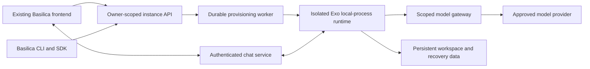

# Exo on Basilica — unified implementation plan

Updated: 2026-09-18. Status: implementation in progress; G0 contracts and baseline underway.

Planning branch: `docs/exo-implementation-plan`, created from freshly fetched `origin/main` at `f3749c7211e828c5c8ff34f6995f822cf83ccd2f`. Plan worktree: `/Users/samueldare/code/cc/basilica/basilica-exo-plan`. The original public checkout remains on its unrelated `docs/basilica-fly-school` branch and must not be used as the branch base for Exo implementation.

**This is the single implementation plan.** It replaces the earlier feasibility, Runta assessment, and frontend documents. Give this entire file to every implementation agent. The coordinator alone updates its contracts, ownership ledger, gate status, and integration record. README and TODO are pointers, not additional specifications.

## 1. Outcome and scope

Users launch Exo in the existing Basilica frontend or through `basilica summon exo`, then return to the same persistent agent from any device. Both surfaces operate on one backend-owned instance. Users do not configure Docker, SSH, images, or ports. Existing OpenClaw behavior remains supported.

```text
Agents → Create agent → Exo → name + model connection + recommended size
       → actual cost and persistence summary → Launch → Chat workspace
```

Connect a model inline and save an owner-scoped connection for reuse. Start with providers/models that pass real streaming/tool conformance tests; upstream's installer offers OpenAI and OpenRouter. Recommend one size, with advanced overrides. Benchmark before choosing defaults or promising startup times. Hosted model use does not require a GPU by default.

First release: deterministic setup, authenticated text chat, background scheduler/adapters, stable names/IDs, status, restart, export of declared persistent state, deletion with verified cleanup, and out-of-band recovery after a broken self-rebuild. Show compute, storage, and model charges separately. Do not imply platform provider keys make inference free or quote an unmeasured flat total.

Pause/resume, timed trials, whole-environment checkpoints, terminal, rich files/artifacts UI, teams, automatic upgrades, and bundled inference are capability-gated follow-ons. Hide nonfunctional controls. File restoration is not process-memory restoration. Full machine recovery is required only when offered in the declared persistence contract; it is not an unconditional prerequisite for a narrower, honestly described first release.

## 2. Checkouts, evidence, and current limitations

Workspace: `/Users/samueldare/code/cc/basilica`.

| Checkout | Responsibility | Reviewed revision |
| --- | --- | --- |
| `basilica/` | CLI, Rust SDK, customer docs, this plan | `f3749c7211e828c5c8ff34f6995f822cf83ccd2f` |
| `basilica-backend/` | Runtime, provisioning, instance/model/chat services, billing integration | `e0cd16dd2cf45625d7f5d822f666ef6b21c6e913` |
| `basilica-site/` | Existing Next.js app and authenticated agent experience | `5854e17d952a62906206ee60d8a64a4cb9cf8a95` |

Use sibling `basilica-site/`, not the older `cc/website/basilica-site` copy. Do not create another frontend or migrate hosts. Read repository-local instructions; inspect `git status --short` and `git diff --stat <reviewed-revision>..HEAD -- <owned-paths>` before implementation. Preserve unrelated work; the public checkout previously had simulator/RL/fly-school edits.

The current backend contains `docs/dependency-modes.md`; it was read during implementation. Default validation uses locked Git dependencies. Public contract changes must be pushed first, then the backend lockfile deliberately updated; disposable local overrides may be used only as documented.

Evidence that determines the design:

- All six pages of `/Users/samueldare/Downloads/Introducing_Exo_Harness_for_Runta_Runtimes.pdf` were inspected. Runta describes local-process Exo in a managed runtime, automatic onboarding, browser terminal, and a credential-substituting gateway. Its guarantees were not independently tested; the referenced demo videos were not available inside the PDF.
- Upstream Exo revision `b2769b6295e3cf23b24aad2794230fca6c09149c`, `crates/exoharness/src/sandbox.rs:1135`, implements local-process execution. Nested Docker is not required. That backend does not implement native sandbox snapshots/restore, attachment/detachment, durable-filesystem declarations, or a disabled-network policy. Basilica supplies the surrounding isolation/storage/network guarantees.
- Upstream `exo.sh` defaults to Docker: do not use its default installer unchanged. `crates/cli/src/adapters.rs` lacks adapter creation, while `crates/executor/src/adapter/store.rs:33` supplies typed creation. Bootstrap must not ask an LLM to create its own chat adapter.
- Exo state defaults to `.exo`; `crates/exoharness/src/secrets.rs:265` can place the master key elsewhere. Backing up `.exo` alone is insufficient.
- ExoChat uses outbound WebSockets. Its worker uses Cloudflare Durable Objects, sends `frame-ancestors 'none'`, and replaces an existing socket for the same role. It is not a drop-in Next.js route or OpenClaw iframe URL.
- Public `crates/basilica-cli/src/cli/commands.rs:264` defines `summon` as a `deploy` alias. Rust SDK CPU provisioning already exists in `crates/basilica-sdk/src/client.rs:684`. Current CPU stop terminates the machine; it cannot be relabeled Pause.
- Backend `crates/basilica-operator/src/controllers/user_deployment_controller.rs:522` constrains workload privileges. Do not weaken shared workload security or mount a node Docker socket.
- The frontend already supplies Auth0, funding, model selection, deployment management and OpenClaw chat. Its `lib/providerStore.js` stores raw provider keys in browser storage; `app/api/openclaw/deploy/route.js` injects resolved keys into deployment env. The Exo connection/gateway design must not inherit that exposure pattern.

Pinned references: [local-process implementation](https://github.com/exoharness/exo/blob/b2769b6295e3cf23b24aad2794230fca6c09149c/crates/exoharness/src/sandbox.rs), [ExoChat](https://github.com/exoharness/exo/blob/b2769b6295e3cf23b24aad2794230fca6c09149c/exo/adapters/exochat/README.md), [snapshot semantics](https://github.com/exoharness/exo/blob/b2769b6295e3cf23b24aad2794230fca6c09149c/exoharness/docs/sandbox-snapshots.md).

No runtime deployment, build, paid model call, or recovery test was performed during planning. Routes/types below are proposed, not shipped API documentation.

## 3. Architecture decisions

1. Test local-process Exo inside an existing Basilica CPU deployment first. Choose a dedicated CPU VM if that environment fails the required isolation, self-rebuild, or persistence contract. Docker remains optional.
2. One durable managed-agent record links owner, template/version, runtime resource, operation, connection, and persistent state. Reuse the current allocator and billing. A backend worker owns provisioning; browser/CLI closure cannot interrupt it.
3. Prebuild and pin the baseline/toolchain. Seed a writable per-instance source checkout once. Preserve source changes; do not fetch `main`, reset evolved source, or rebuild the baseline at every launch.
4. Keep provisioning authority, provider keys, billing and management outside the editable guest. A secret stub is not authentication. Use scoped revocable runtime identity, never a general Basilica account token.
5. Basilica operates the supported chat path. The frontend hosts the UI; a suitable service hosts persistent connections. Upstream's public relay can support a labeled compatibility spike, not the supported public product.
6. Reuse website account flows, theme and components. Preserve OpenClaw links and behavior. A marketplace framework, payment redesign, OpenClaw key migration, and broad frontend rewrite are out of scope.



## 4. Parallel ownership and coordination

**You are not alone in the codebase. Do not revert others' changes. Adapt to accepted edits. Work only in owned files; request changes from another file's owner.** Workstreams are logical responsibilities, not a claim that all workers run simultaneously.

Use isolated worktrees per worker/repository. Create each repository's Exo integration branch from its freshly fetched `origin/main`, not whichever feature branch happens to be checked out. Record the main base SHA and resolve any drift from the reviewed revisions. Workers branch from that main-based integration revision, including already accepted contracts when needed. CO integrates verified changes, records commits, and tells consumers when to update. Changes are not automatically shared between worktrees. Do not switch, reset, or move unrelated changes in the original checkouts. Never run broad auto-fix/format commands over another worker's work.

| ID | Exclusive ownership | Deliverable |
| --- | --- | --- |
| CO — coordinator | This plan/pointers; backend shared route/module registration, app state/bootstrap wiring, Cargo manifests/lockfile, migration filenames/files, shared CI | Frozen contracts, shared schema/wiring, integration and release evidence |
| RT — runtime | Backend `scripts/exo/**`, including upstream patch/helper and runtime smoke/evidence | Pinned runtime, deterministic bootstrap, supervision, persistence/export and bad-rebuild recovery |
| LC — lifecycle | New backend `src/api/routes/agent_instances/**`, `src/agents/lifecycle/**`, `src/db/agent_instances.rs` and colocated tests, all under `crates/basilica-api/` | Durable instance/operation lifecycle, quotes, reconciliation and cleanup |
| MG — model gateway | New backend `src/api/routes/model_connections/**`, `src/agents/model_gateway/**`, `src/db/model_connections.rs` and colocated tests, under `crates/basilica-api/` | Secure connections, scoped gateway, validation/streaming/revocation |
| CT — chat | New backend `src/api/routes/agent_chat/**`, `src/agents/chat/**` and colocated tests, under `crates/basilica-api/`; `scripts/exo-chat/**` | Sessions, pairing, transport, reconnect/revocation and relay assets |
| FE — frontend | `basilica-site/` paths in section 8, including shared auth/API/shell, package/lock/test config and README | Launch/list/workspace UI and frontend tests |
| SDK — CLI/SDK | Public `crates/basilica-cli/**`, `crates/basilica-sdk/**`, relevant public Cargo/lock changes, focused customer docs/examples | Matching CLI/SDK behavior, routing, output and tests |

New backend paths are proposed reservations. At G0, CO checks conventions and records any relocation in the ledger **before code is written**. Existing rental/deployment internals require explicit scope allocation before LC changes them. CO alone edits shared `api/routes/mod.rs`, `db/mod.rs`, `agents/mod.rs`, server state/registration and migrations. Feature owners send concrete registration/schema patches to CO; they do not independently number migrations or modify manifests.

FE alone owns frontend shared files; SDK alone owns public client/types and CLI dispatch. RT alone changes bootstrap even when MG/CT need more inputs. An interface change request includes reason, fields, compatibility, affected consumers and tests; CO versions the contract before landing it. No silent renames or private competing API schemas.

### Scheduling with four available agent slots

CO occupies one slot, leaving at most three workers. Reuse slots as owners finish:

| Wave | Workers beside CO | Dependency rules |
| --- | --- | --- |
| 0 | RT feasibility; FE build/auth baseline; MG existing-service/dependency inspection | Independent foundations while CO freezes contracts and module ownership |
| 1 after G0 | RT packaging; LC lifecycle; MG gateway | LC can implement durable storage/idempotency/reconciliation before G1; final runtime adapter waits for G1 |
| 2 as slots free | LC completion; CT chat; FE product UI | RT/MG hand off contracts/artifacts; FE can implement agreed schemas before every service finishes, but cannot claim real integration from mocks |
| 3 as slots free | CT/FE completion; SDK CLI/SDK | SDK may start earlier whenever G0 and a slot are available; CO integrates shared wiring |
| 4 after G2 | FE/SDK fixes; recall service owner for specific failures | CO runs end-to-end acceptance and records evidence |

Do not wait for an entire wave if a task's own gate is satisfied and a slot is free. This is a capacity-aware schedule, not an artificial serial pipeline.

## 5. Shared contracts — freeze v1 at G0

CO verifies existing naming/casing/auth conventions and produces the exact OpenAPI/types before clients depend on them. Reuse existing services where behavior matches. The following proposed routes are backend routes, separate from website paths:

| Operation | Proposed route | Required semantics |
| --- | --- | --- |
| Templates/offers | `GET /agent-templates`; `POST /agent-instances/quote` | Supported providers/models, sizes/regions, current quote/currency/basis/expiry and capabilities |
| Connections | `POST/GET /model-connections`; `PATCH/DELETE /model-connections/{id}` | Owner-scoped create/list/rotate/delete; accept secrets securely, never return them; explicit in-use deletion policy |
| Launch/list | `POST/GET /agent-instances` | Create accepts template, name, connection ID, quote ID and supported lifetime; returns stable instance and durable operation IDs |
| Detail | `GET /agent-instances/{id}` | Safe instance metadata, never chat/provider secrets |
| Operation | `GET /agent-operations/{id}` | Owner-checked progress, error, retry and cleanup state |
| Lifecycle | `POST /agent-instances/{id}/restart`, `/export`, `/recover`; `DELETE /agent-instances/{id}` | Durable operations with explicit data-retention and billing outcomes; recover names an available compatible code checkpoint |
| Logs | `GET /agent-instances/{id}/logs` | Bounded/paginated, redacted and owner-authorized |
| Chat access | `POST /agent-instances/{id}/chat-sessions` | Short-lived scoped access, expiry, approved transport URL and revocation; separate from general instance JSON |

Derive ownership from verified auth context, not supplied owner IDs. Freeze request/response casing, HTTP/error envelope, pagination and event types at G0. Proposed create response is HTTP 202 with `instance_id`, `operation_id`, `status_url`. An expired quote requires requoting, not silent repricing.

Minimum safe instance fields: stable ID, server-stored name, template/version, phase, desired state, current operation, connection ID/safe model label, cost basis, optional expiry, persistence description, capability flags, and actionable safe error. Runtime resource IDs are implementation metadata with appropriate visibility. Clients must not infer kind from image names or store authoritative identity only in localStorage.

Normalize phases for both clients: `queued`, `provisioning`, `configuring`, `starting`, `ready`, `restarting`, `failed`, `deleting`, `deleted`. Operation state separately expresses running/succeeded/failed and cleanup pending. CO may align names with repository conventions before G0, not independently per feature.

Mutations have owner-scoped idempotency. Same key + normalized body returns the same operation; changed body with the same key conflicts. Persist results across worker restarts. G0 fixes key lifetime and concurrent-mutation rules. Delete during provisioning persists desired deletion and reconciles any created resource. Success requires confirmed provider state and billing finalization, not just a successful API request.

Capabilities cover chat/restart/export/recover/pause/resume/terminal/files; unsupported or unknown is unavailable, not simulated success. At G0 settle quote units, model charges, retention/deletion/expiry policies and persistence scope. No timed trial silently destroys state; it needs verified preservation or a separately explicit, accepted deletion policy.

First-release recovery is user-accessible code recovery, distinct from optional full-environment restore. LC exposes owner-authorized available checkpoint metadata in instance detail and accepts its ID in a durable recover operation. RT preserves an immutable baseline and compatible healthy code/dependency checkpoints outside the editable checkout, quiesces services, preserves canonical state/history, restores the selected code, then verifies readiness. Reject incompatible state-schema/checkpoint combinations; never silently roll back user data. FE/SDK show the checkpoint/time and effect, submit the operation and track progress even when chat is broken. G2/G3 must demonstrate this path after a failed self-rebuild.

Internal bootstrap v1 joins RT/LC/MG/CT: instance ID, pinned baseline, local-process provider, persistent path mapping, model binding/base URL, scoped gateway identity through protected delivery, scoped chat pairing. No upstream provider key or account-wide token. RT emits structured readiness/diagnostics/version rather than secrets in stdout. Freeze service-start/stop and replacement/fencing expectations.

Runtime gateway HTTP v1 now uses the model base URL `/agent-runtime/{instance_id}/v1/` under the API origin, with a trailing slash. Bootstrap supplies the protected runtime bearer identity and explicit `EXO_MODEL_API_STYLE`; Responses and Chat Completions are separate POST routes under that base. `POST /agent-runtime/{instance_id}/identity/refresh` accepts no body or `{}`, extends the same token to at least one hour from renewal without shortening existing expiry, and returns only `expires_at`. Account/JWT credentials, query tokens, and caller-selected renewal lifetimes are rejected. The guest renewal launcher is implemented; protected issuance/delivery and image/bootstrap wiring still require LC/RT integration.

Protected runtime identity file v1 is a private JSON object with exactly `schema_version: 1`, canonical UUID `instance_id`, HTTPS `api_origin` (origin only), and scoped bearer `token`. Delivery makes a private regular file owned by the launcher user, mode 0400 or 0600, in a trusted parent directory; projected symlinks must be copied. This is internal secret delivery, never general instance metadata. RT stores the same token in the encrypted Exo model binding, then invokes the image-owned `runtime_identity.py` launcher in Python isolated mode around the supervised service command. Successful refresh precedes process start; periodic renewal failure/expiry stops the process group. The image must provide orphan reaping and container isolation, and LC retains generation fencing authority. The launcher is implemented; protected delivery, deterministic binding, image/service wiring and real acceptance remain pending.

MG fixes request protocol, owner/runtime identity, destination/model allowlist, issuance/revocation, rotation and usage semantics. CT fixes message IDs/acknowledgments, session roles/expiry, reconnect, channel identity, origins and transport schema. A URL alone is not an adequate contract. FE/SDK obtain chat access only through owner-authorized operations.

G0 checklist: exact module ownership; schema/migration allocation; dependency mode; wire/error/event types; idempotency and in-flight transitions; quote/retention/persistence policy; runtime identity delivery; chat deployment shape; origins/scopes; test runner. CO records decisions here and in generated contracts. Resolve routine choices from repository conventions rather than repeatedly asking the user.

## 6. RT — runtime and state preservation

Create `scripts/exo/VERSION`, pinned build/bootstrap/entrypoint/service assets, typed adapter helper or upstream patch, `smoke.sh`, and redacted evidence. Follow existing runtime packaging patterns under `scripts/openclaw/`, without copying its credential/Docker assumptions. Keep upstream changes in the owned versioned build/patch bundle.

Build a headless supervised local-process runtime with preinstalled pinned tools/dependencies/binaries, immutable baseline and writable instance checkout. Coordinate Exo guardian and supervisor so self-rebuilds do not cause competing restart loops. Idempotently create model binding, canonical agent, conversation, scheduler and chat adapter; never reset existing state or ask an LLM to perform infrastructure setup.

First measure real tool/package execution, self-edit/rebuild, scheduled work, source-build performance on the chosen filesystem, time to usable chat, idle/peak memory, disk needs and current offer cost. A 4 vCPU/8 GiB candidate is only a benchmark hypothesis. If ordinary deployment fails required isolation or persistence, hand CO evidence for the VM fallback before LC changes its runtime implementation. Do not weaken shared workload security.

Declare preservation separately for source/tools/lockfiles, `.exo` history/schedules/artifacts/adapter state, master key/encrypted secrets, user files, installed dependencies, OS package changes and process memory. Ephemeral OS package installs are not automatically durable. Test process restart and pod replacement; machine replacement only if offered. Measure FUSE suitability; if Docker is later selected, do not put its data root on R2 FUSE.

Exports/checkpoints include a versioned integrity manifest and all declared state, protecting secrets with encryption and owner-restricted restore. Quiesce writers, omit stale locks/PIDs/sockets, and fence the old instance before replacement to avoid duplicate scheduled side effects. Define missed-schedule behavior; no blind replay. Restore/regenerate scoped access safely. Keep recovery outside Exo chat after a bad self-edit; reverting source must not silently erase canonical history. Snapshot filesystem recovery differs from sandbox/conversation rewind or process-memory resume.

Hand off image digest, bootstrap schema version, required resources, readiness/error signals, persistence limitations, export/bad-rebuild recovery results, and cleanup transcript. Real acceptance includes scheduled work after closing the browser and repeated bootstrap retaining identity.

## 7. Backend workstreams

### LC — lifecycle and cost

Inspect existing route/database conventions and `api/routes/cpu_rentals.rs`, `secure_cloud.rs`, deployment handling and billing. Implement owned modules for durable records/operations, owner checks, quotes and reconciliation. Submit schema/state/registration changes to CO. Reuse allocator and accounting instead of inventing another source of compute truth.

Persist intent before allocation; reconcile uncertain responses/provider state after worker restart. Running pod is not ready chat. Keep service health, model availability and relay connectivity separate; rate limits must not trigger destructive restart loops. Cleanup failure remains visible with continuing costs and retries.

Test duplicate requests, changed-body idempotency conflict, client/worker disconnect, capacity/volume failure, delete during create, insufficient balance, expired quote, partial teardown and cleanup retry. Runtime fencing and resource-kind/name resolution must prevent accidental action on another instance. Restart/export/recover/delete must follow the declared persistence/retention contract. LC owns the durable recover operation; RT implements the restore and readiness hooks. CPU stop remains termination, not Pause.

### MG — model connections and gateway

Implement owner-scoped safe metadata with encrypted server-side keys and real model validation. Test streaming, tool calls and errors before exposing a model. Authenticate scoped runtime identities and constrain destinations/models; arbitrary URLs and redirects must not receive injected keys. A placeholder/stub does not authenticate a request.

Keep real keys outside guest/browser storage/logs. Support rotation without agent rebuild, revocation and explicit behavior for deleting active connections. Meter via current accounting interfaces. Advertise hard spending caps only if in-flight reservation/enforcement supports them. Existing OpenClaw key migration remains separate.

Test cross-owner use, expired/revoked credentials, destination/model rejection, rotation, streaming cancellation/errors and redaction. Supply RT with protected identity delivery and FE/SDK with safe connection metadata. Real conformance evidence is required, not merely a mocked provider response.

### CT — authenticated chat

Implement session issuance and runtime pairing against the frozen protocol. Reuse upstream ExoChat behavior where useful. If reusing its Cloudflare worker, register its actual Durable Object hosting dependency at G0; otherwise implement a compatible service capable of long-lived connections. Short-lived Next.js handlers are not the relay.

Handle expiry/revocation, unique per-instance channels, reconnect and acknowledgments without replaying actions. Define multiple-browser/same-role replacement behavior. A health probe must not replace the user's socket or generate recurring model charges. Clones cannot reuse the parent's access identity. Redact upstream adapter access URLs from general logs.

Test real chat/tool round trip, scheduler continuity, reconnect/renewal, cross-owner denial and old-session rejection. Text is the baseline. Hand FE/CO transport/session types, origins policy, example client integration, hosting assets and real evidence. Terminal/PTY access remains deferred unless implemented with separate scoped authentication and tested lifecycle.

## 8. FE — existing `basilica-site/` application

Use Next.js 14 JS/JSX, React 18, Tailwind 3, Zustand and `@/` imports. Reuse Aeonik/Montreal fonts, `oc-*` theme, Auth0 shell and balance/funding components. Keep route group `(openclaw)` for this bounded addition; it is absent from URLs. Do not introduce duplicate root layouts/providers.

| Purpose | Owned paths relative to `basilica-site/` |
| --- | --- |
| List/template picker | `app/(openclaw)/agents/page.jsx`; `components/agents/AgentList.jsx`, `AgentTemplatePicker.jsx` |
| Create | `app/(openclaw)/agents/new/page.jsx`; `components/agents/ExoCreateForm.jsx`, `ModelConnectionSelect.jsx` |
| Workspace | `app/(openclaw)/agents/instances/[id]/page.jsx`; `components/agents/ExoWorkspace.jsx`, `ExoChatPanel.jsx` |
| Shared shell/auth | `app/(openclaw)/layout.js`; existing `components/openclaw/OpenClawShell.jsx`, `Sidebar.jsx`, `TopBar.jsx`, `ChatRibbon.jsx`, `AuthGuard.jsx`; `lib/auth.js` |
| API/metadata | `lib/api.js`; new `lib/agentApi.js`, `lib/modelConnections.js` if needed |
| Tests/docs/tooling | `tests/exo-ux-test-plan.md`, focused test/runner files, necessary package/lock/lint config, `README.md` |

Preserve `/openclaw` chat/logs/settings/funding and exact `/agents/...` documentation/install redirects in `next.config.mjs`. No catch-all agent route. Add appropriate Exo/Agents metadata; link existing funding initially. Leave the OpenClaw chat protocol/component intact.

Auth currently returns to `/openclaw`. Preserve callback compatibility while restoring an intended same-origin relative agent path after login; reject unsafe return destinations. Test expiry and fresh-browser access. Use the existing authenticated API client and frozen schemas. Do not provision resources in a frontend handler or keep authoritative names/IDs only in browser storage.

Create flow offers inline saved connection, recommended compute, real quote and persistence/lifetime summary. Keep temporary key input out of persistent stores; clear after secure submission. Never reuse the raw-key persistence store for Exo. Retry uncertain launches with the same idempotency key and reconnect to the operation after refresh.

Exo chat uses CT's scoped access. Do not swap the upstream public ExoChat URL into the existing iframe. Show runtime versus connection state separately, preserve drafts, and avoid blind message replay. Capabilities control actions; management/cost/model/name/status/recovery remain accessible outside guest UI.

Set `NEXT_PUBLIC_MOCK=false` explicitly for hosted acceptance/production builds. Configure actual Auth0 callbacks/logout/origins/audience, backend CORS and chat origin/WebSocket/CSP. No provider secret in `NEXT_PUBLIC_*`. Keep current server-capable Next.js hosting (README documents Vercel), not static export or a new host.

Real acceptance covers clean-account login/create/tool call, fresh-device reopen, price/key/capacity errors, interrupted create and reconnect, revoked access, delete, mobile/theme behavior, plus existing OpenClaw launch/chat/restart/funding. Extend existing UX-test style without copying stale model names or credentials from fixtures. Mock screenshots do not prove integration.

## 9. SDK — one CLI/Rust SDK behavior

Own CLI dispatch/options and SDK client/types together. Inspect `crates/basilica-cli/src/cli/commands.rs`, `cli/handlers/deploy/mod.rs`, `templates/openclaw.rs`, and SDK `client.rs`/`types.rs`. Reuse `CliError`, progress/output helpers and authenticated `BasilicaClient`.

Implement `basilica summon exo` with agreed name/connection/size/region/lifetime options, hidden/env input for creating connections, detached operation mode and secret-free JSON. Show the same quote/persistence semantics as the browser. Do not inherit irrelevant GPU/replica/no-storage flags.

Provide resource-kind-aware list/status/open/logs/restart/export/recover/delete routing. `summon` is currently a deploy alias: preserve generic/OpenClaw behavior and explicitly handle name collisions. Unsupported pause/resume are absent. Open retrieves scoped access separately from general status JSON. Rust SDK represents the shared contract; Python expansion is deferred to avoid unrelated ongoing Python work.

Test parsing, phase/error mapping, secret redaction, idempotency reuse, and resource-kind dispatch. Document a real launch/reopen/cleanup flow. Match public repository style and use Conventional Commits when implementation work is committed.

## 10. Verification and dependency gates

These are future required checks, not completed runs. Establish baselines and record commands/results; distinguish pre-existing failures. New smoke scripts/test targets must be implemented and document their exact invocation before being claimed as gates.

| Owner | Required checks |
| --- | --- |
| RT | `bash -n scripts/exo/*.sh`; actual smoke runner with nonzero failure assertions. Pinned upstream builds use the compatible toolchain and locked dependencies; observed upstream scripts build `exo` and `exo/scheduler-runner/Cargo.toml`. `pnpm check` is upstream lint/typecheck/tests. Record actual commands/any necessary deviations. |
| LC/MG/CT + CO | Targeted Rust tests per owned module and real integration cases; repository `just` checks after wiring. `actionlint` and required local CI validation for changed workflows. Record exact added test targets during implementation. |
| FE | `npm ci`; `npm run build`; `CI=1 npm run lint`; chosen focused test runner; real browser acceptance. Lockfile and `.papi/descriptors/package.json` exist. Dependencies were not installed and ESLint config/dependency was not present at review: establish a noninteractive baseline, never count setup prompts as passing. Build runs sitemap postbuild; inspect generated changes. |
| SDK | `cargo test -p basilica-cli`; `cargo test -p basilica-sdk`; `just fmt-check`; `cargo clippy -p basilica-cli -p basilica-sdk --all-targets -- -D warnings`; required public CI. |
| CO | Cross-repo staging evidence, pinned revisions/image digest, redacted logs/screenshots/test reports, confirmed provider cleanup and billing outcome. |

Only format owned paths; broad checks run on the integration branch after shared wiring. No mock/stub production implementation. Unit test doubles only if repository policy allows; they never substitute for required real-service evidence.

| Gate | Owner | Pass condition | Status |
| --- | --- | --- | --- |
| G0 — contracts/baseline | CO | Wire/runtime/chat schemas and errors frozen; ownership/migrations/dependency mode fixed; test/hosting/persistence policies recorded | In progress |
| G1 — runtime selection | RT + CO | Local-process rebuild/scheduling/declared persistence/export/bad-rebuild recovery demonstrated; deployment versus VM chosen with evidence | Not started |
| G2 — services | LC + MG + CT + CO | Durable launch, scoped model access and real chat integrated; auth/revocation/retry/cleanup cases pass | Not started |
| G3 — product | FE + SDK + CO | Real web/CLI parity, fresh-device access, operations/redaction and OpenClaw regression pass | Not started |
| G4 — release readiness | CO | Required CI passes, actual hosting configuration/cost/persistence disclosure ready, rollback documented, staging resources cleaned | Not started |

Cloud tests require implementation/test authorization, scoped budget/lifetime and teardown records; consolidating this plan creates none. Once authorized, coordinate shared test infrastructure or clearly separate labeled resources to prevent duplicate purchases. Report resources intentionally left running and continuing costs. Publishing follows the user's current authorization, not an automatic effect of reading this plan.

## 11. Coordinator ledger and handoff protocol

Only CO updates this ledger. Workers report evidence; they do not race to edit this file.

| Workstream | Agent/worktree | Scope | Dependency | State | Evidence/revision |
| --- | --- | --- | --- | --- | --- |
| RT | CO / `basilica-backend-exo` | Section 4 runtime paths | Bootstrap v1 for final wiring | Pinned source, bootstrap patch, model protocol and identity renewal launcher pushed; image/bootstrap wiring pending | `754c8645a`; 17 HTTPS/process tests and 20 repeated signal-shutdown runs; prior adapter/scheduler/source/CLI/model-runtime checks |
| LC | CO / `basilica-backend-exo` | Section 4 paths confirmed; migration 035 | G0; G1 for runtime adapter | Durable create/delete intent and leases pushed; reconciler pending | `29109f046`, `fec2645fc`; 6 real PostgreSQL lifecycle tests |
| MG | CO / `basilica-backend-exo` | Section 4 paths confirmed | G0 | Connection API, runtime gateway HTTP, refresh and guest renewal launcher pushed; accounting and protected bootstrap wiring pending | `53256bc7c`; 791 API unit + 28 lifecycle/connection/runtime database tests; private runtime OpenAPI generated |
| CT | Unassigned | Section 4 proposed paths; CO confirms at G0 | G0; RT pairing integration | Not started | None |
| FE | CO / `basilica-site-exo` | Section 8 plus `lib/agentNavigation.mjs` | G0; G2 for final acceptance | Build/lint/auth baseline pushed; product UI pending | `51f53f8`; 4 navigation tests, production build |
| SDK | CO / `basilica-exo` | Section 9 | G0; G2 for final acceptance | Shared DTOs and SDK transport pushed; CLI pending | `f0e1c972`; 100 library + 10 HTTP-client tests |

Every handoff includes owned files, contract version, commit/image digest, exact checks/results, redacted evidence location, unresolved failures, outstanding resources, and consumers now unblocked. Worker code completion is not a passed product gate. CO serializes migrations/shared edits, integrates commits, updates consumers and records final component versions.

Stop only dependent work when an API is unavailable, source drift invalidates assumptions, runtime isolation/persistence fails, or a frozen contract needs revision. Send CO evidence and the smallest required decision; continue independent owned work. Never use a production mock, weaken a customer promise silently, or edit another owner's files just to force compilation.

Final acceptance: deterministic first chat with real tool execution; scheduled work after closing the browser; source/history/keys retained under the declared failure scope; recovery after broken self-modification; cross-owner rejection; provider secrets outside guests; no duplicate purchase on retry; confirmed failure/delete cleanup and billing; web/CLI consistency; and retained OpenClaw behavior.

## 12. Implementation record — 2026-09-17

The user authorized full implementation, tests, and incremental commit pushes.
Original checkouts remain untouched. Implementation worktrees are
`basilica-exo` (public `feat/exo`, main base
`f3749c7211e828c5c8ff34f6995f822cf83ccd2f`) and
`basilica-backend-exo` (backend `feat/exo`, freshly fetched main base
`4bbef3368d2f0fef7f52d53284eed00b57161f99`). Frontend main remains
`5854e17d952a62906206ee60d8a64a4cb9cf8a95`; its isolated worktree is
`basilica-site-exo`. Backend drift adds placement work outside the reserved API paths.

CO currently executes the workstreams sequentially. Section 4 backend reservations
are confirmed against current module conventions. Public wire types are owned by
SDK at `crates/basilica-sdk/src/agents.rs` and reused by backend through its existing
SDK dependency with `openapi`. Transport methods stay in SDK `client.rs`.

Contract decisions for the initial implementation:

- JSON uses snake_case, RFC3339 UTC times, opaque string IDs, and the existing
  `{error: {code, message, timestamp, retryable}}` error envelope. Requests reject
  unknown fields. Paginated collections return `items` and `next_cursor`; page
  limits are 1–100. Logs use a separate opaque cursor and limit 1–1000.
- All mutation requests require an owner-scoped `Idempotency-Key` of 16–128
  ASCII alphanumeric, hyphen or underscore characters. Keys bind method, route,
  and normalized body and are retained with durable operation records for the
  instance's lifetime and at least 30 days after deletion. Replay precedes quote
  expiry checks. Changed requests conflict. One active mutation per instance;
  delete preempts other intent and fences subsequent create/restart work.
- Prices are exact decimal strings in USD; compute and storage hourly costs are
  separate from model costs charged by the connected provider. Quote expiry is
  explicit. The initial lifetime is `until_deleted`; unsupported timed lifetimes
  are rejected. There is no unverified pause or trial promise.
- Model connections accept fixed provider IDs (`openai`, `openrouter`) and models
  from the server's tested catalog, never an arbitrary destination URL. Safe
  metadata never contains provider keys. Rotation increments a credential version;
  deletion conflicts while any nondeleted instance uses the connection.
- Capability booleans default to false. Instance details separate runtime,
  model and chat health. Recovery selects a compatible code checkpoint and
  preserves canonical user state. Export artifacts are retrieved through an
  owner-authorized operation, not a bearer URL in general instance status.
- Chat uses the long-lived backend Axum WebSocket service, short-lived scoped
  sessions, first-frame authentication (no URL tokens), configured browser origins,
  and separate runtime pairing. Message IDs and persisted acknowledgments must
  prevent replay after reconnect. General status never contains chat credentials.

Remaining G0 work includes instance/operation/chat OpenAPI, exact runtime
bootstrap/transport schemas, and persistence feasibility. Connection OpenAPI is
implemented in both generated public and private API documents. The frontend test/build baseline is established.
CO reserves backend API migration
`035_managed_agents.sql` for owner-scoped connections, quotes, instances, durable
operations, idempotency records, and scoped runtime/chat identities. Database
constraints and transition storage are validated against disposable local PostgreSQL.
No live resources have been provisioned and no product gate has passed.

### Verified incremental commits

- Public plan `dbb130a1` pushed to `docs/exo-implementation-plan`.
- Backend `086c698a5` pushed to `feat/exo`: additive migration 035 and disposable
  PostgreSQL constraint runner. `python3 scripts/exo/tests/test_schema.py` passed
  15 tests. Temporary PostgreSQL stopped/removed. Pinned Gitleaks 8.30.1, verified
  against upstream release checksum, passed the complete branch range.
- Frontend `51f53f8` pushed to `feat/exo` in isolated `basilica-site-exo`:
  validated Auth0 appState return paths, removed partial token logging, and added
  noninteractive ESLint/Node test tooling. `npm ci` passed before lint-tooling
  installation; `npm run test:agents` passed 4 tests; `CI=1 npm run lint` passed
  with four existing warnings (image elements and Header hook dependency).
  `NEXT_PUBLIC_MOCK=false NEXT_TELEMETRY_DISABLED=1 npm run build` passed, including
  sitemap generation; generated sitemap files are ignored and uncommitted.
  Existing metadataBase warnings remain. Complete commit-range secret scan passed.
- Public `f0e1c972930da5a8317ed9c70fc6bd3e7131d0f1` pushed to `feat/exo`:
  shared agent types and authenticated Rust SDK methods. `cargo test --locked -p
  basilica-sdk --lib` and the same command with `--features openapi` each passed
  100 tests. `cargo test --locked -p basilica-sdk --test agents_client` passed
  10 tests after the final HTTPS guard. `cargo clippy --locked -p basilica-sdk
  --all-targets --features openapi -- -D warnings` and `just fmt-check` passed.
  The exact changed commit range passed secret scanning. A broader exploratory
  scan of the existing SDK directory flagged two pre-existing findings outside
  this commit; no scanner bypass or exclusion was added.

- Public `c22700c0` pushed: CI now executes Rust SDK tests alongside CLI tests.
  Actionlint and complete-range secret scanning passed. Hosted run
  [35262586904](https://github.com/one-covenant/basilica/actions/runs/35262586904)
  finished: CLI/SDK, validator, Python matrix, lint, and secret checks passed;
  security audit failed on Rustls 0.23.36 (RUSTSEC-2026-0285), and the miner image
  scan failed on PCRE2 10.42-1 (fixed package 10.42-1+deb12u1). Fixed by `234a8de1` below; this historical run is not green.
- Backend `29109f046`, `281a6b245`, and `fec2645fc` pushed: owner-serialized
  create/delete intent and durable retry responses, generation-fenced leases,
  context-bound AES-256-GCM credential storage and keyring rotation, plus a
  heartbeat lock-wait expiry fix. Backend intentionally locks all five public
  crates to `f0e1c972930da5a8317ed9c70fc6bd3e7131d0f1`; full locked Cargo metadata
  inspection passed, with no local dependency override.
  `CARGO_BUILD_JOBS=4 just test-crate basilica-api` passed 756 tests (9 existing
  ignored). `CARGO_BUILD_JOBS=4 python3 scripts/exo/tests/run_lifecycle_db.py`
  passed all 6 tests after the lease fix, including an observed PostgreSQL row-lock
  race. Its temporary database stopped/removed. `cargo clippy --locked -p
  basilica-api --lib --test agent_lifecycle_db -- -D warnings`, `just fmt-check`,
  and `just instructions-check` passed. Pinned Gitleaks passed the complete
  four-commit backend range through `fec2645fc` before push. Hosted backend CI
  remains required.
- Backend `87cb2cde63a7df76b8730d8f463509f9facc11d6` pushed: required CI now
  executes schema and lifecycle tests using disposable native PostgreSQL. Test
  runner edits select the Rust lane. Actionlint, instruction checks, and an Act
  `workflow_call` dry run of `workspace-hermetic` with `rust_selected=true` passed;
  this is graph validation, not a hosted build. Full five-commit secret scan
  passed. Hosted run [35266047579](https://github.com/one-covenant/basilica-backend/actions/runs/35266047579)
  completed successfully for this exact head.
- Public `234a8de1120eaab50c80ae0450505b7028831723` pushed: Rustls updated to
  0.23.45 with its required crypto dependencies; miner image explicitly installs
  the current PCRE2 package. `cargo deny --locked check` passed all four policy
  categories. `CARGO_BUILD_JOBS=2 cargo test --locked -p basilica-sdk -p basilica-cli`
  passed 212 CLI unit tests, 1 noninteractive test, 100 SDK unit tests, 10 agent
  HTTP tests, and 10 doctests (2 existing ignored). Running the package update
  in the exact pinned Debian amd64 base installed PCRE2 10.42-1+deb12u1. This is
  package verification, not a fresh full-image vulnerability scan. Full branch
  secret scan passed. Hosted run [35266045472](https://github.com/one-covenant/basilica/actions/runs/35266045472)
  completed successfully for this exact head.

Runtime source is at the pinned revision in `/tmp/basilica-exo-upstream`.
Backend `37dc442e6` pushed the source pin, preparation script, upstream adapter
and scheduler patch, and actual source/compiled-CLI checks. Apple Clang and explicit
SDKROOT resolved the native macOS build prerequisite. Final adapter Rust tests
passed all 5 cases; 20 parallel binary reruns passed all 100 test executions after
explicit unlock fixed the inherited-descriptor race. The scheduler key-selection
test passed. The CLI was rebuilt after the fix and all 3 compiled-CLI setup tests
passed. All 3 source-preparation tests passed against the actual pinned Git source;
patch apply/reverse checks, shell syntax, Shellcheck, and full-range secret scanning
passed. Patch-only blank context lines were normalized before publication so
`git diff --check` passes without exclusions. These are bootstrap checks, not runtime
scheduling/chat/self-rebuild/recovery evidence. Upstream's independent dependency
graph still requires release security auditing and necessary locked updates.

Backend `f1727c20a9c1e5337c0cad76d824c3eedf3d8a99` pushed owner-scoped
connection persistence: encrypted creation, versioned rotation, safe durable
retry responses with a dedicated HMAC key, stable pagination, deletion checks,
and ciphertext erasure after deletion. Creation/deletion share the agent owner
lock, preventing a concurrently accepted broken binding. Provider validation is
an explicit precondition of the storage boundary, not simulated there. Locked
public dependency inspection passed; only the API's existing HMAC dependency
edge was added. `just test-crate basilica-api` passed 757 tests (9 existing ignored).
The disposable PostgreSQL runner passed 6 lifecycle and 6 connection tests.
Clippy for the library and both integration targets, formatting, instruction checks,
and the full seven-commit secret scan passed. Hosted CI
[35268498110](https://github.com/one-covenant/basilica-backend/actions/runs/35268498110)
completed successfully for that exact head.


Backend `09d956a3f` pushed credential/model-access validation and the connection
service. Production HTTP goes only to fixed OpenAI/OpenRouter HTTPS destinations,
with redirects/proxies disabled, bounded bodies/time/concurrency, and safe errors.
The deployment catalog defaults to empty and must contain only models that
separately pass live runtime/tool conformance. Provider discovery does not expand
it. Metadata validation does not generate tokens or guarantee credit. Accepted
retries bypass provider calls; rotation checks ownership before validation and
rechecks deletion on commit. Nine loopback HTTP tests passed, plus all 6 lifecycle
and 9 connection/service PostgreSQL tests, including deletion during an in-flight
provider check. Clippy, formatting, instruction checks and the complete eight-commit
secret scan passed. The authenticated route/configuration increment below completes the connection
API wiring; this does not claim a deployed connection service.


Backend `786b96f84` pushed authenticated connection create/list/rotate/delete
handlers, optional protected keyring/catalog configuration, scope registration,
and public/private OpenAPI artifacts. Extractor errors are sanitized, mutation
headers validated, and request bodies capped at 32 KiB. Owner identity comes only
from the verified auth context. With configuration absent the service returns 503;
no provider/model is enabled by default. A first test run caught missing private
OpenAPI registration; both specs were corrected and an explicit contract guard
added. The final `CARGO_BUILD_JOBS=4 just test-crate basilica-api` passed 771 tests
(9 existing ignored). The disposable PostgreSQL runner passed 6 lifecycle and
10 connection/service/HTTP tests. `cargo check --locked -p basilica-api --all-targets`,
Clippy for the library and both database targets with `-D warnings`, formatting,
instruction checks, and the complete nine-commit secret scan passed. The actual
`gen-openapi` binary generated both artifacts; every schema reference resolves
and pre-existing paths are unchanged.

Backend `23e8f7dc5` pushed an upstream runtime compatibility fix: the pinned Exo
implementation infers OpenRouter's Chat Completions protocol from its hostname,
which fails behind a Basilica gateway. `EXO_MODEL_API_STYLE` now explicitly selects
`responses` or `chat_completions` before provider/model heuristics, preserves the
configured endpoint and bearer credential, and rejects invalid/empty values
without echoing them. The managed bootstrap contract must set this for its single
model binding: OpenAI uses Responses; the pinned OpenRouter integration uses
Chat Completions. It grants no authority; scoped runtime authentication is still
required. With the variable absent, upstream behavior remains unchanged.
`CC=/usr/bin/clang CXX=/usr/bin/clang++ SDKROOT=/Library/Developer/CommandLineTools/SDKs/MacOSX.sdk CARGO_BUILD_JOBS=2 cargo +1.97.1 test --locked -p executor --lib harness_runtime::tests`
passed all 11 tests, including 3 new protocol cases. All 3 source-preparation tests
passed with the actual pinned mirror and both patches. Formatting and full ten-commit
secret scanning passed. Hosted CI [35272414776](https://github.com/one-covenant/basilica-backend/actions/runs/35272414776)
completed successfully for this exact backend head.

Backend `b5382523f` pushed scoped runtime identity persistence. Issuance requires
a live, current worker lease; credentials contain 256 random bits and only their
SHA-256 digest is stored. Runtime/account token formats reject one another.
Authentication checks instance, owner-bound connection, generation, usable phase,
desired state, expiry, and revocation. Refresh retains the bearer token for safe
lost-response retries and rechecks authorization after row locks. Delete intent
continues to revoke identities atomically. The final disposable PostgreSQL runner
passed all 22 tests (6 lifecycle, 10 connections, 6 runtime identity), including
observed row-lock expiry races for issuance and refresh. The API library passed
772 tests (9 existing ignored). Scoped Clippy with `-D warnings`, formatting,
instruction checks, and pinned full eleven-commit secret scanning passed.
HTTP refresh, protected bootstrap delivery, and the streaming gateway still need
integration; these tests do not establish runtime or live-provider acceptance.

Backend `40750b9fa59b76b702ce930b0ca9aa3a37972439` pushed gateway credential
resolution. Runtime authentication and credential lookup share one authority
predicate; identity, owner-bound connection, model, version and ciphertext are
read in a single PostgreSQL snapshot before context-checked decryption. Each new
request observes committed rotation without a runtime-token change or plaintext
cache. The current approved catalog gates existing connections too. The result
is server-only, redacted and not serializable. The transport must still validate
requested model/protocol, inject keys only at fixed provider destinations, and
cancel on runtime expiry/revocation. These transport handlers are not yet present.
Five new database tests cover rotation, exact OpenAI/OpenRouter bindings, removed
catalog entries, expired/revoked/fenced access, and ciphertext substitution across
owner/connection/provider/model/version. A first run caught an invalid expiry
fixture (expiry before creation); the fixture was corrected without weakening the
schema. The final `CARGO_BUILD_JOBS=4 python3 scripts/exo/tests/run_lifecycle_db.py`
passed 27 tests: 6 lifecycle, 10 connection, and 11 runtime identity/access tests.
`CARGO_BUILD_JOBS=4 just test-crate basilica-api` passed 772 tests (9 existing
ignored). Scoped Clippy with `-D warnings`, formatting, instruction checks, and the
pinned full twelve-commit secret scan passed. Hosted CI
[35274671719](https://github.com/one-covenant/basilica-backend/actions/runs/35274671719)
completed successfully for this exact head.

Backend `c5d7bcbf9fa1bc8c4a5b9a22963f7d769ae39e2a` pushed the bounded model
transport. It constructs fixed-destination HTTPS requests with sensitive provider
authorization, no caller headers, no redirects or ambient proxies, and exact
model/protocol binding. Canonical JSON prevents duplicate model-key ambiguity.
The initial managed contract permits text/local function tools and rejects hosted
tools, background requests, provider file/item references and stored conversation
or response references. Provider storage is disabled; Responses includes encrypted
reasoning content for stateless replay in Exo. Real pinned-runtime conformance is
still required and no models were added to the approved catalog.

The producer continues authority checks under client backpressure; revocation,
expiry, disconnect and deadlines drop the upstream connection and release its
concurrency permit. Requests/frames are limited to 4 MiB, replies to 32 MiB, and
concurrent requests to 32 per process. Connect/header/idle/provider-lifetime bounds
are 5/30/60/600 seconds; authority work is bounded and rechecked every second.
SSE parsing preserves tool/usage JSON, handles split UTF-8 and LF/CRLF/CR framing,
normalizes comments to fixed keepalives, suppresses provider diagnostics, and
rejects malformed/in-band-error/truncated streams. EOF without a terminal event
is not successful completion. Cancellation does not guarantee provider billing
has stopped; usage forwarding is not yet accounting integration or a spending cap.

The final `CARGO_BUILD_JOBS=4 just test-crate basilica-api` passed 785 tests
(9 existing ignored), including 13 transport checks. Actual loopback HTTP tests
cover protocol/model rejection before HTTP, exact endpoint/key substitution,
redirects, safe HTTP/JSON/SSE errors, usage/tool events, response bounds with and
without Content-Length, idle/total deadlines, dropped clients, and observed server
connection teardown on revocation during idle reads and backpressure. A full run
caught a heartbeat test fixture lacking the separating blank line; it was corrected
and the entire API suite rerun. The disposable PostgreSQL runner passed all 27
tests, including the real transport authority recheck before and after revocation.
Scoped Clippy with `-D warnings`, formatting, instruction checks and pinned full
thirteen-commit secret scanning passed. Hosted CI
[35276886704](https://github.com/one-covenant/basilica-backend/actions/runs/35276886704)
completed successfully for this exact head. The following increment adds HTTP
route/configuration integration and runtime refresh; usage accounting and real
model/runtime conformance remain outstanding.

Backend `53256bc7cf9745661025b8034d89ada91520800e` pushed the runtime HTTP
integration and renewal endpoints. A dedicated route builder attaches scoped bearer
authentication before body collection; its three routes are enumerated by the
router inventory guard. They reject account credentials, duplicate Authorization
headers, query tokens and invalid instance IDs. Existing optional model-connection
configuration constructs both runtime services from the same protected keyring and
approved catalog. JSON/SSE responses use no-store; SSE disables proxy buffering.
Refresh accepts empty input, extends the existing identity under server policy,
and returns only expiry. Protected bootstrap delivery and periodic guest renewal
remain unimplemented.

Both existing API timeout layers now recognize the exact runtime POST templates
and grant 640 seconds for handler completion; ordinary routes retain their configured
budget. Body, authority and provider work keep their independent shorter bounds.
Tests verify timeout selection using real matched routes and requests through the
timeout layer. Runtime tracing and metric labels use route templates, omitting
untrusted path values and query strings and avoiding one metric series per instance.
Ingress timeout compatibility still requires hosted acceptance.

The final `CARGO_BUILD_JOBS=4 just test-crate basilica-api` passed 791 tests
(9 existing ignored), including actual route-builder tests for authentication before
unending body reads, body limits, content types, both model protocols, JSON/SSE
responses, safe errors and cache headers. The disposable PostgreSQL runner passed
28 tests (6 lifecycle, 10 connection, 12 runtime), including HTTP refresh, durable
retry with an unchanged token, wrong-instance/account-key rejection and revocation.
Scoped Clippy with `-D warnings`, formatting, instruction checks and pinned full
fourteen-commit secret scanning passed. The actual `gen-openapi` binary generated
both artifacts: the public artifact is byte-identical, the private spec adds exactly
three paths, all pre-existing paths are unchanged, and every schema reference resolves.
The private spec uses a separate runtime bearer security scheme. Hosted CI
[35279539932](https://github.com/one-covenant/basilica-backend/actions/runs/35279539932)
passed for this exact head. Usage accounting, protected bootstrap, lifecycle and
runtime integration, product UI/CLI and full G0–G4 acceptance remain incomplete.

Backend `754c8645a00fb9b85690b5375f40db2d909eadb1` pushed the runtime identity
renewal launcher and its required CI coverage. It reads the protected v1 identity
file without following symlinks, checks ownership/private mode/link count/schema,
and keeps the token out of child arguments, added environment, and launcher logs.
Actual HTTPS verifies CA and hostname, ignores proxies and ambient TLS key logging,
rejects redirects, and bounds replies. The service starts only after successful
refresh. Renewal runs every five minutes, with bounded transient retries; a
3590-second monotonic lease begins at request initiation, independent of guest
wall-clock skew. Denial, malformed replies, expiry or a ten-second total request
timeout stops the service. A single daemon request thread leaves signal/process
supervision responsive without accumulating abandoned retries. SIGTERM/SIGINT and
service exit stop the entire process group, escalating to SIGKILL after grace and
reaping the direct child. No automatic restart loop competes with Exo's guardian.
The image must still supply an orphan-reaping init and container isolation.

`python3 scripts/exo/tests/test_runtime_identity.py` passed all 17 tests using a
disposable, verified localhost TLS certificate and real child processes. Cases
cover private files and schema, CA/hostname rejection, exact request/auth/body,
redirect/proxy/key-log prevention, malformed/oversized replies, retry recovery,
revocation, expiry, hung requests, responsive signals, ignored SIGTERM, descendants
of exited leaders, child status propagation and safe diagnostics. The real CLI
signal-shutdown case additionally passed 20 consecutive runs after fixing the
observed process-group probe race. A permission-denied probe is never treated as
proof of exit; actual signal errors still fail supervision. Python compilation,
Actionlint, instruction contracts, whitespace checks, and the Act `workspace-hermetic`
dry run passed. Pinned Gitleaks scanned the full fifteen-commit backend range with
no findings. The new suite runs in the required workspace lane, and any
`scripts/exo/**` change selects that lane. Hosted CI
[35281395747](https://github.com/one-covenant/basilica-backend/actions/runs/35281395747)
is queued for this exact pushed head. These tests do not launch Exo, exercise a
real model, deliver an identity from the reconciler, or validate a runtime image.

No paid model call, cloud resource, or hosted authenticated acceptance has been
performed. Runtime packaging/bootstrap, lifecycle reconciliation/API wiring,
gateway accounting/conformance, chat, product UI, CLI, full required CI, and
G0–G4 remain incomplete.
