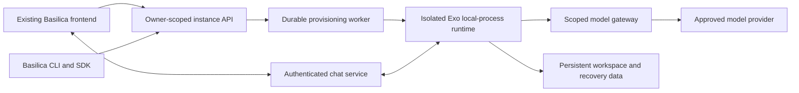

# Exo on Basilica — unified implementation plan

Updated: 2026-09-21. Status: implementation in progress; G0 contracts and baseline underway.

Planning branch: `docs/exo-implementation-plan`, created from freshly fetched `origin/main` at `f3749c7211e828c5c8ff34f6995f822cf83ccd2f`. Plan worktree: `/Users/samueldare/code/cc/basilica/basilica-exo-plan`. The original public checkout remains on its unrelated `docs/basilica-fly-school` branch and must not be used as the branch base for Exo implementation.

**This is the single implementation plan.** It replaces the earlier feasibility, Runta assessment, and frontend documents. Give this entire file to every implementation agent. The coordinator alone updates its contracts, ownership ledger, gate status, and integration record. README and TODO are pointers, not additional specifications.

## 1. Outcome and scope

Users launch Exo in the existing Basilica frontend or through `basilica summon exo`, then return to the same persistent agent from any device. Both surfaces operate on one backend-owned instance. Users do not configure Docker, SSH, images, or ports. Existing OpenClaw behavior remains supported.

```text
Agents → Create agent → Exo → name + model connection + recommended size
       → actual cost and persistence summary → Launch → Chat workspace
```

Connect a model inline and save an owner-scoped connection for reuse. Start with providers/models that pass real streaming/tool conformance tests; upstream's installer offers OpenAI and OpenRouter. Recommend one size, with advanced overrides. Benchmark before choosing defaults or promising startup times. Hosted model use does not require a GPU by default.

First release: deterministic setup, authenticated text chat, background scheduler/adapters, stable names/IDs, status, restart, export of declared persistent state, deletion with verified cleanup, and out-of-band recovery after a broken self-rebuild. Show compute, storage, and model charges separately. Do not imply platform provider keys make inference free or quote an unmeasured flat total.

Pause/resume, timed trials, whole-environment checkpoints, terminal, rich files/artifacts UI, teams, automatic upgrades, and bundled inference are capability-gated follow-ons. Hide nonfunctional controls. File restoration is not process-memory restoration. Full machine recovery is required only when offered in the declared persistence contract; it is not an unconditional prerequisite for a narrower, honestly described first release.

## 2. Checkouts, evidence, and current limitations

Workspace: `/Users/samueldare/code/cc/basilica`.

| Checkout | Responsibility | Reviewed revision |
| --- | --- | --- |
| `basilica/` | CLI, Rust SDK, customer docs, this plan | `f3749c7211e828c5c8ff34f6995f822cf83ccd2f` |
| `basilica-backend/` | Runtime, provisioning, instance/model/chat services, billing integration | `e0cd16dd2cf45625d7f5d822f666ef6b21c6e913` |
| `basilica-site/` | Existing Next.js app and authenticated agent experience | `5854e17d952a62906206ee60d8a64a4cb9cf8a95` |

Use sibling `basilica-site/`, not the older `cc/website/basilica-site` copy. Do not create another frontend or migrate hosts. Read repository-local instructions; inspect `git status --short` and `git diff --stat <reviewed-revision>..HEAD -- <owned-paths>` before implementation. Preserve unrelated work; the public checkout previously had simulator/RL/fly-school edits.

The current backend contains `docs/dependency-modes.md`; it was read during implementation. Default validation uses locked Git dependencies. Public contract changes must be pushed first, then the backend lockfile deliberately updated; disposable local overrides may be used only as documented.

Evidence that determines the design:

- All six pages of `/Users/samueldare/Downloads/Introducing_Exo_Harness_for_Runta_Runtimes.pdf` were inspected. Runta describes local-process Exo in a managed runtime, automatic onboarding, browser terminal, and a credential-substituting gateway. Its guarantees were not independently tested; the referenced demo videos were not available inside the PDF.
- Upstream Exo revision `b2769b6295e3cf23b24aad2794230fca6c09149c`, `crates/exoharness/src/sandbox.rs:1135`, implements local-process execution. Nested Docker is not required. That backend does not implement native sandbox snapshots/restore, attachment/detachment, durable-filesystem declarations, or a disabled-network policy. Basilica supplies the surrounding isolation/storage/network guarantees.
- Upstream `exo.sh` defaults to Docker: do not use its default installer unchanged. `crates/cli/src/adapters.rs` lacks adapter creation, while `crates/executor/src/adapter/store.rs:33` supplies typed creation. Bootstrap must not ask an LLM to create its own chat adapter.
- Exo state defaults to `.exo`; `crates/exoharness/src/secrets.rs:265` can place the master key elsewhere. Backing up `.exo` alone is insufficient.
- ExoChat uses outbound WebSockets. Its worker uses Cloudflare Durable Objects, sends `frame-ancestors 'none'`, and replaces an existing socket for the same role. It is not a drop-in Next.js route or OpenClaw iframe URL.
- Public `crates/basilica-cli/src/cli/commands.rs:264` defines `summon` as a `deploy` alias. Rust SDK CPU provisioning already exists in `crates/basilica-sdk/src/client.rs:684`. Current CPU stop terminates the machine; it cannot be relabeled Pause.
- Backend `crates/basilica-operator/src/controllers/user_deployment_controller.rs:522` constrains workload privileges. Do not weaken shared workload security or mount a node Docker socket.
- The frontend already supplies Auth0, funding, model selection, deployment management and OpenClaw chat. Its `lib/providerStore.js` stores raw provider keys in browser storage; `app/api/openclaw/deploy/route.js` injects resolved keys into deployment env. The Exo connection/gateway design must not inherit that exposure pattern.

Pinned references: [local-process implementation](https://github.com/exoharness/exo/blob/b2769b6295e3cf23b24aad2794230fca6c09149c/crates/exoharness/src/sandbox.rs), [ExoChat](https://github.com/exoharness/exo/blob/b2769b6295e3cf23b24aad2794230fca6c09149c/exo/adapters/exochat/README.md), [snapshot semantics](https://github.com/exoharness/exo/blob/b2769b6295e3cf23b24aad2794230fca6c09149c/exoharness/docs/sandbox-snapshots.md).

No runtime deployment, build, paid model call, or recovery test was performed during planning. Routes/types below are proposed, not shipped API documentation.

## 3. Architecture decisions

1. Test local-process Exo inside an existing Basilica CPU deployment first. Choose a dedicated CPU VM if that environment fails the required isolation, self-rebuild, or persistence contract. Docker remains optional. The 2026-09-18 storage review found missing directory-fsync support and loss of private UID/mode metadata after FUSE hydration. Decision 0010 selects the planned CPU-VM fallback with private local disk; hosted host/runtime acceptance remains required. The unprivileged Exo image runs on that rental; no shared node socket or weakened deployment security is introduced.
2. One durable managed-agent record links owner, template/version, runtime resource, operation, connection, and persistent state. Reuse the current allocator and billing. A backend worker owns provisioning; browser/CLI closure cannot interrupt it.
3. Prebuild and pin the baseline/toolchain. Seed a writable per-instance source checkout once. Preserve source changes; do not fetch `main`, reset evolved source, or rebuild the baseline at every launch.
4. Keep provisioning authority, provider keys, billing and management outside the editable guest. A secret stub is not authentication. Use scoped revocable runtime identity, never a general Basilica account token.
5. Basilica operates the supported chat path. The frontend hosts the UI; a suitable service hosts persistent connections. Upstream's public relay can support a labeled compatibility spike, not the supported public product.
6. Reuse website account flows, theme and components. Preserve OpenClaw links and behavior. A marketplace framework, payment redesign, OpenClaw key migration, and broad frontend rewrite are out of scope.



## 4. Parallel ownership and coordination

**You are not alone in the codebase. Do not revert others' changes. Adapt to accepted edits. Work only in owned files; request changes from another file's owner.** Workstreams are logical responsibilities, not a claim that all workers run simultaneously.

Use isolated worktrees per worker/repository. Create each repository's Exo integration branch from its freshly fetched `origin/main`, not whichever feature branch happens to be checked out. Record the main base SHA and resolve any drift from the reviewed revisions. Workers branch from that main-based integration revision, including already accepted contracts when needed. CO integrates verified changes, records commits, and tells consumers when to update. Changes are not automatically shared between worktrees. Do not switch, reset, or move unrelated changes in the original checkouts. Never run broad auto-fix/format commands over another worker's work.

| ID | Exclusive ownership | Deliverable |
| --- | --- | --- |
| CO — coordinator | This plan/pointers; backend shared route/module registration, app state/bootstrap wiring, Cargo manifests/lockfile, migration filenames/files, shared CI | Frozen contracts, shared schema/wiring, integration and release evidence |
| RT — runtime | Backend `scripts/exo/**`, including upstream patch/helper and runtime smoke/evidence | Pinned runtime, deterministic bootstrap, supervision, persistence/export and bad-rebuild recovery |
| LC — lifecycle | New backend `src/api/routes/agent_instances/**`, `src/agents/lifecycle/**`, `src/db/agent_instances.rs` and colocated tests, all under `crates/basilica-api/` | Durable instance/operation lifecycle, quotes, reconciliation and cleanup |
| MG — model gateway | New backend `src/api/routes/model_connections/**`, `src/agents/model_gateway/**`, `src/db/model_connections.rs` and colocated tests, under `crates/basilica-api/` | Secure connections, scoped gateway, validation/streaming/revocation |
| CT — chat | New backend `src/api/routes/agent_chat/**`, `src/agents/chat/**` and colocated tests, under `crates/basilica-api/`; `scripts/exo-chat/**` | Sessions, pairing, transport, reconnect/revocation and relay assets |
| FE — frontend | `basilica-site/` paths in section 8, including shared auth/API/shell, package/lock/test config and README | Launch/list/workspace UI and frontend tests |
| SDK — CLI/SDK | Public `crates/basilica-cli/**`, `crates/basilica-sdk/**`, relevant public Cargo/lock changes, focused customer docs/examples | Matching CLI/SDK behavior, routing, output and tests |

New backend paths are proposed reservations. At G0, CO checks conventions and records any relocation in the ledger **before code is written**. Existing rental/deployment internals require explicit scope allocation before LC changes them. CO alone edits shared `api/routes/mod.rs`, `db/mod.rs`, `agents/mod.rs`, server state/registration and migrations. Feature owners send concrete registration/schema patches to CO; they do not independently number migrations or modify manifests.

FE alone owns frontend shared files; SDK alone owns public client/types and CLI dispatch. RT alone changes bootstrap even when MG/CT need more inputs. An interface change request includes reason, fields, compatibility, affected consumers and tests; CO versions the contract before landing it. No silent renames or private competing API schemas.

### Scheduling with four available agent slots

CO occupies one slot, leaving at most three workers. Reuse slots as owners finish:

| Wave | Workers beside CO | Dependency rules |
| --- | --- | --- |
| 0 | RT feasibility; FE build/auth baseline; MG existing-service/dependency inspection | Independent foundations while CO freezes contracts and module ownership |
| 1 after G0 | RT packaging; LC lifecycle; MG gateway | LC can implement durable storage/idempotency/reconciliation before G1; final runtime adapter waits for G1 |
| 2 as slots free | LC completion; CT chat; FE product UI | RT/MG hand off contracts/artifacts; FE can implement agreed schemas before every service finishes, but cannot claim real integration from mocks |
| 3 as slots free | CT/FE completion; SDK CLI/SDK | SDK may start earlier whenever G0 and a slot are available; CO integrates shared wiring |
| 4 after G2 | FE/SDK fixes; recall service owner for specific failures | CO runs end-to-end acceptance and records evidence |

Do not wait for an entire wave if a task's own gate is satisfied and a slot is free. This is a capacity-aware schedule, not an artificial serial pipeline.

## 5. Shared contracts — freeze v1 at G0

CO verifies existing naming/casing/auth conventions and produces the exact OpenAPI/types before clients depend on them. Reuse existing services where behavior matches. The following proposed routes are backend routes, separate from website paths:

| Operation | Proposed route | Required semantics |
| --- | --- | --- |
| Templates/offers | `GET /agent-templates`; `POST /agent-instances/quote` | Supported providers/models, sizes/regions, current quote/currency/basis/expiry and capabilities |
| Connections | `POST/GET /model-connections`; `PATCH/DELETE /model-connections/{id}` | Owner-scoped create/list/rotate/delete; accept secrets securely, never return them; explicit in-use deletion policy |
| Launch/list | `POST/GET /agent-instances` | Create accepts template, name, connection ID, quote ID and supported lifetime; returns stable instance and durable operation IDs |
| Detail | `GET /agent-instances/{id}` | Safe instance metadata, never chat/provider secrets |
| Operation | `GET /agent-operations/{id}` | Owner-checked progress, error, retry and cleanup state |
| Lifecycle | `POST /agent-instances/{id}/restart`, `/export`, `/recover`; `DELETE /agent-instances/{id}` | Durable operations with explicit data-retention and billing outcomes; recover names an available compatible code checkpoint |
| Logs | `GET /agent-instances/{id}/logs` | Bounded/paginated, redacted and owner-authorized |
| Chat access | `POST /agent-instances/{id}/chat-sessions` | Short-lived scoped access, expiry, approved transport URL and revocation; separate from general instance JSON |

Derive ownership from verified auth context, not supplied owner IDs. Freeze request/response casing, HTTP/error envelope, pagination and event types at G0. Proposed create response is HTTP 202 with `instance_id`, `operation_id`, `status_url`. An expired quote requires requoting, not silent repricing.

Catalog/quote v1 uses account-authenticated `GET /agent-templates` (SDK array)
and `POST /agent-instances/quote` (HTTP 201). An optional approved catalog pins a
runtime image digest, template revision, recommended size and exact CPU offering
IDs/dimensions; it enables no guessed default. Models come from the existing
conformance-approved model catalog. Current offerings must be available, at most
five minutes old, dimension-matched and resolvable through the public AZ registry.
Regions use full Basilica AZ codenames; native provider region and raw metadata
stay private. If the recommended profile is unavailable, the service advertises
no template rather than recommending an untested substitute.

The initial resource kind is `cpu_rental`, selected using the plan's VM fallback
after the FUSE incompatibility review. Persistent local `/data` retains source,
canonical state/key, home and temporary files across container restart/replacement
on that rental. Host loss, credit exhaustion and rental termination can lose this
disk. No automatic cross-host restore, process-memory restore, or persistent OS
package changes are promised. Export before deletion or funding exhaustion.
Runtime acceptance must still demonstrate these declared guarantees on a real host.

Quotes use current aggregator decimal CPU/RAM/storage rates and existing
secure-cloud markup. Compute includes CPU/RAM; storage is separate; model usage
is billed by the connected provider. Existing billing validates one hour of
resource cost. A quote reserves neither funds nor capacity. Its private versioned
snapshot records accepted offer, resource dimensions, image and rates without raw
metadata. Allocation must recheck balance/capacity and exact offer/price binding,
rejecting change instead of silently repricing. Quote expiry is at most 120 seconds
and never extends inventory freshness, using database time after ownership locks.

Quote requests use the existing global owner-scoped idempotency namespace, strict
bounded JSON and no-store responses. Retry preserves original quote and expiry,
even after expiry or connection deletion; new keys obtain new quotes. Connection
ownership and active approved model are checked before external reads and again
before persistence. Migration 038 adds an owned quote reference to retry records;
consuming launch binds that retry to the instance for lifetime/deletion retention.
Absent catalog returns 503; configured catalog requires billing, model connections
and scoped chat. Configuration is not evidence of runtime or provider readiness.

Minimum safe instance fields: stable ID, server-stored name, template/version, phase, desired state, current operation, connection ID/safe model label, cost basis, optional expiry, persistence description, capability flags, and actionable safe error. Runtime resource IDs are implementation metadata with appropriate visibility. Clients must not infer kind from image names or store authoritative identity only in localStorage.

Normalize phases for both clients: `queued`, `provisioning`, `configuring`, `starting`, `ready`, `restarting`, `failed`, `deleting`, `deleted`. Operation state separately expresses running/succeeded/failed and cleanup pending. CO may align names with repository conventions before G0, not independently per feature.

Mutations have owner-scoped idempotency. Same key + normalized body returns the same operation; changed body with the same key conflicts. Persist results across worker restarts. G0 fixes key lifetime and concurrent-mutation rules. Delete during provisioning persists desired deletion and reconciles any created resource. Success requires confirmed provider state and billing finalization, not just a successful API request.

Maintenance intent v1 covers restart, export and code recovery. Only owned instances with desired state `running`, phase `ready` or `failed`, a bound runtime resource and the explicitly enabled action capability can accept new intent. Any running operation or unresolved cleanup conflicts; only delete may preempt. Same-key replay precedes current-state checks and never resurrects an instance after later deletion. Recovery additionally requires a checkpoint belonging to the same owner and instance whose schema exactly matches the authoritative current state schema. Migration 036 adds a nullable, bounded `state_schema_version`; unknown is incompatible, never inferred from a baseline or capability. The lifecycle controller must record observed schema and register only health-verified checkpoints before enabling recovery; artifact existence alone is insufficient.

An accepted maintenance intent atomically advances generation, persists the operation/checkpoint and retry response, sets phase `restarting` with unknown health, and revokes old runtime/chat grants. This also applies to export because its consistent snapshot requires stopping writers before resuming a fresh service generation. A claimed recovery lease carries its checkpoint ID. Database generation and token revocation fence gateway access and stale lifecycle work; the reconciler must still stop/fence local or remote writers, run the corresponding runtime helper, rotate/deliver new access and verify readiness. Intent acceptance makes no provider call and is not successful completion, physical fencing, an export artifact, or a healthy recovery result. Existing owner-scoped 30-day minimum retry retention applies. Runtime/provider adapters remain separate required work.

Lifecycle mutation HTTP v1 exposes account-authenticated `POST /agent-instances`, `DELETE /agent-instances/{id}` and `POST /agent-instances/{id}/{restart,export,recover}` through the existing durable intent functions. Each request requires exactly one validated `Idempotency-Key`; auth supplies ownership and no additional OAuth scope is required. Create and recover use the shared strict JSON request DTOs. Restart/export/delete accept no body or an empty JSON object only; reject ignored fields, malformed bodies, query parameters and ambiguous duplicate headers. Bound request bodies to 16 KiB and return static errors without echoing input. All handler responses are `Cache-Control: no-store`; accepted intent returns HTTP 202 with the shared stable instance/operation/status URL response, including retries. A 202 records requested work only and never reports provider, runtime, export, recovery or deletion completion.

The HTTP layer preserves DAL replay ordering, quote expiry/ownership checks, action capabilities, compatible checkpoint checks, generation advancement, revocation and delete preemption. UUID path/checkpoint forms are parsed to canonical IDs. Foreign and missing records remain indistinguishable. Account routing/scope tests and real PostgreSQL HTTP tests cover all actions, concurrent replay, changed-request conflicts, stale quotes, malformed input with no writes, checkpoint isolation, revocation, preemption, rollback and read-back through operation status. Generated public/private OpenAPI and existing SDK requests must match. This increment does not fabricate quotes, enable runtime capabilities or run reconciliation; verified catalog/quote issuance and actual execution remain release requirements.

Operation status v1 implements `GET /agent-operations/{id}` behind the existing account authentication and owner-scoped authorization convention, with no additional OAuth scope. It reads the operation and its owned instance in one database statement and returns the shared `AgentOperation` DTO. `state`, error, cleanup, billing, export metadata and timestamps describe that durable operation; `phase` is the current instance phase, including when a newer operation superseded it. It never infers success from a phase or clears failures while reading. Missing and other-owner IDs both return 404; malformed UUIDs return a static 400. Responses use `Cache-Control: no-store`. The query selects only public DTO fields; no provider keys/ciphertext, runtime/chat grants, worker lease tokens, backing resource IDs or private artifact locators are exposed. Invalid persisted typed metadata produces a static internal error, not a partial response or raw database detail. This read path is independent of optional model-provider configuration and performs no allocation, credential issuance or runtime action. It does not enable unimplemented mutations or claim reconciliation is running.

Instance reads v1 implements account-authenticated `GET /agent-instances` and `GET /agent-instances/{id}` using the shared `AgentPage<AgentInstance>` and `AgentInstance` DTOs. Both use the existing owner-only authorization convention without an additional OAuth scope, need only the database, and return `Cache-Control: no-store`. Listing excludes completed deletions, includes deletion still in progress, and uses descending `(created_at,id)` keyset pagination with default 50, allowed 1–100, and a bounded opaque cursor. Each page is a fresh snapshot rather than a frozen collection; intervening insertions/deletions do not create offset duplication. Cursors contain only a timestamp and UUID and never grant access to another owner's records. Detail retains owned deletion tombstones so old links resolve. Missing and other-owner IDs return the same static 404; invalid UUIDs, query shapes and cursors return static 400 errors.

A single database statement reads each page/detail with safe connection model metadata, recorded instance cost/persistence, quote lifetime and the newest 20 registered code-checkpoint choices ordered by creation time/ID. The model label follows the existing connection DTO's model string. The supported `until_deleted` lifetime has no instance expiry; quote expiry must never be returned as instance expiry. Checkpoint compatibility means an exact match to the known authoritative instance schema, independent of action availability. Its fixed effect explains code/dependency restore while preserving canonical history and user files. General reads never expose resource IDs, account/connection credentials, grants, leases, private artifact IDs, digests or keys. Typed conversion rejects corrupt stored metadata with a static internal error; unknown/omitted capabilities remain unavailable. Reads do not allocate, claim/renew work, register checkpoints, alter capabilities or infer health. Registered checkpoint rows remain trusted-controller evidence, and real registration/runtime acceptance is separate required work.

Worker persistence v1 accepts typed resource binding, progress, retained-attempt waiting, retry, export metadata, verified cleanup, ready, failed and deleted updates. Every update takes the owner lock and locks the current operation/instance, matching owner, instance, generation, kind, checkpoint, attempt and lease token. Database wall-clock expiry is checked after row-lock waits and again at the final operation write; loss of authority rolls back the entire update. A stale/expired lease returns false so the worker stops, while invalid transitions conflict. These are trusted reconciler observations, never guest/public assertions; storage functions make no provider/runtime call and cannot prove physical fencing, health, artifact integrity or billing settlement themselves.

Bindings identify confirmed existing Basilica deployment/CPU-rental resources and cannot be replaced; identical binding retries are allowed, including discovery during delete. Create progresses monotonically from queued through provisioning/configuring/starting, and maintenance from restarting through configuring/starting; configuring/starting require a binding. Readiness is a separate completion requiring starting phase, a bound resource, observed schema, all three runtime/model/chat health checks healthy, no unresolved cleanup and no finalized resource billing. Unsupported pause/resume/terminal/files capabilities remain disabled. Recovery cannot change the authoritative schema. Export metadata uses the operation UUID, manifest version 1, a lowercase SHA-256, positive size and future expiry; retries preserve the original metadata. Export readiness additionally requires an unexpired recorded artifact. The reconciler must verify the artifact independently before recording it.

Create waiting keeps the current attempt, lease, resource and scoped grants while publishing only fixed safe failure codes/messages; the execution owner must keep renewing and reconciling that same lease. Retries keep the same running operation, use bounded 1–3600-second database delays, release the lease, and publish only fixed safe failure codes/messages. Cleanup-pending is sticky across retries. Verified cleanup is a separate durable observation for create/delete requiring both all managed resources absent and resource billing finalized; it clears capabilities and revokes access while retaining the historical resource binding. A failed create can become terminal only after this cleanup observation, including verified absence for an unallocated request. Failed maintenance preserves the bound resource and ongoing costs, requires no unresolved cleanup, and revokes scoped access. Delete completes only after recorded cleanup and billing confirmation. All terminal updates clear worker leases atomically with instance phase/health/error changes. Repeated writes using a terminal lease are stale; clients replay the original durable operation and read its final status. Provider adapters must reconcile uncertain external responses by stable instance identity before issuing these observations, and lease loss never authorizes replay of an external action.

Capabilities cover chat/restart/export/recover/pause/resume/terminal/files; unsupported or unknown is unavailable, not simulated success. At G0 settle quote units, model charges, retention/deletion/expiry policies and persistence scope. No timed trial silently destroys state; it needs verified preservation or a separately explicit, accepted deletion policy.

Healthy-checkpoint registration v1 extends the internal ready observation with optional verified checkpoint metadata: UUID, bounded code-version/schema labels, a bounded private artifact identifier and lowercase SHA-256. The caller must independently verify archive integrity, ownership, same-instance context and that the captured code/dependencies match the runtime whose runtime/model/chat health it observed. No guest or account request may supply this observation, and the database does not infer health from capture or artifact existence. Metadata contains no key and does not change the public checkpoint DTO.

Registration happens only inside successful lease-fenced ready completion, after its normal resource/phase/health/export/recovery validation, using the ready observation's schema as an exact compatibility requirement. It atomically inserts the owner/instance-bound immutable checkpoint and completes the operation. Identical existing metadata preserves its original timestamp; a reused ID with different metadata or owner/instance conflicts. Lease loss or any subsequent write failure rolls back both registration and readiness. A ready observation may enable `recover` only if this transaction contains or locks an already registered checkpoint for the same owner/instance and observed schema. Recovery remains disabled when no compatible checkpoint exists. Historical schemas and artifact identifiers are never rewritten to make them compatible; artifact verification/storage/retention and physical runtime acceptance remain reconciler responsibilities.

First-release recovery is user-accessible code recovery, distinct from optional full-environment restore. LC exposes owner-authorized available checkpoint metadata in instance detail and accepts its ID in a durable recover operation. RT preserves an immutable baseline and compatible healthy code/dependency checkpoints outside the editable checkout, quiesces services, preserves canonical state/history, restores the selected code, then verifies readiness. Reject incompatible state-schema/checkpoint combinations; never silently roll back user data. FE/SDK show the checkpoint/time and effect, submit the operation and track progress even when chat is broken. G2/G3 must demonstrate this path after a failed self-rebuild.

Internal bootstrap v1 joins RT/LC/MG/CT: instance ID, pinned baseline, local-process provider, persistent path mapping, model binding/base URL, scoped gateway identity through protected delivery, scoped chat pairing. No upstream provider key or account-wide token. RT emits structured readiness/diagnostics/version rather than secrets in stdout. Freeze service-start/stop and replacement/fencing expectations.

Runtime gateway HTTP v1 now uses the model base URL `/agent-runtime/{instance_id}/v1/` under the API origin, with a trailing slash. Bootstrap supplies the protected runtime bearer identity and explicit `EXO_MODEL_API_STYLE`; Responses and Chat Completions are separate POST routes under that base. `POST /agent-runtime/{instance_id}/identity/refresh` accepts no body or `{}`, extends the same token to at least one hour from renewal without shortening existing expiry, and returns only `expires_at`. Account/JWT credentials, query tokens, and caller-selected renewal lifetimes are rejected. The guest renewal launcher is implemented; protected issuance/delivery and image/bootstrap wiring still require LC/RT integration.

Protected runtime identity file v1 is a private JSON object with exactly `schema_version: 1`, canonical UUID `instance_id`, HTTPS `api_origin` (origin only), and scoped bearer `token`. Delivery makes a private regular file owned by the launcher user, mode 0400 or 0600, in a trusted parent directory; projected symlinks must be copied. This is internal secret delivery, never general instance metadata. RT stores the same token in the encrypted Exo model binding, then invokes the image-owned `runtime_identity.py` launcher in Python isolated mode around the supervised service command. Successful refresh precedes process start; periodic renewal failure/expiry stops the process group. The image must provide orphan reaping and container isolation, and LC retains generation fencing authority. The launcher and initial encrypted binding/bootstrap are implemented; protected delivery/rotation, image/service wiring and real acceptance remain pending.

Canonical-state bootstrap v1 takes the prepared writable source, patched CLI, explicit local pricing artifact, approved model/protocol and protected identity file. Separate stable source/state mount paths are required; the state parent is private (0700). Bootstrap stages `.exo`, `master.key` and a versioned `bootstrap.json` receipt together, verifies the encrypted model binding using typed Exo APIs, fsyncs staged data and publishes by same-filesystem rename. The workspace `.exo` link targets this one canonical state. Canonical slugs are agent/model `managed`, conversation `chat`, and secret `managed-gateway`; the agent uses the Exo harness, local-process provider and agent sandbox scope with tool creation enabled. Repeat setup preserves all records and user edits, requiring the same instance/model/protocol/source/origin/scoped grant and master key. Changed grants use the explicit preserve-state rotation flow below; lifecycle integration remains pending. Readiness events describe setup only; renewal must authorize the identity before service start. Image assembly/seeding, filesystem suitability, service/guardian integration and hosted acceptance remain separate gates.

Service execution v1 wraps image-owned `services.py` with `runtime_identity.py` after canonical bootstrap. The foreground supervisor holds the bootstrap OS lock, passes the canonical root/key and explicit model protocol to both scheduler and adapter runners, and inherits only tool/home/locale/TLS-trust environment fields. Each child has an owned process group; shutdown uses one shared three-second TERM grace plus bounded reaping after KILL. Any unexpected runner exit, including zero, stops its sibling and reports failure. Diagnostics identify actual child PIDs, never use persisted PID files as authority, and do not establish chat/model readiness. Both runners use OS-held locks and retain their lock inodes. Image-level orphan reaping/cleanup and lifecycle generation fencing remain required. Managed drain/rebuild control follows the contract below; image wiring, interrupted-schedule handling and healthy-code recovery remain pending. The upstream guardian must not run unchanged.

Managed runner observation v1 supplies fresh local runtime evidence. The image-owned supervisor owns one anonymous inherited Unix channel per actual scheduler/adapter process. Hidden descriptor options are consumed before harness initialization and marked close-on-exec. After runner initialization/lock/recovery, each fresh challenge re-reads the managed agent/chat configuration and typed scheduler/adapter state, with bounded validation and response time. Both roles must match the current challenge and declared `exo-managed-scheduler-v3` compatibility label. The private supervisor socket lives in container-local `/tmp`, outside exported state; old replies cannot satisfy a new probe and channels are discarded on replacement or exit. Observation does not execute a task/model turn, rewrite state, restart services or declare a healthy checkpoint. Its guest-domain evidence is not independent attestation: the trusted host/controller must still bind the exact container/generation and combine independent model/chat/billing checks. No owner/runtime HTTP readiness assertion is accepted.

Trusted host observation v1 uses a separate fixed `observe` helper mode with the current protected apply request and a fresh nonnil UUID nonce in a strict version-1 outer envelope. The echoed nonce and exact response identity bind each result to this invocation. It locks only existing root-owned journal state and requires exact operation/generation/attempt/resource/input identity and one running container. It never admits a new fence, pulls images, changes networking, repairs inputs or restarts/replaces a workload. The local Engine runs only the image-owned observer as UID/GID 10001 with no stdin, TTY, privilege or caller-selected command. Bounded multiplexed output, completed exec identity/exit and unchanged container incarnation must all agree before returning a separately typed observation under fresh database authority. The result is runtime evidence only; model/chat/billing, schema compatibility and checkpoint verification remain controller responsibilities.

Managed rebuild v1 is opt-in until image assembly supplies the pinned build tools. In managed mode the existing rebuild tool publishes a private, fsynced guardian update and never launches a detached guardian. The foreground owner serializes queued requests, records phases durably, runs locked Rust build/tests and TypeScript checking with bounded cancellation, and copies the executable pair into a unique immutable-by-convention candidate directory. Build failure preserves running services. Successful validation requests graceful drain with a bounded deadline; failed or interrupted drain fails the service generation rather than restarting over uncertain in-flight work. After both runners exit successfully, the owner atomically selects a digest-checked binary pair and starts it with unchanged canonical state. Selection and process survival do not establish model/chat readiness or a healthy recovery checkpoint. Nonterminal claimed requests found after supervisor restart fail as interrupted and are never automatically replayed. The selected candidate persists across ordinary supervisor restarts; immutable baseline and compatible code/dependency checkpoints remain separate required recovery work. No detached restart loop, lock-inode deletion or process-name matching is permitted.

Code checkpoint/recovery v1 captures source, installed source-tree dependencies and the selected executable pair; it excludes canonical `.exo`, Git administration and the rebuild `target` cache. Internal relative symlinks are preserved; external/special files fail capture. A versioned file-integrity manifest is encrypted with the payload using a checkpoint-specific derived key and authenticated instance/source/baseline/state-schema/OS/architecture context. Authentication completes before extraction. LC must supply its authoritative current state-schema label and only register health-verified checkpoints; the artifact helper does not infer schema changes made by arbitrary user code or turn a capture into a healthy checkpoint. Recovery requires the same instance/key/source and compatible declared schema. It holds the service/bootstrap and both runner locks, stages verified code beside the source, retains the replaced checkout (including a root replaced by a file or symlink), recreates missing source without resetting state, selects the verified binary pair and journals each transition under the durable operation ID. Services refuse startup while recovery is pending. Same-operation retries resume interrupted renames or return the completed result; changed checkpoint IDs conflict. Canonical history, schedules, artifacts, binding and master key are never restored from a code checkpoint. Stable private parent directories with local rename/fsync semantics, lifecycle fencing and post-restore readiness remain required; packaging and hosted acceptance are separate gates.

Scoped-identity rotation v1 is an explicit stopped-runtime operation, separate from bootstrap and code recovery. LC fences the previous workload, issues/delivers a replacement grant for the same instance and API origin, and supplies a durable operation ID. The trusted helper verifies the preserved key and receipt, holds bootstrap and runner locks, and journals the old/new token digests without storing plaintext grants. A typed local Exo operation verifies the exact managed model/secret binding and replaces only the encrypted key payload under the existing secret ID, accepting only the old digest or an already-applied new value. It never creates a duplicate secret or rewrites agent/conversation configuration. The helper fsyncs the secret store, verifies the new binding, atomically updates the receipt, and clears a durable startup barrier. Same-operation retries resume after any transition; changed inputs conflict, and completed retries never overwrite a later rotation. Bootstrap, services and code-recovery mutations refuse an incomplete rotation. Missing/corrupt state or keys fail without reset. No old grant is required to resume, and no token appears in arguments, environment, events or journals. LC remains responsible for protected delivery, revocation/generation fencing, successful renewal and post-rotation readiness; the local helper does not claim those integrations.

Persistent-state export v1 snapshots the declared `/data` tree plus the selected executable pair under the bootstrap and both runner locks after lifecycle fencing. It preserves writable source/dependencies, canonical records/history/schedules/artifacts and master key, seed/bootstrap receipts, runtime/recovery journals and user home/tmp files. Image/toolchain assets outside `/data` remain a separately required compatible image. Known managed lock files, regular `*.pid` files and Unix sockets are omitted with an encrypted per-path omission report; other special files and links escaping `/data` fail capture. Internal absolute links are normalized to relative links, including the canonical source/state link. Archives remain bounded (16 GiB regular data, 200,000 entries, 32 MiB manifest), private and atomic; oversize or changing data fails rather than producing a partial export. Pending identity rotation or code recovery prevents export.

The lifecycle owner supplies a separate random 32-byte export key through a protected file outside the exported tree; it is never bundled, logged or derived from the runtime master key. AES-256-GCM/HKDF use a distinct export domain and authenticated owner/instance/export ID, source/data path, baseline, state-schema and platform context. Same-export retries return the original verified artifact rather than capture later changes. Owner-bound verification and staged extraction authenticate before parsing, validate the full integrity manifest and canonical key/receipt binding, refuse incompatible schemas/platforms and existing destinations, and publish only a new private directory. Extraction restores files for an explicitly authorized same-instance lifecycle operation; it never overwrites live state, starts services or claims provider/session validity. LC must authorize artifact/key retrieval, revoke/fence old generations, mount the data at its original stable path, rotate scoped runtime/chat access and verify readiness before any restored runtime starts. Local helper ownership/key checks are not hosted account authorization. Export/recovery of process memory or OS package installs is not offered.

Interrupted scheduling v1 distinguishes unclaimed missed slots from claimed work with uncertain effects. The pinned scheduler writes schema 3 task records and migrates schemas 0–2 without discarding leases; newer schemas are refused. Claim expiry alone never authorizes replay. After acquiring its OS runner lock, a restarted runner atomically moves every retained lease into a typed interruption record with the lease, due slot and detection time. Interrupted tasks remain visible in ordinary listings but are ineligible for execution; reviewing and explicitly removing/recreating a task is the first-release resolution path. Existing results, schedule policy, command, history and canonical identity are preserved. Never-claimed downtime uses the existing Once/Skip/All policy (All capped at 100). Scheduler JSON publication must fsync the new file before rename and the containing directory afterwards, with directory creation durable before claims authorize commands. Interrupted-record publication is repeatable after failure and completes before new tasks or pending wakeups are processed. Existing wakeup delivery remains at-least-once and is not an exactly-once side-effect guarantee. Local OS locks do not fence detached or remote old workers; LC must fence them before restarting a generation. Tests must cover live/expired leases, schema migration, idempotent startup, failure boundaries, unchanged missed-slot behavior, and killing an actual local command before replacement without command replay.

Runtime image/startup v1 uses digest-pinned Node 22.22.0 and Rust 1.97.1 Bookworm bases, pnpm 10.26.2, locked upstream source/dependencies and hash-locked Python helpers. The image carries a root-owned baseline source/dependency tree, executable pair and integrity manifest outside the writable checkout, plus a PID-1 init. It runs as UID/GID 10001 without privilege escalation or container-engine access. LC must provision a private owned local-filesystem `/data` volume and protected identity/runtime/pricing files; storage/filesystem and hosted isolation remain acceptance gates. First start atomically seeds `/data/workspace` containing `source` and a baseline receipt; canonical state remains `/data/state`, user home `/data/home`, temporary files `/data/tmp`. Repeat start validates the seed receipt but never recopies or resets edited source; missing source alongside existing state requires explicit recovery. Node dependencies are installed at the same stable source path during image construction so generated wrappers remain valid after seeding. Startup performs deterministic canonical bootstrap, then execs the identity-renewal launcher around the foreground service supervisor with managed rebuilds enabled and a minimal tool environment. No model, pricing, provider credential, chat pairing or readiness is fabricated. Explicit lifecycle rotation is required for changed grants. Runtime startup does no source download, dependency install or baseline rebuild. The artifact build records compiler/base/package provenance; no claim of bit-for-bit APT rebuilds or hosted model/chat readiness is made. Source/dependencies, canonical state and user-home files are durable under the declared volume scope; OS package changes/process memory are not promised. Image assembly and local process/replacement tests do not select a deployment over the VM fallback or pass G1 by themselves.

Managed chat transport v1 uses the existing long-lived Axum service and PostgreSQL, not the upstream public relay. A dedicated WebSocket route accepts a bounded first authentication frame within ten seconds, never URL credentials. Browser access comes from owner-authenticated `POST /agent-instances/{id}/chat-sessions` with a required retry key and no body or `{}`. Sessions last fifteen minutes, are instance/generation-bound, and require ready phase plus explicit chat capability. Deterministic domain-separated HMAC token derivation from a server-only 32-byte retry key and random session UUID permits stable retry responses while storing only token digests; retries preserve original expiry and never revive revoked sessions. Runtime pairing is a distinct token audience issued only by a current live lifecycle lease, delivered outside ordinary metadata. Every database mutation rechecks current authority after the owner lock; sockets recheck while idle and close on expiry, revocation or generation change. Configured browser origins are exact HTTPS origins; runtime/nonbrowser clients without Origin still require the appropriate scoped credential. Chat configuration is optional and absence fails closed.

Chat messages have caller-generated UUIDs and text bounded to 16 KiB UTF-8. Browser frames may submit only user text; runtime frames may submit only assistant text and transport receipts. Duplicate IDs with the same role/text return their existing durable state; changed content conflicts, including after reconnect or a lifecycle generation change. Account/user/resource IDs, arbitrary tool/system roles, attachments and unknown frame fields are not accepted. General logs omit tokens, text and raw protocol/database errors. Durable monotonically ordered event cursors are decimal strings so browser number precision cannot skip history. Event reads are owner/instance-bound, bounded and paginated. Browser sockets use independent sessions and may coexist; health inspection never takes over a browser socket.

A database-owned runtime connection slot fences older sockets across API replicas. Each user message is claimed durably for one connection before delivery. Transport acknowledgment means that the runtime adapter received the message, never that a model/tool action succeeded. A lost connection after dispatch creates visible uncertain delivery; it never silently replays an action on reconnect. Accepted work that has not been dispatched may be delivered to a replacement socket in the same generation. A lifecycle generation change interrupts old pending work instead of replaying it. Runtime outbound messages may safely retry the same ID because persistence deduplicates them before acknowledgment. Backend replicas consume the shared durable queue/events; process-local socket state is not delivery authority. This is at-most-once inbound dispatch with explicit uncertainty, not an exactly-once model/tool guarantee. The managed runtime adapter must use this protocol and bounded reconnect, preserve outbound IDs, and never print access URLs or acknowledge a send before the service persists it. Real adapter/browser round trips, generation/revocation tests and interrupted-delivery tests are required before chat readiness can be asserted.

The concrete WebSocket path is `/agent-chat`. Authentication is the first JSON
object `{type:"authenticate",instance_id,access_token,cursor?}`; cursor defaults
to decimal `"0"`. Thereafter `user` and `assistant` frames contain `message_id`
(UUID) and `text`; `receipt` contains a user `message_id`; `renew` has no fields
and is runtime-only. The server emits `authenticated`, durable `event`, mutation
`ack`, inbound `delivery`, `renewed`, or static `error` frames. Unknown fields,
roles, oversized frames and noncanonical cursors are rejected. Tokens never occur
in server event/ack/delivery/error frames. Browser sessions expire in 900 seconds;
runtime pairing lasts 3600 seconds and may renew only while its existing identity
and exclusive runtime connection remain valid. Renewal keeps the runtime token
stable and cannot resurrect an expired/revoked generation. Browser renewal instead
obtains a fresh account-authorized session.

Events retain decimal sequence cursors and message states `accepted`, `dispatched`,
`delivered`, `uncertain`, or `interrupted` (legacy `completed`/`failed` history is
read-only). New message events contain role/text; later state events omit text.
At most 128 user messages may await dispatch per instance. Runtime connection
slots use a 15-second database lease, refreshed on transport checks. Expired or
replaced connection claims become uncertain, never queued again. Generation or
deletion transitions interrupt old queued/dispatched user work transactionally;
published assistant messages remain accepted history.
Owner locks serialize event allocation/commit for each instance so cursors cannot
skip late commits. HTTP upgrades and frames are bounded; first authentication and
socket writes time out. Periodic database checks propagate revocation while idle.

Managed runtime chat input v1 is a private owned regular file `chat.json` in the
protected inputs directory. It has exactly `schema_version: 1`, canonical
`instance_id`, public `wss://.../agent-chat` URL as `websocket_url`, and the scoped
runtime `token`. It must match the model identity's instance and API origin. Its
path and nonsecret channel binding may appear in the managed adapter config; the
token never appears there, in argv, diagnostic metadata or access URLs. The worker
reads it privately at startup/reconnect and uses first-frame authentication.
Clones and new generations require separately delivered current grants.

Register one `basilica-chat` adapter for canonical agent `managed` and conversation
`chat` under bootstrap ownership. A durable registration receipt distinguishes
initial/retried setup from existing setup; repeat verification must not recreate a
deleted adapter, re-enable it, or overwrite changed config. Existing state and IDs
survive token renewal/replacement. A worker durably records the inbound message ID
and text digest before publishing the event and receipt. Restart never replays a
recorded inbound action; transport delivery still does not promise tool execution.
Outbound command acknowledgements follow matching persisted server acknowledgements;
network retries retain the exact UUID and text. Renewal is a bounded socket action,
never a model call. Fixed diagnostics omit raw frames/errors/tokens/text. Image and
real model/tool acceptance remain separate evidence from setup and transport tests.

CO reserves migration 037 for chat session audiences/retries, runtime connection ownership and delivery/event metadata. CT owns new `agents/chat/**`, `api/routes/agent_chat/**` and focused integration tests; CO owns migration, configuration, route/security/OpenAPI and CI wiring; RT owns managed adapter/bootstrap patch integration. Existing worker revocation must revoke both browser and runtime chat audiences. Session/transport implementation, runtime integration and real model/tool acceptance are separate evidence and must be labeled as such.

MG fixes request protocol, owner/runtime identity, destination/model allowlist, issuance/revocation, rotation and usage semantics. CT fixes message IDs/acknowledgments, session roles/expiry, reconnect, channel identity, origins and transport schema. A URL alone is not an adequate contract. FE/SDK obtain chat access only through owner-authorized operations.

G0 checklist: exact module ownership; schema/migration allocation; dependency mode; wire/error/event types; idempotency and in-flight transitions; quote/retention/persistence policy; runtime identity delivery; chat deployment shape; origins/scopes; test runner. CO records decisions here and in generated contracts. Resolve routine choices from repository conventions rather than repeatedly asking the user.

## 6. RT — runtime and state preservation

Create `scripts/exo/VERSION`, pinned build/bootstrap/entrypoint/service assets, typed adapter helper or upstream patch, `smoke.sh`, and redacted evidence. Follow existing runtime packaging patterns under `scripts/openclaw/`, without copying its credential/Docker assumptions. Keep upstream changes in the owned versioned build/patch bundle.

Build a headless supervised local-process runtime with preinstalled pinned tools/dependencies/binaries, immutable baseline and writable instance checkout. Coordinate Exo guardian and supervisor so self-rebuilds do not cause competing restart loops. Idempotently create model binding, canonical agent, conversation, scheduler and chat adapter; never reset existing state or ask an LLM to perform infrastructure setup.

First measure real tool/package execution, self-edit/rebuild, scheduled work, source-build performance on the chosen filesystem, time to usable chat, idle/peak memory, disk needs and current offer cost. A 4 vCPU/8 GiB candidate is only a benchmark hypothesis. If ordinary deployment fails required isolation or persistence, hand CO evidence for the VM fallback before LC changes its runtime implementation. Do not weaken shared workload security.

Declare preservation separately for source/tools/lockfiles, `.exo` history/schedules/artifacts/adapter state, master key/encrypted secrets, user files, installed dependencies, OS package changes and process memory. Ephemeral OS package installs are not automatically durable. Test process restart and pod replacement; machine replacement only if offered. Measure FUSE suitability; if Docker is later selected, do not put its data root on R2 FUSE.

Exports/checkpoints include a versioned integrity manifest and all declared state, protecting secrets with encryption and owner-restricted restore. Quiesce writers, omit stale locks/PIDs/sockets, and fence the old instance before replacement to avoid duplicate scheduled side effects. Define missed-schedule behavior; no blind replay. Restore/regenerate scoped access safely. Keep recovery outside Exo chat after a bad self-edit; reverting source must not silently erase canonical history. Snapshot filesystem recovery differs from sandbox/conversation rewind or process-memory resume.

Hand off image digest, bootstrap schema version, required resources, readiness/error signals, persistence limitations, export/bad-rebuild recovery results, and cleanup transcript. Real acceptance includes scheduled work after closing the browser and repeated bootstrap retaining identity.

## 7. Backend workstreams

### LC — lifecycle and cost

Inspect existing route/database conventions and `api/routes/cpu_rentals.rs`, `secure_cloud.rs`, deployment handling and billing. Implement owned modules for durable records/operations, owner checks, quotes and reconciliation. Submit schema/state/registration changes to CO. Reuse allocator and accounting instead of inventing another source of compute truth.

Persist intent before allocation; reconcile uncertain responses/provider state after worker restart. Running pod is not ready chat. Keep service health, model availability and relay connectivity separate; rate limits must not trigger destructive restart loops. Cleanup failure remains visible with continuing costs and retries.

Test duplicate requests, changed-body idempotency conflict, client/worker disconnect, capacity/volume failure, delete during create, insufficient balance, expired quote, partial teardown and cleanup retry. Runtime fencing and resource-kind/name resolution must prevent accidental action on another instance. Restart/export/recover/delete must follow the declared persistence/retention contract. LC owns the durable recover operation; RT implements the restore and readiness hooks. CPU stop remains termination, not Pause.

### MG — model connections and gateway

Implement owner-scoped safe metadata with encrypted server-side keys and real model validation. Test streaming, tool calls and errors before exposing a model. Authenticate scoped runtime identities and constrain destinations/models; arbitrary URLs and redirects must not receive injected keys. A placeholder/stub does not authenticate a request.

Keep real keys outside guest/browser storage/logs. Support rotation without agent rebuild, revocation and explicit behavior for deleting active connections. Meter via current accounting interfaces. Advertise hard spending caps only if in-flight reservation/enforcement supports them. Existing OpenClaw key migration remains separate.

Test cross-owner use, expired/revoked credentials, destination/model rejection, rotation, streaming cancellation/errors and redaction. Supply RT with protected identity delivery and FE/SDK with safe connection metadata. Real conformance evidence is required, not merely a mocked provider response.

### CT — authenticated chat

Implement session issuance and runtime pairing against the frozen protocol. Reuse upstream ExoChat behavior where useful. If reusing its Cloudflare worker, register its actual Durable Object hosting dependency at G0; otherwise implement a compatible service capable of long-lived connections. Short-lived Next.js handlers are not the relay.

Handle expiry/revocation, unique per-instance channels, reconnect and acknowledgments without replaying actions. Define multiple-browser/same-role replacement behavior. A health probe must not replace the user's socket or generate recurring model charges. Clones cannot reuse the parent's access identity. Redact upstream adapter access URLs from general logs.

Test real chat/tool round trip, scheduler continuity, reconnect/renewal, cross-owner denial and old-session rejection. Text is the baseline. Hand FE/CO transport/session types, origins policy, example client integration, hosting assets and real evidence. Terminal/PTY access remains deferred unless implemented with separate scoped authentication and tested lifecycle.

## 8. FE — existing `basilica-site/` application

Use Next.js 14 JS/JSX, React 18, Tailwind 3, Zustand and `@/` imports. Reuse Aeonik/Montreal fonts, `oc-*` theme, Auth0 shell and balance/funding components. Keep route group `(openclaw)` for this bounded addition; it is absent from URLs. Do not introduce duplicate root layouts/providers.

| Purpose | Owned paths relative to `basilica-site/` |
| --- | --- |
| List/template picker | `app/(openclaw)/agents/page.jsx`; `components/agents/AgentList.jsx`, `AgentTemplatePicker.jsx` |
| Create | `app/(openclaw)/agents/new/page.jsx`; `components/agents/ExoCreateForm.jsx`, `ModelConnectionSelect.jsx` |
| Workspace | `app/(openclaw)/agents/instances/[id]/page.jsx`; `components/agents/ExoWorkspace.jsx`, `ExoChatPanel.jsx` |
| Shared shell/auth | `app/(openclaw)/layout.js`; existing `components/openclaw/OpenClawShell.jsx`, `Sidebar.jsx`, `TopBar.jsx`, `ChatRibbon.jsx`, `AuthGuard.jsx`; `lib/auth.js` |
| API/metadata | `lib/api.js`; new `lib/agentApi.js`, `lib/agentClient.mjs`, `lib/agentChat.mjs`, `lib/agentIntent.mjs`, `lib/modelConnections.js` if needed; shared `components/agents/AgentUI.jsx`, `useAgentResource.js` |
| Tests/docs/tooling | `tests/exo-ux-test-plan.md`, focused test/runner files, necessary package/lock/lint config, `.github/workflows/managed-agents.yml`, `README.md` |

Preserve `/openclaw` chat/logs/settings/funding and exact `/agents/...` documentation/install redirects in `next.config.mjs`. No catch-all agent route. Add appropriate Exo/Agents metadata; link existing funding initially. Leave the OpenClaw chat protocol/component intact.

Auth currently returns to `/openclaw`. Preserve callback compatibility while restoring an intended same-origin relative agent path after login; reject unsafe return destinations. Test expiry and fresh-browser access. Use the existing authenticated API client and frozen schemas. Do not provision resources in a frontend handler or keep authoritative names/IDs only in browser storage.

Create flow offers inline saved connection, recommended compute, real quote and persistence/lifetime summary. Keep temporary key input out of persistent stores; clear after secure submission. Never reuse the raw-key persistence store for Exo. Retry uncertain launches with the same idempotency key and reconnect to the operation after refresh.

Exo chat uses CT's scoped access. Do not swap the upstream public ExoChat URL into the existing iframe. Show runtime versus connection state separately, preserve drafts, and avoid blind message replay. Capabilities control actions; management/cost/model/name/status/recovery remain accessible outside guest UI.

Set `NEXT_PUBLIC_MOCK=false` explicitly for hosted acceptance/production builds. Configure actual Auth0 callbacks/logout/origins/audience, backend CORS and chat origin/WebSocket/CSP. No provider secret in `NEXT_PUBLIC_*`. Keep current server-capable Next.js hosting (README documents Vercel), not static export or a new host.

Real acceptance covers clean-account login/create/tool call, fresh-device reopen, price/key/capacity errors, interrupted create and reconnect, revoked access, delete, mobile/theme behavior, plus existing OpenClaw launch/chat/restart/funding. Extend existing UX-test style without copying stale model names or credentials from fixtures. Mock screenshots do not prove integration.

## 9. SDK — one CLI/Rust SDK behavior

Own CLI dispatch/options and SDK client/types together. Inspect `crates/basilica-cli/src/cli/commands.rs`, `cli/handlers/deploy/mod.rs`, `templates/openclaw.rs`, and SDK `client.rs`/`types.rs`. Reuse `CliError`, progress/output helpers and authenticated `BasilicaClient`.

Implement `basilica summon exo` with agreed name/connection/size/region/lifetime options, hidden/env input for creating connections, detached operation mode and secret-free JSON. Show the same quote/persistence semantics as the browser. Do not inherit irrelevant GPU/replica/no-storage flags.

Provide resource-kind-aware list/status/open/logs/restart/export/recover/delete routing. `summon` is currently a deploy alias: preserve generic/OpenClaw behavior and explicitly handle name collisions. Unsupported pause/resume are absent. Open retrieves scoped access separately from general status JSON. Rust SDK represents the shared contract; Python expansion is deferred to avoid unrelated ongoing Python work.

CLI management v1 uses an explicit `basilica agents` namespace for managed-agent
list/status/operation/logs/restart/export/recover/delete and model connections.
Existing rental and generic/OpenClaw deployment routes retain their resource kind.
Bare UUID targets are IDs; `id:` and `name:` disambiguate UUID-shaped names.
Names are resolved through all managed-agent pages only, with ambiguity rejected.
`basilica summon exo` adds a dedicated template with server-recommended sizes,
region choice, an owner connection and `until-deleted` lifetime. A separate quote
command permits review before launch. Every mutation requires an explicit retry
key; launch prints exact non-secret replay inputs before submission and accepts
`--quote-id` to replay without obtaining a new quote. No automatic mutation retry
or silent repricing is allowed. `--detach` reports accepted intent; waiting checks
durable operation identity, terminal state, cleanup and deletion billing. Model
keys enter through hidden input or an environment variable name, never a CLI key
value. General JSON remains secret-free. Open/chat handoff remains pending until
CT's browser transport and session contract is integrated; this increment must
not print credentials or manufacture a functional browser-open flow.

Test parsing, phase/error mapping, secret redaction, idempotency reuse, and resource-kind dispatch. Document a real launch/reopen/cleanup flow. Match public repository style and use Conventional Commits when implementation work is committed.

## 10. Verification and dependency gates

These are future required checks, not completed runs. Establish baselines and record commands/results; distinguish pre-existing failures. New smoke scripts/test targets must be implemented and document their exact invocation before being claimed as gates.

| Owner | Required checks |
| --- | --- |
| RT | `bash -n scripts/exo/*.sh`; actual smoke runner with nonzero failure assertions. Pinned upstream builds use the compatible toolchain and locked dependencies; observed upstream scripts build `exo` and `exo/scheduler-runner/Cargo.toml`. `pnpm check` is upstream lint/typecheck/tests. Record actual commands/any necessary deviations. |
| LC/MG/CT + CO | Targeted Rust tests per owned module and real integration cases; repository `just` checks after wiring. `actionlint` and required local CI validation for changed workflows. Record exact added test targets during implementation. |
| FE | `npm ci`; `npm run build`; `CI=1 npm run lint`; chosen focused test runner; real browser acceptance. Lockfile and `.papi/descriptors/package.json` exist. Dependencies were not installed and ESLint config/dependency was not present at review: establish a noninteractive baseline, never count setup prompts as passing. Build runs sitemap postbuild; inspect generated changes. |
| SDK | `cargo test -p basilica-cli`; `cargo test -p basilica-sdk`; `just fmt-check`; `cargo clippy -p basilica-cli -p basilica-sdk --all-targets -- -D warnings`; required public CI. |
| CO | Cross-repo staging evidence, pinned revisions/image digest, redacted logs/screenshots/test reports, confirmed provider cleanup and billing outcome. |

Only format owned paths; broad checks run on the integration branch after shared wiring. No mock/stub production implementation. Unit test doubles only if repository policy allows; they never substitute for required real-service evidence.

| Gate | Owner | Pass condition | Status |
| --- | --- | --- | --- |
| G0 — contracts/baseline | CO | Wire/runtime/chat schemas and errors frozen; ownership/migrations/dependency mode fixed; test/hosting/persistence policies recorded | In progress |
| G1 — runtime selection | RT + CO | Local-process rebuild/scheduling/declared persistence/export/bad-rebuild recovery demonstrated; deployment versus VM chosen with evidence | In progress; acceptance incomplete |
| G2 — services | LC + MG + CT + CO | Durable launch, scoped model access and real chat integrated; auth/revocation/retry/cleanup cases pass | In progress; acceptance incomplete |
| G3 — product | FE + SDK + CO | Real web/CLI parity, fresh-device access, operations/redaction and OpenClaw regression pass | In progress; local frontend/CLI implementation, hosted parity incomplete |
| G4 — release readiness | CO | Required CI passes, actual hosting configuration/cost/persistence disclosure ready, rollback documented, staging resources cleaned | Not started |

Cloud tests require implementation/test authorization, scoped budget/lifetime and teardown records; consolidating this plan creates none. Once authorized, coordinate shared test infrastructure or clearly separate labeled resources to prevent duplicate purchases. Report resources intentionally left running and continuing costs. Publishing follows the user's current authorization, not an automatic effect of reading this plan.

## 11. Coordinator ledger and handoff protocol

Only CO updates this ledger. Workers report evidence; they do not race to edit this file.

| Workstream | Agent/worktree | Scope | Dependency | State | Evidence/revision |
| --- | --- | --- | --- | --- | --- |
| RT | CO / `basilica-backend-exo` | Section 4 runtime paths | Pinned runtime, persistent state, physical restart, host capture and protected controller capture delivery; transfer/storage and checkpoint integration remain required | Private capture authority and typed receipts implemented; actual controller-to-Engine capture, complete export/recovery coordination and hosted acceptance pending | `ec2f0f396`; 312 owned lifecycle cases, 894 API cases / 62 expected ignores and strict Clippy pass; host predecessor `6df1b0915` passed CI35555036435, including physical host capture; current exact-head CI tracked in backend PR 1872 |
| LC | CO / `basilica-backend-exo` | Lifecycle/catalog, allocation/authority, billing/cleanup/archival, protected delivery, create/delete/restart/readiness and private export-key authority; API migrations 035–046 and billing migrations 048–049 | G0; G1 for runtime adapter | Internal coordinators, guarded Ready, physical fencing, image caching, apply receipts, startup rotation and durable export keys implemented; service worker, artifact capture/storage/retrieval, export/recovery and unpaid-tail/preservation policy pending | `8418eede9`; 303 distinct owned integration cases, 893 API cases (53 ignores), 23 schema cases, strict Clippy and full 71-commit secret scan pass; previous physical restart CI passed in 51.15s; current exact-head CI tracked in backend PR 1872 |
| MG | CO / `basilica-backend-exo` | Section 4 paths confirmed | G0 | Connection API, runtime gateway HTTP, refresh, guest renewal and protected bundle delivery implemented; model accounting and controller/hosted integration pending | `53256bc7c`; 791 API unit + 28 lifecycle/connection/runtime database tests; private runtime OpenAPI generated |
| CT | CO / `basilica-backend-exo` | Chat modules/routes, migration 037, shared configuration/security/OpenAPI | LC grant delivery and real model/tool turns for final acceptance | Scoped sessions, durable relay, managed runtime worker, protected pairing and passive runtime observation implemented; observation composed into guarded Ready; service dispatch and hosted acceptance pending | `dc2b07f9`; 24 owned chat cases including actual Node/Rust transport and passive authority observation pass; guarded create/readiness cases pass; CI 35543815454 green; earlier runtime adapter evidence below |
| FE | CO / `basilica-site-exo` | Section 8 plus `lib/agentNavigation.mjs` | G0; G2 for final acceptance | Authenticated list/create/workspace, scoped chat, lifecycle management and model-key rotation pushed; artifact download and hosted acceptance pending | `fd1c1f1a`; 16 contract/navigation and 17 owned browser cases, lint and production build; CI 35522531903 green on draft site PR 22 |
| SDK | CO / `basilica-exo` | Section 9 | G0; G2 for final acceptance | Shared DTO/SDK and CLI quoted launch, lifecycle, logs and model connections pushed; browser open, export download and hosted parity pending | `f566ee0e`; 349 tests/doctests passed, two existing doctests ignored; strict all-target/all-feature Clippy passed; CI 35334088788 green |

Every handoff includes owned files, contract version, commit/image digest, exact checks/results, redacted evidence location, unresolved failures, outstanding resources, and consumers now unblocked. Worker code completion is not a passed product gate. CO serializes migrations/shared edits, integrates commits, updates consumers and records final component versions.

Stop only dependent work when an API is unavailable, source drift invalidates assumptions, runtime isolation/persistence fails, or a frozen contract needs revision. Send CO evidence and the smallest required decision; continue independent owned work. Never use a production mock, weaken a customer promise silently, or edit another owner's files just to force compilation.

Final acceptance: deterministic first chat with real tool execution; scheduled work after closing the browser; source/history/keys retained under the declared failure scope; recovery after broken self-modification; cross-owner rejection; provider secrets outside guests; no duplicate purchase on retry; confirmed failure/delete cleanup and billing; web/CLI consistency; and retained OpenClaw behavior.

## 12. Implementation record — 2026-09-17

The user authorized full implementation, tests, and incremental commit pushes.
Original checkouts remain untouched. Implementation worktrees are
`basilica-exo` (public `feat/exo`, main base
`f3749c7211e828c5c8ff34f6995f822cf83ccd2f`) and
`basilica-backend-exo` (backend `feat/exo`, freshly fetched main base
`4bbef3368d2f0fef7f52d53284eed00b57161f99`). Frontend main remains
`5854e17d952a62906206ee60d8a64a4cb9cf8a95`; its isolated worktree is
`basilica-site-exo`. Backend drift adds placement work outside the reserved API paths.

CO currently executes the workstreams sequentially. Section 4 backend reservations
are confirmed against current module conventions. Public wire types are owned by
SDK at `crates/basilica-sdk/src/agents.rs` and reused by backend through its existing
SDK dependency with `openapi`. Transport methods stay in SDK `client.rs`.

Contract decisions for the initial implementation:

- JSON uses snake_case, RFC3339 UTC times, opaque string IDs, and the existing
  `{error: {code, message, timestamp, retryable}}` error envelope. Requests reject
  unknown fields. Paginated collections return `items` and `next_cursor`; page
  limits are 1–100. Logs use a separate opaque cursor and limit 1–1000.
- All mutation requests require an owner-scoped `Idempotency-Key` of 16–128
  ASCII alphanumeric, hyphen or underscore characters. Keys bind method, route,
  and normalized body and are retained with durable operation records for the
  instance's lifetime and at least 30 days after deletion. Replay precedes quote
  expiry checks. Changed requests conflict. One active mutation per instance;
  delete preempts other intent and fences subsequent create/restart work.
- Prices are exact decimal strings in USD; compute and storage hourly costs are
  separate from model costs charged by the connected provider. Quote expiry is
  explicit. The initial lifetime is `until_deleted`; unsupported timed lifetimes
  are rejected. There is no unverified pause or trial promise.
- Model connections accept fixed provider IDs (`openai`, `openrouter`) and models
  from the server's tested catalog, never an arbitrary destination URL. Safe
  metadata never contains provider keys. Rotation increments a credential version;
  deletion conflicts while any nondeleted instance uses the connection.
- Capability booleans default to false. Instance details separate runtime,
  model and chat health. Recovery selects a compatible code checkpoint and
  preserves canonical user state. Export artifacts are retrieved through an
  owner-authorized operation, not a bearer URL in general instance status.
- Chat uses the long-lived backend Axum WebSocket service, short-lived scoped
  sessions, first-frame authentication (no URL tokens), configured browser origins,
  and separate runtime pairing. Message IDs and persisted acknowledgments must
  prevent replay after reconnect. General status never contains chat credentials.

Remaining G0 work includes instance/operation/chat OpenAPI, exact runtime
bootstrap/transport schemas, and persistence feasibility. Connection OpenAPI is
implemented in both generated public and private API documents. The frontend test/build baseline is established.
CO reserves backend API migration
`035_managed_agents.sql` for owner-scoped connections, quotes, instances, durable
operations, idempotency records, and scoped runtime/chat identities. Database
constraints and transition storage are validated against disposable local PostgreSQL.
No live resources have been provisioned and no product gate has passed.

### Verified incremental commits

- Public plan `dbb130a1` pushed to `docs/exo-implementation-plan`.
- Backend `086c698a5` pushed to `feat/exo`: additive migration 035 and disposable
  PostgreSQL constraint runner. `python3 scripts/exo/tests/test_schema.py` passed
  15 tests. Temporary PostgreSQL stopped/removed. Pinned Gitleaks 8.30.1, verified
  against upstream release checksum, passed the complete branch range.
- Frontend `51f53f8` pushed to `feat/exo` in isolated `basilica-site-exo`:
  validated Auth0 appState return paths, removed partial token logging, and added
  noninteractive ESLint/Node test tooling. `npm ci` passed before lint-tooling
  installation; `npm run test:agents` passed 4 tests; `CI=1 npm run lint` passed
  with four existing warnings (image elements and Header hook dependency).
  `NEXT_PUBLIC_MOCK=false NEXT_TELEMETRY_DISABLED=1 npm run build` passed, including
  sitemap generation; generated sitemap files are ignored and uncommitted.
  Existing metadataBase warnings remain. Complete commit-range secret scan passed.
- Public `f0e1c972930da5a8317ed9c70fc6bd3e7131d0f1` pushed to `feat/exo`:
  shared agent types and authenticated Rust SDK methods. `cargo test --locked -p
  basilica-sdk --lib` and the same command with `--features openapi` each passed
  100 tests. `cargo test --locked -p basilica-sdk --test agents_client` passed
  10 tests after the final HTTPS guard. `cargo clippy --locked -p basilica-sdk
  --all-targets --features openapi -- -D warnings` and `just fmt-check` passed.
  The exact changed commit range passed secret scanning. A broader exploratory
  scan of the existing SDK directory flagged two pre-existing findings outside
  this commit; no scanner bypass or exclusion was added.

- Public `c22700c0` pushed: CI now executes Rust SDK tests alongside CLI tests.
  Actionlint and complete-range secret scanning passed. Hosted run
  [35262586904](https://github.com/one-covenant/basilica/actions/runs/35262586904)
  finished: CLI/SDK, validator, Python matrix, lint, and secret checks passed;
  security audit failed on Rustls 0.23.36 (RUSTSEC-2026-0285), and the miner image
  scan failed on PCRE2 10.42-1 (fixed package 10.42-1+deb12u1). Fixed by `234a8de1` below; this historical run is not green.
- Backend `29109f046`, `281a6b245`, and `fec2645fc` pushed: owner-serialized
  create/delete intent and durable retry responses, generation-fenced leases,
  context-bound AES-256-GCM credential storage and keyring rotation, plus a
  heartbeat lock-wait expiry fix. Backend intentionally locks all five public
  crates to `f0e1c972930da5a8317ed9c70fc6bd3e7131d0f1`; full locked Cargo metadata
  inspection passed, with no local dependency override.
  `CARGO_BUILD_JOBS=4 just test-crate basilica-api` passed 756 tests (9 existing
  ignored). `CARGO_BUILD_JOBS=4 python3 scripts/exo/tests/run_lifecycle_db.py`
  passed all 6 tests after the lease fix, including an observed PostgreSQL row-lock
  race. Its temporary database stopped/removed. `cargo clippy --locked -p
  basilica-api --lib --test agent_lifecycle_db -- -D warnings`, `just fmt-check`,
  and `just instructions-check` passed. Pinned Gitleaks passed the complete
  four-commit backend range through `fec2645fc` before push. Hosted backend CI
  remains required.
- Backend `87cb2cde63a7df76b8730d8f463509f9facc11d6` pushed: required CI now
  executes schema and lifecycle tests using disposable native PostgreSQL. Test
  runner edits select the Rust lane. Actionlint, instruction checks, and an Act
  `workflow_call` dry run of `workspace-hermetic` with `rust_selected=true` passed;
  this is graph validation, not a hosted build. Full five-commit secret scan
  passed. Hosted run [35266047579](https://github.com/one-covenant/basilica-backend/actions/runs/35266047579)
  completed successfully for this exact head.
- Public `234a8de1120eaab50c80ae0450505b7028831723` pushed: Rustls updated to
  0.23.45 with its required crypto dependencies; miner image explicitly installs
  the current PCRE2 package. `cargo deny --locked check` passed all four policy
  categories. `CARGO_BUILD_JOBS=2 cargo test --locked -p basilica-sdk -p basilica-cli`
  passed 212 CLI unit tests, 1 noninteractive test, 100 SDK unit tests, 10 agent
  HTTP tests, and 10 doctests (2 existing ignored). Running the package update
  in the exact pinned Debian amd64 base installed PCRE2 10.42-1+deb12u1. This is
  package verification, not a fresh full-image vulnerability scan. Full branch
  secret scan passed. Hosted run [35266045472](https://github.com/one-covenant/basilica/actions/runs/35266045472)
  completed successfully for this exact head.

Runtime source is at the pinned revision in `/tmp/basilica-exo-upstream`.
Backend `37dc442e6` pushed the source pin, preparation script, upstream adapter
and scheduler patch, and actual source/compiled-CLI checks. Apple Clang and explicit
SDKROOT resolved the native macOS build prerequisite. Final adapter Rust tests
passed all 5 cases; 20 parallel binary reruns passed all 100 test executions after
explicit unlock fixed the inherited-descriptor race. The scheduler key-selection
test passed. The CLI was rebuilt after the fix and all 3 compiled-CLI setup tests
passed. All 3 source-preparation tests passed against the actual pinned Git source;
patch apply/reverse checks, shell syntax, Shellcheck, and full-range secret scanning
passed. Patch-only blank context lines were normalized before publication so
`git diff --check` passes without exclusions. These are bootstrap checks, not runtime
scheduling/chat/self-rebuild/recovery evidence. Upstream's independent dependency
graph still requires release security auditing and necessary locked updates.

Backend `f1727c20a9c1e5337c0cad76d824c3eedf3d8a99` pushed owner-scoped
connection persistence: encrypted creation, versioned rotation, safe durable
retry responses with a dedicated HMAC key, stable pagination, deletion checks,
and ciphertext erasure after deletion. Creation/deletion share the agent owner
lock, preventing a concurrently accepted broken binding. Provider validation is
an explicit precondition of the storage boundary, not simulated there. Locked
public dependency inspection passed; only the API's existing HMAC dependency
edge was added. `just test-crate basilica-api` passed 757 tests (9 existing ignored).
The disposable PostgreSQL runner passed 6 lifecycle and 6 connection tests.
Clippy for the library and both integration targets, formatting, instruction checks,
and the full seven-commit secret scan passed. Hosted CI
[35268498110](https://github.com/one-covenant/basilica-backend/actions/runs/35268498110)
completed successfully for that exact head.


Backend `09d956a3f` pushed credential/model-access validation and the connection
service. Production HTTP goes only to fixed OpenAI/OpenRouter HTTPS destinations,
with redirects/proxies disabled, bounded bodies/time/concurrency, and safe errors.
The deployment catalog defaults to empty and must contain only models that
separately pass live runtime/tool conformance. Provider discovery does not expand
it. Metadata validation does not generate tokens or guarantee credit. Accepted
retries bypass provider calls; rotation checks ownership before validation and
rechecks deletion on commit. Nine loopback HTTP tests passed, plus all 6 lifecycle
and 9 connection/service PostgreSQL tests, including deletion during an in-flight
provider check. Clippy, formatting, instruction checks and the complete eight-commit
secret scan passed. The authenticated route/configuration increment below completes the connection
API wiring; this does not claim a deployed connection service.


Backend `786b96f84` pushed authenticated connection create/list/rotate/delete
handlers, optional protected keyring/catalog configuration, scope registration,
and public/private OpenAPI artifacts. Extractor errors are sanitized, mutation
headers validated, and request bodies capped at 32 KiB. Owner identity comes only
from the verified auth context. With configuration absent the service returns 503;
no provider/model is enabled by default. A first test run caught missing private
OpenAPI registration; both specs were corrected and an explicit contract guard
added. The final `CARGO_BUILD_JOBS=4 just test-crate basilica-api` passed 771 tests
(9 existing ignored). The disposable PostgreSQL runner passed 6 lifecycle and
10 connection/service/HTTP tests. `cargo check --locked -p basilica-api --all-targets`,
Clippy for the library and both database targets with `-D warnings`, formatting,
instruction checks, and the complete nine-commit secret scan passed. The actual
`gen-openapi` binary generated both artifacts; every schema reference resolves
and pre-existing paths are unchanged.

Backend `23e8f7dc5` pushed an upstream runtime compatibility fix: the pinned Exo
implementation infers OpenRouter's Chat Completions protocol from its hostname,
which fails behind a Basilica gateway. `EXO_MODEL_API_STYLE` now explicitly selects
`responses` or `chat_completions` before provider/model heuristics, preserves the
configured endpoint and bearer credential, and rejects invalid/empty values
without echoing them. The managed bootstrap contract must set this for its single
model binding: OpenAI uses Responses; the pinned OpenRouter integration uses
Chat Completions. It grants no authority; scoped runtime authentication is still
required. With the variable absent, upstream behavior remains unchanged.
`CC=/usr/bin/clang CXX=/usr/bin/clang++ SDKROOT=/Library/Developer/CommandLineTools/SDKs/MacOSX.sdk CARGO_BUILD_JOBS=2 cargo +1.97.1 test --locked -p executor --lib harness_runtime::tests`
passed all 11 tests, including 3 new protocol cases. All 3 source-preparation tests
passed with the actual pinned mirror and both patches. Formatting and full ten-commit
secret scanning passed. Hosted CI [35272414776](https://github.com/one-covenant/basilica-backend/actions/runs/35272414776)
completed successfully for this exact backend head.

Backend `b5382523f` pushed scoped runtime identity persistence. Issuance requires
a live, current worker lease; credentials contain 256 random bits and only their
SHA-256 digest is stored. Runtime/account token formats reject one another.
Authentication checks instance, owner-bound connection, generation, usable phase,
desired state, expiry, and revocation. Refresh retains the bearer token for safe
lost-response retries and rechecks authorization after row locks. Delete intent
continues to revoke identities atomically. The final disposable PostgreSQL runner
passed all 22 tests (6 lifecycle, 10 connections, 6 runtime identity), including
observed row-lock expiry races for issuance and refresh. The API library passed
772 tests (9 existing ignored). Scoped Clippy with `-D warnings`, formatting,
instruction checks, and pinned full eleven-commit secret scanning passed.
HTTP refresh, protected bootstrap delivery, and the streaming gateway still need
integration; these tests do not establish runtime or live-provider acceptance.

Backend `40750b9fa59b76b702ce930b0ca9aa3a37972439` pushed gateway credential
resolution. Runtime authentication and credential lookup share one authority
predicate; identity, owner-bound connection, model, version and ciphertext are
read in a single PostgreSQL snapshot before context-checked decryption. Each new
request observes committed rotation without a runtime-token change or plaintext
cache. The current approved catalog gates existing connections too. The result
is server-only, redacted and not serializable. The transport must still validate
requested model/protocol, inject keys only at fixed provider destinations, and
cancel on runtime expiry/revocation. These transport handlers are not yet present.
Five new database tests cover rotation, exact OpenAI/OpenRouter bindings, removed
catalog entries, expired/revoked/fenced access, and ciphertext substitution across
owner/connection/provider/model/version. A first run caught an invalid expiry
fixture (expiry before creation); the fixture was corrected without weakening the
schema. The final `CARGO_BUILD_JOBS=4 python3 scripts/exo/tests/run_lifecycle_db.py`
passed 27 tests: 6 lifecycle, 10 connection, and 11 runtime identity/access tests.
`CARGO_BUILD_JOBS=4 just test-crate basilica-api` passed 772 tests (9 existing
ignored). Scoped Clippy with `-D warnings`, formatting, instruction checks, and the
pinned full twelve-commit secret scan passed. Hosted CI
[35274671719](https://github.com/one-covenant/basilica-backend/actions/runs/35274671719)
completed successfully for this exact head.

Backend `c5d7bcbf9fa1bc8c4a5b9a22963f7d769ae39e2a` pushed the bounded model
transport. It constructs fixed-destination HTTPS requests with sensitive provider
authorization, no caller headers, no redirects or ambient proxies, and exact
model/protocol binding. Canonical JSON prevents duplicate model-key ambiguity.
The initial managed contract permits text/local function tools and rejects hosted
tools, background requests, provider file/item references and stored conversation
or response references. Provider storage is disabled; Responses includes encrypted
reasoning content for stateless replay in Exo. Real pinned-runtime conformance is
still required and no models were added to the approved catalog.

The producer continues authority checks under client backpressure; revocation,
expiry, disconnect and deadlines drop the upstream connection and release its
concurrency permit. Requests/frames are limited to 4 MiB, replies to 32 MiB, and
concurrent requests to 32 per process. Connect/header/idle/provider-lifetime bounds
are 5/30/60/600 seconds; authority work is bounded and rechecked every second.
SSE parsing preserves tool/usage JSON, handles split UTF-8 and LF/CRLF/CR framing,
normalizes comments to fixed keepalives, suppresses provider diagnostics, and
rejects malformed/in-band-error/truncated streams. EOF without a terminal event
is not successful completion. Cancellation does not guarantee provider billing
has stopped; usage forwarding is not yet accounting integration or a spending cap.

The final `CARGO_BUILD_JOBS=4 just test-crate basilica-api` passed 785 tests
(9 existing ignored), including 13 transport checks. Actual loopback HTTP tests
cover protocol/model rejection before HTTP, exact endpoint/key substitution,
redirects, safe HTTP/JSON/SSE errors, usage/tool events, response bounds with and
without Content-Length, idle/total deadlines, dropped clients, and observed server
connection teardown on revocation during idle reads and backpressure. A full run
caught a heartbeat test fixture lacking the separating blank line; it was corrected
and the entire API suite rerun. The disposable PostgreSQL runner passed all 27
tests, including the real transport authority recheck before and after revocation.
Scoped Clippy with `-D warnings`, formatting, instruction checks and pinned full
thirteen-commit secret scanning passed. Hosted CI
[35276886704](https://github.com/one-covenant/basilica-backend/actions/runs/35276886704)
completed successfully for this exact head. The following increment adds HTTP
route/configuration integration and runtime refresh; usage accounting and real
model/runtime conformance remain outstanding.

Backend `53256bc7cf9745661025b8034d89ada91520800e` pushed the runtime HTTP
integration and renewal endpoints. A dedicated route builder attaches scoped bearer
authentication before body collection; its three routes are enumerated by the
router inventory guard. They reject account credentials, duplicate Authorization
headers, query tokens and invalid instance IDs. Existing optional model-connection
configuration constructs both runtime services from the same protected keyring and
approved catalog. JSON/SSE responses use no-store; SSE disables proxy buffering.
Refresh accepts empty input, extends the existing identity under server policy,
and returns only expiry. Protected bootstrap delivery and periodic guest renewal
remain unimplemented.

Both existing API timeout layers now recognize the exact runtime POST templates
and grant 640 seconds for handler completion; ordinary routes retain their configured
budget. Body, authority and provider work keep their independent shorter bounds.
Tests verify timeout selection using real matched routes and requests through the
timeout layer. Runtime tracing and metric labels use route templates, omitting
untrusted path values and query strings and avoiding one metric series per instance.
Ingress timeout compatibility still requires hosted acceptance.

The final `CARGO_BUILD_JOBS=4 just test-crate basilica-api` passed 791 tests
(9 existing ignored), including actual route-builder tests for authentication before
unending body reads, body limits, content types, both model protocols, JSON/SSE
responses, safe errors and cache headers. The disposable PostgreSQL runner passed
28 tests (6 lifecycle, 10 connection, 12 runtime), including HTTP refresh, durable
retry with an unchanged token, wrong-instance/account-key rejection and revocation.
Scoped Clippy with `-D warnings`, formatting, instruction checks and pinned full
fourteen-commit secret scanning passed. The actual `gen-openapi` binary generated
both artifacts: the public artifact is byte-identical, the private spec adds exactly
three paths, all pre-existing paths are unchanged, and every schema reference resolves.
The private spec uses a separate runtime bearer security scheme. Hosted CI
[35279539932](https://github.com/one-covenant/basilica-backend/actions/runs/35279539932)
passed for this exact head. Usage accounting, protected bootstrap, lifecycle and
runtime integration, product UI/CLI and full G0–G4 acceptance remain incomplete.

Backend `754c8645a00fb9b85690b5375f40db2d909eadb1` pushed the runtime identity
renewal launcher and its required CI coverage. It reads the protected v1 identity
file without following symlinks, checks ownership/private mode/link count/schema,
and keeps the token out of child arguments, added environment, and launcher logs.
Actual HTTPS verifies CA and hostname, ignores proxies and ambient TLS key logging,
rejects redirects, and bounds replies. The service starts only after successful
refresh. Renewal runs every five minutes, with bounded transient retries; a
3590-second monotonic lease begins at request initiation, independent of guest
wall-clock skew. Denial, malformed replies, expiry or a ten-second total request
timeout stops the service. A single daemon request thread leaves signal/process
supervision responsive without accumulating abandoned retries. SIGTERM/SIGINT and
service exit stop the entire process group, escalating to SIGKILL after grace and
reaping the direct child. No automatic restart loop competes with Exo's guardian.
The image must still supply an orphan-reaping init and container isolation.

`python3 scripts/exo/tests/test_runtime_identity.py` passed all 17 tests using a
disposable, verified localhost TLS certificate and real child processes. Cases
cover private files and schema, CA/hostname rejection, exact request/auth/body,
redirect/proxy/key-log prevention, malformed/oversized replies, retry recovery,
revocation, expiry, hung requests, responsive signals, ignored SIGTERM, descendants
of exited leaders, child status propagation and safe diagnostics. The real CLI
signal-shutdown case additionally passed 20 consecutive runs after fixing the
observed process-group probe race. A permission-denied probe is never treated as
proof of exit; actual signal errors still fail supervision. Python compilation,
Actionlint, instruction contracts, whitespace checks, and the Act `workspace-hermetic`
dry run passed. Pinned Gitleaks scanned the full fifteen-commit backend range with
no findings. The new suite runs in the required workspace lane, and any
`scripts/exo/**` change selects that lane. Hosted CI
[35281395747](https://github.com/one-covenant/basilica-backend/actions/runs/35281395747)
passed for this exact pushed head. These tests do not launch Exo, exercise a
real model, deliver an identity from the reconciler, or validate a runtime image.

Backend `9aef315e3a5c8bb02b843031c1f04cf309caaf98` pushed canonical-state
bootstrap. Contract v1 was published in plan commit `43a4f2e8` before this code
publication. `bootstrap.py` invokes the actual pinned CLI to stage the model
credential/binding, Exo local-process agent and canonical chat conversation beside
the state destination. It verifies typed records and decrypts/compares the model
credential, writes a private receipt, fsyncs the tree and publishes `.exo` plus its
master key in one directory rename. The workspace `.exo` link targets that state.
Repeats preserve all records, configuration, user source edits and artifacts;
conflicts, duplicates, missing keys/records and corrupt encrypted credentials fail
without repair. Repeated setup can finish a missing workspace link and directory
sync barriers after publication. Abandoned unpublished staging is never adopted
or automatically deleted. The helper requires a private state parent and a
filesystem that supports the declared rename/fsync semantics; hosted persistence
is still unproven.

Patch `0003` adds bounded exact-UTF-8 `secret set --stdin` and typed `model verify`
with credential comparison over stdin. No bearer value enters child argv or its
minimal environment. Verification writes no model/secret records. The bootstrap
receipt binds instance/model/protocol/source/origin/grant and the master-key digest;
it does not authenticate the image or implement credential rotation. Changed grants
still need an explicit preserve-state rotation flow and lifecycle integration.

The actual compiled-CLI bootstrap suite passed 17 tests, covering state/ID/key
preservation, local-process configuration, guest edits, conflicting inputs,
missing/corrupt keys and credentials, duplicate records, partial initialization,
concurrency, publication/link recovery, injected directory-sync failure, unsafe
locks, stdin bounds and token exclusion from child arguments/environment. All 68
upstream CLI unit tests passed, including the new stdin cases; the scheduler
master-key test and 11 model-protocol tests also passed. The three existing
compiled adapter tests, three actual Git source/patch tests, and 17 HTTPS/process
renewal tests passed. Both real Exo executables built with locked dependencies.
Scoped upstream Clippy with `-D warnings`, Actionlint, Python compilation,
instruction contracts, whitespace checks, and Act dry runs of the new job and
updated aggregate passed. Full sixteen-commit pinned Gitleaks scanning found no
secrets. The new required `managed-exo-bootstrap` job prepares all patches, builds
the executables and runs these relevant suites on Linux; the aggregate requires
its success. Hosted CI
[35283873550](https://github.com/one-covenant/basilica-backend/actions/runs/35283873550)
passed for this exact head, including the new pinned-runtime Linux job. These
results do not establish model/tool execution, scheduler continuity or complete
runtime acceptance.

Inspection confirmed the upstream guardian
uses `nohup`, broad `pkill` matching and implicit key/root settings; it must not be
installed unchanged under the scoped renewal launcher. Image/source assembly,
service/guardian coordination, protected grant delivery/rotation, chat pairing and
bad-rebuild recovery remain required work.

Backend `29b124c8727a24b504988bfafa12ce901d30f5f3` pushed the foreground
service supervisor and OS-owned runner locks after service execution v1 was
published in plan commit `77cbfa1d`. The supervisor holds the canonical bootstrap
lock, supplies explicit state/key/protocol settings and starts separate owned
process groups for the scheduler and adapters. An unexpected exit stops the
sibling; shutdown uses a shared TERM deadline, KILL escalation and bounded direct
child reaping. It never searches process names or trusts persisted PIDs. Patch
`0004` replaces both runner PID-file locks with OS-held file locks; retained lock
inodes permit recovery after process death without PID-reuse conflicts.

All 12 service tests passed using real processes, the compiled pinned runners and
an isolated HTTPS renewal fixture. They cover repeat start/stop with canonical
state preservation, concurrent supervisor/bootstrap exclusion, actual runner
crash and lock reacquisition, old live-PID contents, environment/argument wiring,
missing-key refusal, unexpected clean exit, partial spawn failure, descendants
of exited leaders, SIGINT, TERM-resistant groups, and renewal rejection stopping
both native runners. Stores are empty: these checks do not exercise task or model
execution. The 17 bootstrap, 3 compiled adapter, 3 Git patch preparation and 17
renewal tests passed. Both binaries built with locked dependencies; all 68 CLI
and 2 scheduler unit tests and scoped Clippy with `-D warnings` passed. Python
compilation, whitespace/instruction checks, Actionlint and the managed runtime
Act dry run passed. Gitleaks 8.30.1 found no leaks across all 17 backend commits.
Hosted CI [35285951770](https://github.com/one-covenant/basilica-backend/actions/runs/35285951770)
passed for this exact head.

Inspection for the subsequent rebuild integration found that the existing tool launches a detached
shell guardian, whose stop path deletes a lock inode and uses broad process-name
matching. It cannot be enabled unchanged with the new supervisor. The replacement
must submit rebuild work to the single foreground owner, build and validate a
candidate without overwriting active binaries, coordinate runner drain, and record
activation/failure durably. Image-level orphan cleanup, interrupted-task policy,
healthy checkpoints, out-of-band code recovery and actual runtime acceptance are
still required.

Backend `8c9b70fdb5fe21ec0056185bd361b2c453597030` pushed managed rebuild
coordination after contract v1 was published in plan commit `1ae3cb43`. The
foreground supervisor opts in with image-owned cargo/pnpm paths. Patch `0005`
makes the tool publish a bounded private fsynced request, blocks legacy guardian
invocation in managed mode, and checks scheduler drain markers before reading
tasks or leasing another pass. Without opt-in the managed tool fails explicitly;
it cannot fall through to the detached guardian.

The controller serializes requests, journals phases, runs frozen pnpm install and
TypeScript checking plus locked Rust build/CLI/scheduler tests, and copies the
binary pair into a unique digest-checked bundle. Compiler/SDK settings have an
explicit build-only allowlist and build parallelism defaults to two jobs. Build
failure leaves current runners running. Successful validation requests bounded
graceful drain; both successful exit and consumed markers are required before
atomic durable selection. An incomplete/failed drain fails the generation rather
than restarting over uncertain work. The selection survives supervisor restart;
claimed nonterminal operations become failed/interrupted and are never replayed.
Success is recorded after three seconds of process survival, separately from any
model/chat readiness or healthy-checkpoint claim. Outcome persistence precedes a
bounded conversation-event append; cancellation can leave event delivery pending.

All 16 rebuild tests passed with actual compiled runners and isolated build-tool
processes. They cover complete supervisor request/restart, preserved canonical
records and appended conversation event, build failure/timeout, cancellation of a
hung build and all owned runners, restart interruption, invalid/symlink requests
and manifests, digest mismatch, failed startup/drain, unclaimed drain, environment
exclusion, and legacy guardian refusal before config execution. The 12 service
regressions and 3 complete Git patch-stack tests passed. All 6 TypeScript guardian
tests, full TypeScript checking, scoped Oxlint, shell syntax/Shellcheck, Python
compilation, instruction/whitespace checks, Actionlint and the selected
`workflow_call` Act dry run passed.

A separate real controller build ran frozen pnpm install, TypeScript checking,
both locked Rust builds, all 68 CLI tests and both scheduler tests, then copied and
verified the candidate pair. It used the prepared checkout and existing developer
target cache, with no running services from that cache; this is neither a clean
build benchmark nor hosted runtime acceptance. Initial native attempts exposed
missing Mac compiler/SDK settings; the explicit build environment fixed them and
the subsequent complete pipeline passed. Scoped scheduler Clippy passed with
`-D warnings`. The diff was self-reviewed; no independent subagent review ran.
Pinned Gitleaks found no leaks across all 18 backend commits. Required CI now adds
the managed TypeScript and rebuild suites. Hosted CI
[35288390276](https://github.com/one-covenant/basilica-backend/actions/runs/35288390276)
completed successfully for that exact pushed head.

Source and installed node dependencies remain writable; binary selection is not
an atomic source/dependency snapshot. Image assembly/seeding and scoped identity
delivery/rotation, immutable baseline and compatible healthy code/dependency
checkpoints, out-of-band recovery, interrupted-task policy, storage sizing/retention
and export remain required runtime work. No paid model or cloud acceptance ran.

Backend `d2489a38ca1df429eca675327d83d90ba3d5920f` implements the frozen
code checkpoint/recovery v1 artifact contract from plan commit `9310f9ce`.
Trusted image-owned helpers encrypt source, installed dependencies and the selected
binary pair with a bounded, authenticated integrity manifest. Canonical state and
the key remain separate. Recovery holds bootstrap and both runner locks, verifies
instance/baseline/schema/platform binding, and journals durable staging, source
replacement and binary selection. A startup barrier prevents services from running
through an incomplete transition. Missing or damaged source roots and incorrect
state links can be repaired without following or modifying their old targets;
replaced source is retained. Repeated completed operations preserve later edits.

Validation used actual patched Exo bootstrap records and 24 recovery tests,
including an actual compiled CLI/scheduler round trip with service restart.
Tests cover ciphertext/context tampering, schema/platform/instance mismatch,
missing/replaced keys, unsafe paths and chained symlinks, corrupt staged source
and selection journals, active/direct-runner exclusion, every durable journal
boundary, interruption immediately after both renames, source-parent fsync failure,
idempotency/conflicts and preservation of newer canonical data. Small executable
fixtures isolate archive failure cases; they do not claim guest compilation or
model/tool acceptance. Regressions passed: 17 bootstrap, 12 foreground-service and
16 rebuild tests. Commands use `EXO_SOURCE=/tmp/basilica-exo-upstream`; recovery
runs in the owned Python environment installed from the hash-locked
`scripts/exo/requirements-runtime.txt`. Final recovery suite: 24 tests in 17.116s.

The cryptography dependency is pinned to 50.0.1 with complete transitive hashes;
`uvx pip-audit --no-deps --disable-pip -r scripts/exo/requirements-runtime.txt`
reported no known vulnerabilities. Earlier pins were rejected after the audit.
Python compilation, changed-document relative links, `just instructions-check`,
Actionlint and the selected reusable-workflow Act dry-run passed. The exact Act
command was `act workflow_call -W .github/workflows/rust-build-test.yml -j
managed-exo-bootstrap --input rust_selected=true -n`; this validates the graph,
not Linux execution. The required job now installs the locked Python environment
and runs recovery tests after the existing compiled runtime suites. No Rust source
changed in this increment; existing native evidence and hosted CI remain distinct.
The diff was self-reviewed; no independent subagent review ran. Pinned Gitleaks
8.30.1 scanned all 19 backend branch commits with no leaks.
Hosted CI [35304940178](https://github.com/one-covenant/basilica-backend/actions/runs/35304940178)
completed successfully for this exact pushed head, including Linux runtime
recovery and the full required branch checks.

Checkpoint creation is not healthy-checkpoint registration. The lifecycle owner
still must fence detached/remote writers, supply an authoritative schema label,
renew scoped access and verify application readiness. Immutable baseline/image
assembly, lifecycle integration, export, interrupted-schedule policy, storage
retention/accounting and real hosted recovery remain incomplete. No G0–G4 gate
is claimed by these component tests.

Backend `0c6267f5435464fd1240b026fbe62c4c7eaa8fb8` implements the scoped-identity
rotation contract frozen in plan commit `4ec28458`. The sixth pinned upstream
patch adds local typed `model rotate-key`, validates the exact binding and old
key digest, and preserves secret/binding IDs and metadata. It accepts replacement
material only on bounded stdin, rejects remote-harness mode before transport,
and treats an already-applied replacement as read-only. Its private replacement
file is fsynced before rename, followed by a secret-directory fsync; ordinary
object-store writes and `secret set` keep their existing behavior.

The image-owned `rotate_identity.py` helper holds bootstrap/runner locks,
validates the preserved key and receipt, journals token digests under a durable
operation ID, blocks bootstrap/services/code-recovery mutations while rotation is
pending, and verifies the new binding before publishing the updated receipt.
Interrupted writes resume without the old plaintext token. Same-operation input
changes conflict; completed retries never roll back a later rotation. Completion
retries repeat the marker-removal directory barrier, also fixed and regression
tested in code recovery. No agent/configuration/history/source reset occurs.

Local validation passed with the real patched CLI and encrypted store: 18 rotation
tests, 25 code-recovery tests, 17 bootstrap tests, 12 service tests and 16 rebuild
tests. Rotation tests cover exact record/metadata preservation, changed old keys,
duplicate bindings/secrets, missing keys/secrets, wrong instance/origin,
unsafe store paths, journal corruption, each durable phase, interruption after
secret/receipt writes, failed fsync, completed retries after a later rotation,
active supervisor/orphan-runner exclusion, cross-operation startup barriers,
remote-harness refusal and token redaction. The initial run found an incorrect
secret-store path in the new helper; the actual `.exo/exoharness/secrets` layout
and parent validation fixed it before publication. The final rotation run passed
18 tests in 13.087s. Source preparation's three tests passed, and a separately
prepared checkout's full Git diff exactly matched the actual tested checkout and
all six delivered patches.

The locked Rust 1.97.1 CLI build and all 68 native CLI tests passed. Scoped
CLI and exoharness library Clippy both passed with `-D warnings`. The commands
were `cargo +1.97.1 build --locked -p exo`, `cargo +1.97.1 test --locked -p exo
--bin exo`, `cargo +1.97.1 clippy --locked -p exo --bin exo -- -D warnings` and
`cargo +1.97.1 clippy --locked -p exoharness --features basic-backend --lib --
-D warnings`, with explicit Mac compiler/SDK paths and two build jobs. Python compilation,
`just instructions-check`, changed-document relative links, Actionlint and the
selected reusable-workflow Act dry-run passed. The CI runtime lane now runs the
rotation suite in the hash-locked recovery Python environment. Pinned Gitleaks
8.30.1 scanned all 20 backend branch commits with no leaks. The diff was
self-reviewed; no independent subagent review ran. Backend `0c6267f5` is pushed;
[hosted CI 35306577208](https://github.com/one-covenant/basilica-backend/actions/runs/35306577208)
completed successfully for the exact head, including all required checks.

These checks prove local record replacement and process exclusion, not hosted
generation fencing, protected delivery, grant revocation/renewal or model/chat
readiness. Immutable baseline/image assembly is the next runtime integration
step. Lifecycle reconciliation, healthy-checkpoint registration, interrupted-task
policy, export and the product's remaining G0–G4 work remain open.

Backend `ff8e6e164c0d7398cd8025558b1b8500c750d15b` implements the runtime
image/startup contract frozen in plan commit `f2ee3193`. Root-owned helpers,
compiled CLI/scheduler and a verified source/dependency baseline are packaged with
Rust 1.97.1, Node 22.22.0, pnpm 10.26.2 and a PID-1 init. Startup seeds a private
workspace atomically, preserves existing edits, verifies canonical bootstrap and
execs renewal around the owned services with managed rebuilds enabled. Inputs
are protected explicit identity, model/protocol and pricing files. Missing source
with existing state requires recovery; changed grants require explicit rotation.
The guide and decision `0005-managed-exo-runtime-image.md` describe the input,
storage, upgrade and isolation boundaries.

The actual Docker Linux/arm64 release image built successfully. Its local image
ID is `sha256:b634a601674c19e6411fcf75df71a079f8f93a64cd4adc3829e1728b87d8027d`,
uncompressed size 4,901,581,248 bytes, baseline manifest SHA-256
`b67d359f92d48c44b076899c17088aa7f0c65739f36d4d6635bd16c2981d4d15`.
The image was not published to a registry. Runtime helper hashes matched the
committed source. Build-time frozen pnpm install, TypeScript checking, all six
managed guardian tests and both release executable builds passed. The initial
native release compilation reported 6m14s; this is build evidence, not a hosted
self-rebuild benchmark or a capacity recommendation. A final invocation through
`docker buildx build --load` reused cached layers and produced the same image ID.

The real container test passed both starts on one owned persistent volume under
UID/GID 10001, read-only root filesystem, zero capabilities, no privilege escalation
and external networking disabled. It used a synthetic loopback TLS renewal fixture
with actual bootstrap, scheduler and adapter processes. Offline Node dependency
execution and Rust compilation passed. Container replacement retained edited
source, home files, canonical artifacts, the master key, bootstrap/seed receipts
and agent configuration. Both containers stopped gracefully with exit 143 and
without OOM. Full first/second test cycles took 51.709s and 3.300s respectively;
these include fixture/tool checks and shutdown, not time-to-chat measurements.
All uniquely labeled smoke containers and their volume were removed.

Local checks also passed: 11 atomic baseline tests (0.110s), six actual-CLI
entrypoint tests with intercepted exec (5.259s), Python compilation, Bash syntax,
ShellCheck, Actionlint, changed-document relative links, `just instructions-check`
and `git diff --check`. Both selected reusable-workflow jobs passed Act dry-runs:
`act workflow_call -W .github/workflows/rust-build-test.yml -j JOB --input
rust_selected=true -n`, for `managed-exo-bootstrap` and `managed-exo-image`.
Act validates the graph; the Docker smoke supplies actual local Linux execution.
The diff was self-reviewed; no independent subagent review ran. Pinned Gitleaks
8.30.1 scanned all 21 backend branch commits with no leaks. Backend `ff8e6e16`
is pushed; [hosted CI 35308537209](https://github.com/one-covenant/basilica-backend/actions/runs/35308537209)
completed successfully for that exact head, including both required Exo jobs
and the full workflow. The new image job built and verified replacement on CI
Linux; no image publication occurred.

These tests do not prove real model/tool turns, chat readiness, scheduled side
effects, export, healthy-checkpoint registration, hosting filesystem suitability,
lifecycle generation fencing or G1 acceptance. Interrupted-task handling and
export remain open at that revision; LC/MG/CT/FE/SDK integration remains required.
Backend `808760119d323b59d47632610159fc1b36bfcb17` implements interrupted
scheduling v1, frozen in plan commit `c0de74f9`. The seventh upstream patch migrates
task schemas 0–2 to schema 3 without discarding retained leases. Expiry never
permits a second claim. Startup, under the runner OS lock, records the original
lease, due slot and detection time in a single durable task update before new
work or pending wakeups. Interrupted tasks remain visible even when already
disabled, without changing the enabled flag, command, results or schedule. Review
and explicit removal/recreation are required before new work; the existing bounded
Once/Skip/All policy still governs never-claimed missed slots. Private temporary
records are fsynced before rename and parent-directory sync; directory creation
is synced before claims authorize execution. The operating guide and decision
`0006-managed-exo-interrupted-schedules.md` document these boundaries.

Validation passed: 43 native scheduler tests (1.00s), both runner lock/key-selection
tests, and three actual CLI/scheduler process tests (7.959s) on the Mac host.
The process test executes a local command until a durable side effect is observed,
proves a competing runner cannot mutate its claim, kills the owned process group,
and starts replacement twice without command replay. It also checks an expired
schema-2 claim and refusal of unsupported schema before other due work is claimed.
Native cases cover live/expired leases, preserved result metadata, repeated startup,
default visibility/owner filtering, private atomic publication, failed replacement,
and unchanged missed policies. Source preparation's three tests passed, and the
prepared seven-patch Git diff exactly matched the tested source. Rust 1.97.1 locked
CLI/scheduler builds and scoped executor/runner Clippy with `-D warnings` passed.
TypeScript typechecking and scheduler-tool Oxlint passed. Regressions passed:
12 service, 16 rebuild and six entrypoint tests. Python compilation, rustfmt checks,
Actionlint, selected runtime-job Act dry-run, document links, instruction contracts
and diff checks passed. The diff was self-reviewed; no independent subagent review
ran. Gitleaks 8.30.1 scanned all 22 backend branch commits with no leaks.

The final local Linux/arm64 image is
`sha256:40a3ea7a9fab5e4ba9644cef5cb9a3de80c0259a54ff959d282c205802a7d983`,
size 4,902,259,436 bytes, baseline manifest SHA-256
`66994d3fc1a599bc0d6dec612d356535759527ed95886b1887bd38df11978b01`.
Its delivered patch and process-test hashes matched the final source. Frozen pnpm
install, TypeScript checking, six guardian tests and release executable compilation
passed during build. Under UID/GID 10001, read-only root, dropped capabilities,
no privilege escalation and no external networking, all three interruption tests
passed (0.265s), followed by both real renewal/service/container replacement cycles
(46.705s and 2.992s, including checks and shutdown). State/source/key/configuration
preservation and graceful exit 143 passed. All owned smoke containers and volume
were removed. No registry image was published.

Backend `80876011` is pushed;
[hosted CI 35310209617](https://github.com/one-covenant/basilica-backend/actions/runs/35310209617)
completed successfully for the exact head, including all required checks. The
required native runtime job includes scheduler and process tests; the image job also exercises the
interruption test before replacement. Previous image head `ff8e6e16` completed
full hosted CI successfully. These are local/component interruption guarantees,
not hosted generation fencing, normal schedule-to-conversation/model delivery or
exactly-once wakeups. Export and healthy-checkpoint/lifecycle integration remain
open; no G0–G4 gate is claimed.

Backend `34401b33d02799abb1c5282f7f8147bb46d31bd0` implements persistent-state
export v1, frozen in plan commit `4d35773d`. The trusted helper snapshots the whole
declared data tree and selected executable pair under the bootstrap/runner locks,
checks the requested instance against the canonical receipt, and refuses pending
recovery/rotation. A separate protected 32-byte export key encrypts canonical keys,
records, source/dependencies, Git metadata, journals and home/tmp files using a
distinct AES-GCM/HKDF domain. Known locks, regular PID files and sockets are listed
in an encrypted omission report; unsafe links/special files and exceeded bounds
fail without publishing an artifact. Same-ID retries verify the original snapshot
and repeat the parent-directory durability barrier.

Verification authenticates before parsing, checks owner/instance/schema/platform,
the baseline manifest, canonical key/receipt binding and selected executable pair.
Extraction publishes only a new private directory outside the encrypted bundle
and original data tree. Internal absolute links become relative; bootstrap accepts
only its exact canonical relative equivalent or the original absolute state link.
The helper never overwrites live state or starts services. The operating guide
and decision `0007-managed-exo-state-export.md` describe key delivery, layout,
scratch-space requirements, failure recovery and the lifecycle boundary.

All 17 native export tests passed in 31.528s with the actual compiled CLI and
encrypted bootstrap state. Cases cover file/key round trips and bootstrap at the
original mount path, original-snapshot retries, wrong owner/instance/schema/key/
baseline/platform, tampering before archive parsing, private independent keys,
omission reports, external links/special files, locks/pending transitions, source
mutation, canonical-key mismatch, selected-pair preservation, existing/unsafe
destinations, encryption-domain separation, interrupted publication and limits.
The selected-pair case uses explicitly labeled executable fixtures; no provider
request or real model turn is claimed. Regressions passed: 25 code-recovery tests
(17.220s), 17 bootstrap tests (6.500s) and six entrypoint tests (5.518s).

The final local Linux/arm64 image is
`sha256:83804c74b64cbd0c026902ef4c8fefaa9821a2671a4b6171308b3d33b5c609b5`,
size 4,902,336,358 bytes. Its baseline manifest SHA-256 remains
`66994d3fc1a599bc0d6dec612d356535759527ed95886b1887bd38df11978b01`;
delivered export/archive/bootstrap helper hashes matched the committed source.
The final build reused the already-validated Rust/source baseline. In the image,
three scheduler interruption tests passed (0.313s), followed by all 17 export tests
(8.649s) and both actual renewal/service/container replacement cycles (39.390s and
2.637s, including checks and shutdown). A separate stopped-runtime container
captured and extracted the complete seeded persistent volume: 43,834 entries,
1,158,950,260 ciphertext bytes, 101.131s including capture/verification/extraction.
Installed dependencies, edited source, home files, canonical records and keys were
preserved and the original canonical state remained unchanged. These tests used
UID/GID 10001, read-only root, dropped capabilities, no privilege escalation and no
external networking. All uniquely labeled test containers and both owned volumes
were removed. No image was published to a registry.

An initial Linux fixture run exposed that Docker's temporary `/tmp` mount was
non-executable; the test copied the real CLI there. The fixture now uses an explicit
executable private `/data` temporary mount, matching the runtime workspace, while
retaining the restricted `/tmp` mount. The final image tests above passed with that
fix. Python compilation, Actionlint, instruction contracts, document links and
diff checks passed. Both selected reusable jobs passed Act dry-runs using
`act workflow_call -W .github/workflows/rust-build-test.yml -j JOB --input
rust_selected=true -n` for `managed-exo-bootstrap` and `managed-exo-image`.
Act supplies graph validation; the container runs supply actual local Linux tests.
The diff was self-reviewed; no independent subagent review ran. Gitleaks 8.30.1
scanned all 23 backend branch commits with no leaks before the push.
[Hosted CI 35312976428](https://github.com/one-covenant/basilica-backend/actions/runs/35312976428)
completed successfully for the exact pushed head. Both required runtime
lanes execute export tests; the image lane also verifies the complete volume.

Export artifact integrity is not hosted owner authorization, key retrieval,
generation fencing, restore readiness, retention/accounting or a product gate.
Healthy-checkpoint registration and lifecycle/API integration remain open.

Backend `9f3709a4333fd18f119ef299b6c268db5c4242a0` implements maintenance
intent v1 against the contract frozen in `0732a6dd`. The typed restart/export/recover action uses the existing owner advisory
lock, persisted request digest and atomic retry response. It checks owned state,
bound resource, explicit capability and absence of running work/unresolved cleanup.
Recovery checks an owned same-instance checkpoint against the authoritative schema
added by migration 036; an unknown schema is incompatible. Acceptance records the
checkpoint on the operation, advances generation, resets health and revokes old
runtime/chat grants. Claiming now returns the checkpoint ID. Export workers may
issue fresh scoped access so services can resume after the fenced snapshot.
Delete preemption and retry replay preserve their existing authority.

The actual Rust storage suite passed against a disposable local PostgreSQL cluster:
15 lifecycle tests (0.82s), ten model-connection tests (0.16s) and 12 runtime-identity
tests (0.82s). Nine new lifecycle cases cover all three maintenance actions,
duplicate/concurrent requests, owner/instance checkpoint isolation, schema and
capability/state/cleanup rejection, changed retry bodies, grant revocation and new
issuance, delete preemption/races, replay after deletion, generation exhaustion and
rollback after an injected failure at the final retry-record write. The last case
checks operation count, generation and both grant tables before retrying normally.
Ready/failed state and checkpoint rows are explicitly database fixtures, not live
runtime health evidence. All 16 migration constraint tests passed (2.677s).
The initial new constraint used an unsupported PostgreSQL regex repetition bound;
separate length and character checks fixed it, including tests at 256/257 characters.
The final database test build completed in 12m14s with Rust 1.97.1, locked dependencies,
explicit Mac compiler/SDK paths and two build jobs. Public dependency inspection
confirmed all five public crates at `f0e1c972` in locked mode. Formatting, Python
compilation, document links, instruction contracts and diff checks passed. The API
unit suite passed 791 tests with nine existing ignored tests (4.90s). Scoped Clippy
passed with `-D warnings` for the API library and all three database test targets
(6m23s). The commands were `NO_K8S_TESTS=1 cargo test --locked -p basilica-api --lib`
and `cargo clippy --locked -p basilica-api --lib --test agent_lifecycle_db --test
model_connections_db --test runtime_identities_db -- -D warnings`, with the same
compiler/SDK environment. Existing dependency future-compatibility notices for
`proc-macro-error2` and `trie-db` remain; they were not new lint failures.
The diff was self-reviewed; no independent subagent review ran. Gitleaks 8.30.1
scanned all 24 backend branch commits with no leaks before push.
[Hosted CI 35315257023](https://github.com/one-covenant/basilica-backend/actions/runs/35315257023)
completed successfully for the exact pushed head. No live migration
or resource operation ran.
HTTP routes, reconciliation, physical fencing, schema observation,
healthy-checkpoint registration and runtime/provider acceptance remain required.

Backend `6e5dbb24a5783e723a33f6365ba487f58cbbb1f5` implements operation status v1,
frozen in plan commit `a559b567`. The returned `status_url` now resolves to an actual
`GET /agent-operations/{id}` handler in the account-authenticated route group. One
owner-scoped statement reads the requested operation and its instance. The shared
typed response preserves historical operation state/error/cleanup/billing/export
metadata while reporting current instance phase. Missing and other-owner IDs
produce the same error fields; malformed IDs and invalid persisted metadata yield
static errors. Handler responses carry `Cache-Control: no-store`. Reads do not
change operations, retry records, grants or leases and do not require optional
provider configuration. Only safe public metadata is serialized; no worker token,
provider credential, resource ID, private artifact locator or key is returned.
Structured diagnostics contain owner/operation context and database error codes,
never decoded metadata or raw database detail.

Five new actual PostgreSQL/HTTP-handler tests cover accepted status URLs, shared
DTO decoding, owner/query-override rejection, invalid IDs, unchanged lease/retry
records, superseded failure versus current deletion phase, cleanup/billing progress,
safe export projection, private extra-field exclusion and corrupt metadata. HTTP
tests supply an explicit verified-auth fixture; they are not hosted JWT acceptance.
Database completion and artifact rows are labeled fixtures, not provider cleanup,
billing settlement or actual export evidence. The full API unit suite passed 793
tests with nine existing ignored tests (4.97s), including new checks of both OpenAPI
variants and the actual assembled route inventory/scope map. GET/HEAD are confined
to the protected group; unsupported methods/nested paths receive no scope mapping.
The initial 42 database tests passed. After the final structured-logging update,
the database suite was rerun: 20 lifecycle/status tests (0.87s), ten connection
tests (0.14s), and 12 runtime-identity tests (0.71s), all passing. Scoped Clippy with
`-D warnings` passed again for the library and all three database targets (42.85s).

Commands used the existing Rust 1.97.1 locked graph, two build jobs, explicit Mac
compiler/SDK paths and `NO_K8S_TESTS=1`: `python3 scripts/exo/tests/run_lifecycle_db.py`,
`cargo test --locked -p basilica-api --lib`, and `cargo clippy --locked -p basilica-api
--lib --test agent_lifecycle_db --test model_connections_db --test runtime_identities_db
-- -D warnings`. `cargo run --locked -p basilica-api --bin gen-openapi` regenerated
both tracked schemas; its binary dependency build completed in 8m56s. A structural
comparison confirmed that only the new operation path and six response schemas were
added; every previous path and schema remained unchanged. Public/private documents
now contain 68/79 paths and 135/152 schemas respectively. Formatting, instruction
contracts, document links and diff checks passed. The diff was self-reviewed; no
independent subagent review ran. Gitleaks 8.30.1 scanned all 25 backend branch commits
with no leaks before push.
[Hosted CI 35317419604](https://github.com/one-covenant/basilica-backend/actions/runs/35317419604)
completed successfully for the exact pushed head. No deployment or provider
operation ran.

This endpoint reports durable state; it does not execute pending intent or prove
runtime readiness. Remaining lifecycle mutation/read surfaces, reconciliation,
healthy-checkpoint registration, physical fencing, quote/allocation/accounting and
hosted acceptance remain open.

Backend `b3a631f22265dc2ff7035e1fea31263801c6d6ab` implements worker persistence v1,
frozen in plan commit `258c18aa`. The internal `apply_agent_worker_update` API now
records resource bindings, monotonic progress, bounded delayed retries, immutable
export metadata, verified cleanup and ready/failed/deleted outcomes. It takes the
owner lock and locks the current operation/instance, matching the complete lease
identity. Database wall-clock expiry is checked after row-lock acquisition and
at the final operation write. Lost authority returns false and rolls back all
instance, grant and operation changes. Typed failures expose fixed safe messages;
database diagnostics log SQLSTATE without raw rejected rows.

Readiness requires starting phase, a bound resource, observed schema and healthy
runtime/model/chat observations; recovery preserves the authoritative schema.
Unsupported capabilities are rejected. Export additionally requires immutable,
unexpired version-1 metadata bound to the operation UUID. Cleanup remains sticky
across retries. A distinct cleanup observation requires both resource absence and
final billing; it revokes access and clears capabilities while retaining the
historical binding. Failed creation requires this observation even without an
allocation. Maintenance failure retains the resource and ongoing costs and cannot
complete with unresolved cleanup. Delete requires recorded cleanup and billing.
All terminal writes clear leases and record completion atomically. Identical
historical bindings remain retryable after cleanup; new bindings cannot reopen
finalized resource billing. Operation-kind-incompatible phases are rejected.

Fourteen new real PostgreSQL tests cover complete create/restart/recover/export/
delete transitions, concurrent terminal writes, immutable/cross-instance resource
bindings, payload bounds, health/schema/capability rejection, retry identity/delay,
sticky cleanup, access revocation, billing requirements, export metadata and expiry,
all lease identity fields, current pointer/generation/desired state/deletion fences,
lease replacement/preemption, expiry during an observed row-lock wait, injected
expiry after instance mutation and rollback on final-write failure. These are
trusted-controller observation fixtures, not physical allocation, runtime health,
artifact-integrity or settlement evidence. No external operations run in storage.

Final validation passed with Rust 1.97.1, the unchanged locked graph, two build jobs,
explicit Mac compiler/SDK paths and `NO_K8S_TESTS=1`. The disposable database runner
passed 34 lifecycle/status/worker tests (1.63s), ten connection tests (0.19s), and
12 runtime-identity tests (0.76s); its build completed in 1m35s and cleanup succeeded.
The full API unit suite passed 793 tests with nine existing ignored tests (4.32s;
build 1m20s). Final scoped Clippy passed with `-D warnings` (5.54s); an earlier API
library/all-tests Clippy run also passed (2m20s). The 16 schema tests passed (2.818s).
Commands were `python3 scripts/exo/tests/run_lifecycle_db.py`, `cargo test --locked
-p basilica-api --lib`, `cargo clippy --locked -p basilica-api --lib --test
agent_lifecycle_db --test model_connections_db --test runtime_identities_db --
-D warnings`, and `python3 scripts/exo/tests/test_schema.py`. Formatting, instruction
contracts, relative document links and diff checks passed. The diff was self-reviewed;
no independent subagent review ran. Gitleaks 8.30.1 scanned all 26 backend branch
commits against freshly fetched main with no leaks before push.
[Hosted CI 35319809436](https://github.com/one-covenant/basilica-backend/actions/runs/35319809436)
completed successfully for the exact pushed head. The preceding operation-status
commit's hosted CI is also confirmed successful above.

This increment provides durable worker writes; the actual reconciler still must
verify external resource ownership, fence writers, run runtime helpers, deliver
grants, validate artifacts and obtain health/billing evidence. Healthy-checkpoint
registration, provider/runtime adapters, quote/allocation/accounting, the remaining
API surfaces, chat, product UI, CLI and hosted acceptance remain required.

Backend `3d2a27c6c354b57e5f3953311a38ae38455ca354` implements instance reads v1,
frozen in plan commit `d82694e7`. `GET /agent-instances` and
`GET /agent-instances/{id}` are now registered in the account-protected route group,
with owner checks and no additional OAuth scope. They require only the database
and return the existing shared page/instance DTOs with `Cache-Control: no-store`.
Lists include deletion still in progress and omit completed deletions; owned
deletion tombstones remain addressable by ID even after connection deletion.
Descending timestamp/UUID keyset pagination defaults to 50 and allows 1–100.
Cursor payloads are bounded and reject malformed/extended-year timestamps before
PostgreSQL. Unknown/duplicate query fields, invalid UUIDs and invalid UTF-8 paths
produce static errors without echoing caller input.

Each read uses one SQL snapshot for owned instance metadata, safe model label,
recorded costs/persistence, quote lifetime and the newest 20 registered checkpoint
choices. Until-deleted instances have no expiry; quote expiry is not reused as a
lifetime. Checkpoint compatibility requires a known exact schema match and does
not imply availability or enable recovery. Typed projection excludes backing
resource IDs, credentials, grants, leases and private artifact fields. Corrupt
stored typed metadata yields a static internal error only for the owner; foreign
and missing IDs remain indistinguishable. Reads do not mutate operations, retries,
grants, health or capability state. Existing Rust SDK `list_agents`/`get_agent`
methods were inspected and match these routes and DTOs; no public SDK change or
new dependency revision was needed.

Seven new actual PostgreSQL/HTTP-handler tests cover shared response decoding,
safe field projection, unchanged runtime state, owner isolation, missing/foreign
errors, query override rejection, empty/default/bounded pages, same-timestamp
ordering, cursor-row deletion with concurrent newer insertion, malformed cursors,
path/extractor errors, deletion/tombstone behavior, connection deletion, checkpoint
ownership/bounds/order/schema compatibility and corrupt metadata. Account identity,
prices, persistence, registered checkpoints and cleanup observations are explicit
fixtures, not hosted authentication, live quotes, verified runtime artifacts or
billing settlement. The initial run exposed a test's incorrect timestamp-normalization
location and confirmed that extended cursor dates need pre-database rejection;
the corrected final suite passed.

Final validation used Rust 1.97.1, the unchanged locked graph, two build jobs,
explicit Mac compiler/SDK paths and `NO_K8S_TESTS=1`. The database runner passed
41 lifecycle/status/worker/read tests (2.30s), ten connection tests (0.38s) and 12
runtime-identity tests (0.82s), with successful owned-cluster cleanup; its final
build took 2m13s. The full API unit suite passed 795 tests with nine existing
ignored tests (5.59s; build 3m28s), including new scope/inventory and OpenAPI
contract tests. Scoped Clippy with `-D warnings` passed (1m37s). All 16 schema
checks passed (2.572s). Commands were `python3 scripts/exo/tests/run_lifecycle_db.py`,
`cargo test --locked -p basilica-api --lib`, `cargo clippy --locked -p basilica-api
--lib --test agent_lifecycle_db --test model_connections_db --test runtime_identities_db
-- -D warnings`, and `python3 scripts/exo/tests/test_schema.py`.

`cargo run --locked -p basilica-api --bin gen-openapi` regenerated both tracked
schemas (3m37s build). A structural comparison confirmed exactly two added paths
and eleven added schemas, with every previous path, schema and other metadata
unchanged. Utoipa inlines the page item schema; it was checked equal to the named
`AgentInstance` schema. Public/private output now contains 70/81 paths and 146/163
schemas respectively. Formatting, instruction contracts, relative documentation
links and diff checks passed. The diff was self-reviewed; no independent subagent
review ran. Gitleaks 8.30.1 scanned all 27 backend branch commits against freshly
fetched main with no leaks before push.
[Hosted CI 35322295185](https://github.com/one-covenant/basilica-backend/actions/runs/35322295185)
completed successfully for the exact pushed head. The preceding worker persistence
commit's hosted CI is also confirmed successful above.

The owner read surface is implemented; lifecycle mutation/quote/template/log
surfaces, actual reconciliation and runtime adapters, healthy-checkpoint
registration, model accounting/conformance, chat, frontend/CLI integration and
hosted acceptance remain required. No deployment or provider operation ran.

Backend `879b3a1add9a2f4f940dcd72e3e5e71b83bcdb7a` implements healthy-checkpoint
registration v1, frozen in plan commit `89f4672a`. The internal ready observation
now accepts optional `AgentHealthyCheckpoint` metadata. Bounded code/schema/artifact
labels, a non-nil UUID and lowercase SHA-256 are validated; schema must match the
observed ready schema. Private artifact identifiers and digests are omitted from
Debug output. The metadata contains no key and is not an account/guest request DTO.

After the existing readiness checks, the worker inserts an immutable checkpoint
bound to the lease's owner and instance, or verifies every field of an existing ID
without replacing its artifact or timestamp. Registration and ready completion
share the final lease guard and transaction. A later failure or expiry rolls back
both. Recovery can be enabled only when this transaction registers or locks a
checkpoint for the same owner/instance and observed schema. Ready with recovery
disabled remains allowed when no compatible checkpoint exists. Old schemas are
never rewritten to manufacture compatibility. The caller still must verify the
actual artifact and correspondence between the captured code/dependencies and the
runtime whose health it observed; successful capture alone is not registration.

Eight new real PostgreSQL tests cover registration followed by durable recovery
intent and completion, reuse of an existing compatible checkpoint, recovery
capability rejection without one, immutable metadata/timestamp retries, changed
metadata rejection, malformed bounds/digests/IDs, Debug redaction, unhealthy/wrong-
phase/expired/preempted observations, owner/instance isolation, rollback after
registration on lease expiry, and rollback on the final operation write failure.
Existing worker fixtures now leave recovery disabled when they provide no checkpoint.
Health, artifact and resource observations are explicit fixtures, not verified live
runtime or archive evidence. No provider or runtime action executes in these methods.

The unchanged Rust 1.97.1 locked graph, two build jobs, explicit Mac compiler/SDK
paths and `NO_K8S_TESTS=1` were used. `python3 scripts/exo/tests/run_lifecycle_db.py`
passed 49 lifecycle/status/worker/checkpoint/read tests (1.41s), ten connection tests
(0.15s) and 12 runtime-identity tests (0.75s); build 2m48s, with successful owned
PostgreSQL cleanup. `cargo test --locked -p basilica-api --lib` passed 795 tests
with nine existing ignored tests (5.94s; build 2m46s). Scoped `cargo clippy --locked
-p basilica-api --lib --test agent_lifecycle_db --test model_connections_db --test
runtime_identities_db -- -D warnings` passed (1m31s). All 16 schema tests passed
(3.110s). Formatting, instruction contracts, relative document links and diff
checks passed. Public DTOs, generated OpenAPI, dependencies and migrations were
unchanged. The diff was self-reviewed; no independent subagent review ran.
Gitleaks 8.30.1 scanned all 28 backend branch commits against freshly fetched main
with no leaks before push.
[Hosted CI 35323743823](https://github.com/one-covenant/basilica-backend/actions/runs/35323743823)
completed successfully for the exact pushed head. The preceding instance read
commit's hosted CI is also confirmed successful above, and the LC ledger is updated.

This completes the database registration boundary, not runtime-to-checkpoint
integration or physical recovery acceptance. Actual artifact verification/storage/
retention, runtime adapters and reconciliation, quote/mutation surfaces, model
accounting/conformance, chat, frontend/CLI integration and hosted acceptance remain
required. The runtime helpers still do not infer healthy checkpoints from capture.

No paid model call, cloud resource, or hosted authenticated acceptance has been
performed. Lifecycle reconciliation/API wiring, gateway accounting/conformance,
chat, product UI, CLI, current required CI, and G0–G4 remain incomplete.


Backend `67ba2c0bc6a0ba893ae054cbc9f308ac493c96b2` implements lifecycle
mutation HTTP v1, frozen in plan commit `91f3103d`. The protected account router
now exposes create, delete, restart, export and recover through the existing
transactional intent functions. Ownership comes only from verified account context.
Exactly one validated idempotency key is required; strict shared create/recover
DTOs and empty-object/absent action bodies are bounded to 16 KiB. Query parameters,
duplicate key/content-type headers, malformed paths and rejected JSON values return
static errors without echoing input. All handler responses are no-store. Accepted
or replayed intent returns the shared three-field HTTP 202 response and durable
operation status URL; it does not claim successful runtime work or cleanup.

Nine new real PostgreSQL HTTP cases cover concurrent creation/deletion retries,
replay after quote expiry and later deletion, changed-request conflicts, pending
operation read-back, all three maintenance actions, generation advancement and
access revocation, delete preemption of a live create lease, foreign/missing target
isolation, request validation and streamed body bounds without writes, compatible
checkpoint selection and canonical UUID retries, capability denial, and full
rollback after a triggered retry-record write failure. Empty and JSON action
bodies use the same operation. Quotes, verified account contexts and runtime
health/checkpoints are explicit fixtures; no provider allocation, model call,
physical fencing, export or recovery execution is represented by these tests.

The first database run caught Serde accepting `[]` as an empty struct. An explicit
object-shape check fixes the actual handler boundary; the full database rerun
passed. Generated-schema review also caught `Option<EmptyAgentAction>` advertising
JSON null. Optional non-null object references now match the handlers, with an
exact assertion in both OpenAPI contract tests. The existing SDK already sends
the corresponding shared bodies and idempotency header; no dependency or SDK
change was needed. Scope/inventory tests prove all five mutations are protected
and unsupported methods/nested actions remain unavailable.

Validation used the unchanged locked Rust 1.97.1 graph, two jobs, explicit Mac
compiler/SDK paths and `NO_K8S_TESTS=1`. The disposable PostgreSQL runner passed
58 lifecycle/read/worker/HTTP tests (1.45s), ten connection tests (0.17s) and 12
runtime-identity tests (0.73s), with successful cleanup; build 1m25s. The final
API library suite passed 797 tests with nine existing ignored tests (4.57s;
build 1m18s), including the tightened schema checks. One final local launch waited
in macOS `_dyld_start` before running normally; it was observed, not restarted.
Scoped Clippy passed (33.14s). All 16 schema tests passed (2.682s). Formatting,
68 maintained instruction contracts, relative documentation links and diff checks
passed. Both generated specs were checked: public 73 paths/150 schemas, private
84 paths/167 schemas, adding three paths/five methods/four schemas while preserving
all prior operations and schemas. The last annotation-only correction did not
change runtime behavior; the full library, generator and Clippy were rerun.

The diff was self-reviewed; no independent subagent review ran. Gitleaks 8.30.1
scanned all 29 backend branch commits against freshly fetched main with no leaks
before push. [Hosted CI 35326738439](https://github.com/one-covenant/basilica-backend/actions/runs/35326738439)
completed successfully for this exact head. The preceding checkpoint
registration head's CI 35323743823 is confirmed green above.

This completes HTTP intent submission, not lifecycle execution. Inspection of the
existing CPU rental route confirms a direct deploy followed by billing registration;
calling it blindly after a worker timeout would not satisfy stable-instance
reconciliation. Verified catalog/quote issuance, provider/runtime adapters,
reconciliation, physical fencing, artifact retrieval/retention, gateway accounting
and real model conformance, chat, frontend/CLI completion and G0–G4 acceptance
remain required. No paid model call, cloud operation or hosted acceptance ran.


Public `f566ee0e9268b81b181448b108eb22c3076f5695` implements CLI management v1,
frozen in plan commit `6ded4bbd`. `basilica summon exo` now uses a dedicated
managed-agent template, with name, saved model connection, server-recommended
size/region selection, reviewed quote IDs, until-deleted lifetime, explicit
idempotency keys and detached or bounded operation waiting. Automatic quoting
prints the exact server cost/persistence contract before confirmation. Launch
prints non-secret replay inputs before sending intent; `--quote-id` preserves
that request for replay without fetching a replacement quote. Timeout never
cancels server work. `--show-phases` reports operation/cleanup/billing changes on
stderr; machine-readable stdout contains the accepted or terminal response.

The explicit `agents` namespace provides templates, quotes, paginated list/logs,
status, operation, restart, export, recover and delete. Model connections support
list/create/rotate/delete using hidden key entry or an environment variable name.
Keys never become command options, debug output or saved CLI config. Mutations
use the existing authenticated SDK and HTTPS guard. Name lookup traverses agent
pages only, rejects ambiguous names/repeated cursors, and supports explicit `id:`
and `name:` selectors. Existing rentals and generic/OpenClaw deployments retain
their routes. Exo rejects irrelevant parent deployment settings as well as unknown
child options. `exo` is reserved as a template; the guide explains qualified
image names for generic deployment.

The server retains authority over capabilities so replay can succeed after phase
or capability changes. Operation state remains historical while phase reflects
the current instance, including a later restart/deletion; this was checked against
the actual backend status projection before finalizing the CLI. Failure exits
nonzero. Successful export requires artifact metadata; successful deletion
requires deleted phase, no pending cleanup and finalized billing. General output
uses only the existing safe response types, never chat access credentials.

Sixteen new CLI/gate tests cover parsing and legacy template dispatch, unrelated
parent flags, key/page bounds, server recommendation and region selection,
secret-free input/output types, hidden-input noninteractive failure, paginated
name/ID resolution, ambiguity and repeated cursors, all lifecycle routes, exact
launch replay, historical operation state, failed/inconsistent outcomes,
completion, quote mismatch, timeout without cancellation and environment-key
transport. HTTP tests run the actual SDK against owned loopback protocol fixtures;
they do not prove hosted authentication, quotes, runtime operations, model use,
cleanup settlement or chat. The new `docs/EXO.md` guide describes a launch/return/
cleanup flow for an enabled server and explicitly identifies pending integrations.
It is not a live acceptance transcript.

Final validation used Rust 1.97.1, the unchanged locked dependency graph, two build
jobs, explicit Mac compiler/SDK paths and `NO_K8S_TESTS=1`. `cargo test --locked
-p basilica-cli -p basilica-sdk` passed 228 CLI unit tests (1.08s), one CLI
noninteractive integration test (2.03s), 100 SDK unit tests (0.08s), ten SDK HTTP
tests (0.10s), three CLI doctests (3.62s) and seven SDK doctests (0.72s), with two
existing SDK doctests ignored. Some doctests are compile-only examples. Total:
349 passed, zero failed, two ignored; final rebuild 27.19s. A preceding full run
also passed, before the final phase-display integration found during compiled
help inspection. `cargo clippy --locked -p basilica-cli -p basilica-sdk
--all-targets --all-features -- -D warnings` passed (6m56s), reporting dependency
future-compatibility notices for `proc-macro-error2` and `trie-db`. `just fmt-check`,
compiled `summon exo --help`/`agents --help`, changed-document relative links and
diff checks passed. Logs are `/tmp/basilica-exo-agent-cli-final-test.log`,
`/tmp/basilica-exo-agent-cli-clippy.log` and the matching help/fmt files.

The diff was self-reviewed; no independent subagent review ran. Gitleaks 8.30.1
scanned all four public branch commits against freshly fetched main with no leaks
before push. [Hosted CI 35334088788](https://github.com/one-covenant/basilica/actions/runs/35334088788)
completed successfully for this exact pushed head. The preceding public
head's CI 35266045472 is confirmed successful. Backend lifecycle mutation CI
35326738439 is also now confirmed successful and the LC ledger is updated.
No SDK wire types, dependencies or backend files changed; no backend dependency
revision update was needed for this CLI-only increment.

This completes the CLI launch/management transport increment, not G3 or release
acceptance. Browser open/scoped chat handoff and artifact download remain pending,
as do verified catalog/quote issuance, actual lifecycle reconciliation, runtime
and provider adapters, model accounting/conformance, authenticated chat, product
frontend and hosted G0–G4 acceptance. No cloud resource, paid model call or hosted
acceptance ran. The full implementation goal remains active.

### 2026-09-18 — scoped durable chat transport increment

Backend revision `e76d801e4651938a63e3e820f3b2872f1e43fb44` implements the frozen managed chat v1
service in `agents/chat/**` and `api/routes/agent_chat/**`, with migration 037,
optional protected configuration, separate socket route placement, owner session
issuance, safe tracing/metrics and public/private OpenAPI. The new decision 0008
and `scripts/exo/README.md#scoped-managed-chat` record configuration, protocol,
limits, migration/rollback and remaining release prerequisites.

Browser issuance uses the existing owner lock and global idempotency namespace.
Only ready owned instances with the chat capability and an active model binding
can obtain a new session. The protected 32-byte HMAC key derives a token from a
random session UUID and its owner/instance/generation/audience binding. PostgreSQL
stores only its digest; retry metadata stores a session ID. Replay preserves the
original token and expiry and never revives revoked access. The configured retry
key must remain consistent across API replicas/restarts; changing it fails old
session retries closed. There is no key-rotation migration in this increment.

Internal runtime pairing validates the full current lifecycle lease identity and
wall-clock expiry, revokes prior runtime grants, and leaves browser grants alone.
The transport requires scoped first-frame authentication within ten seconds,
rejects query credentials and Authorization headers, validates exact HTTPS browser
origins, and separates user/assistant/receipt/renew authority. Runtime grant renewal
requires the current live exclusive connection. Browser sessions last 15 minutes;
runtime grants last one hour. Both audiences are checked while idle and during
mutations. No account endpoint can mint a runtime pairing grant.

Messages use stable caller UUIDs, bounded UTF-8 text and server-selected roles.
Duplicate matching content returns existing state across reconnect and generation
changes; changed content conflicts. Instance events commit under serialization
before cursors advance. Runtime dispatch commits before socket writes. Cross-replica
connection replacement or expiry marks missing receipts uncertain and never
requeues those actions. The lifecycle trigger revokes both session audiences,
removes runtime ownership and interrupts queued/dispatched user actions, preserving
already published assistant history. Final authority checks roll back late writes.
A receipt records transport delivery, not model/tool completion.

The final owned PostgreSQL runner passed 95 tests: 15 new chat tests (2.44s), 58
lifecycle tests (1.92s), ten model-connection tests (0.21s) and 12 runtime-identity
tests (0.82s). Chat coverage includes concurrent issuance and message identity,
digest-only storage, lease/owner/generation fencing, expiry after observed lock
waits, final-write rollback, expired runtime slots, bounded queues/text/cursors,
HTTP session handling and actual loopback WebSocket roundtrip/resume/takeover/
revocation. The socket clients and account/runtime state are explicit fixtures;
these are transport checks, not real Exo/model/tool acceptance. The runner stops
and removes its private Unix-socket PostgreSQL cluster. The final 16 native schema
checks also passed (3.095s).

`cargo test --locked -p basilica-api --lib` passed 803 tests, zero failed, with nine
existing tests ignored (6.62s; compilation 2m02s). Six added library tests cover
configuration, strict frames/cursors, route placement, request-path redaction,
disabled transport and both generated document contracts. Strict Clippy passed for
the API library plus all four database targets (1m42s including lock wait). An
initial lint finding in a test helper's name was fixed; no allow was added.
Formatting, instruction contracts (68 maintained documents), changed-document
links and diff checks passed. The locked-source verifier confirmed all five public
packages still resolve to Git revision `f0e1c972`; the sole lockfile change is a
new direct dev-dependency edge to the already-locked `tokio-tungstenite 0.29.0`.
Validation used Rust 1.97.1, two build jobs, explicit Mac compiler/SDK paths and
`NO_K8S_TESTS=1`. Existing dependency future-compatibility notices remain for
`proc-macro-error2` and `trie-db`.

Both OpenAPI documents were generated and structurally checked: exactly two new
paths and eight new schemas, no changes to existing definitions, and all schema
references resolved. Gitleaks 8.30.1 scanned all 30 backend branch commits against
freshly fetched main with no leaks before push. Hosted CI: [35338466216](https://github.com/one-covenant/basilica-backend/actions/runs/35338466216)
completed successfully for the exact pushed backend head.
Local logs are `/tmp/basilica-exo-chat-final-db.log`,
`/tmp/basilica-exo-chat-final-unit.log`, `/tmp/basilica-exo-chat-final-clippy.log`,
`/tmp/basilica-exo-chat-schema.log` and `/tmp/basilica-exo-chat-openapi.log`.
The diff was self-reviewed; no independent subagent review ran.

CT service implementation is now available to FE and RT, but G2 remains open.
Exo adapter/bootstrap integration, protected lifecycle delivery, passive readiness,
real model/tool roundtrip, scheduler continuity during chat, public ingress/TLS and
hosted reconnection still require implementation or acceptance. The upstream
ExoChat worker has incompatible framing and publishes access URLs; it cannot be
substituted unchanged. Its inbound marker uses a flush without filesystem sync,
and needs explicit durable acknowledgement handling for the managed contract.
Transcript history is retained in PostgreSQL; a release retention/purge policy is
still required. No cloud resource, paid model call, live migration or hosted
acceptance ran. The full implementation goal remains active.


### 2026-09-18 — managed runtime chat worker and protected pairing

Backend revision `5d6c59666c656f8081c6f0893bd731c0e5ba37a7` adds pinned-source
patch `0008-scoped-managed-chat.patch`, bootstrap/entrypoint pairing, actual worker
process and relay integration tests, CI coverage and decision 0009. It retains
upstream pin `b2769b6295e3cf23b24aad2794230fca6c09149c` and patches 0001–0007.
The preceding backend chat-service revision's exact hosted CI run 35338466216
completed successfully. No public SDK dependency or model catalog was changed.

The worker launches directly with Node and installed `tsx`, authenticates with a
privately read runtime grant, renews on the authenticated socket and reconnects
with bounded backoff. It reloads protected grants on reconnect. Inputs bind the
instance, audience and canonical WSS endpoint; TLS validation remains enabled.
The canonical adapter stores no grant. Outgoing UUID/text survive reconnect;
Exo receives `command_ack` only after the service confirms persistence. The worker
syncs an inbound UUID/digest marker before handoff/receipt and never re-emits a
retained identity. This preserves at-most-once action delivery, with possible loss
at the marker/handoff boundary; it does not assert tool success. Diagnostics are
fixed, raw adapter events/commands are no longer traced, and shutdown is bounded.

Bootstrap registers the typed `managed`/`chat` adapter and publishes a private
receipt after file/directory persistence barriers. Retries preserve identity and
history. Receipt-backed `--verify-only` refuses deleted/disabled/reconfigured
registrations and cannot recreate an absent adapter store. Retrying after a
receipt-directory sync failure repeats the barrier. Established chat setup rejects
missing protected input. An unpaired component-mode boot still makes no chat
readiness claim. Exports/recovery must preserve the inbox and registration receipt.

Validation used the actual prepared source and executables. Thirteen TypeScript
tests (seven chat plus six existing guardian tests), type checking and strict
Oxlint passed. Rust CLI tests passed 69 cases; executor adapter tests passed 32;
strict upstream Clippy passed for CLI and executor. Three patch preparation tests
passed, including apply/reverse checks. Native Python suites passed six pairing,
six actual TLS worker, 17 bootstrap, seven entrypoint and three bootstrap-patch
cases. TLS process cases cover reconnect/grant reload, lost outbound ACK, restart
deduplication, invalid permissions, revocation and rejection of an untrusted CA.
Their relay is an explicitly labeled protocol fixture.

The additional `run_lifecycle_db.py --with-runtime-chat` test executes the actual
Node worker against the actual Rust relay and owned PostgreSQL, through a local
TLS byte proxy that does not simulate application frames. A browser message is
handed to the worker, its response commits before acknowledgement, and advancing
the instance generation revokes it. All 96 database tests passed: 16 chat (4.13s),
58 lifecycle (2.40s), ten connection (0.36s) and 12 runtime identity (1.02s). The
Rust integration target passed strict Clippy. CI installs frozen Node dependencies
and requires this real-worker mode; the default developer runner explicitly skips
that one case when the flag is absent. Account/runtime database state is fixture
state; these checks do not execute an Exo conversation or call a provider.

The packaged local Linux/arm64 image is
`sha256:4635b76a51aba1203889b130c545a9739053318035759863f6b3ad885ce57653`
(4,902,584,746 bytes). Both six-case chat suites passed in this image, running as
UID 10001, read-only root, dropped capabilities, no external network and private
scratch directories. Scheduler recovery (three) and state export (17) also passed.
The final image passed two container boots on one volume (18.215s and 3.011s),
graceful shutdown, and encrypted full-state export/restore: 43,840 entries,
1,158,992,436 ciphertext bytes, 105.885s for the export check. All owned containers
and volumes were removed. Gitleaks 8.30.1 scanned all 31 branch commits against
freshly fetched main with no findings before push. Exact-head hosted CI [35342366206](https://github.com/one-covenant/basilica-backend/actions/runs/35342366206)
completed successfully for the exact pushed commit; its separate instruction-contract workflow also passed. Formatting, 68 instruction contracts, changed-document links,
Actionlint and Act dry-runs for both changed jobs passed. Act is graph validation,
not evidence of hosted CI execution. This diff was self-reviewed; no independent
agent review ran.

Evidence logs are `/tmp/basilica-exo-real-chat-relay-final.log`,
`/tmp/basilica-exo-chat-relay-clippy.log`,
`/tmp/basilica-exo-chat-packaged-image-tests.log`, and
`/tmp/basilica-exo-chat-adapter-secret-scan.log`; upstream check logs use the prefix
`/tmp/basilica-exo-chat-adapter-`. The image remains a local artifact; no registry
publication, cloud allocation, live migration or paid model call occurred.

This is concrete implementation progress, not G1/G2 completion. Outstanding work
still includes protected lifecycle delivery and physical fencing, provider/runtime
reconciliation, verified quotes/catalog and accounting, real model/tool and
scheduler-during-chat acceptance, passive readiness, frontend and remaining CLI
flows, retention policy, public ingress and G0–G4 hosted acceptance. The full goal
remains active with its original scope.


### 2026-09-18 — approved CPU catalog and durable quote implementation

This increment implements `/agent-templates` and `/agent-instances/quote` using
the shared SDK DTOs, account authentication, bounded requests and no-store replies.
Exact approved profiles select fresh available CPU inventory through the existing
public AZ registry and secure-cloud pricing markup. Compute/RAM and storage prices
are separate decimal strings; the existing billing client checks one hour without
reserving money. Quotes retain a private offer/image/rate snapshot and original
expiry across owner-scoped retries, with no provider purchase or silent repricing.
Models come only from the existing conformance-approved catalog. No image,
profile, price or model is enabled by default.

Decision 0010 records why ordinary deployment storage cannot currently satisfy
the runtime: the pinned fuser 0.14.0 default does not implement directory fsync,
and FUSE hydration recreates files with mode 0644 and UID/GID 1000. This conflicts
with durable directory publication and private UID/GID 10001 state. The planned
CPU-VM fallback therefore becomes the initial launch contract; existing deployment
security/storage is unchanged. Local disk persists across managed container
replacement on that rental. Host loss, termination and credit exhaustion can lose
it; exports, process-memory limitations and funding/deletion effects are explicit.
This source review is not a hosted benchmark or runtime acceptance result.

Migration 038 adds owned quote references to retry records. Consuming launch
attaches the quote retry to the instance for lifetime/deletion retention. Launch
also rechecks quote expiry after final writes, rolling back the instance,
operation and retry binding if expiry occurs during the transaction. Quote issuance
checks current connection ownership/model compatibility on both sides of external
inventory/billing reads, and checks database-time expiry before commit. Failed
writes and connection deletion cannot leave a partial quote.

The complete API unit suite passed 805 tests with nine existing ignored tests
(4.92s). An intervening run exposed an existing race between two environment
configuration tests writing the same resource-prefix variable; a shared test mutex
fixes the race without changing production configuration behavior. All 17 schema
checks passed (2.641s), including quote ownership, uniqueness and retention links.
The final real PostgreSQL/transport run passed all 106 tests: ten catalog/quote,
16 chat (including the actual Node worker/Rust relay), 58 lifecycle, ten model
connection and 12 runtime identity tests. Inventory, balance and account-auth
inputs in catalog tests are explicit fixtures; the HTTP routes and database writes
are real. They do not prove provider allocation or a paid model turn.

Strict Clippy passed for the API library and catalog/lifecycle integration targets
(1m30s). Generated public and private OpenAPI documents contain the authenticated
SDK array/quote contracts, omit private configuration/offer schemas, and resolve
all 299 and 333 local references respectively. Formatting, 68 instruction contracts,
changed-document links and diff checks passed. The backend dependency source remains
locked to public revision `f0e1c972`; no local dependency override was enabled.
This increment was self-reviewed; no independent agent review ran.

Backend commit `859a3f536dff2bff783b5a6cc4e2cf65f3987c52` is pushed to
`feat/exo`. Gitleaks 8.30.1 scanned all 32 branch commits against freshly fetched
main and found no leaks before push. Exact-head hosted
[CI 35346217769](https://github.com/one-covenant/basilica-backend/actions/runs/35346217769)
failed its generated OpenAPI drift check; test jobs and instruction contracts passed.
The generated files had been verified locally but were omitted from the commit.
Correction `aa91419609e119b77155c1fc581951b81c5cc906` commits both generated
documents: exactly two new paths and five DTO schemas in each, with no existing
path changes. Gitleaks scanned 33 commits without findings before push. Its
[CI 35347648907](https://github.com/one-covenant/basilica-backend/actions/runs/35347648907)
completed successfully for exact head `aa9141960`; instruction contracts also passed.
Local logs use `/tmp/basilica-exo-catalog-` and `/tmp/basilica-exo-openapi-fix-`.

Apply additive migrations 035–038 before the new API, even while catalog is
disabled. The optional catalog has no enabled default and requires configured
model connections, billing and chat. Enable offers only after approved image/profile
acceptance and a deployed reconciler. The runbook documents catalog withdrawal,
quote expiry before API rollback, and preservation of quote/retry records.

Actual allocation/reconciliation, protected runtime delivery/fencing, model usage
accounting/conformance, real model/tool and hosted filesystem/runtime acceptance,
frontend/remaining CLI flows, retention policy and G0–G4 remain required. This is
concrete implementation progress within the original goal; it does not make a
configured catalog evidence of a ready production service. No cloud allocation,
live migration, registry publication or paid model call was performed.

### 2026-09-18 — durable CPU allocator implementation

The prior turn was concrete progress: approved catalog and durable quotes were
implemented and pushed. Hosted CI subsequently found the generated OpenAPI files
were missing from that commit. Correction `aa9141960` publishes them; its OpenAPI
drift check is now green. Full hosted CI status is recorded separately above.

CO reserves migration 039 and extends LC's implementation scope to
`crates/basilica-aggregator/src/service/managed_cpu/`, the small shared rental-insert
refactor in `src/db.rs`, and managed CPU service registration in `src/service.rs`.
The public SDK/backend dependency remains locked to `f0e1c972`. No existing rental
route is switched to the new allocator in this increment.

The existing synchronous allocator generated a fresh ID for each call and saved
the rental only after provider allocation. That crash window cannot satisfy the
managed-agent retry contract. The new internal methods prepare an immutable,
owner-scoped request using the existing AZ routing/SSH-key registration, CPU
inventory and `OfferingSnapshot`. Preparation atomically inserts its dispatch
journal and an ordinary pending rental. The journal is a retry/dispatch record,
not a second compute or billing ledger. Hostnames use the environment prefix and
full allocation UUID. Preparation can register a public SSH key but buys no VM.

Submission rechecks exact quoted resources/rates, native flavor and freshness,
locks journal then rental, and commits one submission marker before invoking the
existing provider. Its timestamp becomes the ordinary rental's creation time for
billing registration. Provider errors, timeout, interrupted execution and failed
response persistence never reset the marker. Successors only observe by full
hostname and verify flavor/SSH handle. Empty/failed listings and multiple or
incompatible matches remain uncertain; they never permit a second purchase.
Provider identities already bound to another active/archived rental are rejected.
Observation and rental persistence commit together. Preparation cannot recycle an
archived rental identity, and retaining the journal prevents later rental removal
from enabling resubmission.

Cancellation succeeds only before submission; it shares the database lock order
with dispatch. A crash after marker commit but before purchase can remain uncertain
without a VM: that is an explicit limitation until provider idempotency or stronger
absence evidence is available. It does not permit false cleanup/billing completion.
The caller must retain and reconcile such cases rather than silently relaunch.

Before enabling launch, the controller still must persist allocation identity,
fence current generation/operation authority, verify balance, supply a protected
platform SSH key, gate generic stop/GC paths, register/settle existing billing,
resolve uncertain cleanup, deliver runtime configuration/access, and verify passive
readiness. Source inspection found the current Hyperstack delete path can return
success after an accepted delete with only inconclusive follow-up reads; managed
cleanup must independently prove absence before finalizing resource/billing state.
The existing API `ssh/client.rs` is a K3s token client and uses
`ServerCheckMethod::NoCheck`; it is not a suitable protected runtime-delivery
transport without verified host identity. This inspection does not change shared
K3s behavior; the managed host transport must establish its own trusted identity.
The internal allocator is not yet the launch controller or a hosted
acceptance result. No migration against a live database, VM purchase, registry
publication or paid model request was performed.

Backend commit `a537ee05b20b0ab2e13a4b6d859d2ad6b5a14051` is pushed to
`feat/exo`. The complete API unit suite passed 805 tests (nine existing ignored,
5.37s), and the aggregator suite passed 270 ordinary unit tests (15 owned-database
cases separately run, 0.58s). The final owned database/transport run passed all
121 cases: ten catalog (0.39s), 16 chat (3.23s, including actual Node/Rust relay
revocation), 58 lifecycle (2.08s), ten connections (0.24s), 12 runtime identities
(0.77s), and 15 durable allocator tests (1.40s).

Allocator tests apply the actual rental migrations, with unrelated user-rental
tables and the external provider as explicit fixtures. They exercise account-key
ownership through the real aggregator service, concurrent prepare/dispatch,
interrupted provider calls, lost responses, failed/empty/ambiguous inventory,
changed rates/resources/native flavor/freshness, cancellation, archived identity
reuse, final-write expiry, transaction failure, and a single-connection pool.
The final-write expiry case verifies its delayed write was reached before rollback.
No fixture result establishes provider capacity, billing settlement or host readiness.

All 18 schema checks passed (2.692s). Strict aggregator library/test Clippy passed
(7m30s first dependency check; 2.25s final cached check). Formatting, Python compile,
68 instruction contracts, changed-document links and diff checks passed. Gitleaks
8.30.1 found no leaks across all 34 commits against freshly fetched main before
push. Migration 039 has no numbering collision with current main (through 034).
The default lifecycle CI runner includes the new allocator cases; the documented
`--allocation-only` mode supports focused local execution. No workflow was edited.
This increment was self-reviewed; no independent agent review ran.

The existing backend PR 1872 now describes the implemented scope, actual tests,
rollout requirements and unfinished integration. Exact-head hosted
[CI 35350159897](https://github.com/one-covenant/basilica-backend/actions/runs/35350159897)
completed successfully for exact head `a537ee05b`; instruction contracts also passed. The preceding OpenAPI correction's CI 35347648907
completed successfully; that result does not prove the new commit's CI. Local
logs use `/tmp/basilica-exo-allocation-`.

This is concrete implementation progress toward the original full goal. G0–G4,
controller/runtime/accounting integration, frontend/remaining CLI flows, retention
policy and real hosted acceptance are still incomplete; the goal remains active.

### 2026-09-18 — allocation authority and atomic instance binding

The previous goal turn made concrete progress: the durable CPU allocator was
implemented, tested and pushed. Exact-head CI 35350159897 has now completed
successfully. This increment connects its preparation/dispatch transactions to
the existing managed-agent operation authority; it does not start a launch worker.
CO extends LC's scope to `crates/basilica-api/src/agents/lifecycle/allocation.rs`
and the existing lifecycle database integration target. No new migration is needed.

Both allocator entry points that can prepare or buy resources require an explicit
`ManagedCpuGuard` accepting a PostgreSQL transaction. The guard runs before
journal/rental locks and after final writes. No production allow-all guard exists.
The API implementation derives the stable rental UUID and exact CPU/rate terms
from the instance's already-consumed quote. It locks the owner using the same
advisory-lock namespace as lifecycle HTTP mutations, verifies current create
operation/token/generation, active connection, unexpired database lease, compatible
resource binding and absence of cleanup/settlement. It then binds that rental ID
and provisioning phase in the same transaction as the allocation journal/rental.
Expiry after lock waits or during final writes rolls back all related mutations.
A delayed worker cannot substitute price/resources or replace another resource.

A consumed quote remains the source of accepted terms after its original expiry;
queue delay is not permission to reprice. The allocator still checks fresh current
inventory before purchase. Already-submitted requests remain observable without
new launch authority, because deletion and successor workers must reconcile a
purchase authorized before they took over. Database authority is not physical VM
fencing, and deletion after the submission marker commits still requires cleanup
of the in-flight/uncertain provider request. No ready state or successful cleanup
is inferred from these guards.

Inspection identified the next accounting prerequisite: the existing billing
`TrackRental` secure path inserts its rental and start event separately, returns
an existing row without repairing a missing event, and does not use the supplied
start time in that branch. A blind retry is insufficient proof of registration.
Managed billing integration must make that path atomic/recoverable and preserve
accepted dispatch time/identity before enabling the launch controller. This
increment does not modify billing behavior or introduce a second billing ledger.

Backend commit `ef44cba6fb241e494b3ef32aa835c01683de1edd` is pushed to
`feat/exo`. All 805 API unit tests passed (nine existing ignored, 3.70s); all 270
ordinary aggregator unit tests passed (18 owned-database cases separately run,
0.50s). The full owned PostgreSQL/transport run passed 132 cases: ten catalog
(0.38s), 16 chat (3.28s, including the actual Node worker/Rust relay), 66 lifecycle
(1.93s), ten connections (0.16s), 12 runtime identities (0.74s), and 18 allocator
cases (1.39s). The lifecycle target includes eight new actual database guard cases;
the allocator target includes three new guard-hook cases, covering authority loss
before and after writes plus observation after submission without new authority.
Provider/authorization doubles are explicit in allocator tests; they do not
substitute for hosted account authorization or a physical provider call.

Strict aggregator library/test Clippy passed (14.86s), as did API library/lifecycle
integration Clippy (1m38s). Formatting, 68 instruction contracts, changed-document
links and diff checks passed. Gitleaks 8.30.1 scanned all 35 commits against freshly
fetched main with no findings before push. No migration or workflow changed, and
public dependencies remain locked to `f0e1c972`. Existing schema and runtime-image
checks were not rerun for unchanged artifacts. This diff was self-reviewed;
no independent agent review ran.

The existing PR 1872 includes current scope and validation. Exact-head hosted
[CI 35351974825](https://github.com/one-covenant/basilica-backend/actions/runs/35351974825)
has completed successfully; the preceding allocator CI 35350159897 passed. Logs use
`/tmp/basilica-exo-allocation-guard-`. No live migration, cloud allocation,
registry publication or paid model request occurred. G1/G2 statuses now accurately
show implementation in progress, with acceptance incomplete; neither gate passed.
The full original G0–G4 objective remains active, including controller wiring,
billing/model usage accounting, protected host/runtime delivery, physical fencing,
frontend and remaining CLI flows, retention policy and real hosted acceptance.

### 2026-09-18 — managed rental registration v1 contract

CO reserves billing migration `048_managed_rental_registrations.sql`, billing
gRPC/storage registration modules, the existing rental/event transaction helpers,
and an owned PostgreSQL integration target/runner for LC accounting work.
The existing `TrackRental` request selects this additive contract with metadata
`basilica_managed_agent_registration=v1`; unknown versions fail closed. It requires
a secure CPU rental, the stable instance/rental UUID, owner, actual provider binding,
exact accepted CPU/RAM/storage rates and dimensions, and original dispatch
`start_time`. Time is normalized to PostgreSQL microseconds; prices that cannot
be represented by existing billing columns are rejected rather than rounded.
Other request metadata is rejected on this internal path to prevent ignored terms.

Registration atomically inserts the ordinary billing rental, its start UsageEvent,
and a durable registration receipt containing canonical immutable terms. The
receipt is not a second cost ledger. Concurrent/retried calls return the current
rental status only for identical terms, including owner and dispatch time; a
conflicting or legacy unreceipted rental fails closed. A terminal rental never
reactivates. Event retention cannot cause re-registration; the receipt and rental
remain retained together. A failed transaction leaves none of these writes behind.
Ordinary secure/community/storage and orchestrator-reactivation contracts remain
unchanged. No new public protocol revision is needed. Deployment requires the
additive billing migration before enabling managed callers. Balance checks,
telemetry/settlement and lifecycle-controller wiring remain separate required work.

The registration v1 rollout contract additionally requires a positive response
with tracking ID `managed-agent:v1:<rental UUID>`. Old servers ignore request
metadata and return a bare rental UUID; that is not proof of registration. CO
extends LC scope to the existing billing client and its hermetic gRPC reliability
target so acknowledgment checking is enforced in the shared client before any
controller consumes this API. There is no automatic unmarked retry or new rental
ID fallback. The deployment order remains billing migration/server before callers.

Pricing preserves the existing billing convention: request per-resource rates
already include accepted markup; billing stores markup as metadata and does not
apply it twice. The eventual caller must derive those customer rates from the
consumed quote and reject nonrepresentable terms before purchase. Inspection
found that catalog configuration currently allows markup through 1000 percent
while the existing billing column accepts only 0–100, and catalog rates are not
yet checked against the six-decimal billing columns. Admission alignment is an
explicit prerequisite to enabling paid launch, not permission to round or reprice
an accepted quote.

### 2026-09-18 — atomic managed billing registration implementation

The previous goal turn made concrete progress by publishing current-lifecycle
allocation authority and its evidence. Its exact-head hosted CI 35351974825 is
now green. Pushed backend commit `05a842d9747fb12ca5416f885ebdc5abce00fba2`
implements registration v1 and decision 0011 without enabling the launch controller.
Existing PR 1872 contains the current scope and evidence; exact-head
[CI 35355566807](https://github.com/one-covenant/basilica-backend/actions/runs/35355566807)
has passed, as has its instruction-contract workflow.

The real billing RPC validates CPU dimensions, provider binding, supplied dispatch
time and prices, then transactionally inserts the ordinary rental, start usage
event and immutable receipt. PostgreSQL enforces receipt retention and protects
its referenced rental from deletion. Same-ID concurrent calls serialize, identical
replays return current status, and changed owner/binding/price/resource/time terms
conflict. Replays also detect drift in the stored rental charge basis. Legacy
unreceipted rows are not adopted, and terminal rows cannot be reactivated. Usage
event retention does not remove the registration identity. Metrics record only
the call that actually creates the registration; accounting remains in the
existing billing rental/credit machinery.

The shared billing client checks the explicit versioned acknowledgment before
accepting success. Loopback tests reject a legacy bare ID, another version/ID or
negative acknowledgment without automatic retry; ordinary callers keep their
existing response contract. This closes the old-server rollout ambiguity found
during review. Billing migration/server deployment must precede managed callers.
Existing request protocols, Cargo dependencies and workflow files are unchanged.
The existing CI lifecycle runner now includes both billing regression targets,
and `--billing-only` provides the focused owned-database/loopback path.

Final validation passed: 805 API unit tests (nine existing ignored, 4.07s), 57
billing unit tests (0.00s), strict billing library/registration/client-test Clippy
(4m10s including waiting for Cargo's build lock), formatting and 68 instruction
contracts. The complete owned runner passed 142 database/runtime cases: catalog
ten (0.35s), chat 16 (3.12s, including the actual Node worker/Rust relay), lifecycle
66 (1.92s), model connections ten (0.19s), runtime identities 12 (0.71s), allocator
18 (1.53s), and new billing registration ten (1.58s). Five billing client transport
cases passed in 4.01s. New cases exercise concurrent duplicate/conflicting calls,
restarted service replay, interrupted event/receipt writes and deferred commit
failure, invalid terms, terminal settlement preservation, receipt immutability,
stored-term drift and ordinary secure/community/orchestrator compatibility.

Initial validation exposed a test fixture missing explicit database configuration,
a PostgreSQL backend-close race during fixture teardown, and large-error Clippy
findings at the parsing boundary; all were corrected. Cleanup force-drops only
generated databases inside the runner-owned disposable cluster. The final full
runner completed successfully and removed that cluster. Changed-document links
and diff checks passed; Gitleaks 8.30.1 scanned all 36 committed branch changes
against freshly fetched main with no findings. Logs use
`/tmp/basilica-exo-billing-registration-`. The diff was self-reviewed; no independent
agent review ran. Unchanged runtime image and API schema suites were not rerun.

Registration is not billing activation, a credit reservation, telemetry, settlement
or a ready runtime. Catalog/dispatch admission must first enforce the marked-up
price precision and stored markup range described above. Controller wiring,
protected host/runtime delivery, physical fencing and verified cleanup, model
accounting/conformance, frontend and remaining CLI/export flows, retention policy
and real hosted acceptance remain required. No existing database, cloud purchase,
registry publication or paid model request was used. The original G0–G4 goal
remains active and no acceptance gate is marked complete.

### 2026-09-18 — billing-compatible admission contract

CO extends LC ownership to a shared managed pricing validator in billing, its
existing registration parser, catalog selection/cost calculation and allocator
preparation/dispatch validation. Managed prices are admitted only when applying
the accepted markup produces exact customer rates representable in the existing
six-decimal billing columns and round-trippable through the current RPC. Markup
must fit the existing 0–100 percent, two-decimal storage contract. No accepted
quote may be rounded or repriced. The catalog uses those same per-resource
customer rates to compute costs, while retaining original provider rates/markup
in its consumed snapshot. An older prepared allocation is revalidated immediately
before dispatch; already-submitted allocations remain observable for cleanup even
if their old terms would now fail admission. Ordinary pricing paths are unchanged.

Inspection of the next integration boundary confirms that generic billing RPC
acknowledgments cannot prove managed settlement. `finalize_rental_core` updates
the rental and appends its end event separately, returning previously accumulated
`actual_cost`; it does not bill the tail through a verified cleanup timestamp.
Generic telemetry starts with a fixed 60-second interval and clamps subsequent
intervals to 1–300 seconds, so it cannot recover the full dispatch/startup gap or
an extended controller outage. Managed metering therefore needs durable, retry-safe
coverage from original dispatch through verified cleanup using existing credit
operations, and an atomic finalization acknowledgment. Blind heartbeat replay or
`FinalizeRental.success` is not settlement evidence. No billing finalization or
telemetry behavior is changed by this admission increment.


### 2026-09-18 — exact billing-compatible admission implemented

The previous goal turn made concrete progress by publishing atomic billing
registration and its evidence; its exact-head CI 35355566807 is now green.
Backend commit `437e1f6ff2681e020d62866c88181c4fa13a595c` is pushed to
`feat/exo`. This increment implements the admission contract above without
enabling the launch controller or changing accepted quote snapshots.

Billing owns the shared validator used by the registration parser, catalog and
allocator. Exact integer arithmetic applies accepted markup once, rejecting
negative, overflowing or fractional-microdollar customer prices rather than
rounding them. The current RPC must round-trip each customer rate exactly;
nonzero float underflow and hidden precision tails are rejected. Markup fits the
existing 0–100 percent, two-decimal column. A submicrodollar provider rate remains
valid when markup produces an exactly representable customer rate. Catalog costs
use the validated per-resource customer rates and retain original provider rates
and markup in the frozen offer.

Allocator preparation rejects invalid terms before writes, and dispatch validates
the locked authoritative journal again before any provider call. This also covers
older prepared journals. Already-submitted and read-only reconciliation paths
remain observable even when historical pricing would fail new admission, so
cleanup is not stranded. Ordinary pricing paths are unchanged. No migration,
protocol, dependency or workflow changed in this increment.

Final validation passed: 806 API unit tests (nine existing ignored, 4.72s), 270
aggregator unit tests (20 database cases run separately, 0.65s) and 60 billing
unit tests (0.00s), totaling 1,136. Strict billing, aggregator and API Clippy
passed in 29.25s, 1m06s and 3m13s. The combined unit build took 10m29s after
Cargo feature changes; the live process was observed through completion.

The complete owned lifecycle runner passed 145 database/runtime cases: catalog
11 (0.40s), chat 16 (2.36s, including the actual Node worker/Rust relay), lifecycle
66 (2.05s), model connections ten (0.19s), runtime identities 12 (0.73s), allocator
20 (1.63s) and billing registration ten (2.12s). Five loopback billing client
transport cases passed in 4.01s, for 150 integration cases total. New cases cover
all three price dimensions, no quote/balance/provider side effects for invalid
terms, equality of quoted and billed costs, old prepared-journal rejection and
continued observation of already-submitted allocations. The runner completed
successfully and removed its owned disposable PostgreSQL cluster.

Formatting, diff checks, changed-document links and 68 instruction contracts
passed. Gitleaks 8.30.1 scanned all 37 committed branch changes against freshly
fetched main with no findings. Logs use
`/tmp/basilica-exo-billing-admission-`. The diff was self-reviewed; no independent
agent review ran. Unchanged runtime-image and API-schema suites were not rerun.
Exact-head hosted [CI 35359251111](https://github.com/one-covenant/basilica-backend/actions/runs/35359251111)
has passed, as has its instruction-contract workflow.

Durable metering and atomic settlement remain the next integration boundary,
followed by the remaining controller, host delivery/fencing/cleanup, model
accounting/conformance, product surfaces and hosted acceptance work. No existing
database, cloud purchase, registry publication or paid model request was used.
The original G0–G4 goal remains active; no acceptance gate is newly complete.


### 2026-09-18 — durable managed metering contract

CO reserves billing migration 049, billing-owned managed metering storage/domain
code, regression tests and generic billing-writer exclusions. This is a cursor
and settlement receipt over the existing rental and credit ledger, not a second
balance or cost ledger. Registration terms and the original dispatch timestamp
remain authoritative. Cumulative cost uses the existing additive calculator and
six-decimal CreditBalance convention, with one cumulative rounding boundary;
each tick deducts only the difference from the already charged cumulative cost.

A rental-row lock serializes ticks and settlement. Credit debit/audit, usage
event, rental total/state, coverage cursor and terminal receipt must commit in
one transaction. Failed or insufficient debits leave coverage and settlement
unchanged for retry. Zero-cost coverage is still durable. Out-of-order ticks
return durable coverage; settlement cannot move it backwards, and conflicting
terminal timestamps fail closed. Retained terminal identity survives usage-event
retention. Only trusted backend reconciliation may supply verified cleanup time;
this billing primitive cannot prove physical absence. Its eventual RPC must
acknowledge this contract explicitly before the controller accepts settlement.

Generic telemetry, status/finalization, stale-pending cleanup and aggregation
writers must not change these managed rentals. The first storage increment does
not enable a controller or expose a new RPC. Existing managed registrations may
initialize coverage only from pristine pending/zero-cost state with unchanged
immutable terms. Insufficient-credit cleanup/settlement policy, transport wiring
and physical-cleanup integration remain explicit follow-up requirements.


### 2026-09-18 — durable metering and settlement storage implemented

The previous goal turn made concrete progress by pushing billing-compatible
admission and updating the plan. Its exact-head CI 35359251111 is now green.
Backend commit `19174649020645e9bf18cbfa57e6d41809b2a599` is pushed to
`feat/exo` and implements the storage contract above with decision 0012 and
additive billing migration 049. It does not enable a launch controller or a
metering RPC, and does not replace physical-cleanup evidence.

`ManagedMetering::advance` locks the owner-matched registered rental, verifies
immutable terms and raw stored total, and serializes ticks/settlement. It computes
cumulative cost from dispatch using the existing additive hourly calculator and
six-decimal CreditBalance semantics. Checked integer division handles exact
half-microcredit ties without interval-dependent rounding. The difference from
prior cumulative coverage goes through existing credit operations; rental total,
credit debit/audit, processed usage event, cursor and settlement identity commit
atomically. No duplicate cost or balance ledger is introduced.

Older ticks return current coverage. Settlement cannot move it backwards; exact
terminal replay returns the retained receipt, even after usage-event retention,
and changed settlement timestamps conflict. Zero-cost coverage persists without
a credit account. Insufficient credit leaves all accounting/coverage unchanged,
allowing an identical retry after funding; unresolved debt/cleanup policy is not
silently converted into successful settlement. Only pristine pending zero-cost
registrations can initialize missing coverage. Generic telemetry/event handlers,
rental updates/finalization, pending cleanup and aggregation writers exclude
managed registrations; write queries enforce the mutation boundary.

Final validation passed: all 62 billing unit tests (0.00s after a 31.72s build),
19 owned PostgreSQL cases (3.25s after a 7.91s build) and five loopback client
transport tests (4.01s after a 14.75s build). The nine new database cases cover
startup/outage intervals, cadence-independent totals, concurrent tick/settlement
replays, terminal retention, zero-cost settlement, insufficient balance, raw term
and submicrocredit drift, generic-writer exclusions and ordinary rental behavior.
Balance, lifetime spend, audit debits and rental totals agree. Failure injection
covers usage/debit/billing-event/rental/cursor writes and deferred commit. A real
PostgreSQL lock pauses execution after debit, then cancellation proves rollback
and safe retry. The runner completed and removed its owned disposable cluster.

Strict billing library/all-test Clippy passed (34.06s; final rerun after the last
accounting assertion 4.50s). Formatting, diff checks, changed-document links and
68 instruction contracts passed. Initial test issues were a nullable pre-metering
cost assertion and a unit fixture using protocol fields instead of domain fields;
both were corrected before final validation. The first Clippy check also required
the standard integer multiple predicate. Gitleaks 8.30.1 scanned all 38 committed
branch changes against freshly fetched main with no findings. Logs use
`/tmp/basilica-exo-metering-`. The diff was self-reviewed; no independent agent
review ran. Unchanged API/allocator/runtime-image/schema suites were not rerun
for this billing-only increment. Exact-head [CI 35361352158](https://github.com/one-covenant/basilica-backend/actions/runs/35361352158)
has passed, as has its instruction-contract workflow.

Next, expose this contract through a versioned backend-only metering RPC/client,
then wire durable lifecycle ticking and confirmed-cleanup settlement. Inspection
confirms `basilica-backend-protocol` already owns private service protos and the
billing crate already depends on it; a new private service can avoid changing
locked public validator protocols. The existing shared transport policy provides
bounded deadlines/reconnection. This is a next-boundary finding, not implemented
transport or an acknowledgment contract. Unpaid-tail handling, controller/host
identity and delivery, fencing/cleanup, model accounting/conformance, product
surfaces and real hosted acceptance remain required. No live database, cloud
purchase, registry publication or paid model request was used. The original
G0–G4 goal remains active and no acceptance gate is newly complete.

### 2026-09-18 — managed metering RPC contract

CO extends LC ownership to a backend-private `managed_billing.v1` protocol,
billing gRPC server registration and the shared billing client. `MeterRental`
requires explicit contract version 1, rental/owner identity, a precise microsecond
coverage boundary and an explicit tick/settle action. Only trusted internal
reconciliation can call it; settlement still requires independently proven
physical cleanup. No new public gateway route or public validator protocol is
introduced. Existing billing transport/deadline policy and connection are reused.

The response explicitly identifies contract version, rental/owner, committed
coverage, exact decimal total and optional retained settlement event UUID. The
client accepts only matching identity/version, valid unrounded credit precision,
coverage at least as new as a tick, and exact requested coverage plus a settlement
receipt for settlement. Old-server/unimplemented, malformed acknowledgments and
transport failures never downgrade to generic finalization or trigger automatic
mutation retry. Only a durable controller may retry the same request. Errors are
static: malformed input, conflicting/unavailable coverage, insufficient credits
and storage failure are distinct without exposing SQL/provider details.


### 2026-09-18 — managed metering RPC and client implemented

The previous goal turn made concrete progress by publishing atomic metering and
settlement storage. Its exact-head CI 35361352158 is now green. Backend commit
`c61ba302e75cad57a8b7d96f8183ecf816d3642a` implements the private transport
contract above. The production billing server registers and health-reports the
new service, with 16 KiB message limits. The existing shared client uses the same
lazy channel and bounded transport for plain/TLS configuration. Public validator
protocols, dependency revisions, Cargo.lock, infrastructure and migrations are
unchanged; the private protocol manifest description was updated.

Request validation precedes storage and requires version 1, a non-nil rental ID,
bounded owner, exact microsecond timestamp in protobuf range, and explicit action.
Static gRPC statuses distinguish invalid input, state/ownership conflict,
insufficient credits and storage failure without returning SQL or request text.
The client verifies identity/version, precise decimal credit bounds, sufficient
tick coverage, and exact settlement coverage plus a retained non-nil receipt.
Old servers and malformed acknowledgments fail closed. No automatic mutation
retry or legacy-finalization fallback is introduced. Durable reconciliation must
retain the identity and exact verified cleanup timestamp across explicit retries.

Source inspection confirms the maintained external billing ALB forwards only
`/basilica.billing.v1.BillingService/*`; it does not route the new managed path.
Use private service discovery under the existing internal billing trust boundary.
This is configuration evidence, not a live network-isolation test. No public
user/guest route or caller authentication mechanism is added. Hosted acceptance
must verify actual access restrictions before launch.

Review also found that the generic processor delegates telemetry completion to
the handler. Simply ignoring a historical managed frame would leave it pending
forever. The handler now marks that frame processed without charging, and a real
stored-event regression proves it leaves the pending queue.

Final validation passed: 17 backend-protocol and 62 billing unit tests (79 total,
0.00s each after a 32.32s build), eight hermetic loopback transport cases (4.01s
after a 1m10s build), and 22 owned PostgreSQL/RPC cases (2.90s after a 29.88s build).
Three new transport cases reject default/wrong version, identity, timestamp,
precision and receipt acknowledgments; reject an old server; and prove one
attempt with a propagated deadline. Three new database/RPC cases exercise the
production billing server/typed client, service restart and terminal replay,
malformed/oversized input and wrong owner without writes, insufficient credits,
sanitized storage errors, and a response lost after a real commit with exactly
one debit across explicit retry. Fixtures are explicit fault injectors, not
provider/model acceptance evidence. The owned runner cleaned up its cluster.

Strict billing/private-protocol library/all-test Clippy passed (4.39s final run),
formatting, diff checks, changed-document links and 68 instruction contracts
passed. Initial Clippy findings were oversized synchronous Status results and an
unused test import; static parser errors and the stored-event assertion resolved
them. Gitleaks 8.30.1 scanned all 39 committed branch changes against freshly
fetched main with no findings. Logs use `/tmp/basilica-exo-metering-rpc-`.
The diff was self-reviewed; no independent agent review ran. Unchanged
API/allocator/runtime-image/schema suites were not rerun. Exact-head hosted
[CI 35363037034](https://github.com/one-covenant/basilica-backend/actions/runs/35363037034)
is queued; its instruction-contract workflow passed.

The lifecycle controller still must call registration and this RPC, tick from
dispatch durably, prove cleanup and preserve the settlement boundary. Outstanding
credit-tail policy, protected host identity/delivery, fencing, model accounting,
product surfaces and hosted G0–G4 acceptance remain required. No existing database,
cloud purchase, registry publication or paid model request was used. The full
goal remains active; no acceptance gate is newly complete.

### 2026-09-18 — durable lifecycle billing delivery contract

CO reserves API migration 040 and `agents/lifecycle/billing` for a durable billing
call journal. Billing still owns all balances/costs. Enrollment derives immutable
registration terms from the bound, observed allocation and consumed quote; no
public request or guest can submit terms. A separate billing lease is necessary
because paid usage continues after the launch operation becomes terminal.

Each pending register/tick/settle call and timestamp persists before RPC dispatch.
Lease loss/restart retries the identical call; it never chooses a newer timestamp
to get past an uncertain result. Responses and retry scheduling require the live
billing lease. Verified absence is recorded separately under current create/delete
lifecycle authority, before settlement; database time freezes its first observed
boundary, prevents new ticks, and preserves it through billing outage/insufficient
credit and later operation generations. It does not claim billing finalized.
Only a matching retained settlement acknowledgment permits lifecycle cleanup
completion. This journal stores coverage/receipts, not cost or a second ledger.

Physical cleanup must still be established by a trusted provider reconciler. This
increment supplies callable delivery/reconciliation functions but does not enable
paid launch or a background worker before host/cleanup integration is ready.
The user's retention preference on insufficient credit is being requested; no
state-destroying cleanup or debt write-off policy is inferred in this increment.

### 2026-09-18 — lifecycle billing delivery implementation

API migration 040 and `agents/lifecycle/billing` implement the delivery contract
above. Enrollment checks the observed provider/request/owner against the accepted
quote and freezes registration, dispatch and provider identity. Independent
60-second billing leases retain exact pending calls across restart and lost
acknowledgment, with 30-second error retry. RPCs execute outside locks. Local
acknowledgment/retry and absence observation recheck authority after writes, so
expiry during a database trigger cannot commit stale state.

Current create/delete authority can freeze the first database-time absence
boundary, revoke scoped access and mark cleanup pending independently of payment.
Already pending ticks resolve before settlement at that boundary. The receipt is
immutable; cleanup completion cannot rely on a supplied boolean. Every managed
allocation, including prepared allocations, requires confirmed billing coverage
before readiness. Billing delivery continues after launch reaches `succeeded`.
No background worker or provider absence proof is introduced by these functions.
Decision 0013 and the runtime runbook specify migration order and preservation of
pending calls/boundaries/receipts through rollback.

Review tightened the SQL settlement constraint to reject NULL coverage and closed
a prepared-allocation readiness bypass. The first test run used an earlier-built
library for the new readiness case; the final rebuild includes the fix. Its
insufficient-credit fixture also initially had no credit account, correctly
receiving a storage error rather than the insufficient-balance status. The final
fixture creates a real account with one microcredit before accruing the hour.

Final validation passed: 806 API unit tests (nine existing environment-dependent
cases ignored), 174 owned integration/transport cases and 18 schema cases. The
integration total comprises 124 API cases, including all nine new delivery cases
and actual Node worker/Rust relay, 20 allocator cases, eight client transport
cases and 22 billing database/RPC cases. Tests prove enrollment/term drift,
concurrent claims, unavailable service/replaced leases, expiry during acknowledgment
and absence writes, lost local acknowledgment after actual remote registration and
debit, pending tick ordering, readiness and continued metering after launch,
cleanup boundary retention across generations, and settlement after funding.
Allocator/runtime observations remain explicit fixtures, not provider or model
acceptance. The full runner completed and removed its owned PostgreSQL cluster.

Strict API library/lifecycle-test Clippy, formatting, diff checks, changed-document
links and 68 instruction contracts passed. Public dependencies remain locked to
`f0e1c972` with no lockfile change. Gitleaks 8.30.1 scanned all 40 committed branch
changes against freshly fetched main with no findings. The diff was self-reviewed;
no independent agent review ran. Logs use `/tmp/basilica-exo-billing-delivery-`.
Backend commit `bc7260844537001f5aaa481989dc12d10031b2fd` is pushed. The preceding
RPC commit's CI 35363037034 is green.

Protected host/runtime delivery, provider absence proof and cleanup integration,
background reconciliation, insufficient-credit state retention/export policy,
model accounting, frontend/CLI completion and hosted G0–G4 acceptance remain
required. No live database, cloud purchase, image publication or paid model call
was used. No acceptance gate is newly complete; the full goal remains active.

Exact-head hosted [CI 35366731627](https://github.com/one-covenant/basilica-backend/actions/runs/35366731627)
is queued; its instruction-contract workflow passed. Existing backend PR 1872 now
reflects durable delivery, validation and remaining integration work.

### 2026-09-18 — provider cleanup contract reservation

CO reserves API migration 041 and `agents/lifecycle/cleanup`, aggregator
`service/managed_cpu/cleanup` and strict managed-provider observation/termination
methods. Cleanup persists an immutable owner/allocation/VM target before any
external mutation, under current create/delete authority. It revokes scoped
access and makes cleanup pending. This is an irreversible cleanup intent; callers
must complete the chosen state-preservation policy before invoking it.

The managed Hyperstack path uses bounded direct requests without redirects. A
successful GET is present regardless of its status word and must match the frozen
VM ID, hostname, flavor and deploy key before deletion. Only a direct GET 404 for
the known observed VM yields absence evidence; DELETE acceptance/404, malformed
responses, authentication/transport failures, 5xx, redirects and empty lists never
do. Prepared cancellation and uncertain submissions remain distinct allocation
states. Provider absence evidence must match the persisted cleanup target before
billing freezes database time; settlement is still a separate durable operation.

Cleanup uses the original stable VM identity across operation generations. Lost
leases cannot commit observations or begin new steps. An already dispatched
termination cannot be recalled; no provider-side fencing guarantee is invented.
Retries can reissue idempotent termination of that same irreversibly retired
identity, but never buy a replacement. No cleanup worker or live resource action
is enabled in this increment. Providers without the strict cleanup contract are
not eligible for newly prepared managed CPU purchases.

### 2026-09-18 — strict provider cleanup implementation

API migration 041 retains an immutable owner/allocation/VM retirement target.
Current create/delete authority atomically prepares that intent, enrolls billing,
revokes scoped access and marks cleanup pending. The managed Hyperstack adapter
uses a separate bounded client without redirects. It checks the exact VM's ID,
hostname, flavor and deploy key before termination; only direct GET 404 yields
typed absence evidence matching the persisted target. DELETE acceptance/404,
status words, redirects, malformed/oversized bodies and failed reads cannot freeze
billing's cleanup boundary. Lease loss prevents new steps or stale writes; a
request already dispatched cannot be recalled. Retries preserve the same
irreversibly retired target across operation generations. New managed catalog,
quote and purchase admission rejects adapters lacking the strict contract.
Ordinary provider deletion semantics are unchanged.

CO also corrected uncertain allocation recovery in the existing managed allocator.
Hyperstack inventory summaries omit deploy-key identity, so treating the summary
as a complete VM prevented recovery after a lost create response. Reconciliation
now resolves the unique hostname candidate through its exact VM-detail endpoint
and validates the returned ID and deployment binding before recording it. Failed
or mismatched details remain uncertain; no purchase is repeated. A real Hyperstack
adapter on loopback plus the actual rental database proves that path.

Final validation passed: 1,079 unit tests (806 API and 273 aggregator), 183 owned
integration/transport cases and 18 schema cases. The 22 aggregator database tests
ignored in the ordinary unit lane ran in the owned runner; nine existing API unit
cases requiring separate environments remain ignored. The integration total is
131 API cases (including six new cleanup cases and the actual Node/Rust chat
adapter), 22 allocator cases, eight billing-client transport cases and 22 billing
storage/RPC cases. New coverage includes immutable intent/concurrency, revocation,
foreign/mismatched targets, uncertain allocations, expiry and delete generations
during provider observation, post-write expiry rollback, unsupported-provider
admission, and the actual cleanup-observation/billing-settlement/API-delete path.
Provider responses are explicit fixtures, not live cloud cleanup evidence.

The first database run passed the six new cleanup cases but an older billing
expiry regression spent its short lease setting up the new loopback proof fixture
and expired before reaching the intended write. Moving fixture setup before the
countdown made that regression test the intended post-write boundary; the final
full owned run passed and removed its temporary PostgreSQL cluster.

Strict aggregator library/all-test and API library/lifecycle/catalog-test Clippy,
formatting, diff checks, changed-document links and 68 instruction contracts
passed. The locked public dependency remains `f0e1c972`; no lockfile changed.
The diff was self-reviewed without an independent agent review. Logs use
`/tmp/basilica-exo-cleanup-`. The previous delivery commit's CI 35366731627 passed.

The background controller must still coordinate fresh balance, protected host
identity/runtime delivery, state preservation, physical fencing and ordinary
rental archival after retained settlement. Existing archival code is in
`crates/basilica-api/src/db/rentals.rs`; generic secure-cloud teardown calls generic
finalization, so the managed controller must reuse archival without downgrading
its settlement contract. Model usage accounting, frontend/CLI completion and
hosted G0–G4 acceptance remain required. No background worker, live migration,
cloud termination/purchase, registry publication or paid model request ran.
The full goal remains active; no acceptance gate is newly complete.

Backend commit `bb9fb12bed5e7d066eb64861e7c5b9d440d63643` is pushed. Gitleaks
8.30.1 scanned all 41 committed backend changes against freshly fetched main with
no findings. Existing PR 1872 now reflects the final cleanup/recovery scope.

Exact-head hosted [CI 35370797461](https://github.com/one-covenant/basilica-backend/actions/runs/35370797461)
passed; the instruction-contract workflow on the same commit also passed.

### 2026-09-18 — settled rental archival contract (CO reservation)

CO owns the API worker/rental persistence and owned lifecycle fixtures for this
increment. No new migration or public wire change is reserved. Managed cleanup
must archive the original ordinary rental in the same transaction as its verified
cleanup state, after matching the stable owner/provider binding and retained
absence/settlement receipt. The archived stop time is the frozen cleanup boundary.
Never-dispatched allocations must be durably cancelled before completion; uncertain
dispatch cannot be archived as absent. Replay accepts only the matching retained
archive. Current lifecycle authority is checked after all writes, so lease loss
rolls archival back. Allocation, cleanup and billing receipts remain retained.
Generic billing finalization is not used. Background scheduling and preservation
policy remain required; this increment enables no paid launch or live operation.

This increment also reserves the ordinary teardown entry point and generic
archival wrapper: both reject managed allocation IDs before bypassing lifecycle
cleanup. Review found that generic teardown otherwise logs failed generic billing
finalization and continues to archival. The new boundary preserves ordinary
rental behavior while keeping managed cleanup under its retained receipts.

The worker now also rechecks its retained lease deadline after the final operation
UPDATE. Checking only that UPDATE's WHERE clause evaluates authority before its
writes; a slow trigger can otherwise let an expired worker commit. The owned
fixture delays that final write and verifies rollback of archival and completion.

### 2026-09-18 — settled archival implementation and owned evidence

The API worker now archives a managed ordinary rental in the same transaction as
`CleanupVerified`, then revalidates that archive before terminal create failure or
delete. It verifies the stable resource/owner, frozen provider/deploy key, accepted
offering/snapshot/markup, immutable cleanup intent and retained settlement. The
stop time equals the frozen absence boundary. Prepared allocations are durably
cancelled and archived without inventing a billing registration. Uncertain
dispatch, missing records, conflicting history and identity drift remain pending.
Allocation, cleanup and billing records survive archival. No migration was added.

Generic teardown now rejects managed IDs before volume detach or provider calls,
and the generic archival wrapper also rejects them. This closes a bypass where
ordinary teardown logged generic billing finalization failure but continued to
archive. Ordinary rental archival still uses its existing status/reason behavior.
The shared row-movement helper preserves complete rental data under a row lock.

The owned integration run passed 190 cases: 138 API (12 catalog, 16 chat including
the actual Node/Rust worker, 88 lifecycle, 10 model connections and 12 runtime
identities), 22 allocator, eight billing-client transport and 22 billing database/
RPC cases. Seven new archival cases cover concurrent replay, complete projection
preservation, exact stop time, identity/financial drift, foreign/missing history,
prepared cancellation rollback, uncertain dispatch, ordinary compatibility, storage
failure and expiry during both archival and the final operation write. All 18
schema cases and 68 instruction contracts also passed. These use owned PostgreSQL
and loopback provider fixtures, not live provider or paid model evidence.

An intermediate run exposed a fixture-name collision and interference between
short lease probes. API schemas share a database, and owner advisory locks span
those schemas; deliberate slow writes for the common fixture owner could expire
a different test's lease. The runner now executes unrelated API fixture cases
sequentially. Each concurrency/race case still starts its competing tasks. The
final owned run passed and removed its temporary cluster. Logs use
`/tmp/basilica-exo-archive-`; final database evidence is `db-complete.log`.

The full G0–G4 goal remains active. Background coordination, fresh balance before
purchase, protected host/runtime delivery, physical fencing, preservation/export
and retention policy, model usage, frontend/CLI completion and hosted acceptance
remain required. No launch worker, live migration, paid resource, registry publish
or model request was enabled. Next lifecycle work must keep external balance and
provider calls outside database locks; `ManagedCpuGuard::authorize` explicitly
allows no external I/O.

Backend commit `b8b2786e3c995a19166876cfd59b0d74e7023025` is pushed. Final
validation also passed all 806 API unit tests (nine existing environment-dependent
cases ignored), strict API library/lifecycle-test Clippy, formatting and changed
document links. Gitleaks 8.30.1 scanned all 42 committed branch changes against
freshly fetched main with no findings. The public dependency remains locked at
`f0e1c972`; no lockfile changed. The diff was self-reviewed without independent
agent review. Previous cleanup CI 35370797461 is green.

Exact-head [CI 35373783587](https://github.com/one-covenant/basilica-backend/actions/runs/35373783587)
is queued; instruction-contract workflow 35373782938 passed. Existing PR 1872
now includes the archival, generic-teardown boundary and post-write lease checks.

### 2026-09-18 — fresh purchase balance contract (CO reservation)

CO owns API lifecycle allocation/funding, the aggregator managed submission
interface and their owned fixtures. No migration or public protocol change is
reserved. Preparation may persist without checking funds; provider dispatch must
require a distinct guard obtained from a fresh one-hour balance check over exact
accepted, marked-up CPU/RAM/storage rates. The existing billing client performs
that bounded read outside database locks. The permit binds the entire request and
current lifecycle lease, expires 30 seconds after a pre-read database timestamp,
and is checked after locks and after writes. It is private, process-local and not
serializable. A plain preparation guard cannot satisfy submission.

Stale/deleted authority, changed terms, insufficient balance, billing uncertainty
and expired evidence cannot purchase. Already submitted/observed allocations use
reconciliation independently of current funds; they never repeat purchase. This
is admission, not a fund/capacity reservation: concurrent spending can still
exhaust an account and requires the existing metering/cleanup policy. No background
controller or paid launch is enabled by this increment.

The previous archival commit's hosted CI 35373783587 completed with one failure
in `revocation_cancels_idle_and_backpressured_provider_connections`; its managed
archival/schema/owned database lanes passed. The old assertion required at least
three authority checks, although the successful checks before revocation depend
on scheduling. CO also owns this bounded test correction: require an observed
revoked authority check, provider-connection cancellation and an authentication
error. It does not weaken or change gateway runtime behavior. The funding commit
will carry this correction and receive its own complete CI run.

### 2026-09-18 — fresh purchase admission implementation and validation

`submit_managed_cpu` now requires `ManagedCpuDispatchGuard`, distinct from the
preparation guard. The production API creates its private `AgentDispatchGuard`
only through `AgentAllocationGuard::fund_dispatch`, which validates the current
create lease, accepted quote, connection, stable resource and exact prepared
request before and after a bounded billing read. No database locks span that RPC.
The existing billing client checks one hour of CPU/RAM/storage at the shared exact
marked-up rates. The whole request and original lease are bound to a database-time
deadline 30 seconds after preflight; the 10-second billing timeout and later lock
waits/writes consume that same window. Submission checks freshness after writes,
so expired evidence cannot commit a dispatch marker or send a purchase.

Preparation still purchases nothing. Already-submitted/observed allocations remain
reconcilable without fresh balance and never repeat purchase. Insufficient credit,
unavailable billing and expired evidence have distinct static internal errors.
This is admission, not a credit reservation or provider-side fencing: concurrent
spend and already-dispatched calls still require lifecycle reconciliation. Decision
0015 documents the contract and rollback. No migration/public wire change or
background worker is added.

Validation passed all 1,079 unit tests (806 API and 273 aggregator) and 198 owned
integration/transport cases: 145 API (95 lifecycle, 12 catalog, 16 chat including
the actual Node/Rust adapter, 10 model connections and 12 runtime identities), 23
allocator, eight billing-client transport and 22 billing database/RPC. The 23
allocator DB cases ignored in the ordinary unit lane ran in the owned runner;
nine existing API environment-dependent unit cases remain ignored.

Seven new API funding cases exercise real billing at one microcredit below and
exactly at the accepted hour, complete request/lease binding, no balance read for
stale/mismatched/uncertain work, unlocked deletion and journal changes during the
RPC, bounded stalls and post-write expiry rollback. The final focused rerun of all
seven also proves the deadline includes time spent waiting for billing: five
seconds in the read plus 26 seconds in a write expires the original 30-second
window. A new allocator case rejects each funding error before/after dispatch
writes with zero provider purchases and a retained prepared journal.

The corrected gateway revocation test passed in the final API unit run. Its former
CI failure depended on a count of successful periodic checks; it now requires the
actual revoked check, connection cancellation and authentication error. Strict API
library/lifecycle-test and aggregator library/all-test Clippy, formatting, changed
document links and 68 instruction contracts passed. Logs use
`/tmp/basilica-exo-funding-`: `db.log`, `focused.log`, `unit-final.log`,
`api-clippy-final.log` and `aggregator-clippy.log`. Owned PostgreSQL fixtures were
removed after the runs. Native test binaries briefly paused at macOS's loader;
the confirmed live processes were allowed to finish without restart.

Backend commit `b2c4ab400162fe199c5af7e9a86938084ff4a260` contains this increment.
Gitleaks 8.30.1 scanned all 43 committed changes against freshly fetched main with
no findings. Locked public dependencies remain at `f0e1c972`, with no lockfile
change. The diff was self-reviewed; no independent agent review ran.

The full G0–G4 goal remains active. Actual background coordination, protected
platform SSH/host identity and runtime delivery, physical fencing, preservation/
export and retention policy, model usage, frontend/CLI completion and hosted
acceptance remain required. No paid resource, live migration, registry publication
or model request ran. The next lifecycle increment must integrate these prepared
execution boundaries rather than enabling launch without protected delivery.

Backend commit `b2c4ab400` is pushed and existing PR 1872 reflects this scope.
Exact-head [CI 35376253486](https://github.com/one-covenant/basilica-backend/actions/runs/35376253486)
is queued; instruction-contract workflow 35376253261 passed.


### Protected platform SSH identity — implementation reservation

CO reserves API migration 042, `agents/lifecycle/allocation/host_keys`, and the
managed allocator's SSH lookup/registration boundary. Each physical allocation
gets a separate Ed25519 client key. The private key is encrypted under a dedicated
control-plane keyring with authenticated owner/instance/key identity; it never
enters a rental journal, provider registration, guest, or customer SSH endpoint.
Creation/replay requires current create authority before and after writes.
Customer SSH keys and their single-key-per-account constraint remain independent.
Managed registration retains the exact allocation/key/provider/region binding,
with no customer-key fallback. Hyperstack registration must verify the exact
public key on replay and must not delete a possibly shared registration after an
ambiguous response. Host-key trust, protected runtime delivery and the actual
controller remain required follow-on integration, not evidence of a running host.


### Protected platform SSH identity — implementation and validation

Backend commit `ded6d84c78bd78b57e7c95be113666b4037cb567` adds API migration 042 and a dedicated encrypted
Ed25519 client key for each physical allocation. `AgentAllocationGuard::prepare_request`
creates/replays the key under current create authority, verifies contextual
decryption and public/private agreement, and returns only the accepted request
with its key ID. Owner/instance/key/purpose binding prevents ciphertext copying.
Missing encryption keys or corrupt records fail closed. Generation/replay is
serialized by the owner lock and checked again after writes; it neither binds a
rental nor makes provider calls. Existing journals cannot acquire replacement
private keys. Records remain immutable and retained across deletion/archival.

Managed allocation now reads the exact platform key record, independently of
customer `ssh_keys` and their per-account uniqueness constraint. Journal replay
checks the original public key. Provider registration uses the configured resource
prefix, native region and selected environment and stores a separate immutable
handle. Hyperstack verifies complete exact-name search results against the public
key, imports only if absent, and requires a fresh verified read after success or
conflict. Ambiguous responses are repaired by lookup without rollback deletion;
collisions, malformed/truncated responses and mismatched keys fail closed. The
managed HTTP client rejects redirects and bounds bodies and elapsed I/O. Other
providers default to unsupported. Ordinary customer SSH paths are unchanged.

All 1,085 unit tests passed: 808 API and 277 aggregator. Nine existing API
environment-dependent cases remain ignored; all 24 allocator database cases
ignored in the ordinary unit lane passed in the owned runner. The final full
runner passed 205 integration/transport cases: 151 API (101 lifecycle, 12 catalog,
16 chat including actual Node/Rust transport, 10 model connections and 12 runtime
identities), 24 allocator, eight billing-client transport and 22 billing DB/RPC.
The six new host-key lifecycle cases also passed independently, including two
instances owned by one account and rejection of copied ciphertext. Provider
loopback tests cover retained registration, success/conflict verification, unsafe
listings and lost-response recovery. The old allocator service fixture was
updated for the new platform-key contract while retaining full-hostname and
single-purchase retry assertions.

All 20 schema checks, strict API library/lifecycle-test and aggregator library/
all-test Clippy, formatting, changed-document links and 68 instruction contracts
passed. Owned PostgreSQL fixtures were removed. Logs use
`/tmp/basilica-exo-host-keys-`: `unit-final.log`, `db-final.log`, `focused.log`,
`schema.log`, `api-clippy.log`, `aggregator-clippy.log` and `instructions.log`.
Decision 0016 and the runtime runbook document migration order, retained keyring
requirements and rollback. Public dependencies remain locked to `f0e1c972`, with
no lockfile change. The diff was self-reviewed; no independent agent review ran.

This completes the isolated platform client-key and provider-registration
increment. Host-key authentication/pinning, protected runtime-grant delivery,
actual controller coordination, physical fencing, preservation/export/retention,
model usage, frontend/CLI completion and hosted G0–G4 acceptance remain required.
No host SSH connection, background launch worker, live migration, paid resource,
registry publication or model request ran. The full goal remains active.

Prior purchase-admission commit `b2c4ab400` passed exact-head CI 35376253486.

Gitleaks 8.30.1 scanned all 44 backend commits against freshly fetched main with
no findings before push.


### Trusted host bootstrap v1 — implementation reservation

CO reserves API migration 043, the allocation host-key/bootstrap modules, the
managed allocator dispatch boundary and the strict Hyperstack managed-create
adapter. The platform generates a separate Ed25519 SSH server identity before
purchase and retains its encrypted private key under a distinct authenticated
purpose. The server public key is the SSH pin; it is not learned from an IP or
an unauthenticated first connection. The client private key remains exclusively
in the control plane. Only the server key is installed through the trusted
provider's cloud-init creation channel. This trusts the cloud provider and its
instance metadata delivery, as VM root is already inside that boundary.

An immutable public bootstrap manifest binds instance/client identity, server
public key, payload digest, explicit approved provider OS image and management
IPv4 CIDRs. New managed preparation requires this manifest. Dispatch requires a
non-serializable protected payload matching that retained manifest; plaintext
user-data never enters allocation journals, public DTOs, logs or provider errors.
Old prepared journals without bootstrap cannot purchase; submitted/observed
identities remain reconcilable. The strict managed create path sends one bounded
request, never follows redirects, opens only SSH from configured management
networks, and does not log request/response bodies. Lost responses remain
uncertain under the existing single-purchase contract.

Cloud-init installs only the designated server key, disables password/root login
and automatic host-key publication, and uses no runtime/account/provider grants.
The exact manifest and payload must replay across process restarts. Subsequent
SSH authenticates the retained server key before any protected runtime delivery.
Runtime container setup must protect host metadata/key files from untrusted
workloads and fence commands by operation generation and monotonically increasing
lease attempt. Actual runtime delivery/controller coordination and hosted trust/
filesystem/isolation acceptance remain part of the full goal.

CO also reserves the API dev-dependency declaration and lockfile package edge
for the already-locked russh 0.62.2. It supplies an owned loopback SSH server to
verify the actual pinned client handshake; no dependency version upgrade or
production dependency is intended. The create-time host probe revalidates its
lease and immutable observed target after the handshake, executes no command,
and is not runtime-health or protected-delivery evidence.

The strict purchase body also reserves an aggregator dependency edge to the
already-locked futures-util stream library. The stream cannot be cloned for
reqwest's implicit HTTP/2 retry path. No package version upgrade is intended.


### Trusted host bootstrap and pinned SSH — local validation

Backend commit `23d61bb4a` implements API migration 043, immutable encrypted
server identity and the protected managed-create boundary reserved above. The
public manifest includes the exact cloud-init digest, approved OS image and
explicit management IPv4 networks. The client private key remains in the control
plane. The strict Hyperstack adapter receives the protected server bootstrap
separately, strips provider metadata, rejects redirects/mismatched responses and
uses a non-replayable streaming body so implicit HTTP/2 retries cannot resend a
purchase. Submitted uncertainty remains under the original allocator journal.

The pinned SSH probe validates current create authority, observed allocation,
owned active rental, exact provider/key/bootstrap and instance binding. It checks
the server pin before client authentication and revalidates authority/target after
the handshake. It executes no command or runtime grant and proves no runtime
health. The actual loopback SSH test accepts only the correct server/client pair,
rejects a wrong server before signed client authentication and rejects a wrong
client. Database tests cover missing observation and stale authority; a complete
hosted rental-to-SSH integration remains pending.

Before merging main, 1,091 unit cases passed (809 API, 282 aggregator), including
the final non-replayable provider body. Nine existing API environment-dependent
cases remain ignored. All 25 allocator database cases ignored in the unit lane
passed in the owned runner. The full runner passed 212 integration/transport
cases: 157 API (107 lifecycle, 12 catalog, 16 chat including actual Node/Rust
transport, 10 model connections, 12 runtime identities), 25 allocator, eight
billing-client and 22 billing DB/RPC. This includes six new bootstrap lifecycle
cases and the allocator missing/mismatched-bootstrap dispatch test. Owned
PostgreSQL fixtures were removed after the run.

All 22 schema tests, strict API library/lifecycle-test and aggregator library/
all-test Clippy, formatting, changed-document links and 68 instruction contracts
passed. The lockfile adds only dependency edges to existing russh and futures-util
packages; public crates remain locked to `f0e1c972`. The initial stream-body build
failed on a missing direct dependency; that was corrected and affected checks
passed. No package upgrade was used. The diff was self-reviewed without an
independent agent review. Decision 0017 and the runtime runbook record the provider/
metadata/root trust boundary, migration sequence and retained-key rollback.

Evidence prefix: `/tmp/basilica-exo-host-bootstrap-`; final pre-merge logs are
`unit.log` (API), `aggregator-unit-verified.log`, `db.log`, `schema.log`,
`api-clippy-final.log`, `aggregator-clippy-final.log` and `instructions-final.log`.

Main advanced to `f7f2f6948` while validation ran. Only generated OpenAPI files
conflicted; their semantic merge preserves all routes/schemas from both branches.
Regeneration exactly matches the semantic merge (82 public and 93 private
paths). Merge commit `9544c375f` is pushed and PR #1872 is mergeable. All 835
post-merge API unit tests passed, with nine existing environment cases ignored.
Post-merge strict API library/lifecycle-test Clippy also passed. The full owned
integration rerun also passed all 212 cases, and its temporary PostgreSQL
fixtures were removed. No hosted
cloud-init execution, real host access, runtime delivery, background launch,
live migration, paid resource, registry publication or model request ran.
Protected runtime files, metadata isolation, generation/lease-attempt fencing,
controller coordination, preservation/retention/export, product completion and
hosted G0–G4 acceptance remain required. The full goal remains active.


Gitleaks 8.30.1 scanned all 45 committed backend changes against freshly fetched
main without findings. Exact-head instruction workflow 35417682242 passed. CI
35417682398 passed on attempt 2 at `9544c375f`. The first attempt failed only
while Terraform fetched the 1Password provider signature from github.com
(HTTP 500); retrying the failed checks after completion succeeded. No
infrastructure source change or relaxed validation was needed.


Final post-merge evidence uses `merged-openapi.log`, `merged-api-unit.log`,
`merged-api-clippy.log`, `merged-db.log`, `merged-instructions.log` and
`ci-final.json` under the same temporary log prefix. The two regenerated OpenAPI
files were compared structurally against the independent semantic merge and
matched exactly. PR #1872 is updated and mergeable at `9544c375f`; both backend
commits are pushed. This completes the trusted bootstrap/pinned-probe increment,
not protected runtime delivery or any remaining G0–G4 acceptance gate.

### Protected host execution v1 — implementation reservation

CO reserves `scripts/exo/host/`, its owned tests, decision 0018 and the API pinned
SSH delivery boundary. Implement a root-owned per-instance journal which records
the latest generation/operation/lease attempt before container/input effects.
Lower generations/attempts and changed same-attempt input fail closed. Image and
resource identity remain immutable. Lease timing is checked after lock waits;
protected input and transport must not enter command arguments or diagnostics.

Container reconciliation must bind exact owned IDs/configuration, use no automatic
restart and distinguish an accepted stop/removal from verified absence. New input
must not be installed over a still-running prior generation. Local filesystem,
network/metadata isolation, protected grant issuance, actual runtime startup and
controller coordination remain necessary parts of this work; a journal by itself
does not establish physical fencing or readiness. Owned Docker/process/filesystem
fixtures are permitted; no live VM or registry operation is authorized by this
reservation.

### Protected host execution v1 — component evidence

Backend commit `19728c13ced78f3550cc605c496fe86b6fcdc9f3` adds the root-only
stdin protocol, durable per-instance generation/attempt journal, exact protected
input replay, immutable resources and preserved data. Root admission/fencing is
published before effects; expired lock waiters and stale/changed retries cannot
proceed. Input replay verifies exact bytes and metadata even after lost create
responses. Higher attempts within a generation require the identical protected
bundle, including credentials. Retire is terminal and can preempt apply at the
same fence. The filesystem gate selects the open descriptor's actual mount ID.

The Docker adapter uses bounded one-attempt Unix HTTP, strict native identity and
sandbox/mount verification. Intent precedes create; the native ID precedes start.
Unknown create is reconciled without repeating the POST, uncertain start is never
replayed, and prior execution requires verified stop/removal/direct absence before
new inputs/start. Unknown delayed creates retain bounded tombstones and are
revisited on retirement replay; they cannot auto-start. `retired` does not prove
provider absence. `container_running` is not runtime `Ready`.

A verified owned bridge and exact iptables policy isolate private/metadata/host
traffic; IPv6, capabilities, automatic restart, live restore, published ports and
host sockets are excluded. The helper requires an already cached immutable image,
Linux root, local ext4/XFS/Btrfs and the Engine's DOCKER-USER integration. One
instance per host is the supported contract. It is not yet installed by bootstrap
or invoked by the API/controller. Decision 0018 and the runtime runbook document
these constraints and retained-state rollback.

Validation for this component:

- `python3 -m unittest discover -s scripts/exo/tests -p 'test_host_*.py'`:
  **25 passed**, covering real POSIX journal/process/lock behavior, actual Unix
  HTTP transport faults/slow responses, explicit Engine lifecycle faults and
  bounded firewall subprocesses. Manager Engine fixtures are not physical process
  evidence.
- `docker build -f scripts/exo/tests/host-network.Dockerfile -t
  basilica-exo-host-net:owned scripts/exo/tests` and
  `python3 scripts/exo/tests/run_host_network.py --image basilica-exo-host-net:owned`:
  **passed** in an owned network-disabled container with nested namespaces and an
  anonymous local volume. All metadata/private endpoints were first reachable;
  policy then blocked those packets and host INPUT while allowing the isolated
  public-address fixture. Exact replay and an earlier-ACCEPT bypass check passed.
  Real Linux root/UID 10001 input ownership/access, journal denial and unsupported
  overmount rejection passed. No host networking/socket was mounted. The exact
  owned container and anonymous volume were removed.
- Actual Docker create/inspect/remove sandbox check passed using the cached Exo
  image and explicit `none` fixture network; **the container was never started**.
  All rendered inspect fields matched, and removal was followed by direct 404.
- `actionlint`, Act dry runs for the host job and required success gate, **29 local
  documentation links**, **68 instruction contracts** and diff whitespace passed.
  The reusable-workflow graph was dry-run only; the owned test commands ran for
  real locally. The new job is wired into the required CI success result.
- Gitleaks 8.30.1 scanned the complete **46-commit** backend review range against
  freshly fetched main with no findings. No Rust files or dependency locks changed;
  the preceding exact-head Rust/DB evidence remains associated with `9544c375f`,
  not claimed as a rerun for this new commit. The diff was self-reviewed; no
  independent agent review was performed.

Logs use `/tmp/basilica-exo-host-`: `all-tests.log`, `network-tests.log`,
`net-pinned-build.log`, `actionlint.log`, `act.log`, `act-gate.log`,
`instructions.log` and `secret-scan.log`. CI at the new head is pending when this
entry is written.

Remaining work includes durable encrypted bundle issuance atomically with scoped
runtime/chat grants, pinned SSH delivery with current lease/target revalidation,
trusted helper/image installation, the complete real-Engine root execution path,
identity rotation/restart/replacement/export/recovery and controller coordination.
The previously documented billing/preservation/retention/UI/CLI/model and hosted
G0–G4 gates remain open. No live VM, registry publication, model request or launch
worker was enabled. This is a verified component increment, not completion of
protected delivery or the overall goal.

Host follow-up `b9e2c441247706e8a79760703a2f2632346ff662` fixes the newly
introduced fixture's repository-wide PCRE2 contract: its Bookworm Dockerfile is
included in the affected-image census and CD path selection, and explicitly
installs `libpcre2-8-0`. The 21-image package contract and rebuilt real Linux
ownership/packet fixture passed locally. The complete backend review-range scan
now covers 47 commits with no findings. In CI run 35420789470, the new host job
passed; CD-scripts reported the missing fixture census entry. The correction is
pushed for a new exact-head run; the prior run is not a successful full-CI result.
Instruction workflow 35420789218 passed for the original host commit. No runtime
code, Rust source or dependency lock changed in this follow-up.

### Protected runtime bundle — implementation reservation

CO reserves API migration 044, `agents/lifecycle/runtime_bundle/`, transaction-aware
internal runtime/chat issuance, owned lifecycle/schema tests and decision 0019.
Persist exact protected inputs and their grant identities in one transaction under
current operation/generation/lease authority. Lease takeover must recover the same
bundle, not mint different tokens. Bind owner, connection, accepted resource and
operation in the authenticated encrypted content and retained relational identity.
Never expose provider credentials or plaintext bundle data through public journals,
Debug, general serializers or diagnostics. Expired/revoked grants fail replay;
ordinary runtime renewal can extend a still-live retained identity. Delivery and
host retirement remain separate actions requiring current authority and pinning.

Full host-control CI run 35421044622 completed successfully at exact backend head
`b9e2c441247706e8a79760703a2f2632346ff662`; instruction workflow 35421044414 also
passed. The required success gate was additionally executed locally over ten
selected/skipped/success/failure/cancellation combinations. No failed check is
being carried into the protected-bundle increment. Final CI evidence is in
`/tmp/basilica-exo-host-ci-final.json`.

### Protected runtime bundle — verified issuance component

Backend commit `5c8844a21` adds migration 044 and controller-only atomic bundle
preparation. The bundle binds owner, instance, operation/generation, connection,
retained physical host bootstrap, observed resource/configuration and explicit
runtime profile. Full current lease identity, phase, desired state, owned rental,
accepted terms and registered billing coverage are required. Runtime/chat grants
and encrypted input commit together; a failed insertion rolls back grant creation
and prior chat revocation. The distinct encryption purpose binds the complete
manifest and exact protected bytes; plaintext does not enter public journals or
Debug. Old key IDs remain usable during active-key rotation.

Concurrent/replayed preparation and higher lease attempts recover the same bundle
and credentials. Changed profile/resource or expired/revoked grants fail closed;
there is no silent token replacement. Live runtime/chat renewal preserves input
identity. A new accepted generation receives a distinct bundle, and old access is
rejected. Composite foreign keys retain the owner/generation/grant relationships;
immutable bundle rows cannot be updated or deleted. API migration 044 must precede
bundle consumers. Decision 0019 and the runtime runbook document rollback and
controller obligations. The helper is still not installed or invoked by a worker.

Validation passed:

- **837 API unit cases**, nine existing environment-dependent cases ignored;
  includes new encryption context/tamper/key rotation and profile validation.
- **220 owned integration/transport cases**: 165 API (115 lifecycle including
  eight new bundle cases, 12 catalog, 16 chat, ten connections, 12 identities),
  25 allocator, eight billing-client and 22 billing DB/RPC. The actual Node/Rust
  chat mode ran. Bundle fixtures explicitly seed rental/billing observations;
  they do not claim provider or billing-RPC acceptance of those seeded rows.
- Actual host Python parser accepted the Rust-produced input, passed over stdin.
  Tests also cover concurrent issuance/takeover, real grant authentication,
  failed writes, post-insert lease expiry, observed owner-lock wait/expiry,
  revoked/expired grants, immutable relational identity and generation change.
- **22 schema checks**, strict API library/lifecycle-test Clippy, formatting,
  **30 local documentation links**, **68 instruction contracts** and diff checks.
  One initial test compile missed a fixture import; one generation fixture lacked
  its restart capability. Both were corrected without weakening production gates;
  the complete owned harness passed afterwards.

Logs: `/tmp/basilica-exo-bundle-{unit,db,schema,clippy-final,fmt-check,instructions}.log`.
The full backend review-range secret scan is recorded separately in
`/tmp/basilica-exo-bundle-secret-scan.log`. The diff was self-reviewed without an
independent agent review. No dependency locks or generated API schemas changed;
there is no new public endpoint. New-head CI remains to be checked after push.

Remaining: the complete SSH request/response digest contract (Rust/Python float
serialization differs, so input-parser acceptance is insufficient), fresh worker
lease/target checks around pinned SSH, static trusted helper and immutable image
installation, full real-Engine host execution, identity rotation/restart/export/
recovery and controller coordination. Expired bootstrap grants require an explicit
failure/new-generation recovery path, not erasure or resurrection. All previously
open retention, billing policy, UI/CLI/model and hosted G0–G4 gates remain open.
No paid VM, model request, registry publication or managed launch was performed.

### Current-main integration after bundle issuance

Merge `dce8b96666c379483ddf3c69fa2752e936515fa8` is pushed and integrates
main `0e341e9e887d68d2977663e3a9b6ffd955af2ee1` with bundle commit
`5c8844a21`. Source merged automatically. Actual OpenAPI generation matched the
independent semantic merge exactly: 87 public paths/182 schemas and 100 private
paths/203 schemas. Both generated files are committed and GitHub reports the
branch conflict-free. Existing external package versions and the public
`f0e1c972` dependency revision are unchanged.

Profile-origin validation now rejects port zero and DNS labels with underscores
or leading/trailing hyphens before issuing protected inputs, matching the host
parser. Regression inputs cover these cases. No managed migration, runtime
identity format or host protocol version changed in this merge.

Exact-head CI [35500938256](https://github.com/one-covenant/basilica-backend/actions/runs/35500938256)
passed in full; instruction run
[35500938043](https://github.com/one-covenant/basilica-backend/actions/runs/35500938043)
also passed. The combined-tree evidence is:

- The API job passed 885 tests with 174 skips, explicitly including both runtime
  bundle unit cases and profile-origin validation.
- The workspace library/binary run passed 4,144 tests with 34 skips. The required
  owned PostgreSQL/runtime-chat harness separately passed all 220 cases: 115
  lifecycle (including all eight bundle cases), 12 catalog, 16 chat with the
  actual Node/Rust path, 10 model-connection, 12 runtime-identity, 25 allocation,
  eight billing-client and 22 billing-database cases. These actual executions
  provide database evidence independently of the API job's skipped targets.
- Strict all-targets API Clippy and the Rust quality gate passed, as did generated
  OpenAPI drift, pinned runtime/bootstrap, host fencing/packet isolation and the
  runtime image/container-replacement job. CI's other required gates passed;
  configured staging/artifact/notification skips are not execution claims.
- Local generation/comparison, 22 schema tests, formatting, 68 instruction
  contracts, nine actual Gitleaks regression fixtures and the full 48-commit
  backend review-range scan passed. The duplicate local Rust build was stopped
  during API test compilation after full exact-head CI completed. Its queued
  Clippy/database commands were not run locally; they are not recorded as local
  passes. No owned local database had been started by that cancelled runner.

Logs and the explicit local-cancellation record are under
`/tmp/basilica-exo-bundle-merged-*`, including the completed CI job logs and
`ci-result.json`. The diff was self-reviewed without an independent agent review.
PR 1872 retains the disabled-launch contract. Protected SSH delivery, complete
request/response digest interoperability, trusted helper/image installation,
physical runtime coordination, state-preservation and all remaining G0–G4 gates
are still open. No paid VM, model request or managed launch was performed.


### Exact protected host wire contract

Backend `9547f3271a102d41bd33356b60c3c3601e6dbdb9` implements decision 0020.
Version 2 apply envelopes carry exact retained input JSON inside a stable body;
length-framed, domain-separated SHA-256 digests bind the body and, separately,
the lease attempt. Timing refresh does not change either identity. Neither v2
authority digest re-encodes parsed floating-point prices. The owned offering verified during
bundle preparation supplies image/CPU/RAM through a private in-memory descriptor;
no caller-supplied resource override or encrypted-bundle/migration change occurs.

The response verifier requires successful exit, bounded strict JSON, version,
canonical instance/operation identity, generation, attempt, request digest and
native container ID. It accepts only apply's `container_running` acknowledgement,
which is not runtime readiness. Request debug output omits credentials; exact
wire bytes are exposed only through the protected stdin accessor. The root
helper retains v1 parsing/journals, creates explicit v2 journals and rejects
cross-version admission before effects, even for higher fences or retirement.
Host files retain deterministic Python encoding and exact-file replay checks;
these file bytes are not misrepresented as identical to the retained Rust wire.

Passed locally: five Rust bundle/wire tests, using the actual Python parser and
response and checking exact float bits across signed zero, exponent thresholds,
subnormal values and the largest finite double; 29 Python host tests including
version conflicts and actual POSIX replay; the owned Linux root/UID 10001 fixture
for both versions and actual packet isolation; 68 instruction contracts; 32 local
documentation links; full review-range Gitleaks (49 commits, no findings). The
actual retained-bundle database fixture now constructs the production wire from
its owned offering and verifies Python's response in Rust. Local strict all-targets
API Clippy and formatting passed as well.

Full [CI 35502470125](https://github.com/one-covenant/basilica-backend/actions/runs/35502470125)
and instruction run
[35502470000](https://github.com/one-covenant/basilica-backend/actions/runs/35502470000)
passed for branch head `9547f3271`. CI checked PR merge `3f2a45e` against main
`6db481b00`; the branch itself retains the previously merged `0e341e9e` baseline.
API: 888 passed/174 skipped. Workspace library/binary tests: 4,155 passed/34
skipped. The separate owned database/runtime-chat harness passed all 220 cases,
including the updated retained-bundle concurrency/takeover test with real
Rust/Python request/response verification (115 lifecycle, 12 catalog, 16 chat,
10 model-connection, 12 runtime-identity, 25 allocation, eight billing-client,
22 billing-database). Hosted strict Clippy, host/packet, pinned runtime/bootstrap,
image/replacement, schema and other required gates also passed. Configured skipped
jobs and test targets are not counted as executions. No separate local database
rerun is claimed; the owned database evidence is from CI. GitHub reports the
current PR clean and mergeable. Logs use `/tmp/basilica-exo-wire-*`, including
full CI job logs and `ci-result.json`. The diff was self-reviewed without an
independent agent review.

This is a serialization/storage boundary, not current worker authority or host
delivery. Fresh lease/grant/target checks around pinned SSH, helper/image
installation, authority-checked cleanup transport, full real-Engine runtime
execution, rotation/restart/export/recovery, controller coordination and remaining
G0–G4 gates remain open. Managed launch remains disabled; no paid host or model
call was performed.


### Trusted host helper artifact installation

Backend `6a0f1b03a04c005d41a1eb30a212986b4e51d9fc` implements decision 0021,
with API image source packaging corrected in
`3138c69f98db300aebecca5e4666ae9021d35821`.
The compiled API embeds exactly seven host modules plus installer source, bound
by a SHA-256 over the exact bounded package. Fixed install and run commands use
absolute sudo/interpreter paths, a cleared environment and Python `-I -S -B`.
They accept no caller-selected source, path, environment or interpreter. Public
source is carried in the command; protected runtime inputs remain on stdin.

Installation walks root-owned safe ancestry using no-follow directory FDs,
serializes publication with a persistent flock, writes/fsyncs private staging
and publishes a digest-addressed root-only directory atomically. Existing
versions must match exact filenames, bytes, modes, ownership and single-link
metadata; no in-place repair occurs. Effective directory mounts must be local
ext4/XFS/Btrfs. Interrupted staging remains private and is bounded at eight
entries. Execution verifies an existing version and execs the isolated helper
with untouched stdin and close-on-exec installer FDs. It cannot install.

Passed locally: two Rust tests through the real POSIX shell and actual installer
parser, 35 owned Python host cases (six installer cases), and the actual disposable
Linux sudo fixture with distinct management UID 10002/runtime UID 10001. Linux
checks cover replay, root ownership/modes, poisoned cwd/Python environment,
untouched v2 stdin, runtime-UID denial, unsupported overmount and changed-source
rejection without repair. Existing v1/v2 storage and packet isolation checks also
pass. The expired request reaches the real helper and produces no instance state;
this is not an SSH or complete Engine/runtime startup claim.

Formatting, 68 instruction contracts, 32 local documentation links, the PCRE2
contract across 21 Dockerfiles and the full 51-commit review-range secret scan
passed. Strict local all-targets API Clippy also passed.
Logs use `/tmp/basilica-exo-installer-*`. The diff was self-reviewed without an
independent agent review. The first Linux run exposed sudo hostname resolution
in the network-disabled fixture; an entry for only its own hostname in its own
`/etc/hosts` resolved it. Initial CI passed 890 API tests but found missing
compile-time helper files in the API Docker build. The fix copies the seven
modules and installer into the builder; an actual local Docker-context build
verified all eight source digests. The complete API image build
now passes on the corrected head. No production check was relaxed.

Full [CI 35504818971](https://github.com/one-covenant/basilica-backend/actions/runs/35504818971)
and [instruction CI 35504818622](https://github.com/one-covenant/basilica-backend/actions/runs/35504818622)
passed on corrected branch head `3138c69f9`. CI checked PR merge `bddd75b01`
against main `02f126d33`; the branch's merged baseline remains `0e341e9e`.
API: 890 passed/174 skipped, including both artifact tests. Workspace library and
binary tests: 4,158 passed/34 skipped. The separate owned PostgreSQL/runtime-chat
harness passed all 220 cases: 115 lifecycle, 12 catalog, 16 chat, 10 model
connection, 12 runtime identity, 25 allocation, eight billing-client and 22
billing-database cases. Actual Node/Rust chat and the retained-bundle host-wire
fixture ran. The database evidence is from CI; no separate local database rerun
is claimed for this installer change. Strict hosted Clippy, API image build,
35 host tests and actual Linux sudo/packet checks, pinned runtime/bootstrap,
image replacement, schema and all other required gates passed. Configured skips
are not counted as executed evidence. GitHub reports PR 1872 clean and mergeable.

These builders perform no SSH or database access and grant no authority. The
next delivery boundary must authenticate the retained host/client keys and
revalidate current worker/owned target before installation, verify its exact
acknowledgement, then derive fresh database request timing and recheck bundle
grants/target before sending protected stdin. Bounded SSH output/deadlines and
authority checks after effects remain required. Cleanup needs separate current
retirement identity and must not depend on live runtime grants. Immutable image
installation, full real-Engine execution, rotation/restart/export/recovery,
controller integration and all remaining G0–G4 gates remain open. Managed launch
remains disabled; no paid VM, model call or registry publication was performed.


### Current-authority protected SSH apply delivery

Backend `83cfb75eb9f49711453c28178336b852011bd2b4` implements decision 0022.
The active apply boundary now delivers only an already-retained runtime bundle.
It reuses the complete bundle authority/resource checks, decrypts the exact owned
host/client identity and checks both live grant rows. It does not issue, renew or
replace credentials. A shared target decoder preserves the existing create-only
host probe's separate authority policy.

The guard authenticates both retained SSH identities and revalidates current
worker, grant and owned-target state before installing the fixed helper, before
opening its run command, after command acceptance but before protected stdin,
and after verifying the exact response. The database clock and current stored
lease deadline determine request timing, capped by both grant expiries and the
protocol maximum. No database locks span SSH I/O, and copied lease deadlines
provide no authority.

The private direct-russh transport bounds commands, input, output, channel queues,
connection/command time and total delivery lifetime. It explicitly sends EOF,
including for empty installation input, concurrently drains output and requires
one successful command acknowledgement plus an explicit exit and close. Stderr,
oversized output, missing/duplicate status and unexpected messages fail without
reflecting remote text. A separate socket owner shuts down connections on success,
failure, timeout or cancellation, including a stalled SSH handshake.

Local scoped Rust tests passed all ten cases, including five new real loopback
transport tests. Seven new owned PostgreSQL/SSH tests passed through actual
production authority/vault/wire code and the Python request parser/response
builder. They cover missing bundles, forged/expired leases at delivery stages,
revoked grants, target drift, both exact keys, current database timing, deletion
after input, and lost acknowledgement followed by actual lease takeover. The
stale worker makes no new SSH connection; the successor sends identical retained
body bytes under a higher attempt without minting credentials. The 165 existing
API database/runtime-chat cases, 25 allocator cases and eight billing-client cases
also passed locally. After equivalent full CI passed, the remaining duplicate
local runner was interrupted; its owned PostgreSQL cleaned up and no local run
of the final 22 billing-database cases is claimed. The queued local Clippy did
not run in that interrupted script. Standalone formatting passed.

Full [CI 35507248186](https://github.com/one-covenant/basilica-backend/actions/runs/35507248186)
and [instruction CI 35507248106](https://github.com/one-covenant/basilica-backend/actions/runs/35507248106)
passed on `83cfb75eb`. CI tested merge `b0ce136` against main `02f126d33`: 895 API
tests passed/181 skipped, 4,163 workspace tests passed/41 skipped, and all 227
separate owned PostgreSQL/runtime-chat cases passed. Strict hosted Clippy, API
image build, 35 host tests, actual Linux sudo/packet checks and pinned runtime
checks passed. All 68 local instruction contracts, 35 documentation links and
the full 52-commit review-range secret scan passed. Skips are not executed evidence.
The diff was self-reviewed without an independent agent review.

Further source review found that the locked SSH library can log buffered
plaintext packet bytes at trace level. Correction
`dc0d55bbf8e4236902a4e7b538776f861745641e` adds an API logging initializer that preserves common verbosity preferences but unconditionally
excludes SSH-library records in its process-wide log bridge, including spawned
session tasks. The explicit-trace/background-thread and direct-record regression
passed locally and in corrected-head CI. Application and other dependency traces
remain visible. Startup fails if a logger is already installed. Cargo.lock adds
only direct references to already-locked logging dependencies; no package version
changed. The final full 53-commit review-range secret scan is clean. The duplicate
local Clippy queue was interrupted after the stronger hosted check passed, and
no local Clippy pass is claimed for this increment.

Corrected-head [full CI 35508099673](https://github.com/one-covenant/basilica-backend/actions/runs/35508099673)
and [instruction CI 35508099529](https://github.com/one-covenant/basilica-backend/actions/runs/35508099529)
passed on `dc0d55bbf`. CI tested merge `58632a0` against main `02f126d33`: 896 API
tests passed/181 skipped, 4,164 workspace tests passed/41 skipped, and all 227
separate owned database/runtime-chat cases passed again. The new binary logging
regression ran, as did all seven delivery authority cases. Strict Clippy with all
features and targets, API image build, pinned runtime/image replacement, host/packet
and all other required checks passed. PR 1872 is clean and mergeable. Logs are
`/tmp/basilica-exo-delivery-*`; local and hosted results remain distinguished above.

These tests explicitly seed rental/billing observations and simulate helper
execution acknowledgements. They are real SSH/database/wire evidence, not a
complete privileged-helper/Engine execution or runtime-readiness claim. The
private ephemeral-port override exists only in test builds; production still
requires port 22. No controller invokes this boundary, and it never marks Ready.

Separate current-retirement authority and host cleanup transport, immutable image
installation, complete real-Engine execution, rotation/restart/export/recovery,
controller integration and all remaining G0–G4 gates remain open. Managed launch
remains disabled. No paid host, live migration, model call or registry publication
was performed.


### Protected terminal host retirement

Backend `8b4b1ec0edaa97263d0d138daec78c76ee56f750` implements decision 0023;
`8c06514d40737260e5a087103ac8228deb282b85` corrects owned fixtures without
changing production retirement behavior.
`AgentHostRetireGuard` uses separate current cleanup authority and the existing
bounded pinned SSH workflow. A committed immutable cleanup intent, exact current
worker attempt and owned provider/resource/bootstrap/key identity are required.
Cleanup preparation now also compares the exact worker attempt. A recorded
provider absence or settlement prevents further host delivery.

Retirement does not depend on live runtime/chat grants, model credentials, bundle
decryption, current credit or acknowledged billing registration. It reads only
public bundle identity when one exists and verifies that identity against the
accepted owned resources. The version 2 body contains exactly empty inputs; a
successful response requires terminal `retired` status, explicit null container
ID and exact operation/generation/attempt/digest binding. Current database time
bounds authority across all transport stages, with no locks held over network I/O.

The shared apply path preserves its complete live bundle/grant checks and exact
identity comparison. Retirement never prepares cleanup intent, issues credentials,
advances the worker or freezes billing. Provider absence and settlement retain
their separate existing proofs. The caller must satisfy export/retention policy
before irreversibly preparing cleanup; no background controller is enabled.

The production library check and all 11 scoped Rust tests passed locally. The new
Rust/Python test drives the real parser, manager and durable host journal with an
explicit Engine fault fixture: retirement is recorded before a failed stop,
retries and takeovers preserve terminal state, stale/apply requests are rejected,
strict acknowledgements are checked and user data survives. This is not a real
Docker Engine or privileged-host acceptance claim. All 68 instruction contracts,
35 local documentation links and the full 54-commit review-range secret scan passed.
The diff was self-reviewed without an independent agent review.

The initial database run passed 165 existing API cases and 12 of 15 delivery
cases. Three new fixture setups failed because they tried to reverse acknowledged
billing coverage or mutate immutable cleanup/bundle rows. Corrected fixtures start
with unacknowledged billing, prove the original bundle cannot be decrypted by a
replacement-only keyring, and assert immutable rewrite attempts are rejected.
No trigger or production protection was weakened. The corrected full 55-commit
secret scan passed against current main `39edb3a0`. Prior-head CI was superseded
and cancelled; it is not a full retirement CI pass.

On corrected head `8c06514d4`, all 11 scoped Rust tests and all 235 separately
executed owned cases passed locally: 165 API database/runtime-chat, 15 protected
apply/retirement authority, 25 allocator, eight billing-client and 22
billing-database cases. The owned PostgreSQL runner completed cleanup. Formatting
passed. The duplicate local Clippy queue was stopped after corrected-head CI passed the stronger strict
all-features/all-targets check; no local Clippy pass is claimed. Instruction
CI 35510323840 passed. Full CI 35510323989 has passed 897 API tests/189 skipped,
strict lint, API image, pinned runtime, runtime image replacement and host/packet
checks. [Full CI 35510323989](https://github.com/one-covenant/basilica-backend/actions/runs/35510323989)
completed successfully: 4,165 workspace tests passed/49 skipped and all 235
separate owned integration cases passed again. The tested merge was `748ea9e45`
against main `39edb3a0` on exact head `8c06514d4`. [Instruction CI 35510323840](https://github.com/one-covenant/basilica-backend/actions/runs/35510323840)
also passed. These results complete the retirement component's validation,
without establishing full privileged-helper/Engine or hosted acceptance.

Immutable image installation, complete real-host apply/retirement and Engine execution, controller coordination and all remaining
G0–G4 gates remain open. No paid resource, model call, live migration or registry
publication was performed.

### Immutable runtime image acquisition and real Engine execution

Backend `33d57c7d2182cbe45640128c74f6d4ac563af29a` implements decision 0024.
After durable host admission and physical fencing, a missing approved registry
digest permits one local Engine pull. Current authority bounds headers and
streaming to at most 180 seconds, retaining the final 30 seconds; progress is
bounded to 64 KiB per line and 8 MiB total. Truncated/chunked/error/duplicate-key
streams fail closed. Fresh exact digest and sandbox-configuration inspection
precedes input staging. Cached conflicts are never repaired silently. Tags,
imports and registry credentials are not accepted; retirement does not pull.
The embedded raw package limit rises from 64 to 72 KiB in Rust and Python;
the 100 KiB encoded and 120 KiB complete-command bounds remain unchanged.

All 46 host tests passed on native Python 3.14 and isolated Linux Python 3.11.
Two artifact and 11 runtime-bundle Rust tests passed on the final production
source, along with all 235 separate owned database/runtime-chat cases: 165 API,
15 delivery, 25 allocator, eight billing-client and 22 billing-database cases.
Actual Linux sudo/installer/packet checks, formatting, 68 instruction contracts,
37 documentation links, actionlint and Act image/aggregate dry runs passed.
Act validates only the workflow graph. Gitleaks 8.30.1 passed the full 56-commit
review range against main `89720094c4baf9b821594dab780d5d31144ac85b`.
The diff was self-reviewed without an independent agent review.

The owned real-Engine harness passed cold digest acquisition from an empty image
store, exact image inspection, actual non-root management sudo/installer/helper
execution, protected runtime mounts, real Node/Rust tools and TLS identity renewal.
Exact replay retained the same container. A successor attempt physically replaced
it and proved the old container absent; stale requests were rejected. Terminal
retirement and replay proved container absence, denied renewed apply and preserved
canonical state and owner files. The outer container and its anonymous volumes
were removed, as was the owned 4.99 GB temporary runtime archive.

An initial replacement assertion exposed the pinned adapter runner's documented
`adapter_runner_started` append. Captured before/after records proved that was the
only new event and its matching conversation-head change. The corrected fixture
allows exactly that append while requiring every prior event, agent configuration,
receipt, master key and owner file to retain its bytes. Four regression cases
reject history deletion/rewrites, identity changes, invalid heads, unexpected
events and extra records. The original no-adapter image suite retains its strict
whole-snapshot comparison. No runtime persistence behavior was weakened.

The runtime source image was
`sha256:4635b76a51aba1203889b130c545a9739053318035759863f6b3ad885ce57653`,
with pinned upstream `b2769b6295e3cf23b24aad2794230fca6c09149c` on Linux/aarch64.
The derivative added only generated fixture trust. Its registry and TLS renewal
service were isolated owned fixtures; no host socket, external runtime network,
model call or chat acceptance was involved. Logs are
`/tmp/basilica-exo-image-install-*`; the complete real-Engine run exited zero.

Initial CI identified a missing census entry and path-filter selector for the new
fixture Dockerfile. Correction `c6baadfe6e09bf7b7ea400f8d2be2e0bf741b671`
adds both without changing the runtime or weakening the package protection.
The PCRE2 contract passed for all 22 affected Dockerfiles, the 68 instruction
contracts passed again, and the corrected full 57-commit secret scan passed.
The superseded full run was cancelled; it is not a full CI pass.
Corrected-head [instruction CI 35513809168](https://github.com/one-covenant/basilica-backend/actions/runs/35513809168)
passed; [full CI 35513809342](https://github.com/one-covenant/basilica-backend/actions/runs/35513809342)
passed on exact head `c6baadfe6`: 897 API tests passed/189 skipped, 4,165 workspace
tests passed/49 skipped, all 235 separate owned cases passed, and strict
all-features/all-targets Clippy and all required checks passed. CI tested merge
`513aec5ba8aad2a4c9d0b7bb9704d37f2191e202` against main `89720094c`.
The runtime-image job passed both its existing tools/replacement/full-state export
suite and the complete new cold-pull/root-helper/Engine/retirement harness on
Linux/x86_64. It is now a required aggregate dependency. The real-Engine step
reported complete success and the expected helper digest
`0232b3b238d3bf2ad1b7533d6d6aea5f9c102af55e3d53562f0ee0c03e7bae2e`.
Hosted logs are `/tmp/basilica-exo-image-install-ci-{api,workspace,lint,image}.log`.
Public dependencies remain locked to `f0e1c972`; no schema/migration or lockfile
changed. Full issuance-to-SSH/root-helper integration, rotation/restart/export/
recovery coordination, retention policy, controller and product completion, and
all remaining G0–G4 gates stay open. Managed launch remains disabled. No paid
resource, live migration, hosted SSH or external registry publication occurred.

### Complete owned issuance-to-OpenSSH host execution

Backend `73c8148cfe0e8c30e96a29fe3f6f72e2f72ff283` adds a complete owned
integration path through the existing production boundaries. The Rust driver
creates actual retained bundle/grant state and generated platform SSH identities
in disposable PostgreSQL. An actual OpenSSH server uses the issued host key and
authorized client key. The current apply and retirement guards authenticate that
server and deliver their fixed commands and protected stdin. A non-root management
user invokes sudo; acknowledgements come from the real root installer/helper and
nested Docker Engine. No synthetic helper acknowledgement is used in this lane.

The first apply cold-pulls the approved digest and starts the actual runtime.
Observations verify tools, scoped TLS renewal, baseline ownership and persistent
owner edits. Exact replay retains the same container. An expired worker lease is
claimed by its successor; the old worker loses authority, the retained ciphertext
stays byte-identical, and a new container physically replaces the old one. An
actual delete intent then advances the instance generation and creates a new
delete operation. Old-generation apply is rejected; retirement and replay stop
the runtime and preserve canonical history, configuration, receipts, master key
and owner files. Current runtime authentication is revoked. The database remains
in `deleting` with cleanup pending and billing unsettled: host retirement does not
invent provider absence or complete the lifecycle operation.

`python3 scripts/exo/tests/run_host_delivery.py --image basilica-exo-host-engine:ssh-owned --runtime-image basilica-exo:chat-local`
passed locally with the final delete-generation flow in 124.99 seconds for the
Rust integration case, plus host preparation and verified cleanup. Its preceding
same-generation cleanup run passed in 137.86 seconds; the final run is the stronger
evidence. All owned PostgreSQL servers, containers, networks, anonymous volumes,
temporary image archives and fixture credentials were removed. The source runtime
remains the pinned Linux/aarch64 image recorded above; the new fixture image is
`sha256:86bf1b1d55c7824d6c733df58eb5131b6bad69eb12fa47e3427f97f7e0b00911`.

All 15 existing delivery-authority database cases passed after the shared fixture
refactor, as did all 46 host tests. Final-source strict API Clippy with all features
and targets, formatting, 68 instruction contracts, 34 documentation links,
actionlint, the image-job Act dry run and the 22-Dockerfile PCRE2 contract passed.
The full 58-commit Gitleaks 8.30.1 review-range scan passed against main `89720094c`.
The diff was self-reviewed without an independent agent review. Evidence is in
`/tmp/basilica-exo-host-delivery-*`, including the final
`delete-generation.log` and `clippy-final.log`.

The harness publishes only an ephemeral host-loopback SSH port. It removes the
outer container's external default routes and restricts bridge output to replies
before starting services; the runtime retains its production packet policy. No
host Docker socket is mounted. A private temporary file exchange configures only
the owned SSH/TLS fixtures and records assertions; production commands and input
travel through real SSH. The ordinary database runner explicitly excludes this
case because the required image CI job owns its PostgreSQL/OpenSSH/Engine setup.
The image job now runs it after the existing image and direct-host suites.

Exact-head [instruction CI 35516456384](https://github.com/one-covenant/basilica-backend/actions/runs/35516456384)
passed; [full CI 35516456718](https://github.com/one-covenant/basilica-backend/actions/runs/35516456718)
also passed on this exact head, testing merge
`6ab28d39983ecaa5a4f27041232a01517b00ac57` against main
`89720094c4baf9b821594dab780d5d31144ac85b`. All required checks passed,
including 897 API cases (190 skipped), 4,165 workspace cases (50 skipped),
all 235 separate owned cases, strict Clippy, API image, pinned runtime and host
packet isolation. The new full issuance/OpenSSH/Engine case passed in 40.22 seconds
on Linux/x86_64, with runner cleanup verified. Its additional ignored marker
accounts for the one added ordinary-lane skip; the required image lane runs it.
The existing image/replace/export and direct-helper cold-pull/retirement suites
also passed. Full-state export covered 43,840 entries and 1,186,905,046 ciphertext
bytes in 33.015 seconds. The CI source image was
`sha256:73d8f67641f63ea3982dc3cc2b72d4a191f420170f8ea3a3df3c51b8ba8fcd68`;
the embedded helper digest remains `0232b3b238d3bf2ad1b7533d6d6aea5f9c102af55e3d53562f0ee0c03e7bae2e`.
Logs are `/tmp/basilica-exo-host-delivery-ci-{api,workspace,image,lint}.log`.
Provider/rental and acknowledged billing observations
are still explicit fixtures, as is TLS renewal; model/chat readiness, provider
absence, settlement and completed user deletion are not claimed. No production
controller, schema, migration, dependency lock or runtime contract changed.
Controller and maintenance/rotation/export/recovery coordination, retention
policy, product completion and remaining hosted G0–G4 gates remain open. Managed
launch remains disabled; no paid resource, live migration, model call or external
registry publication occurred.

### Passive observation of runtime chat pairing

Backend `0ae5d63adde9797e17a5bbb12e3236332e83b10d` adds
`ChatService::observe_runtime` for the controller's current operation lease and
exact retained session ID. It observes the existing exclusive runtime connection
without opening another socket or changing any credential, worker/socket lease,
message, receipt or event. Owner, operation, generation, attempt, kind/checkpoint,
current instance state and active model connection are checked under the owner
lock and row locks. Wall-clock expiry is evaluated after lock waits; the returned
observation deadline is the earliest worker, session or connection expiry. Lost
worker authority fails; absent/revoked/expired pairing returns no presence.

This is immediate transport evidence, not model/tool or application readiness.
Disconnect/revocation can invalidate it immediately; the eventual controller must
combine it with the remaining runtime/model evidence under current authority.
No public route or background worker is enabled and no capability is inferred.
No migration, runtime wire, dependency-lock or architectural contract changed.

All 24 owned chat tests passed on final source (11.27 seconds), including eight
new presence cases, actual WebSocket continuation and the actual managed Node
adapter through the Rust relay and owned TLS proxy. Read-only snapshots verify
that observation leaves pending receipts and persisted authority unchanged; cases
cover all lease identity fields, takeover, cross-owner/session/audience rejection,
revocation, every deadline and expiry during a confirmed row-lock wait. The first
full run passed the new cases but exposed an existing raw-SQL generation fixture
deadlock against a live socket. Generation fixtures now take the same owner
advisory lock as lifecycle mutations; the complete final-source run passed.
All owned database/process fixtures were removed.

Locked compilation, strict API Clippy with all features/targets, formatting,
68 instruction contracts, 34 local documentation links and the full 59-commit
Gitleaks 8.30.1 review-range scan passed against main `89720094c`. Evidence is
`/tmp/basilica-exo-chat-presence-{compile,tests-verified,clippy,secret-scan}.log`.
The diff was self-reviewed without an independent agent review. The head is
pushed. [Instruction CI 35518201551](https://github.com/one-covenant/basilica-backend/actions/runs/35518201551)
passed; [full CI 35518201732](https://github.com/one-covenant/basilica-backend/actions/runs/35518201732)
also passed on this exact head, testing merge
`0ed779c4656b58ab2fba75befd5ca97a59da6ea0` against main `89720094c`.
All required checks passed: 897 API cases (198 skipped), 4,165 workspace cases
(50 skipped), all 243 separate owned cases, strict Clippy, images, pinned runtime
and host packet isolation. The required owned chat suite passed all 24 cases in
8.53 seconds, including the actual Node adapter; the complete issuance/OpenSSH/
Engine case passed again in 40.56 seconds. The additional eight API ignored
markers are executed by the required owned database lane. Logs are
`/tmp/basilica-exo-chat-presence-ci-{api,workspace,image,lint}.log`. Controller integration and
all remaining G0–G4 acceptance requirements remain open.


### Managed Exo frontend product increment

Frontend `bfcfac0ad9519d6262abde08e651cf1b70797802` is pushed against main
`5854e17d952a62906206ee60d8a64a4cb9cf8a95` in
[draft site PR 22](https://github.com/one-covenant/basilica-site/pull/22).
The existing Next.js/Auth0 shell now serves `/agents`, `/agents/new`, and
`/agents/instances/[id]`. The list/detail views read owner-authorized backend
records. Creation uses the published catalogue and connection metadata,
server-recommended compute, valid region, an explicit matching unexpired quote,
and its compute/storage/model billing and persistence/deletion disclosure.
The existing exact documentation redirects and OpenClaw routes remain intact.
CO extends FE's shared helper and test workflow paths above; no API/runtime
schema, deployment host, production flag or backend dependency changes.

Exo provider input is transient and cleared before awaiting submission. Its API
calls require the shared Auth0 credential and suppress raw upstream error bodies.
Only non-secret create/restart/export/recover/delete request intent is retained
in owner-scoped session storage before mutation. A lost response can be retried
with its exact key/body after refresh, without buying again or silently requoting;
unreadable saved intent blocks a new mutation until explicitly reviewed/cleared.
Connection creation clears its key and asks the user to refresh saved connections
before repeating an uncertain submission. No Exo key uses the OpenClaw provider
store.

The workspace separates runtime/model health, operation outcome and scoped chat
connection state. Text chat authenticates in its first WebSocket frame, validates
the approved API host/protocol/expiry, retains full-precision cursor and draft
on reconnect, reconciles messages by durable ID and never automatically resends
an uncertain user action. Cursor-bearing history outranks late acknowledgements.
Capability-gated restart/export/recovery, compatible checkpoint selection, logs,
cost and persistence remain outside chat. Delete presents the recorded data-loss
policy and does not report finalized resource billing while cleanup is pending.
Export currently exposes operation/artifact metadata; authenticated download and
connection-rotation UI still need integration.

Clean `npm ci` passed on Node.js 22.22.0. All 15 Node contract/navigation cases
and 12 Chromium browser cases passed; the final browser run took 48.4 seconds.
The browser suite uses a synthetic Auth0 SDK cache and owned API/WebSocket
fixtures, aborts unexpected external browser requests, and fails on page errors.
Coverage includes lost create/maintenance response replay after refresh, quote
expiry, provider input handling, draft retention, uncertain-message no-resend,
capability restrictions, checkpoint selection, logs, cleanup disclosure,
unreadable saved intent, list pagination/errors/empty state, keyboard focus,
mobile/dark layouts and exact redirects. The initial failures exposed ambiguous
wrapped-control labels and cold development route compilation; explicit accessible
names and a documented dev assertion timeout fixed them. Desktop/light,
desktop/dark and 390px mobile screenshots were visually reviewed, including the
quote panel and management controls below the conversation.

`CI=1 npm run lint`, `NEXT_PUBLIC_MOCK=false npm run build`, `actionlint`,
diff checks, the staged Gitleaks 8.30.1 scan and full two-commit branch secret
scan all passed. Sitemap postbuild outputs remained ignored with no instance IDs
or credentials. Four existing lint warnings and existing build warnings remain;
`npm ci` reports 22 dependency advisories, with existing application dependency
versions preserved. The diff was self-reviewed without an independent agent.
The new frontend CI repeats clean install, contract, lint, owned browser and
production-build checks without live credentials. [Frontend CI 35520196728](https://github.com/one-covenant/basilica-site/actions/runs/35520196728)
passed in 2m41s on this head, testing merge
`d2cb867786fd39dada8019745a5c467e96fc6daf` against main `5854e17d9`.
All 15 contract/navigation and 12 browser cases passed on Linux (browser 50.7s),
along with clean install, lint, production build and artifact upload. The existing
Vercel preview status also passed; PR 22 is clean/mergeable and remains draft.
The run notes existing v4 action Node-runtime deprecation and the forthcoming
`ubuntu-latest` image migration; neither failed validation.
The CI log is `/tmp/basilica-exo-frontend-ci.log`. Other logs are `/tmp/basilica-exo-frontend-{ci-install,contract-tests-final,
product-lint-final,browser-tests-final,product-build-final,secret-scan}.log`;
reviewed fixture screenshots are under frontend `test-results/` and are ignored.
All owned Next.js/browser fixtures were stopped; port 4319 is no longer listening.

This advances G3 implementation, not integrated product acceptance. Real Auth0
login/expiry, backend/CSP/origin hosting, model/tool calls, web/CLI parity,
artifact download, connection rotation, actual OpenClaw/funding regression,
controller/maintenance coordination, unpaid retention policy and remaining
G0–G4 release/hosted requirements stay open. Preview mock mode fails closed for
managed agents. No manual deployment, paid host/model, live migration or external
registry publication was requested by this increment. The repository's existing
Vercel integration automatically started a PR preview build; that is not hosted
Exo acceptance and its environment was not reconfigured.


### Owned lifecycle execution and model-key update follow-through

Backend `18c533a432ae695cc94c74557d33aadef76e328a` strengthens renewal to
match the complete owner/operation/instance/kind/checkpoint/generation/attempt/
token identity under owner and row locks. It reads the stored database deadline,
checks expiry after lock waits and again after the write, and rolls back a slow
renewal that crosses the old expiry. The caller's cached deadline is not authority.

`execution::run_claimed` constructs one reconciliation future only after that
fresh renewal. It renews every 15 seconds with a five-second RPC bound and a
conservative 55-second local authority window measured before the request. It
keeps polling work during renewal and drops owned work/pending renewal on
shutdown, authority loss, uncertainty, caller cancellation or the finite step
deadline. It neither spawns detached effects nor automatically replays work,
releases a lease or declares readiness/cleanup. Adapters must still journal
external effects and revalidate authority immediately before mutation.

Nine paused-clock unit cases and all 120 owned lifecycle database cases passed
(the latter in 111.39 seconds), including eight forged identity fields, a
nontransactional trigger witness proving slow-write rollback, blocked initial
renewal without constructing work, real delete preemption, takeover and no
terminal-state inference. The owned PostgreSQL fixture was removed. Strict API
Clippy with every target/feature passed after replacing a redundant test closure;
all nine final-source unit cases passed again after that test-only cleanup.
Formatting, 68 instruction contracts, 34 documentation links and the full
60-commit Gitleaks 8.30.1 range against
main `f1dcfc4059e92c44ddb42fd882118537dd76cb4c` passed. No lockfile, schema,
migration, runtime wire or enabled controller changed. The head is pushed to
[backend PR 1872](https://github.com/one-covenant/basilica-backend/pull/1872).
[Current-head CI 35522682791](https://github.com/one-covenant/basilica-backend/actions/runs/35522682791)
passed on this exact head, testing merge
`9a494855e67582db3baaf170676d9732fd50217c` against main `f1dcfc405`.
The API lane passed 906 cases (203 skipped), and workspace coverage passed
4,345 cases (50 skipped). All 248 separate owned cases
passed, including all 120 lifecycle cases in 89.52 seconds and all 24 chat cases
in 7.65 seconds. The complete retained-issuance/OpenSSH/Engine test passed in
41.07 seconds; image/replacement, pinning, host isolation, strict Clippy and
every other required check passed. Instruction CI 35522682678 also passed.
The PR remains mergeable. Logs use `/tmp/basilica-exo-execution-*.log`.

The coordinator remains required. In particular, database heartbeats cannot
extend the fixed deadline already sent to a host helper. Ordinary leases grant
60 seconds and the host wire permits at most five minutes; long cold pulls or
host steps need a deliberately bounded authority policy or verified resumption
before launch. Container-running and passive chat presence remain insufficient
for actual runtime/model/schema readiness.

Frontend `fd1c1f1a15e4d6283b792e6bd24b8a5621f63824` is pushed to draft
[site PR 22](https://github.com/one-covenant/basilica-site/pull/22). The workspace
management panel updates a saved model connection even when runtime/chat is
unavailable. It explains that all agents sharing the connection are affected and
keeps provider/model identity fixed without rebuilding or changing reported
health. The password input is cleared before awaiting PATCH and on form close.
Only owner/connection-scoped retry identity with an empty request envelope is
stored; no secret or secret-derived fingerprint is retained. After a lost
response or refresh the user must re-enter the original key. Changed-payload
replay conflicts rather than silently rotating again. Unreadable storage blocks
mutation until explicit recovery, and a response after navigation cannot clear
a newly mounted form's saved intent.

All 16 Node cases and all 17 Chromium cases passed (58.2 seconds), including
five new update/retry/conflict/navigation/mobile cases. The first attempts found
a wrong fixture route and an unscoped error selector matching Next.js's route
announcer; both were corrected without weakening assertions. The mobile form
was visually inspected. Lint, formatting, production build with mock disabled,
diff checks, staged scanning and the full three-commit Gitleaks 8.30.1 range
passed. Existing lint/build warnings remain and no application dependency or
lockfile changed. [Current frontend CI 35522531903](https://github.com/one-covenant/basilica-site/actions/runs/35522531903)
passed in 2m53s, including all 16 contract cases and 17 browser cases (1.2
minutes on Linux), lint and production build. Tested merge `cee52163846dfee93ee42391641833ebc6ef172b` uses
main `5854e17d952a62906206ee60d8a64a4cb9cf8a95`. The automatic Vercel
preview also passed and the PR remains draft/mergeable. Logs use
`/tmp/basilica-exo-key-*.log`. Both increments were
self-reviewed without independent agents.

These are owned-fixture implementation increments. Real Auth0, model/provider-key
validation, hosted rotation, artifact download, complete controller/maintenance/
cleanup coordination, unpaid retention, model accounting and the remaining
G0–G4 acceptance requirements stay open. No paid host/model, live migration,
manual deployment or external registry publication was performed.


### 2026-09-20 — explicit delete coordinator

Backend `24201f5bc0a4bc04233b7fdc8f61672cdbaf7f6e` adds the production
explicit-delete coordinator under the bounded lease-owned execution runner.
Every step rereads the instance, complete operation identity and allocation
journal under current authority. Never-dispatched allocations cancel and archive
locally. A submitted purchase uses only read-only reconciliation of the original
request; no purchase method is exposed to this coordinator. Empty inventory
is uncertainty, not absence. An observed allocation uses exact provider cleanup;
a DELETE acknowledgement still requires a subsequent direct absence observation.
Explicit owner deletion can terminate the provider host even when SSH is broken;
this does not infer deletion from credit exhaustion or a failed create.

Verified provider absence freezes the existing database-clock billing boundary.
The new scoped billing claim reuses retained registration/tick/settlement
identities for only this owner and instance. Insufficient credit leaves an
actionable pending status rather than writing off charges. Finalization requires
settlement, then revalidates absence/rental/billing evidence during archival.
Interruption after archival resumes the terminal write without another external
call. Uncertain external responses retain intent and a bounded retry; stale or
cancelled work cannot infer completion. No polling worker is enabled yet.

All 130 owned lifecycle database cases passed on final compiled source in
117.35 seconds, including ten new coordinator cases with actual loopback
BillingService and strict provider HTTP. Cases cover unallocated/prepared
cancellation, unresolved and later-observed purchases, DELETE acknowledgement
versus direct absence, credit exhaustion and funding, exactly one debit after
a lost settlement acknowledgement, interruption after archival, wrong owner/
operation/resource authority, provider uncertainty and isolation from another
instance's earlier-due billing delivery. All owned PostgreSQL, billing and HTTP
fixtures were removed. These are controlled provider observations, not hosted
provider acceptance.

Locked compilation, strict API Clippy with all targets/features, formatting,
68 instruction contracts, 34 documentation links, diff checks, staged scanning
and the full 61-commit Gitleaks 8.30.1 range against main
`f1dcfc4059e92c44ddb42fd882118537dd76cb4c` passed. Public dependencies remain
locked to `f0e1c972`; no lockfile, migration, DTO or runtime-wire shape changed.
The increment was self-reviewed without independent agents and pushed to
[backend PR 1872](https://github.com/one-covenant/basilica-backend/pull/1872).
[Instruction CI 35524705521](https://github.com/one-covenant/basilica-backend/actions/runs/35524705521)
and [full current-head CI 35524705728](https://github.com/one-covenant/basilica-backend/actions/runs/35524705728)
passed, testing merge `a6678dbe7ebfe1cbe1cc91b68bebbd71692201d6`
against main `f1dcfc405`. The API lane passed 906 cases (213 skipped), and
workspace coverage passed 4,345 cases (50 skipped). All 258 separate owned cases
passed, including 130 lifecycle cases in 91.04 seconds and 24 chat cases in
7.54 seconds. The complete retained-issuance/OpenSSH/root-helper/Engine path
passed in 41.48 seconds. Strict Clippy, image/replacement, pinned runtime, host
isolation and every other required check passed. The PR is mergeable.
Local logs use `/tmp/basilica-exo-delete-*.log`.

The next integration remains the full service worker and launch/maintenance/
readiness path. Inspection of the pinned upstream CLI and trusted supervisor
confirms that spawn, local binding verification and chat pairing do not supply
a schema-aware application/model readiness probe. Database renewal also cannot
extend an already-issued host-command deadline. Artifact retrieval, unpaid
retention, model accounting and remaining G0–G4 hosted acceptance remain open.
No paid host/model, live migration, manual deployment or external registry
publication was performed.


### 2026-09-20 — fresh managed runner and declared-schema observations

Backend `b6c0136b081ecb83bc472356a8c8431da4b9701b` adds patch 0009 and the
image-owned `service_probe.py`. The supervisor owns fresh channels to the actual
compiled runners rather than treating process creation or saved PID files as
readiness. Both runners re-read canonical managed agent/chat configuration and
their typed scheduler/adapter records on every challenge. Incompatible/corrupt
state, paused/exited runners, duplicate/oversized/malformed replies, stale nonces
and mismatched roles/schema do not pass. Reads never create missing records,
execute model/tasks or reset canonical state. The declared schema is tied to the
compiled scheduler version with a compile-time assertion.

The supervisor checks its owned children before and after the two bounded probes,
and its two-second request budget includes slow/trickled I/O. It drops channels
on replacement and closes the private listener during shutdown; managed rebuild
work owns the foreground loop, so observation is unavailable while that work
runs. The Unix socket is in a UID-owned mode-0700 directory under container-local
`/tmp`, avoiding exported state and Unix pathname limits. Existing regular files
or symlinks are not replaced. The descriptor is passed only through a hidden CLI
option and made close-on-exec before harness startup; no environment variable or
public listener carries runner authority. Fixed observer output contains only
version, `services_ready` and the declared schema. Decision 0025 records scope
and trust limits.

Final-source locked Exo/runner builds passed. All 16 actual supervision cases
passed in 16.21 seconds, including four new replacement/current-state/paused-runner
cases; all five Python protocol cases and three Rust channel cases passed.
The existing 17 bootstrap, three interrupted-scheduler and 16 rebuild cases
passed (the rebuild suite in 44.30 seconds). Three source-preparation cases apply
and unwind all nine patches against the pinned upstream. The initial native run
exposed the Unix socket pathname limit; moving the endpoint to the short hashed
tmpfs path fixed it. A test-thread cleanup error and patch-context whitespace
were corrected before final validation. Owned local process/socket fixtures were
cleaned up, with no model/provider request.

Actionlint, the actual `managed-exo-bootstrap` Act dry run, 68 instruction
contracts, 35 documentation links, Python compilation, diff/staged checks and
the full 62-commit Gitleaks 8.30.1 range against main `f1dcfc405` passed. No Cargo
dependency, migration, API DTO or host-wire shape changed. The increment was
self-reviewed without independent agents and is pushed to backend PR 1872.
[Full CI 35526676541](https://github.com/one-covenant/basilica-backend/actions/runs/35526676541)
and [instruction CI 35526676381](https://github.com/one-covenant/basilica-backend/actions/runs/35526676381)
passed on this exact head, testing merge
`331569f2da50415f7f57c66fefafeb8a3ab114a7` against main `f1dcfc405`.
Linux passed all three Rust probe tests, five protocol tests and 16 real-runner
supervision cases (6.35 seconds). The runtime image independently passed all
five protocol and 16 supervision cases (5.54 seconds), and both actual container
replacements required fresh readiness observations. Existing patched-runtime
rebuild/recovery/rotation/export suites passed. Complete retained-issuance/OpenSSH/
root-helper/Engine delivery passed in 41.63 seconds. The API lane passed 906
cases (213 skipped); workspace coverage passed 4,345 (50 skipped). All 258
separate owned cases passed, including 130 lifecycle cases in 91.27 seconds
and 24 chat cases in 9.55 seconds. Strict Clippy and every other required check
passed. The PR remains mergeable. Local logs use `/tmp/basilica-exo-probe-*.log`.

This guest-domain observation is not independent attestation of arbitrary
self-modified code, complete application conformance or a healthy checkpoint.
Trusted host observation, complete lifecycle/maintenance/worker coordination,
model/chat/billing readiness, long host-command authority, artifact retrieval,
unpaid retention, model accounting and remaining G0–G4 hosted acceptance stay
open. Managed launch remains disabled. No paid host/model, live migration, manual
deployment or external registry publication was performed.

### 2026-09-20 trusted host runtime observation

Backend `c3ce931fce0eabaddd0c2b08a595dcbbd4926f1e` implements the fixed passive host
observation contract (ADR 0026). Rust passes a fresh nonnil UUID challenge and the
current protected apply request in a strict outer envelope. Python opens only
existing trusted journal state, requires the exact running operation/generation/
attempt and retained input bytes, and inspects the same native container before
and after the fixed unprivileged observer. No fence admission, image acquisition,
network change, input repair or runtime replacement occurs in this mode.

The Engine exec must match its exact container and fixed process configuration
before start and after completion. The pre-start exit code is explicitly null;
completion requires integer zero/true/current schema or one/false/null. Stream
framing, stderr, byte bounds, deadlines and container incarnation are checked.
The Rust result is separately typed and accepted only under fresh pinned-host and
database authority. The helper package is 74,484 raw bytes / 99,312 encoded bytes;
raw capacity rises from 72 to 75 KiB while the eight-file whitelist and encoded/
complete-command limits remain 100/120 KiB. Existing apply/retire wire is unchanged.

Local checks: 60 Python host cases; 886 API library cases with 27 expected ignores;
17 owned PostgreSQL/SSH delivery cases, including all observation authority
boundaries; 5 Rust/Python wire, 2 artifact and 5 transport cases; strict Clippy,
rustfmt, instruction/link checks, staged scan and full 63-commit Gitleaks range.
The current runtime image `1fb9f64c0649a9f920e794f11051a1086d19db03d96759df05ba9e81c85c5e05`
and actual nested Engine passed passive observations before/after replacement,
stale/retired rejection and unchanged journal/persistent data. The first physical
run exposed the incorrect pre-start integer-exit assumption; it was corrected
against pinned Engine behavior and the full sequential Engine run passed. Earlier
parallel reruns expired/rejected startup authority and are not successful evidence.

The full real OpenSSH path passed in 135.54 seconds, including fresh observations,
rejection of a successor before its physical fence is applied, replacement,
retirement and unchanged persistent state. All owned resources cleaned up. The
instruction workflow and full exact-head CI passed:
[CI 35532802019](https://github.com/one-covenant/basilica-backend/actions/runs/35532802019)
and [instruction CI 35532801647](https://github.com/one-covenant/basilica-backend/actions/runs/35532801647).
The tested merge is `e3b761996ab1f8af13e6d5a158e9105aebc26fca` against main
`1b76cfa5d8323d8d830b286b763caf0fb4231ed9`. API passed 907 tests (215 skipped),
workspace passed 4,346 (52 skipped), and all 260 owned integration cases passed,
including 130 lifecycle cases in 91.49 seconds, 24 chat cases in 8.57 seconds and
17 protected-delivery cases. The complete Linux OpenSSH/Engine case passed in
40.87 seconds. The pinned runtime and runtime-image suites also passed, including
fresh runner probes and both physical container observations.
The backend diff was self-reviewed without independent agents. No dependencies,
public DTOs or migrations changed in this increment. No paid resources, live
migrations, external hosted SSH, registry publication or model calls were used.

This is guest-domain operational evidence bound to trusted host authority, not
independent attestation of hostile guest code. Complete model/chat/billing and
compatible-checkpoint composition, service worker dispatch, maintenance, retention
and remaining G0–G4 hosted acceptance remain open; managed launch remains disabled.

### 2026-09-21 guarded controller readiness contract

An internal controller coordinator now composes retained runtime authority,
context-bound model metadata access, fresh trusted host observation, exact passive
chat presence and recent acknowledged billing coverage. It runs within the existing
heartbeat/cancellation owner and bounds one readiness attempt to 30 seconds. Model
validation uses the configured conformance-approved catalog and a maximum 15-second
metadata request; it does not generate model tokens. Billing coverage must be no
older than 60 seconds, not future dated, and free of a recorded delivery error.

The final Ready write shares the owner transaction with retained bundle/resource/
target checks, exact credential version/ciphertext comparison and locked runtime
chat session/connection evidence. Its earliest frozen lease, grant, chat, billing
or observation deadline is rechecked after all writes. Expiry during a slow write
rolls back the entire transition. Worker updates additionally match the attempt
number. Pending observations preserve the attempt and retained grants.

This path enables chat only. The existing optional-checkpoint Ready contract is
preserved; recovery requires a separately verified compatible checkpoint. It does
not enable service dispatch, maintenance, artifact capture or hosted launch.
Backend ADR 0027 records the contract. Implementation commit
`1f4e58ffa42075391f0f92dd7c616f3921828c89` passed all 269 owned integration cases:
12 catalog, 24 chat (including the actual Node worker/relay), 131 lifecycle,
10 model-connection, 12 runtime-identity, 25 delivery/readiness, 25 allocator,
8 billing transport and 22 billing database cases. Lifecycle ran in 114.26 seconds;
chat in 11.70 seconds; delivery/readiness in 23.84 seconds. Eight new readiness
cases include successful completion, credential rotation, metadata rejection,
absent/expired chat, stale/future/error billing, cancelled/forged authority, retained
grant revocation and expiry rollback during the Ready write. All owned database
fixtures cleaned up. Host health and billing acknowledgements are explicit
fixtures in those readiness cases, not physical end-to-end readiness evidence.
The pre-merge API library passed 886 tests with 35 expected ignores; strict API
Clippy for all targets/features passed. Formatting, instruction/documentation
links, staged Gitleaks and the full 64-commit review-range scan passed.

Backend `ccd051b130c8468915fb82065456eaad5b2503f3` merges main
`eca54885db36428278f00dffe03ffa02aa58f4d0`. The only conflicts were generated OpenAPI
files. Regeneration from merged Rust preserves every route and schema from both
branches: 88 public routes / 183 schemas and 101 private routes / 204 schemas.
All five public Basilica dependencies remain locked to
`f0e1c972930da5a8317ed9c70fc6bd3e7131d0f1`. The merge does not change managed-agent
lifecycle/database source. Local merged API tests passed 889 cases with 35 expected
ignores. Real pinned OpenSSH/root-helper/Engine delivery passed in 140.67 seconds,
including fresh observations, successor rejection before physical fencing,
replacement, retirement and preserved data. All owned host/database fixtures
cleaned up. Strict merged API Clippy for all targets/features passed in 3m 19s.

[CI 35536609842](https://github.com/one-covenant/basilica-backend/actions/runs/35536609842)
and [instruction CI 35536609687](https://github.com/one-covenant/basilica-backend/actions/runs/35536609687)
passed for the merged head. The tested merge is
`a6d64c18bcbbe64e70e27acf60f7d3964ddbf40e` against the same main above. API passed
910 tests (224 skipped); workspace passed 4,355 (60 skipped), plus all 269 owned
cases. Lifecycle ran in 91.91 seconds, chat in 8.96 seconds and protected
delivery/readiness in 10.01 seconds. Complete Linux OpenSSH/Engine delivery passed
in 42.12 seconds. Pinned runtime, runtime image, fresh runner probes, standalone
Engine replacement/observations, packet isolation, strict lint, schema drift and
all other required lanes passed. PR 1872 is mergeable. The diff was self-reviewed
without independent agents. Local logs use `/tmp/basilica-exo-readiness-*.log`.

No paid host/model request, live migration, manual deployment or external registry
publication was performed. Complete service dispatch, launch/maintenance
coordination, verified checkpoints, retention, artifact retrieval, model accounting
and remaining G0–G4 hosted acceptance stay open. Managed launch remains disabled.

### 2026-09-21 create/launch coordinator

Backend `49bc037cb4a16ce08d43aaf82bd02ba72f234b78` composes claimed creation from
stable allocation and fresh balance admission through retained bootstrap, billing
registration/coverage, protected apply, Starting and guarded Ready under one
heartbeat/cancellation owner. Bounded reconciliation re-reads full current
operation/attempt/lease authority and durable state between external actions.
Waiting publishes fixed safe failures without releasing the lease, advancing the
attempt, changing allocation or rotating grants; service dispatch must continue
renewing and reconciling that same lease while waiting.

Observed provider allocations now have an exact-target guarded refresh. A bounded
GET must retain native VM ID, hostname, machine type and provider SSH-key identity.
No database locks span provider I/O; current authority is checked again before and
after updating the original rental's status/address. Missing/inconsistent results
remain uncertain, never verified absence or permission to purchase again. A running
provider response with an unusable address stays in provisioning for later refresh.
Allocation authority additionally matches the worker attempt.

Billing enrollment begins when allocation is observed, including before a host
address is ready. Registration alone is insufficient: actual acknowledged recent
coverage is required before delivery. Protected SSH delivery now freezes its
expiry at the earliest lease/grant/coverage deadline, including coverage plus 60
seconds. Neither heartbeat nor a later billing tick extends an already-sent host
request. Same-attempt replay retains the protected body and physical fence. A
model/chat wait in Starting does not repeat apply. Explicit deletion still uses
the separate verified absence/settlement coordinator; a transient create failure
never infers permission to destroy data. ADR 0028 records this contract.

The six new owned coordinator cases exercise actual queued intents, retained
pre-purchase encrypted keys, allocation/worker guards, real billing RPC and database
migrations, metadata HTTP and pinned SSH wire. They cover progression to guarded
Ready, insufficient funding followed by uncertain-purchase reconciliation, lost
apply acknowledgement, deletion during apply, metadata rejection without repeated
apply, and a placeholder address corrected by a later refresh. Provider lifecycle
and guest execution remain explicit fixtures. The 32 delivery/readiness/launch
cases passed in 34.55 seconds; 131 lifecycle, 24 chat (including the actual runtime
worker/relay), 12 catalog, 10 model-connection and 12 identity cases also passed.
The five new exact-target refresh cases passed within the 30-case allocator suite.
Formatting, instruction contracts, ADR links, locked dependency verification,
staged scanning and the full 66-commit Gitleaks 8.30.1 review range passed. The full
281-case owned runner passed, including 8 billing transport and 22 billing
database cases, with owned fixture cleanup. Ordinary library tests passed 889 API
cases (42 expected ignores) and 282 aggregator cases (30 expected ignores). Strict
Clippy passed for both changed crates across all targets/features. The final
14-case readiness/create rerun passed in 15.39 seconds, including rejection of
malformed, unspecified, broadcast and multicast addresses before host delivery.
The initial short-authority physical delivery failed on cold image acquisition;
the follow-up bootstrap-cache and final hosted CI validation are recorded below.

Service dispatch, failed-create/state preservation, compatible checkpoints,
maintenance, retention/export policy, artifact retrieval, model accounting and
remaining G0–G4 hosted acceptance remain open. Managed launch is disabled. No paid
host/model request, live migration, manual deployment or external registry
publication was performed.

### 2026-09-21 cold image acquisition under short delivery authority

The new lease/billing deadline exposed a real cold-start failure: eight bounded
same-attempt protected pulls returned `image unavailable`. The owned Engine had
completed only two of ten layers when inspected. The runtime includes 1.19 GB and
1.75 GB layers, so cancellation can discard substantial partial progress; repeated
short requests cannot be treated as a reliable acquisition strategy.

Backend `220d8097c0f483e3298e2da81d48de6362d8acab` adds a version-2 frozen host
bootstrap that retains the accepted quote's immutable runtime digest and hashes its exact
generated cloud-init command. That command performs one anonymous local-Engine
cache fill with a clean environment, private empty Docker configuration and a
600-second timeout. It receives no runtime grants and starts no containers.
Legacy version-1 manifests retain their original SSH-only serialized payload;
existing journals are never retrofitted. ADR 0029 records the provisioning scope,
failure behavior, exact-source compatibility and rollback requirements.

Actual generated command execution against the empty owned Engine and loopback
registry passed, followed by protected delivery under the real short heartbeat
lease, exact replay, current observations, takeover, physical replacement and
retirement with preserved state. The Rust physical case passed in 131.82 seconds,
including the cold fill; its first protected apply needed no retry. The expected
successor observation conflict was rejected before physical fencing. All owned
host/database resources cleaned up. Host Python tests passed 63 cases; ordinary
compilation, formatting, instruction contracts and local ADR links passed. The
full 281-case owned database/transport runner passed again: catalog 12, chat 24,
lifecycle 131, model connections 10, identities 12, delivery/readiness/create 32,
allocator 30, billing transport 8 and billing database 22. The 67-commit review
range passed Gitleaks 8.30.1. Ordinary libraries passed 890 API cases (42 expected
ignores) and 283 aggregator cases (30 expected ignores), including exact legacy
bootstrap bytes and version/image compatibility. Strict Clippy passed for both
crates across all targets/features in 1m 11s.

The first hosted run exposed a missing build input: the API Dockerfile copied the
existing trusted-host source but omitted the newly embedded bootstrap command.
Backend `dc2b07f94dd87ba82b1089da8d4f76960f9fe434` includes that source in the
API build context. Docker BuildKit checking passed without warnings, and the full
68-commit secret scan passed. No Rust/runtime behavior changed in the packaging fix.

[CI 35543815454](https://github.com/one-covenant/basilica-backend/actions/runs/35543815454)
and [instruction CI 35543815323](https://github.com/one-covenant/basilica-backend/actions/runs/35543815323)
passed for final head `dc2b07f94dd87ba82b1089da8d4f76960f9fe434`. The tested merge
is `2a2aa020e093c9421383a10572f9ef4ee1c89f0d` against unchanged backend main
`eca54885db36428278f00dffe03ffa02aa58f4d0`. API passed 911 tests (231 expected
skips); workspace passed 4,357 (72 expected skips), and all 281 owned cases passed.
The full Linux PostgreSQL/OpenSSH/Engine case passed in 40.89 seconds, including
the generated cold-cache command and a single first protected apply under the
real renewed lease. Runtime-image smoke/replacement, standalone cold acquisition,
pinned runtime/patches, packet isolation, all API/container builds, strict lint,
schema drift and the other required lanes passed. PR 1872 remains mergeable.
The diff was self-reviewed without independent agents. Local evidence is under
`/tmp/basilica-exo-bootstrap-cache-*.log`.

This is execution of the exact generated bootstrap command on an owned host,
not provider cloud-init acceptance. No paid host/model call, live migration,
manual deployment or external registry publication was performed. The broader
service/preservation/maintenance and G0–G4 gates remain open.

### 2026-09-21 documentation security dependency alignment

Documentation head `4edf009182ab3e1064f7143c3003178c61fc808f` passed its secret
scan and quick checks, but required security CI found the public repository's
existing Rustls 0.23.36 dependency affected by
[RUSTSEC-2026-0285](https://rustsec.org/advisories/RUSTSEC-2026-0285). Both the
documentation branch and public main retained that version; the Exo implementation
branch already carried the patched dependency graph.

The existing security commit `234a8de1120eaab50c80ae0450505b7028831723` is reused
on the documentation branch as `a9f79601`. It locks Rustls 0.23.45 with its WebPKI
and AWS-LC dependency updates and explicitly requests the Bookworm PCRE2 security
update in the miner image. No advisory suppression or toolchain/manifest change
was introduced. This is a required CI repair, not additional Exo application
implementation. Backend head `dc2b07f9`, its locked public revision and its green
CI are unchanged.

Local validation passed: `cargo deny --locked check` (cargo-deny 0.19.9;
advisories, bans, licenses and sources),
`cargo check --locked -p basilica-cli -p basilica-sdk`, and
`docker buildx build --check --platform linux/amd64 --file scripts/miner/Dockerfile .`.
The Docker command validates the build definition; it is not a full image build.
The lockfile is byte-identical to implementation head `f566ee0e` (Git blob
`d11513afe2c18815cb8a53874a3052c5a061c464`). Required remote validation of this
repair is recorded in [PR 570 checks](https://github.com/one-covenant/basilica/pull/570/checks)
and its PR description, including the exact head and workflow result.

### 2026-09-21 explicit restart coordination and Starting takeover

Backend `de997005aee986015c4a4196d91921b237962b07` adds a bounded internal
`RestartCoordinator`. An explicit restart uses the same quote-bound, observed CPU
rental and current billing. The coordinator has no purchase or provider-deletion
method. It applies retained new-generation inputs through pinned delivery and
requires guarded runtime/model/chat readiness. Waiting retains the attempt and
grants; same-attempt Starting waits do not repeatedly replace the runtime.

Takeover review found that inheriting Starting alone could leave a successor
attempt unable to observe the predecessor's physical fence. API migration 045 adds
a nullable positive `runtime_applied_attempt`, bounded by the operation's current
attempt. Protected apply records it only after a verified host acknowledgement,
under a fresh owner transaction matching the retained bundle, target and complete
authority. The frozen request deadline and current authority are checked after
writing; expiry rolls the receipt back. Create and restart reapply the same
retained body when Starting has no receipt for their attempt. Neither the
immutable bundle nor its grants are rewritten. ADR 0030 records the contract.

All 292 owned integration cases passed, including 43 delivery/readiness/create/
restart cases in 68.84 seconds. The eleven new cases cover restart generation and
replay, failed billing, insufficient credit and retained backoff, lost apply
acknowledgements, deletion during apply, resource drift, Configuring/Starting
takeover, create Starting takeover, failed receipt writes and expiry during writes.
These execute real PostgreSQL, billing RPC, metadata HTTP and pinned SSH transport;
provider lifecycle, guest execution and chat presence are explicit fixtures.
Initial new-test failures were corrected fixture mistakes (retry-key bounds,
counting passive observations as applies, billing UUID mapping and immutable
coverage/backoff setup), not suppressed production checks.

The separate actual OpenSSH/Engine test passed in 133.36 seconds with frozen cold
image bootstrap, short-authority delivery, replay, attempt replacement, retirement
and preserved state. Its fixture resources were removed. This verifies the
protected-delivery path with receipt persistence; full physical new-generation
restart acceptance remains open. No paid host/model request was made.

API library tests passed 890 cases with 53 expected ignores; all 23 schema cases
passed. Strict all-target/all-feature Clippy, formatting, instruction contracts,
relative ADR links, staged scanning and the complete 69-commit Gitleaks range
passed. Full locked metadata still resolves all five public crates to `f0e1c972`.
The diff was self-reviewed; no independent subagent review ran. Logs are under
`/tmp/basilica-exo-restart-*.log`. Exact-head remote validation is tracked in
[backend PR 1872 checks](https://github.com/one-covenant/basilica-backend/pull/1872/checks)
and will be recorded below.

Apply API migration 045 before the new binary. Older API code ignores the nullable
column; rollback need not drop it. No live migration, manual deployment or registry
publication ran. The service worker and public restart capability remain disabled
until integration gates pass. Full physical restart, verified checkpoints, export/
recovery coordination and storage, preservation policy, artifact retrieval, model
accounting and remaining G0–G4 acceptance remain required.


Remote restart-coordinator validation completed successfully: [CI 35548012661](https://github.com/one-covenant/basilica-backend/actions/runs/35548012661)
passed for exact backend head `de997005aee986015c4a4196d91921b237962b07`,
testing merge `2ee7245393d9ae4a984d39c275e86e59f506ef46` against
`eca54885db36428278f00dffe03ffa02aa58f4d0`. The API lane passed 911 tests
with 242 expected skips, all 292 owned cases passed, and the actual host fixture
passed in 42.84 seconds. Strict lint, instruction contracts, schema, runtime/image/
network lanes and service container builds passed. This result covers the committed
coordinator and same-generation host fixture, not the subsequent physical
new-generation restart extension under development.


### 2026-09-21 physical restart and explicit startup rotation

Backend `375599f3acc7e8731221c10d9049d55d2b80f80b` extends the real owned
PostgreSQL/OpenSSH/root-helper/Engine fixture through the actual restart
coordinator. The first extension timed out: the new container received a rotated
grant, but entrypoint called strict bootstrap without invoking the existing
identity-rotation primitive. Bootstrap correctly refused the changed token.

Restart bundles now carry an explicit `identity_rotation_operation_id` bound to
the lifecycle and host operation. Startup requires existing canonical state,
verifies its identity/configuration, resumes the durable rotation journal, then
runs strict bootstrap before services. Create and same-grant retry retain their
existing behavior. Interrupted rotation, wrong-operation/malformed directives,
changed configuration and missing-state refusal have focused regression coverage.
ADR 0031 records compatibility and rollback: use a matching runtime image/helper/API;
never change the accepted image or rewrite retained bundles to retrofit support.

The rebuilt production image `sha256:5e54e323762fa91cd02e8cb26e96cd9c79cf8973e3938fd9816282dfe3a37ef9`
passed the actual owned physical test in **142.68 seconds**. It exercises cold
bootstrap cache fill, short-authority issuance/delivery, same-generation replay
and takeover, new-generation credential replacement through RestartCoordinator,
strict receipt verification, guarded Ready and subsequent terminal retirement.
The fixture verifies old runtime access revocation, exact predecessor removal,
new protected runtime/chat tokens and preservation of the master key, prior
conversation records, source edits and owner files. Its allowed record changes
are the verified token receipt and ordinary runner-start event append. Owned
container, network, volumes and temporary PostgreSQL were removed; the unrelated
foreign container and default PostgreSQL were untouched.

Model metadata, current chat presence, provider/rental state, billing coverage
and renewal are explicit local fixtures. This is not paid model behavior,
production guest WebSocket connectivity, hosted provider/cloud-init acceptance
or service-worker dispatch evidence. Public launch/restart remain disabled.

All **292 owned integration cases** passed, including 43 delivery/readiness/create/
restart cases (84.06s). API library tests passed **890 / 53 expected ignores**;
actual-CLI entrypoint **10**, identity rotation **18** and host Python **65** cases
passed. Strict all-target/all-feature Clippy, formatting, instruction/link checks,
staged scan and the complete **70-commit** Gitleaks range passed. No dependency,
toolchain, public DTO or schema migration change was needed. The diff was
self-reviewed; no independent subagent review ran. Logs use
`/tmp/basilica-exo-rotation-*.log` and `/tmp/basilica-exo-physical-restart-host2.log`.

Required [CI 35549980979](https://github.com/one-covenant/basilica-backend/actions/runs/35549980979)
for exact head `375599f3acc7e8731221c10d9049d55d2b80f80b` is running;
instruction contracts passed. Final remote results are recorded in
[backend PR 1872](https://github.com/one-covenant/basilica-backend/pull/1872).
The preceding coordinator head `de997005a` remains the completed green CI evidence
above. No paid resources/model calls, live migrations, manual deployments or
external registry publications were performed. Remaining G0–G4 gates are open.


### 2026-09-21 completed restart CI and durable export key authority

Restart head `375599f3acc7e8731221c10d9049d55d2b80f80b` passed every job in
[backend CI 35549980979](https://github.com/one-covenant/basilica-backend/actions/runs/35549980979),
testing merge `9c1c3f21ca8948fca63ee6443467b22f699483ad` against
`eca54885db36428278f00dffe03ffa02aa58f4d0`. API passed 911 / 242 expected
skips, workspace 4,357 / 83 skips, all 292 owned cases passed, and the actual
new-generation OpenSSH/Engine restart/retirement passed in 51.15 seconds.
Runtime, image, network, schema, lint, coverage and service builds passed.
Plan head `ee699b55ac6f73ae400e14a580556c6f3b710ca2` passed every job in
[public CI 35550206705](https://github.com/one-covenant/basilica/actions/runs/35550206705),
including 213 CLI, 20 miner and 757 validator cases (16 skips), Python SDK
3.10–3.13, security/dependency checks and miner/validator images/vulnerability scans.

Backend `8418eede94ca6c8a54a4417529f519a59fe636fc` adds controller-only
`lifecycle::export_keys` and API migration 046. One independent random 32-byte
export key is retained per owned operation. Its authenticated envelope binds the
owner, instance, operation/generation, authoritative state schema, accepted image
and frozen database timestamps. Concurrent calls and successor attempts recover
the same key; stale authority, changed context, missing wrapping keys or expiry
never mint replacement material. No host/model/billing/storage call occurs.

The server selects retention within an internal 60-second–30-day bound; retries
retain the original expiry even if configuration changes. This is not a deployed
customer retention policy. Current lease and frozen key expiry are rechecked after
lock waits and writes. The bounded retention primitive skips locked rows and clears
at most 100 expired ciphertexts, retaining immutable context/expiry tombstones.
Database constraints prevent early erasure, replacement, extension, tombstone
delete or ciphertext restoration. Backup retention is separate; no cryptographic
erasure of historical backups or downloaded copies is claimed. ADR 0032 records
these boundaries and rollback requirements.

Local validation passed **303 distinct owned integration cases**: the complete
runner passed 302 cases, then all eleven focused export-key cases passed (ten
overlap). API library passed **893 / 53 expected ignores**, and all **23 schema**
cases passed with migration 046. Three encryption-envelope unit cases cover
context/domain isolation, wrapping-key rotation, malformed input and redaction.
The new database cases cover retry, takeover/forgery, deletion/context drift,
expiry after observed lock waits, write-time expiry rollback, lost wrapping keys,
independent exports, immutable records, owner/instance/generation foreign keys and
bounded erasure. Review corrected the migration's calendar-day comparison to
elapsed seconds; a final focused case passed across an Australia/Sydney DST change.
Final strict Clippy, formatting, instruction/link checks, staged scan and the full
**71-commit** Gitleaks range passed. Full locked dependencies/toolchain are unchanged.
The diff was self-reviewed; no independent subagent review ran. Evidence logs use
`/tmp/basilica-exo-export-keys-*.log`.

Apply migration 046 before using the new module; older API code ignores its table.
Keep wrapping keys, ciphertexts and retry tombstones on rollback. Required CI for
exact head `8418eede94ca6c8a54a4417529f519a59fe636fc` is tracked in
[backend PR 1872](https://github.com/one-covenant/basilica-backend/pull/1872);
final remote evidence belongs in its PR description. No new physical export,
artifact storage/download, checkpoint or hosted acceptance is claimed. Protected
capture/transfer, durable verification/storage, authenticated retrieval, retention
sweep scheduling/customer policy and remaining service/G0–G4 gates remain open.
No paid resources/model requests, live migration, manual deployment or external
registry publication occurred.

## 2026-09-21 fenced host export capture

Backend `05192bfdce9e55adee5cc558afa72d78f250c553` corrected the export
helper's UUID-only owner restriction to bind the exact opaque authenticated account
subject. Existing UUID-owner artifacts remain readable. All jobs passed in
[CI 35553034236](https://github.com/one-covenant/basilica-backend/actions/runs/35553034236),
testing merge `548385227a9d665488891505ab752901b13b819e` against base
`eca54885db36428278f00dffe03ffa02aa58f4d0`: API 914 passed / 253 expected skips,
workspace 4,360 passed / 83 skips, 303 owned integration cases, 19 runtime export
cases and physical restart/retirement in 47.26 seconds. Plan head
`a10ae374b15efdde42d02879585174bcd53878ec` passed all jobs in public
[CI 35552577019](https://github.com/one-covenant/basilica/actions/runs/35552577019).

Backend `6df1b091573cf759250fc9ea367975cd16dae482` now implements the private
host capture boundary. A v2 `export` request commits a newer host fence, stops old
writers, and runs the pinned image's fixed export helper in a container with no
network, logs, capabilities or restart policy. Existing canonical data is required.
The account/instance/operation/schema, independent key and frozen key expiry arrive
only in protected input. The trusted job consumes that key file before capture;
the host clears unconsumed input after fencing or successful completion. Runtime
input mounts remain read-only. Journal digests preserve replay identity after the
key input has been consumed.

Capture may run beyond the initiating SSH request as an owned container job; this
does not extend the request's authority. Fresh authorization remains required for
each later poll, transfer and resume. A hard deadline bounds the job to one hour or
the initially remaining key lifetime, with a final expiry check before its receipt.
Supersession/deletion stops it before replacement. The existing encrypted helper
verifies the complete captured archive and preserves the original snapshot on
retry. Successful container exit and a strict context-bound receipt are required
for `export_captured`; the receipt supplies byte counts and SHA-256 hashes for both
encrypted objects. A captured operation may then transition to `apply`, fencing the
capture container before a runtime with rotated access starts.

Local verification passed: 73 host protocol/journal/installer/Engine-fixture cases,
5 export job cases using real encrypted state and a killed blocked job, both Rust
embedded-artifact checks, strict API all-target/all-feature Clippy, formatting,
instruction/link checks, actionlint and an Act dry run of the changed runtime job.
The actual generated helper command is 119,987 bytes, within the unchanged 120 KiB
cap; bounded package/base64 allowances are now 84/112 KiB. The first regression run
exposed that package limit and was corrected; an initial new test attempted to
rewrite its own mode-0400 fixture, which was repaired before the final job suite.

The final owned physical runner passed in **457.81 seconds** using local image
`sha256:2407fb1ba3723d447002acd35562c1b01f6c5a985727f7231790aca2bd3a52e9`.
It exercised cold digest acquisition, real sudo/helper/Engine operation, quiesced
encrypted capture, exact payload/metadata hashes, removal of the private key input,
credential rotation, responsive resumed services, stale-request rejection and
terminal retirement while preserving canonical data. Owned containers and volumes
were cleaned. TLS renewal is an explicit fixture; this does not establish hosted
model/chat behavior or controller-to-SSH export delivery.

Decision 0033 in the backend records the lifecycle, key-consumption, job-deadline
and rollback contract. Use a matching image/helper; older versions reject export
actions. Retain journals, keys and canonical data during rollback. Controller
authorization and typed capture delivery, bounded artifact transfer, verified
durable storage, account artifact/key retrieval, export/recovery coordination,
retention/staging cleanup, service/billing worker dispatch and model accounting
remain required. Public export remains disabled and no G0–G4 gate is closed by
this host increment. Required exact-head CI is tracked in backend PR 1872 and
plan PR 570. No paid host/model call, live migration, manual deployment or external
registry publication was performed.


## 2026-09-21 protected controller export capture delivery

The preceding host-capture head `6df1b091573cf759250fc9ea367975cd16dae482`
passed every required job in [CI 35555036435](https://github.com/one-covenant/basilica-backend/actions/runs/35555036435).
It tested merge `a8519658f00013c4fe45fe2930e2eb23ac75c8d3` against backend base
`eca54885db36428278f00dffe03ffa02aa58f4d0`: 914 API tests passed / 253 expected
skips, all 19 runtime export tests and 5 export-job tests passed, and the existing
issued-bundle/OpenSSH/Engine restart/retirement lane passed in 45.24 seconds.
The separate direct-helper lane includes physical export. Plan head
`5ddb6d9f6101bd1e9412bcde0af486fdeb5b9605` also passed
[CI 35555167817](https://github.com/one-covenant/basilica/actions/runs/35555167817).
These results belong to those exact heads, not subsequent controller changes.

Backend `ec2f0f3963c892a11627de35f2d6f81059f7aa43` adds `AgentHostExportGuard`, a retained-only export-key
snapshot and strict typed capture receipts. Each command requires the exact owner,
current export lease/attempt, Restarting phase, accepted quote/observed compute,
prior runtime resource manifest, pinned SSH identity, fresh billing coverage and
unexpired retained key. No runtime/model/chat grants are issued or decrypted;
capture remains possible after their revocation or model-connection deletion.
Opaque account subjects preserve exact Unicode identity through ASCII JSON escapes.

Authority is checked after SSH authentication, helper installation, command
admission and response. Both snapshots must remain within their original deadlines;
renewal cannot revive an already expired submitted response. Lost replies replay
the same retained protected body. Captured receipts bind both object hashes/lengths
to the exact request and native container, but never register artifacts or advance
worker state. Resume phases and recorded artifacts reject capture replay.
Decision 0034 documents the authority, deadline and storage boundary.

All nine focused owned PostgreSQL/SSH tests passed in 8.81 seconds, including
current-authority races at each command stage, lost replies, absent retained keys,
revoked model grants, changed host/compute/billing, strict receipt bounds and
submitted-deadline expiry after renewal. A fixture must confirm its mutation
completed; an SSH test-server panic cannot substitute for a production rejection.
The API library passed 894 tests with 62 expected ignores. Strict all-target,
all-feature API Clippy, formatting, 68 instruction contracts, documentation links,
9 contributor scanner tests and staged secret scanning passed. The full owned lifecycle runner passed all 312 cases, including all retained-key
and delivery/create/restart/retirement regressions, with no fixture panics. The
full review-range secret scan is recorded with the published follow-on.
Self-review was performed; no independent subagent review ran.

The SSH fixture exercises actual Rust/Python wire and retained database authority;
its capture receipts are explicit simulated host observations. Actual controller-
to-Engine capture remains a separate acceptance step. Bounded object transfer,
verified durable storage, account artifact/key retrieval, export resume/recovery
coordination, retained healthy checkpoints, retention/staging cleanup, service and
billing worker dispatch, model accounting and all hosted G0–G4 gates remain open.
No public export capability was enabled. No paid host/model call, live migration,
manual deployment or external registry publication was performed.
